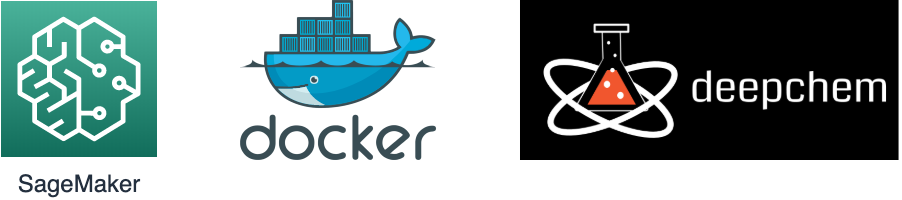

# SageMakerで利用できるDeepChemのためDockerfile

## TL;DR



SageMakerでトレーニングのために使用できる[DeepChem](https://www.deepchem.io/)用のDockerfileです。
バージョン依存にするため、取り急ぎ以下のバージョン専用です。

* deepchem-2.3.0
* python-3.6
* tensorflow-1.14.0

Dockerfileにより独自コンテナでSageMaker上でトレーニングする方法は[SageMakerで独自コンテナでトレーニングする方法](https://www.inoue-kobo.com/aws/sagemaker-with-mycontainer/index.html)を参照してください。

## Dockerfile

```Dockerfile
FROM nvidia/cuda:10.0-cudnn7-devel
ENV PATH /opt/conda/bin:$PATH

ENV PYTHON_VERSION 3.6
ENV PATH /usr/local/cuda-10.1/bin:$PATH
ENV LD_LIBRARY_PATH /usr/local/cuda-10.0/lib64:$LD_LIBRARY_PATH
ENV LD_LIBRARY_PATH /usr/local/cuda10.0/targets/x86_64linux:$LD_LIBRARY_PATH

RUN apt-get update --fix-missing && apt-get install -y wget bzip2 ca-certificates \
    libglib2.0-0 libxext6 libsm6 libxrender1 \
    git mercurial subversion
RUN wget --quiet https://repo.anaconda.com/miniconda/Miniconda3-latest-Linux-x86_64.sh -O ~/miniconda.sh && \
    /bin/bash ~/miniconda.sh -b -p /opt/conda && \
    rm ~/miniconda.sh && \
    ln -s /opt/conda/etc/profile.d/conda.sh /etc/profile.d/conda.sh && \
    echo ". /opt/conda/etc/profile.d/conda.sh" >> ~/.bashrc && \
    echo "conda activate base" >> ~/.bashrc

# deepchemはscikit-learnが0.20.1以外だと動作しないため注意が必要です。
RUN conda install scikit-learn==0.20.1
RUN conda install -c deepchem -c rdkit -c conda-forge -c omnia deepchem-gpu=2.3.0 python=3.6 --yes
RUN pip install sagemaker-containers
# deepchemの後にtensorflow-gpuを入れ直します。そうしないとGPUが利用されません。
RUN pip uninstall tensorflow --yes
RUN pip install tensorflow-gpu==1.14.0

# Copies the training code inside the container
COPY code/train.py /opt/ml/code/train.py

# Defines train.py as script entrypoint
ENV SAGEMAKER_PROGRAM train.py
```

### SageMakerが利用するCUDAのバージョンは固定されている

実際に実行すると`10.0`とマイナーバージョンまで指定してライブラリを検索している様です。
このため、`10.1`や`10.2`など必要なライブラリの一部が見つからないとエラーになります。

### scikit-learnは最新だとdeepchemが必要なモジュールを見つけられない

最新のscikit-learnを利用するとdeepchemがscikit-learnに含まれると想定している`joblib`を見つけられずにエラーになります。
また、あまりバージョンを下げすぎると`jaccard_similarity_score`の名前が変わっていて見つけられません。
このため、`0.20.1`を指定しています。

### tensorflow-gpuはdeepchemのインストール後に明示的に再インストールする

deepchemの前に`tensorflow-gpu`をインストールしても`tensorflow`がインストールされていました。
このため、deepchemのインストール後に`tensorflow`をアンインストールして明示的に`tensorflow-gpu`をインストールします。

### GPUを利用していることを確認する方法

```python
from tensorflow.python.client import device_lib

print(device_lib.list_local_devices())
print(f'Use gpu: {tf.test.is_gpu_available()}')
```