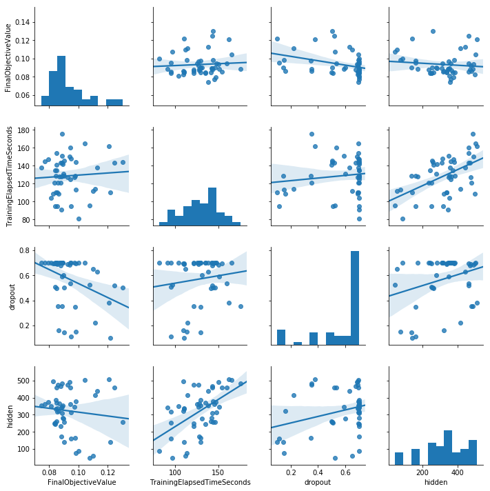

# SageMakerでTensorFlow+Kerasによる独自モデルをトレーニングする方法

## TL;DR

`AWS SageMaker`において、`TensorFlow+Keras`で作成した独自モデルを[Script Mode](https://github.com/aws/sagemaker-python-sdk/tree/master/src/sagemaker/tensorflow#preparing-a-script-mode-training-script)のトレーニングジョブとして実行します。
トレーニングジョブ用のDockerイメージについてはSageMakerが提供するイメージをそのまま利用します。このため、独自のイメージをビルドする必要はありません。

さらに、SageMaker組み込みのハイパーパラメータの自動調整機能を利用して、ハイパーパラメータの自動的な探索を行います。
なお、トレーニングしたモデルをデプロイしたエンドポイントの作成は行いません。学習済みモデルはSageMakerの機能としてでは無く、モデルをロードして直接利用します。

### SageMakerのトレーニングジョブとは

SageMakerのトレーニングジョブでは、Pythonスクリプトとしてモデルの作成と学習の実行を記述し、それをトレーニングジョブ用のDockerイメージのエンドポイントとして設定する事で、インスタンスの立ち上げからジョブの実行、結果の保存、インスタンスの停止までを一括で管理してくれます。
トレーニングジョブとして実行する事で、ノートブックインスタンスでは小さくて安いインスタンスタイプを利用し、学習フェーズのみGPUを利用した高価なインスタンスタイプを利用することができます。

トレーニングジョブの実行については、SageMaker用のAWSコンソールやノートブックインスタンス上のノートブックから行う事が可能です。

### ラベルデータの準備

ラベルデータはAWS S3上に配置されていることが前提となっています。

### ベンチマーク用データ

[京都大学情報学研究科--NTTコミュニケーション科学基礎研究所 共同研究ユニット](http://nlp.ist.i.kyoto-u.ac.jp/kuntt/index.php)が提供するブログの記事に関するデータセットを利用しました。 このデータセットでは、ブログの記事に対して以下の4つの分類がされています。

* グルメ
* 携帯電話
* 京都
* スポーツ

## 全体の流れ

* トレーニング用Pythonスクリプトの説明
* 共通パラメータ
* Estimatorの準備
* トレーニングジョブの実行
* ハイパーパラメータの自動調整の実行
* 自動調整結果の確認
* 最適化されたモデルのロード
* 最適化されたモデルによる推論結果確認

## トレーニング用Pythonスクリプトの説明

トレーニング用Pythonスクリプトの作成場所やファイル名に制限はありませんが、ここでは`jobs`ディレクトリ配下に`train.py`というファイル名で作成しています。
パラメータの受け渡し部分がありますが、基本的に普通に`keras`でモデルを定義して学習させるのと変わりはありません。

### モジュールの配置方法

Script Modeでは必要なモジュールをrequirements.txtで指定するのでは無く、Estimatorの`dependencies`に指定するディレクトリ配下に配置します。
pipでinstallする場合は、以下の様に`taregetオプション`でモジュールの配置先を指定します。

```bash
pip install [module] --target [dependenciesに指定するディレクトリ]
```

ここでは`jobs/modules`に配置します。`text-vectorian`を利用する場合のコマンド実行例は以下の通りです。

```bash
pip install text-vectorian --target jobs/modules
```

### ラベルデータの配置先

SageMakerによりS3からトレーニングジョブを実行するコンテナのローカルストレージ上にダウンロードされています。
特に意識せずに`SM_CHANNEL_*`で渡されたディレクトリの内容を利用することができます。

なお、Pipe ModeとしてS3からストリームとしてデータを取得しながら学習させることもできます。

### トレーニング用Pythonスクリプトの内容

```bash
!cat jobs/train.py
```

```python
import os
import argparse
import pandas as pd
import numpy as np
import sys

# モジュール配置先を読み込み対象として指定します。
# これにより通常と同じようにimport指定する事ができます。
sys.path.append('modules')

import keras
from keras.layers import Dense, Dropout, LSTM, Embedding, Reshape, RepeatVector, Permute, Flatten, Conv1D
from keras.layers.wrappers import Bidirectional
from keras.callbacks import LambdaCallback, EarlyStopping, ModelCheckpoint
from keras import Input, Model, utils
from keras.preprocessing.sequence import pad_sequences
import logging
from keras.callbacks import EarlyStopping
import tensorflow as tf
from tensorflow.python.keras import backend as K
import subprocess
from text_vectorian import SentencePieceVectorian
import pickle

logger = logging.getLogger(__name__)
vectorian = SentencePieceVectorian()

def _run_prepare_commands():
    '''
    事前準備としてOSコマンドを実行します。
    '''

    commands = '''
pip freeze
'''

    for command in commands.split('\n'):
        if command == '':
            continue
        ret = subprocess.call(command.split(' '))
        logger.info(ret)

def _save_model(model, history, model_dir, output_dir):
    '''
    モデルや実行履歴を保存します。
    '''

    model_filename = model_dir + '/model_v1.h5'

    logger.info(f'Model save as {model_filename}.')
    model.save(model_filename)

    if isinstance(history, keras.callbacks.History):
        history_df = pd.DataFrame(history.history)

    history_df.to_csv(output_dir + '/history.csv')

def _save_labels(data, output_dir):
    '''
    推論で利用するためのラベルデータの情報を保存します。
    '''

    del data['labels']
    del data['features']

    data_filename = output_dir + '/labels.pickle'

    with open(data_filename, mode='wb')as f:
        pickle.dump(data, f)

def _load_labeldata(train_dir):
    '''
    ラベルデータをロードします。
    '''

    features_df = pd.read_csv(f'{train_dir}/features.csv')
    labels_df = pd.read_csv(f'{train_dir}/labels.csv')
    label2index = {k: i for i, k in enumerate(labels_df['label'].unique())}
    index2label = {i: k for i, k in enumerate(labels_df['label'].unique())}
    class_count = len(label2index)
    labels = utils.np_utils.to_categorical([label2index[label] for label in labels_df['label']], num_classes=class_count)

    features = []

    for feature in features_df['feature']:
        features.append(vectorian.fit(feature).indices)

    features = pad_sequences(features, maxlen=vectorian.max_tokens_len)

    logger.info(f'データ数: {len(features_df)}, ラベル数: {class_count}, Labels Shape: {labels.shape}, Features Shape: {features.shape}')

    return {
        'class_count': class_count,
        'label2index': label2index,
        'index2label': index2label,
        'labels': labels,
        'features': features,
        'input_len': vectorian.max_tokens_len
    }

def _create_model(input_shape, hidden, dropout, class_count):
    '''
    モデルの構造を定義します。
    '''

    input_tensor = Input(input_shape)
    common_input = vectorian.get_keras_layer(trainable=True)(input_tensor)
    x1 = Bidirectional(LSTM(hidden))(common_input)
    x1 = Dense(hidden * 2, activation='relu')(x1)
    x1 = Dropout(dropout)(x1)
    output_tensor = Dense(class_count, activation='softmax')(x1)

    model = Model(input_tensor, output_tensor)
    model.compile(loss='categorical_crossentropy', optimizer='nadam', metrics=['acc', 'mse', 'mae'])
    model.summary()

    return model

if __name__ == '__main__':
    # Estimatorのパラメータは本スクリプトの引数として指定されるため、argparseで解析します。
    # Pythonの文法上Estimatorのパラメータはスネークケースですが、引数として渡される場合は`--`をプレフィクスにしたチェーンケースになっています。
    # なおhyperparameterとして渡すdictオブジェクトは、名前の変換は行われないのでそのまま引数名として受け取ります。
    parser = argparse.ArgumentParser()
    # Estimatorのパラメータとして渡されるパラメータ
    parser.add_argument('--epochs', type=int, default=10)
    parser.add_argument('--batch-size', type=int, default=100)
    parser.add_argument('--hidden', type=int)
    parser.add_argument('--dropout', type=float)
    parser.add_argument('--container-log-level', type=int, default=logging.INFO)
    # 環境変数として渡されるパラメータ
    parser.add_argument('--model-dir', type=str, default=os.environ['SM_MODEL_DIR'])
    parser.add_argument('--train-dir', type=str, default=os.environ['SM_CHANNEL_TRAIN'])
    parser.add_argument('--test-dir', type=str, default=os.environ['SM_CHANNEL_TEST'])
    parser.add_argument('--output-dir', type=str, default=os.environ['SM_OUTPUT_DATA_DIR'])

    args, _ = parser.parse_known_args()
    # ログレベルを引数で渡されたコンテナのログレベルと合わせます。
    logging.basicConfig(level=args.container_log_level)

    # 事前準備を実行します。実行は任意です。
    _run_prepare_commands()

    # ラベルデータをロードします。
    data = _load_labeldata(args.train_dir)
    # モデルの定義を行います。
    model = _create_model(data['features'][0].shape, args.hidden, args.dropout, data['class_count'])
    # 学習用のデータを準備します。
    train_features = data['features']
    train_labels = data['labels']
    # 学習を実行します。
    # verboseを　2に指定するのはポイントです。デフォルトは1ですが、そのままではプログレッシブバーの出力毎にログが記録されるため冗長です。
    # 2二することで、epochごとの結果だけ出力されるようになります。
    history = model.fit(train_features, train_labels,
        batch_size=args.batch_size,
        validation_split=0.1,
        epochs=args.epochs,
        verbose=2,
        callbacks = [
            EarlyStopping(patience=5, monitor='val_acc', mode='max'),
        ])

    # 学習したモデルを保存します。
    _save_model(model, history, args.model_dir, args.output_dir)
    # 推論時に利用するラベルデータの情報を保存します。
    _save_labels(data, args.output_dir)
```

## 共通パラメータ

以降はノートブックインスタンス上のノートブックで実行します。

ラベルデータの保存先となるS3やジョブ実行名となるプロジェクト名、バージョンなどの情報です。
プロジェクト毎に定義します。

```python
import sys
sys.path.append('jobs/modules')

TAGS = [{ 'Key': 'example.com:example.ProjectName', 'Value': 'knbc' }]
PROJECT_NAME = 'knbc'
VERSION = 'v1'
S3_BUCKET = 's3://sagemaker-us-east-1.example.com/knbc'
TRAINS_DIR = S3_BUCKET + '/data/trains'
TESTS_DIR = S3_BUCKET + '/data/tests'
OUTPUTS_DIR = S3_BUCKET + '/outputs'
```

## Estimatorの準備

`Estimator`はトレーニングジョブ用Pythonスクリプトやラベルデータ、ハイパーパラメータなどを読み込んでトレーニングジョブをどのように実行するかを定義するためのものです。

### メトリクスの定義

`metric_definitions`に渡すdictオブジェクトです。
トレーニングジョブの実行状況はCloudWatchのログとして出力されますが、この定義に従って学習経過のログが解析されCloudWatch Logsで視覚化されます。

`Name`がCloudWatchのメトリクス名、`Regex`がログをどのように解析するかを正規表現で指定しています。`(\S+)`が数値を指し示す事で、その内容がグラフで表示されると考えてください。

### TensorFlowに設定するパラメータ

#### role

S3からラベルデータを取得したり、モデルや出力結果を配置するための権限を表すIAM Roleです。

#### script_mode

`True`を指定します。

#### dependencies

モジュールを配置したディレクトリを指定します。

#### metric_definitions

メトリクスの定義を指定します。指定しないとメトリクスとして何も記録されず、ハイパーパラメータの自動調整もできません。

```python
from sagemaker.tensorflow import TensorFlow
import logging

params = {
    'batch-size': 512,
    'epochs': 10,
    'hidden': 32,
    'dropout': 0.1
}
metric_definitions = [
    {'Name': 'train:acc', 'Regex': 'acc: (\S+)'},
    {'Name': 'train:mse', 'Regex': 'mean_squared_error: (\S+)'},
    {'Name': 'train:mae', 'Regex': 'mean_absolute_error: (\S+)'},
    {'Name': 'valid:acc', 'Regex': 'val_acc: (\S+)'},
    {'Name': 'valid:mse', 'Regex': 'val_mean_squared_error: (\S+)'},
    {'Name': 'valid:mae', 'Regex': 'val_mean_absolute_error: (\S+)'},
]
estimator = TensorFlow(
    entry_point='jobs/train.py',
    role='arn:aws:iam::1234567890123:role/service-role/AmazonSageMaker-ExecutionRole-20181129T043923',
    train_instance_count=1,
    train_instance_type='ml.p2.xlarge',
    framework_version='1.12.0',
    py_version='py3',
    script_mode=True,
    hyperparameters=params,
    output_path=OUTPUTS_DIR,
    dependencies=['jobs/modules'],
    container_log_level=logging.INFO,
    metric_definitions=metric_definitions,
    tags=TAGS
)
inputs = {'train': TRAINS_DIR, 'test': TESTS_DIR}
```

## トレーニングジョブの実行

Estimatorのfitメソッドによりトレーニングを実行します。

### パラメータの説明

#### job_name

ジョブ名は一意である必要があります。自動的に一意にはしてくれないため、タイムスタンプやuuidを追加するのがお勧めです。

#### inputs

ラベルデータを指定します。学習用とテスト用などを別けて指定することが可能です。

```python
import shortuuid

uuid = shortuuid.ShortUUID().random(length=8)
estimator.fit(job_name=f'{PROJECT_NAME}-{VERSION}-s-{uuid}', inputs=inputs)
```

```
     - 4s - loss: 1.3353 - acc: 0.3528 - mean_squared_error: 0.1818 - mean_absolute_error: 0.3587 - val_loss: 1.2979 - val_acc: 0.4164 - val_mean_squared_error: 0.1763 - val_mean_absolute_error: 0.3561
    Epoch 2/10
     - 2s - loss: 1.2878 - acc: 0.3950 - mean_squared_error: 0.1757 - mean_absolute_error: 0.3540 - val_loss: 1.2628 - val_acc: 0.4297 - val_mean_squared_error: 0.1719 - val_mean_absolute_error: 0.3455
    Epoch 3/10
     - 2s - loss: 1.2295 - acc: 0.4507 - mean_squared_error: 0.1678 - mean_absolute_error: 0.3422 - val_loss: 1.1847 - val_acc: 0.4721 - val_mean_squared_error: 0.1617 - val_mean_absolute_error: 0.3242
    Epoch 4/10
     - 2s - loss: 1.1362 - acc: 0.5307 - mean_squared_error: 0.1543 - mean_absolute_error: 0.3207 - val_loss: 1.1010 - val_acc: 0.5544 - val_mean_squared_error: 0.1486 - val_mean_absolute_error: 0.3119
    Epoch 5/10
     - 2s - loss: 1.0099 - acc: 0.6000 - mean_squared_error: 0.1356 - mean_absolute_error: 0.2897 - val_loss: 1.0430 - val_acc: 0.5252 - val_mean_squared_error: 0.1440 - val_mean_absolute_error: 0.2795
    Epoch 6/10
     - 2s - loss: 0.9278 - acc: 0.6372 - mean_squared_error: 0.1240 - mean_absolute_error: 0.2628 - val_loss: 0.9230 - val_acc: 0.6207 - val_mean_squared_error: 0.1248 - val_mean_absolute_error: 0.2580
    Epoch 7/10
     - 2s - loss: 0.8285 - acc: 0.6817 - mean_squared_error: 0.1103 - mean_absolute_error: 0.2356 - val_loss: 0.8919 - val_acc: 0.6313 - val_mean_squared_error: 0.1201 - val_mean_absolute_error: 0.2460
    Epoch 8/10
     - 2s - loss: 0.7441 - acc: 0.7227 - mean_squared_error: 0.0978 - mean_absolute_error: 0.2134 - val_loss: 0.8506 - val_acc: 0.6631 - val_mean_squared_error: 0.1125 - val_mean_absolute_error: 0.2268
    Epoch 9/10
     - 2s - loss: 0.6586 - acc: 0.7611 - mean_squared_error: 0.0861 - mean_absolute_error: 0.1893 - val_loss: 0.8458 - val_acc: 0.6711 - val_mean_squared_error: 0.1113 - val_mean_absolute_error: 0.2179
    Epoch 10/10
```

## HyperparameterTunerの準備

ハイパーパラメータの探索をどのように行うかを`HyperparameterTuner`のパラメータとして定義します。
ハイパーパラメータ探索のアルゴリズムは`Bayesian`のみですが、将来的には増えると思います。

### 最適化するメトリクスの定義

`Estimator`で指定したメトリクスの中から選択します。指定するのは`Name`に指定した文字列です。
指定したメトリクスの最大化を行う場合は`Maximaize`、最小化を行う場合は`Minimize`を指定します。

### ハイパーパラメータの調整幅の定義

ハイパーパラメータの探索を行う内容です。
ここで指定した調整幅内の値が`Estimator`を経由して`トレーニングジョブ用Pythonスクリプト`に渡されます。

`トレーニングジョブ用Pythonスクリプト`では引数として渡されたハイパーパラメータの内容を利用した学習を行い、
その結果をメトリクスとして評価する事で、最適化するメトリクスが最小あるいは最大となるハイパーパラメータを探索します。

### パラメータの説明

#### objective_metric_name

最適化するメトリクス名です。

#### hyperparameter_ranges

ハイパーパラメータの調整幅の定義です。dictオブジェクトとして指定します。

#### early_stopping_type

ハイパーパラメータ探索アルゴリズム上、これ以上最適化が困難と判断した段階でハイパーパラメータの自動調整ジョブを停止します。
`Auto`にしている場合は、後述の`max_jobs`未満で探索が終了する可能性があります。

#### max_jobs

ハイパーパラメータ探索で実行するトレーニングジョブの延べ数の上限です。

```python
from sagemaker.tuner import IntegerParameter, CategoricalParameter, ContinuousParameter, HyperparameterTuner

objective_metric_name = 'valid:mse'
objective_type = 'Minimize'
hyperparameter_ranges = {
    'hidden': IntegerParameter(32, 512),
    'dropout': ContinuousParameter(0.1, 0.7)
}

tuner = HyperparameterTuner(estimator,
                            objective_metric_name,
                            hyperparameter_ranges,
                            metric_definitions,
                            max_jobs=50,
                            max_parallel_jobs=1,
                            objective_type=objective_type,
                            early_stopping_type='Auto',
                            tags=TAGS)
```

## ハイパーパラメータの自動調整の実行

HyperparameterTunerのfitにより自動調整を実行します。
トレーニングジョブの実行と同じ様な感じです。

### パラメータの説明

#### job_name

ジョブ名は一意である必要があります。自動的に一意にはしてくれないため、タイムスタンプやuuidを追加するのがお勧めです。
ハイパーパラメータの自動調整は推測したハイパーパラメータ毎にトレーニングジョブを生成するため、ここで指定した名前のポストフィクスとしてさらに文字列を追加します。
このため、最大32文字とトレーニングジョブの`job_name`よりも制限が厳しくなっています。

#### inputs

ラベルデータを指定します。学習用とテスト用などを別けて指定することが可能です。

```python
import shortuuid

uuid = shortuuid.ShortUUID().random(length=3)
tuner_job_name = f'{PROJECT_NAME}-{VERSION}-o-{uuid}'
tuner.fit(job_name=tuner_job_name, inputs=inputs)
```

## 自動調整結果の確認

ハイパーパラメータの探索は長い時間がかかります。このため、デフォルトで非同期実行になっています。
AWSコンソールなどで確認し、ハイパーパラメータの探索が完了したら、対象のジョブ名を記録して下さい。

`HyperparameterTuner.attach`関数にジョブ名(job_name)を指定することで、ハイパーパラメータの探索結果を確認することができます。

```python
from sagemaker.tuner import IntegerParameter, CategoricalParameter, ContinuousParameter, HyperparameterTuner
import seaborn as sns

job_name = tuner_job_name
tuner = HyperparameterTuner.attach(job_name)
df = tuner.analytics().dataframe().drop(['TrainingEndTime', 'TrainingJobName', 'TrainingJobStatus', 'TrainingStartTime'], axis=1).dropna()

sns.pairplot(df, kind='reg')
```



## 最適化されたモデルのロード

```python
import keras
import boto3
import pickle
from urllib.parse import urlparse

estimator = TensorFlow.attach(tuner.best_training_job())
print(tuner.best_training_job())

url = urlparse(estimator.model_data)
s3_root_dir = '/'.join(url.path.split('/')[:-2])[1:]
model_s3path = s3_root_dir + '/output/model.tar.gz'
output_s3path = s3_root_dir + '/output/output.tar.gz'
model_filename = 'models/model_v1.h5'
s3 = boto3.resource('s3')
bucket = s3.Bucket(url.netloc)

print(model_s3path)
bucket.download_file(model_s3path, 'models/model.tar.gz')
bucket.download_file(output_s3path, 'models/output.tar.gz')
!cd models; tar zxvf model.tar.gz; tar zxvf output.tar.gz

model = keras.models.load_model(model_filename)

with open('models/labels.pickle', mode='rb') as f:
    labels = pickle.load(f)
```

## 最適化されたモデルによる推論結果確認

```python
from text_vectorian import SentencePieceVectorian
from keras.preprocessing.sequence import pad_sequences
import pandas as pd

vectorian = SentencePieceVectorian()
tests_features_df = pd.read_csv(f'{TESTS_DIR}/features.csv')
tests_labels_df = pd.read_csv(f'{TESTS_DIR}/labels.csv')
tests_features = []
for feature in tests_features_df['feature']:
    tests_features.append(vectorian.fit(feature).indices)
tests_features = pad_sequences(tests_features, maxlen=labels['input_len'])
```

```python
from sklearn.metrics import classification_report, confusion_matrix
import numpy as np
import keras

predicted_labels = model.predict(tests_features).argmax(axis=1)
numeric_labels = [labels['label2index'][label] for label in tests_labels_df['label']]
print(classification_report(numeric_labels, predicted_labels, target_names=labels['index2label'].values()))
```

```
                 precision    recall  f1-score   support

             京都       0.70      0.77      0.74       137
           携帯電話       0.81      0.74      0.77       145
           スポーツ       0.72      0.72      0.72        47
            グルメ       0.75      0.74      0.75        90

    avg / total       0.75      0.75      0.75       419
```

## 参考文献

* [Keras でAmazon SageMaker を使用する（Script Mode）](https://qiita.com/rtaguchi/items/8422b9802ec7c4e75215)
* [TensorFlow SageMaker Estimators and Models](https://github.com/aws/sagemaker-python-sdk/tree/master/src/sagemaker/tensorflow#preparing-a-script-mode-training-script)
* [Amazon SageMaker Python SDK](https://sagemaker.readthedocs.io/en/latest/index.html)
