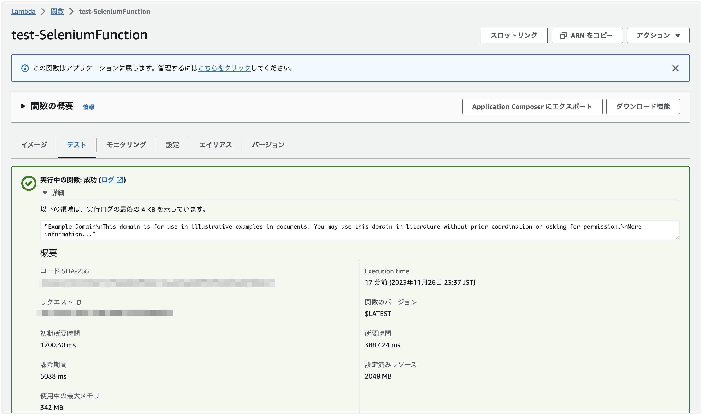

# SeleniumをAWS Lambdaでサーバーレスに動かしてみる

## TL;DR

APIが提供されていないなどの理由で、Seleniumを使ってWebサービスを操作する際に、サーバーレスで実行できると便利ですが、AWS Lambdaで実行するためには依存モジュールなどの調整が必要です。このあたりの面倒な作業については、有難いことに以下のリポジトリで開発されています。

* [docker-selenium-lambda](https://github.com/umihico/docker-selenium-lambda)

SeleniumをAWS Lambdaで動かすためのDockerコンテナが定義されており、SeleniumをHeadlessで動かすためのコードサンプルも付いています。基本的にそのまま利用できますが、実行例がServerless Frameworkになっているので、AWS CDKでの実行例を作ってみました。

## フォルダ構成

```
📦src
 ┣ 📂app
 ┃ ┣ 📜Dockerfile
 ┃ ┣ 📜app.py
 ┃ ┗ 📜requirements.txt
 ┗ 📂cdk
 ┃ ┣ 📂stacks
 ┃ ┃ ┣ 📜__init__.py
 ┃ ┃ ┗ 📜cdk_stack.py
 ┃ ┣ 📜app.py
 ┃ ┣ 📜cdk.json
 ┃ ┣ 📜requirements-dev.txt
 ┃ ┗ 📜requirements.txt
```

`src/app`にSeleniumを利用したアプリケーションのコードを配置し、`src/cdk`にAWS CDKのコードを配置しています。`src/cdk`配下は`cdk init`した際のフォルダ構成になっていますが、`cdk/cdk`を`cdk/stacks`にフォルダ名を変更しています。また、testsや.venvなどのフォルダは削除しています。

## app/app.py

```python
from selenium import webdriver
from tempfile import mkdtemp
from selenium.webdriver.common.by import By
from aws_lambda_powertools import Logger

logger = Logger()


def handler(event=None, context=None):
    options = webdriver.ChromeOptions()
    service = webdriver.ChromeService("/opt/chromedriver")

    options.binary_location = "/opt/chrome/chrome"
    options.add_argument("--headless=new")
    options.add_argument("--no-sandbox")
    options.add_argument("--disable-gpu")
    options.add_argument("--window-size=1280x1696")
    options.add_argument("--single-process")
    options.add_argument("--disable-dev-shm-usage")
    options.add_argument("--disable-dev-tools")
    options.add_argument("--no-zygote")
    options.add_argument(f"--user-data-dir={mkdtemp()}")
    options.add_argument(f"--data-path={mkdtemp()}")
    options.add_argument(f"--disk-cache-dir={mkdtemp()}")
    options.add_argument("--remote-debugging-port=9222")

    chrome = webdriver.Chrome(options=options, service=service)
    chrome.get("https://example.com/")

    content = chrome.find_element(by=By.XPATH, value="//html").text

    logger.info(content)

    return content
```

## app/requirements.txt

```
aws-lambda-powertools==2.27.0
```

## app/Dockerfile

最新のバージョンは [docker-selenium-lambda](https://github.com/umihico/docker-selenium-lambda) を参照してください。

```Dockerfile
FROM --platform=linux/x86_64 public.ecr.aws/lambda/python@sha256:fb31ca51357519a48a90f01a76e9d550778ecfcbe8d92dd832ec49b6672e387c as build
RUN dnf install -y unzip && \
    curl -Lo "/tmp/chromedriver-linux64.zip" "https://edgedl.me.gvt1.com/edgedl/chrome/chrome-for-testing/119.0.6045.105/linux64/chromedriver-linux64.zip" && \
    curl -Lo "/tmp/chrome-linux64.zip" "https://edgedl.me.gvt1.com/edgedl/chrome/chrome-for-testing/119.0.6045.105/linux64/chrome-linux64.zip" && \
    unzip /tmp/chromedriver-linux64.zip -d /opt/ && \
    unzip /tmp/chrome-linux64.zip -d /opt/

FROM --platform=linux/x86_64 public.ecr.aws/lambda/python@sha256:fb31ca51357519a48a90f01a76e9d550778ecfcbe8d92dd832ec49b6672e387c
RUN dnf install -y atk cups-libs gtk3 libXcomposite alsa-lib \
    libXcursor libXdamage libXext libXi libXrandr libXScrnSaver \
    libXtst pango at-spi2-atk libXt xorg-x11-server-Xvfb \
    xorg-x11-xauth dbus-glib dbus-glib-devel nss mesa-libgbm
RUN pip install selenium==4.15.2
COPY --from=build /opt/chrome-linux64 /opt/chrome
COPY --from=build /opt/chromedriver-linux64 /opt/
COPY . .
COPY requirements.txt requirements.txt
RUN pip install --upgrade pip && \
    pip install --no-cache-dir -r requirements.txt

CMD [ "app.handler" ]
```

## cdk/stacks/cdk_stack.py

```python
from aws_cdk import aws_lambda as lambda_
from aws_cdk import Stack
import aws_cdk as cdk
from constructs import Construct


class CdkStack(Stack):
    def __init__(self, scope: Construct, construct_id: str, **kwargs) -> None:
        super().__init__(scope, construct_id, **kwargs)

        selenium_function = lambda_.DockerImageFunction(
            self,
            "SeleniumFunction",
            code=lambda_.DockerImageCode.from_image_asset("../app", file="Dockerfile"),
            function_name=f"test-SeleniumFunction",
            timeout=cdk.Duration.minutes(1),
            memory_size=2048,
        )
```

## デプロイ方法

```bash
cd src/cdk
cdk synth
cdk deploy
```

## テスト方法

デプロイができたら後はLambdaとして実行するだけです。以下はAWSコンソールからテスト実行した際の実行例です。

