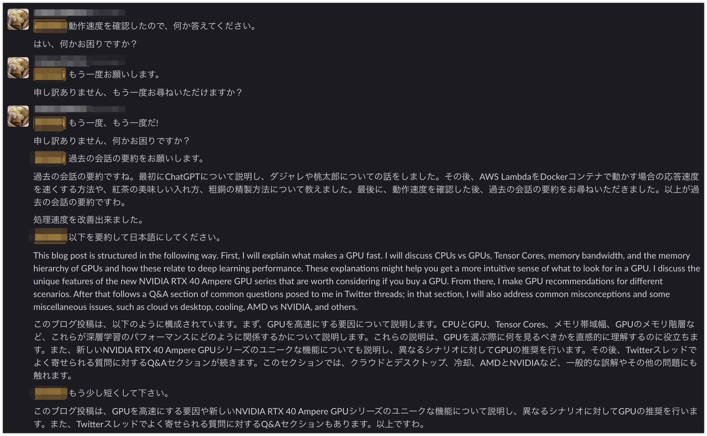

# LangChain と OpenAI API を使って Slack 用のチャットボットをサーバーレスで作ってみる(ChatGPT 編)

## TL;DR

OpenAI API で利用できるモデルとして、ChatGPT(Plus)と同様のモデルである`gpt-3.5-turbo`が利用できるようになったので、前回の[LangChain と OpenAI API を使って Slack 用のチャットボットをサーバーレスで作ってみる](https://www.inoue-kobo.com/aws/slack-gpt-backend/)と同じようにサーバーレスで Slack 用チャットボットを実装してみました。

`gpt-3.5-turbo`は`text-davinci-003`と比較して利用料金が 1/10 となっており大変リーズナブルですが、[LangChain](https://github.com/hwchase17/langchain)から利用する場合は`0.0.98`以上である必要があります。前回利用した`0.0.88`と比較して容量が増加しており、ぎりぎり通常の AWS Lambda でデプロイすることができません(250MB 容量制限にひっかかります)。このため、今回は Docker Container 版の AWS Lambda としてデプロイします。

LangChainの`ConversationSummaryBufferMemory`を利用しているため、過去の会話の履歴をいい感じに要約して保持してくれる点は前回と一緒です。

また、LangChain がトークン数の計算に GPT2 のトークナイザーを利用するようになっており、そのままでは Huggingface に対して毎回アクセスを行います。このことで前処理に 1 分近くかかることが確認されたため、Huggingface に対してアクセスすることなく、OFFLINE での利用ができるように調整しています。一応これで十数秒で応答するはずですが、かなりアドホックなやり方であるため将来の互換性はありません。この点は今後のLangChainのバージョンアップに期待です。



### 前提条件

-   slack-sdk==3.20.0
-   langchain==0.0.98
-   openai==0.27.0
-   transformers==4.25.1

### ディレクトリ構成

```
📦slack-gpt-backend
 ┣ 📂app
 ┃ ┣ 📂huggingface
 ┃ ┃ ┣ 📂models--gpt2
 ┃ ┃ ┃ ┣ 📂refs
 ┃ ┃ ┃ ┃ ┗ 📜main
 ┃ ┃ ┃ ┣ 📂snapshots
 ┃ ┃ ┃ ┃ ┣ 📂e7da7f221d5bf496a48136c0cd264e630fe9fcc8
 ┃ ┃ ┃ ┃ ┃ ┣ 📜special_tokens_map.json
 ┃ ┃ ┃ ┃ ┃ ┣ 📜tokenizer.json
 ┃ ┃ ┃ ┃ ┃ ┣ 📜tokenizer_config.json
 ┃ ┃ ┃ ┃ ┃ ┗ 📜vocab.json
 ┃ ┃ ┣ 📜merges.txt
 ┃ ┃ ┣ 📜special_tokens_map.json
 ┃ ┃ ┣ 📜tokenizer.json
 ┃ ┃ ┣ 📜tokenizer_config.json
 ┃ ┃ ┣ 📜version.txt
 ┃ ┃ ┗ 📜vocab.json
 ┃ ┣ 📜Dockerfile
 ┃ ┣ 📜__init__.py
 ┃ ┣ 📜app.py
 ┃ ┣ 📜backend.py
 ┃ ┗ 📜requirements.txt
 ┗ 📜template.yaml
 ```

## GPT2のトークナイザーをダウンロードする

最初にフォルダ構成を作成します。

```
┣ 📂app
 ┃ ┣ 📂huggingface
 ┃ ┃ ┣ 📂models--gpt2
 ┃ ┃ ┃ ┣ 📂refs
 ┃ ┃ ┃ ┣ 📂snapshots
 ┃ ┃ ┃ ┃ ┣ 📂e7da7f221d5bf496a48136c0cd264e630fe9fcc8
```

snapshotsの下にある乱数が現在のGPT2モデルの識別子です。現時点では記載の通りとしてください。

次に、以下のようにGPT2のトークナイザーのデータをダウンロードします。

```python
from transformers import GPT2TokenizerFast

tokenizer = GPT2TokenizerFast.from_pretrained("gpt2")
tokenizer.save_pretrained("app/huggingface/models--gpt2/snapshots/e7da7f221d5bf496a48136c0cd264e630fe9fcc8")
```

以下のファイルがダウンロードされます。

* tokenizer_config.json
* tokenizer/special_tokens_map.json
* tokenizer/vocab.json
* tokenizer/merges.txt
* tokenizer/added_tokens.json
* tokenizer/tokenizer.json

続いて以下のファイルを作成します。

* app/huggingface/models--gpt2/refs/main

内容は以下のとおりです。

```
e7da7f221d5bf496a48136c0cd264e630fe9fcc8
```

## バックエンドを実装する

### template.yaml

```yaml
AWSTemplateFormatVersion: '2010-09-09'
Transform: AWS::Serverless-2016-10-31
Description: >
  slack-gpt-backend

# More info about Globals: https://github.com/awslabs/serverless-application-model/blob/master/docs/globals.rst
Globals:
  Function:
    Timeout: 120
    MemorySize: 10240 # ボトルネックにならないように最大にしていますが、最小でも動作上は問題ありません。
#    Tracing: Active X-Rayで処理内容の詳細をトレースしたい場合は有効にします。
    Environment:
      Variables:
        LOG_LEVEL: INFO
        POWERTOOLS_LOGGER_SAMPLE_RATE: 0.1
        POWERTOOLS_LOGGER_LOG_EVENT: true
        POWERTOOLS_SERVICE_NAME: slack-gpt-backend

Parameters:
  OpenAiApiKey:
    Type: AWS::SSM::Parameter::Value<String>
    Default: '/slack-gpt-backend/OpenAiApiKey'
  SlackToken:
    Type: AWS::SSM::Parameter::Value<String>
    Default: '/slack-gpt-backend/SlackToken'
  SlackChannel:
    Type: AWS::SSM::Parameter::Value<String>
    Default: '/slack-gpt-backend/SlackChannel'
  SlackContextTeamId:
    Type: AWS::SSM::Parameter::Value<String>
    Default: '/slack-gpt-backend/SlackContextTeamId'
  SlackUserId:
    Type: AWS::SSM::Parameter::Value<String>
    Default: '/slack-gpt-backend/SlackUserId'
  SlackReplyUsername:
    Type: AWS::SSM::Parameter::Value<String>
    Default: '/slack-gpt-backend/SlackReplyUsername'

Resources:
  postMessageV2Function:
    Type: AWS::Serverless::Function
    Properties:
      PackageType: Image
      Policies:
      - DynamoDBCrudPolicy:
          TableName: !Ref ConversationHistoriesTable
      Environment:
        Variables:
          CONVERSATIONS_HISTORIES_TABLE: !Ref ConversationHistoriesTable
          OPENAI_API_KEY: !Ref OpenAiApiKey
          SLACK_TOKEN: !Ref SlackToken
          SLACK_USER_ID: !Ref SlackUserId
          SLACK_CHANNEL: !Ref SlackChannel
          SLACK_CONTEXT_TEAM_ID: !Ref SlackContextTeamId
          SLACK_REPLY_USERNAME: !Ref SlackReplyUsername
      Architectures:
        - x86_64
      Description: Slackで入力されたメッセージを受け取り、OpenAI APIを通して得た返答をSlackのメッセージとして投稿します。
      Events:
        Api:
          Type: Api
          Properties:
            Path: /{proxy}
            Method: ANY
    Metadata:
      Dockerfile: Dockerfile
      DockerContext: ./app
      DockerTag: v1
  ConversationHistoriesTable:
    Type: AWS::Serverless::SimpleTable
    Properties:
      PrimaryKey:
        Name: id
        Type: String
  ApplicationResourceGroup:
    Type: AWS::ResourceGroups::Group
    Properties:
      Name:
        Fn::Join:
        - ''
        - - ApplicationInsights-SAM-
          - Ref: AWS::StackName
      ResourceQuery:
        Type: CLOUDFORMATION_STACK_1_0
  ApplicationInsightsMonitoring:
    Type: AWS::ApplicationInsights::Application
    Properties:
      ResourceGroupName:
        Fn::Join:
        - ''
        - - ApplicationInsights-SAM-
          - Ref: AWS::StackName
      AutoConfigurationEnabled: 'true'
    DependsOn: ApplicationResourceGroup

Outputs:
  WebEndpoint:
    Description: API Gateway endpoint URL for Prod stage
    Value: !Sub "https://${ServerlessRestApi}.execute-api.${AWS::Region}.amazonaws.com/Prod/"
```

### requirements.txt

```
slack-sdk==3.20.0
langchain==0.0.98
openai==0.27.0
transformers==4.25.1
aws-lambda-powertools
aws-xray-sdk
```

### backend.py

llmとして`OpenAI`ではなく`OpenAIChat`を利用します。

```python
from langchain.prompts import PromptTemplate
from langchain import ConversationChain
from langchain.llms import OpenAIChat
from langchain.chains.conversation.memory import ConversationSummaryBufferMemory
from slack_sdk import WebClient
from slack_sdk.errors import SlackApiError
import os
import boto3

reply_llm = OpenAIChat(temperature=0, max_tokens=500)
summary_llm = OpenAIChat(temperature=0, max_tokens=1000)
conversation_template = """以下は、私とAIが仲良く会話している様子です。AIは饒舌で、その文脈から具体的な内容をたくさん教えてくれます。AIは質問に対する答えを知らない場合、正直に「知らない」と答えます。

{history}
私: {input}
AI:"""

conversation_prompt = PromptTemplate(
    input_variables=["history", "input"], template=conversation_template
)

summary_template = """会話内容を順次要約し、前回の要約に追加して新たな要約を返してください。

### 現在の要約

{summary}

### 新しい会話

{new_lines}

### 新しい要約

"""

slack_token = os.environ["SLACK_TOKEN"]
slack_client = WebClient(token=slack_token)
dynamodb = boto3.resource("dynamodb")
table = dynamodb.Table(os.environ["CONVERSATIONS_HISTORIES_TABLE"])
summary_prompt = PromptTemplate(
    input_variables=["summary", "new_lines"], template=summary_template
)
memory = ConversationSummaryBufferMemory(
    human_prefix="私", llm=summary_llm, max_token_limit=2000, prompt=summary_prompt
)
conversation = ConversationChain(
    llm=reply_llm, prompt=conversation_prompt, memory=memory, verbose=False
)


def get_reply(message, buffer=[], summary_buffer=""):
    conversation.memory.buffer = buffer
    conversation.memory.moving_summary_buffer = summary_buffer
    reply = conversation.predict(input=message)

    return reply, conversation.memory


def post_messsage2slack(channel, message, reply_username):
    result = slack_client.chat_postMessage(
        channel=channel, text=message, username=reply_username
    )

    return result


def save_context(context_team_id, channel, buffer, summary_buffer):
    item = {
        "id": f"{context_team_id}/{channel}",
        "buffer": buffer,
        "summary_buffer": summary_buffer,
    }
    table.put_item(Item=item)


def load_context(context_team_id, channel):
    response = table.get_item(
        Key={
            "id": f"{context_team_id}/{channel}",
        }
    )

    return response
```

### app.py

Transformersをオフラインでりようするために、以下の環境変数を設定しています。

* TRANSFORMERS_CACHE
* TRANSFORMERS_OFFLINE

```python
from aws_lambda_powertools import Logger
from aws_lambda_powertools import Tracer
from aws_lambda_powertools.utilities.typing import LambdaContext
from aws_lambda_powertools.event_handler import APIGatewayRestResolver
from aws_lambda_powertools.logging import correlation_paths
from backend import get_reply, save_context, load_context, post_messsage2slack
import os


logger = Logger()
tracer = Tracer()  # Sets service via POWERTOOLS_SERVICE_NAME env var
app = APIGatewayRestResolver()

os.environ["TRANSFORMERS_CACHE"] = os.environ["LAMBDA_TASK_ROOT"]
os.environ["TRANSFORMERS_OFFLINE"] = "1"
slack_user_id = os.environ["SLACK_USER_ID"]
slack_channel = os.environ["SLACK_CHANNEL"]
slack_context_team_id = os.environ["SLACK_CONTEXT_TEAM_ID"]
slack_reply_username = os.environ["SLACK_REPLY_USERNAME"]


@app.post("/events")
def post_message():
    event = app.current_event

    # Slackからは複数回呼び出されるため、最初の呼び出し以外は無視するようにします。
    retry_counts = event.get("multiValueHeaders", {}).get("X-Slack-Retry-Num", [0])

    if retry_counts[0] != 0:
        logger.info(f"Skip slack retrying({retry_counts}).")
        return {}

    body = app.current_event.json_body

    # Slack Appのイベントハンドラーとして登録する際の対応です。
    if "challenge" in body:
        return {"challenge": body["challenge"]}

    logger.info(body)

    message = body["event"]["text"]
    # 対象にメンションされたイベント以外に反応すると無限ループになるので要注意です。
    if not message.startswith(slack_user_id):
        logger.info("Not mentioned me.")
        return {}

    history = load_context(slack_context_team_id, slack_channel).get("Item", {})

    logger.info(history)

    buffer = history.get("buffer", [])
    summary_buffer = history.get("summary_buffer", "")

    reply, memory = get_reply(message, buffer, summary_buffer)

    logger.info(reply)

    save_context(
        slack_context_team_id,
        slack_channel,
        memory.buffer,
        memory.moving_summary_buffer,
    )

    post_messsage2slack(slack_channel, reply, slack_reply_username)

    return {}


@tracer.capture_lambda_handler
@logger.inject_lambda_context(correlation_id_path=correlation_paths.API_GATEWAY_REST)
def lambda_handler(event: dict, context: LambdaContext) -> dict:
    return app.resolve(event, context)
```

## Dockerfileを用意する

```Dockerfile
FROM public.ecr.aws/lambda/python:3.9

# Install the function's dependencies using file requirements.txt
# from your project folder.
COPY requirements.txt  .
RUN  pip3 install -r requirements.txt --target ${LAMBDA_TASK_ROOT}

COPY huggingface ${LAMBDA_TASK_ROOT}

# Copy function code
COPY app.py ${LAMBDA_TASK_ROOT}
COPY backend.py ${LAMBDA_TASK_ROOT}

# Set the CMD to your handler (could also be done as a parameter override outside of the Dockerfile)
CMD [ "app.lambda_handler" ]
```

## SSM ParameterStore を仮に設定する

以下の値のPrameterStoreを仮の値(dummyなど)で設定します。

-   /slack-gpt-backend/OpenAiApiKey
-   /slack-gpt-backend/SlackToken
-   /slack-gpt-backend/SlackChannel
-   /slack-gpt-backend/SlackContextTeamId
-   /slack-gpt-backend/SlackUserId
-   /slack-gpt-backend/SlackReplyUsername

デプロイ時にParameterStoreが存在していることが要求されるためです。

## デプロイする

以下の様に SAM でデプロイします。Docker Containerを利用するため、deployではECRリポジトリURLを指定する必要があります。

```bash
sam build
sam deploy --guided --image-repository [ECRリポジトリURL]/slack-gpt-backend
```

## Slack アプリとして組み込む

[LangChain と OpenAI API を使って Slack 用のチャットボットをサーバーレスで作ってみる](https://www.inoue-kobo.com/aws/slack-gpt-backend/)を参照してください。

## SSM ParameterStore をちゃんと設定する

[LangChain と OpenAI API を使って Slack 用のチャットボットをサーバーレスで作ってみる](https://www.inoue-kobo.com/aws/slack-gpt-backend/)を参照してください。

## 再デプロイする

Lambdaからは環境変数として参照しているため、ParameterStoreの値を変更しても即事に反映されません。このため、ParameterStore値を変更したら、以下の様に再デプロイします。

```bash
sam deploy --image-repository [ECRリポジトリURL]/slack-gpt-backend
```

## 参考文献

-   [Introducing ChatGPT and Whisper APIs](https://openai.com/blog/introducing-chatgpt-and-whisper-apis)
-   [Slack App の作り方](https://zenn.dev/nyancat/articles/20211219-create-slack-app)
-   [LangChain](https://langchain.readthedocs.io/en/latest/index.html)
