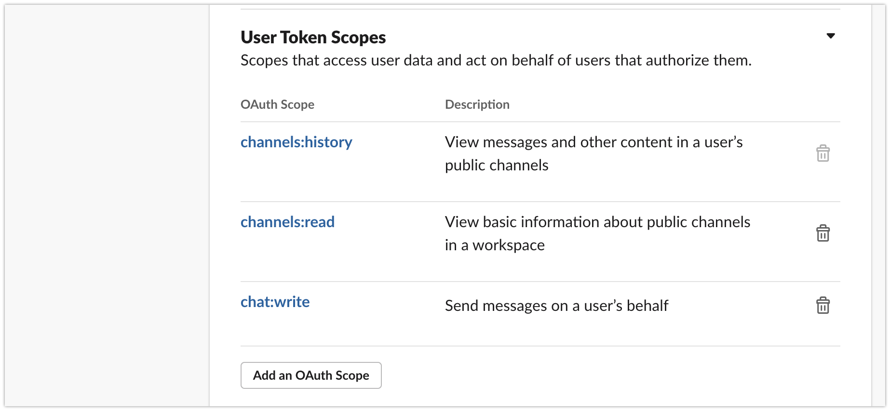

# LangChain と OpenAI API を使って Slack 用のチャットボットをサーバーレスで作ってみる

## TL;DR

[LangChain](https://github.com/hwchase17/langchain)を使って Slack 用のチャットボットを作ってみました。AI/ML モデルは OpenAI API(text-davinci-003)を利用しています。LangChain の Memory 機能を利用しており、会話の履歴も考慮して返信することができます。この際、OpenAI 側のモデルの入力トークン制限が問題になりますが、`ConversationSummaryBufferMemory`を利用することで、一定のトークン数を超える履歴は要約して保持するようになっています。

また、バックエンドの実装では AWS Lambda を利用しています。Lambda はサーバレスであるため会話の履歴をメモリ上に保持することができませんが、DynamoDB に LangChain の Memory を保存することで、全てサーバーレスでの実装となっています。


## バックエンドを実装する

バックエンドの実装は IaC ツールである AWS SAM を利用します。SAM の`template.yaml`の内容は以下のとおりです。

```yaml
AWSTemplateFormatVersion: '2010-09-09'
Transform: AWS::Serverless-2016-10-31
Description: >
    slack-gpt-backend

# More info about Globals: https://github.com/awslabs/serverless-application-model/blob/master/docs/globals.rst
Globals:
    Function:
        Timeout: 120
        MemorySize: 128
        Environment:
            Variables:
                LOG_LEVEL: INFO
                POWERTOOLS_LOGGER_SAMPLE_RATE: 0.1
                POWERTOOLS_LOGGER_LOG_EVENT: true
                POWERTOOLS_SERVICE_NAME: slack-gpt-backend

Parameters:
    OpenAiApiKey:
        Type: AWS::SSM::Parameter::Value<String>
        Default: '/slack-gpt-backend/OpenAiApiKey'
    SlackToken:
        Type: AWS::SSM::Parameter::Value<String>
        Default: '/slack-gpt-backend/SlackToken'
    SlackChannel:
        Type: AWS::SSM::Parameter::Value<String>
        Default: '/slack-gpt-backend/SlackChannel'
    SlackContextTeamId:
        Type: AWS::SSM::Parameter::Value<String>
        Default: '/slack-gpt-backend/SlackContextTeamId'
    SlackUserId:
        Type: AWS::SSM::Parameter::Value<String>
        Default: '/slack-gpt-backend/SlackUserId'
    SlackReplyUsername:
        Type: AWS::SSM::Parameter::Value<String>
        Default: '/slack-gpt-backend/SlackReplyUsername'

Resources:
    postMessageFunction:
        Type: AWS::Serverless::Function
        Properties:
            CodeUri: src/
            Handler: app.lambda_handler
            Runtime: python3.9
            Layers:
                - !Sub arn:aws:lambda:${AWS::Region}:017000801446:layer:AWSLambdaPowertoolsPython:21
            Policies:
                - DynamoDBCrudPolicy:
                      TableName: !Ref ConversationHistoriesTable
            Environment:
                Variables:
                    CONVERSATIONS_HISTORIES_TABLE: !Ref ConversationHistoriesTable
                    OPENAI_API_KEY: !Ref OpenAiApiKey
                    SLACK_TOKEN: !Ref SlackToken
                    SLACK_USER_ID: !Ref SlackUserId
                    SLACK_CHANNEL: !Ref SlackChannel
                    SLACK_CONTEXT_TEAM_ID: !Ref SlackContextTeamId
                    SLACK_REPLY_USERNAME: !Ref SlackReplyUsername
            Architectures:
                - x86_64
            Description: Slackで入力されたメッセージを受け取り、OpenAI APIを通して得た返答をSlackのメッセージとして投稿します。
            Events:
                Api:
                    Type: Api
                    Properties:
                        Path: /{proxy}
                        Method: ANY
    ConversationHistoriesTable:
        Type: AWS::Serverless::SimpleTable
        Properties:
            PrimaryKey:
                Name: id
                Type: String
    ApplicationResourceGroup:
        Type: AWS::ResourceGroups::Group
        Properties:
            Name:
                Fn::Join:
                    - ''
                    - - ApplicationInsights-SAM-
                      - Ref: AWS::StackName
            ResourceQuery:
                Type: CLOUDFORMATION_STACK_1_0
    ApplicationInsightsMonitoring:
        Type: AWS::ApplicationInsights::Application
        Properties:
            ResourceGroupName:
                Fn::Join:
                    - ''
                    - - ApplicationInsights-SAM-
                      - Ref: AWS::StackName
            AutoConfigurationEnabled: 'true'
        DependsOn: ApplicationResourceGroup

Outputs:
    WebEndpoint:
        Description: API Gateway endpoint URL for Prod stage
        Value: !Sub 'https://${ServerlessRestApi}.execute-api.${AWS::Region}.amazonaws.com/Prod/'
```

`src`配下にソースコードを配置します。準備するのは以下の内容です。

-   app.py
-   backend.py
-   requirements.txt

### requirements.txt

```
slack-sdk==3.20.0
langchain==0.0.88
openai==0.26.1
tiktoken==0.2.0
```

### backend.py

OpenAI API を呼び出したり、DynamoDB に会話の履歴(Memory)を保存したりする処理です。後述の`app.py`から呼び出します。

```python
from langchain.prompts import PromptTemplate
from langchain import OpenAI, ConversationChain
from langchain.chains.conversation.memory import ConversationSummaryBufferMemory
from slack_sdk import WebClient
from slack_sdk.errors import SlackApiError
import os
import boto3

reply_llm = OpenAI(temperature=0, max_tokens=500, client=None)
summary_llm = OpenAI(temperature=0, max_tokens=1000, client=None)
conversation_template = """以下は、私とAIが仲良く会話している様子です。AIは饒舌で、その文脈から具体的な内容をたくさん教えてくれます。AIは質問に対する答えを知らない場合、正直に「知らない」と答えます。

{history}
私: {input}
AI:"""

conversation_prompt = PromptTemplate(
    input_variables=["history", "input"], template=conversation_template
)

summary_template = """会話内容を順次要約し、前回の要約に追加して新たな要約を返してください。

### 現在の要約

{summary}

### 新しい会話

{new_lines}

### 新しい要約

"""

slack_token = os.environ["SLACK_TOKEN"]
slack_client = WebClient(token=slack_token)
dynamodb = boto3.resource("dynamodb")
table = dynamodb.Table(os.environ["CONVERSATIONS_HISTORIES_TABLE"])
summary_prompt = PromptTemplate(
    input_variables=["summary", "new_lines"], template=summary_template
)
memory = ConversationSummaryBufferMemory(
    human_prefix="私", llm=summary_llm, max_token_limit=2000, prompt=summary_prompt
)
conversation = ConversationChain(
    llm=reply_llm, prompt=conversation_prompt, memory=memory, verbose=False
)


def get_reply(message, buffer=[], summary_buffer=""):
    conversation.memory.buffer = buffer
    conversation.memory.moving_summary_buffer = summary_buffer
    reply = conversation.predict(input=message)

    return reply, conversation.memory


def post_messsage2slack(channel, message, reply_username):
    result = slack_client.chat_postMessage(
        channel=channel, text=message, username=reply_username
    )

    return result


def save_context(context_team_id, channel, buffer, summary_buffer):
    item = {
        "id": f"{context_team_id}/{channel}",
        "buffer": buffer,
        "summary_buffer": summary_buffer,
    }
    table.put_item(Item=item)


def load_context(context_team_id, channel):
    response = table.get_item(
        Key={
            "id": f"{context_team_id}/{channel}",
        }
    )

    return response
```

### app.py

Slack とやり取りするメイン処理です。

```python
from aws_lambda_powertools import Logger
from aws_lambda_powertools.utilities.typing import LambdaContext
from aws_lambda_powertools.event_handler import APIGatewayRestResolver
from aws_lambda_powertools.logging import correlation_paths
from backend import get_reply, save_context, load_context, post_messsage2slack
import os

logger = Logger()
app = APIGatewayRestResolver()
slack_user_id = os.environ["SLACK_USER_ID"]
slack_channel = os.environ["SLACK_CHANNEL"]
slack_context_team_id = os.environ["SLACK_CONTEXT_TEAM_ID"]
slack_reply_username = os.environ["SLACK_REPLY_USERNAME"]


@app.post("/events")
def post_message():
    event = app.current_event

    # Slackからは複数回呼び出されるため、最初の呼び出し以外は無視するようにします。
    retry_counts = event.get("multiValueHeaders", {}).get("X-Slack-Retry-Num", [0])

    if retry_counts[0] != 0:
        logger.info(f"Skip slack retrying({retry_counts}).")
        return {}

    body = app.current_event.json_body

    # Slack Appのイベントハンドラーとして登録する際の対応です。
    if "challenge" in body:
        return {"challenge": body["challenge"]}

    logger.info(body)

    message = body["event"]["text"]
    # 対象にメンションされたイベント以外に反応すると無限ループになるので要注意です。
    if not message.startswith(slack_user_id):
        logger.info("Not mentioned me.")
        return {}

    history = load_context(slack_context_team_id, slack_channel).get("Item", {})

    logger.info(history)

    buffer = history.get("buffer", [])
    summary_buffer = history.get("summary_buffer", "")

    reply, memory = get_reply(message, buffer, summary_buffer)

    logger.info(reply)

    save_context(
        slack_context_team_id,
        slack_channel,
        memory.buffer,
        memory.moving_summary_buffer,
    )

    post_messsage2slack(slack_channel, reply, slack_reply_username)

    return {}

@logger.inject_lambda_context(correlation_id_path=correlation_paths.API_GATEWAY_REST)
def lambda_handler(event: dict, context: LambdaContext) -> dict:
    return app.resolve(event, context)
```

## デプロイする

以下の様に SAM でデプロイします。

```bash
sam build
sam deploy --guided
```

## Slack アプリとして組み込む

Outgoing Webhook が非推奨になったらしく、Slack アプリを作成します。以下の画面から作成します。

-   https://api.slack.com/apps


色々設定がありますが、必要なポイントだけ記載します。

### Event Subscriptions

Slack からの Event を受け付ける先として、先にデプロイした API Gateway の URL を指定します。API Gateway の URL は AWS コンソールから確認してください。


指定する URL は以下のとおりです。

-   https://[Random String].execute-api.ap-northeast-1.amazonaws.com/Prod/events

購読するイベントは`message.channels`です。Bot として購読する場合とユーザ(人)の代わりとして購読する場合の 2 種類がありますが、今回はユーザの代わりとして機能させます。


### OAuth & Permissions

後で ParameterStore に設定する`Slack Token`と Slack API を呼び出すための権限を設定します。

`Slack Token`も 2 種類あり、利用する Token で Bot として振る舞うか、ユーザの代わりとして振る舞うかが変わります。今回はユーザの代わりとするため`User OAuth Token`を利用します。後で ParameterStore に設定するため、覚えておいてください。


権限の設定も`User Token Scopes`に設定します。



上記では色々設定していますが、今回は以下だけ設定すれば動くと思います。

-   chat:write

設定後、Workspace にアプリを再インストールします。


## SSM ParameterStore を設定する

Slack Token や OpenAI の ApiKey など、バックエンドが利用する各種パラメータは SAM で自動的に設定しないため、AWS コンソールにて先に以下のパラメータを設定しておきます。

-   /slack-gpt-backend/OpenAiApiKey
-   /slack-gpt-backend/SlackToken
-   /slack-gpt-backend/SlackChannel
-   /slack-gpt-backend/SlackContextTeamId
-   /slack-gpt-backend/SlackUserId
-   /slack-gpt-backend/SlackReplyUsername

### /slack-gpt-backend/OpenAiApiKey

OpenAI API の ApiKey を設定します。API Key の取得方法は以下を参照してください。

-   https://help.openai.com/en/articles/4936850-where-do-i-find-my-secret-api-key

### /slack-gpt-backend/SlackToken

前述の`Slack Token`を設定します。今回設定するのは`User OAuth Token`です。

### /slack-gpt-backend/SlackContextTeamId

Slack Workspace の ID です。想定しているのは以下の形式ですが、現在は DyanmoDB 側の ID 項目で使用しているだけであるため、基本的には一意であれば何でも構いません。

-   X99ZZZZZZ

### /slack-gpt-backend/SlackChannel

Bot が返信する先のチャネル名を指定します。ID ではなく、以下のようなチャネルの表示名です。

-   #talk-with-ai

### /slack-gpt-backend/SlackUserId

Bot に代替させるユーザの Slack UserId です。以下のような形式です。この UserId にメンションされた場合に Bot が返信します。

-   <@U99XXXZZZ>

### /slack-gpt-backend/SlackReplyUsername

Bot がメッセージを送信する際の Username です。チャネルに参加している人の Username を指定します。

## Slack の対象チャネルにアプリを招待する

Bot を導入するチャネルに作成したアプリを追加します。


## もう少し何とかしたいところ

-   SlackChannel をパラメータで指定していますが、Slack からのイベント通知でチャネルの情報は取得できるため、それを利用することが考えられます。
-   現在の実装では複数のチャネル(あるいは Workspace)に対応できていないため、情報の持ち方を変えることで改善したいところです。
-   AI/ML モデルに与えるプロンプトを直書きしているので、DynamoDB などで動的に設定するようにしたいです。
-   Slack からのイベント受付において Retry を単純に無視していますが、SQS を利用するなどで取りこぼしをしないようにちゃんとケアしたいところです。

## 参考文献

-   [Slack App の作り方](https://zenn.dev/nyancat/articles/20211219-create-slack-app)
