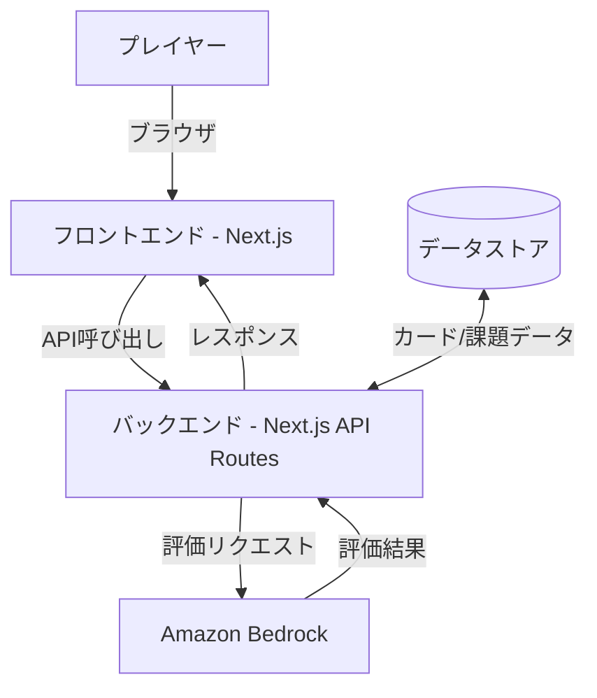
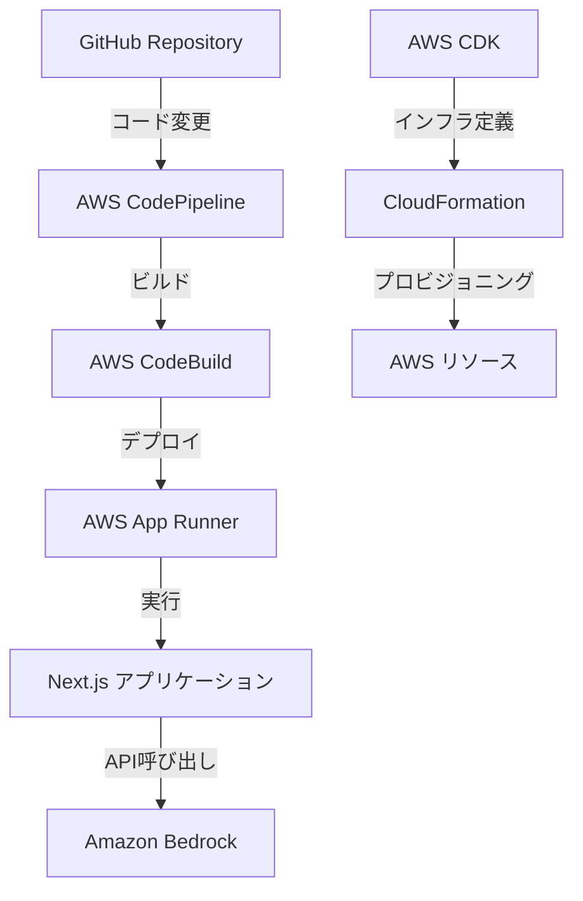
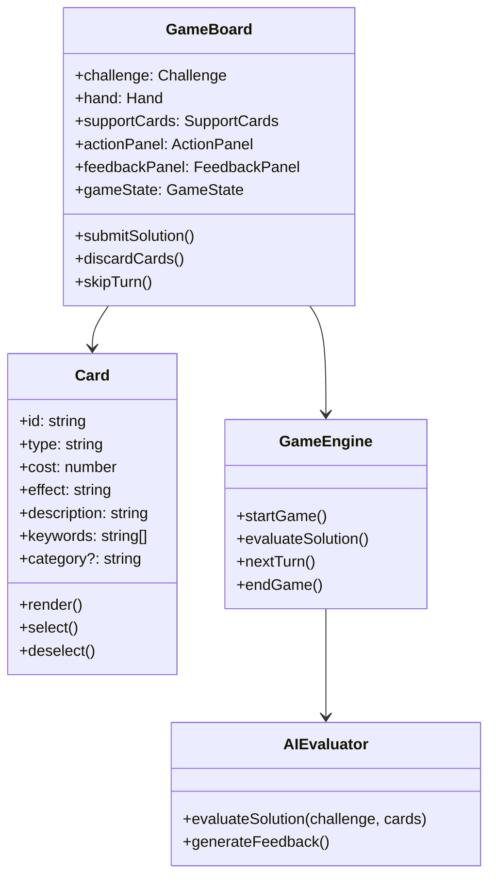

# 設計ドキュメント

## 概要

AWSアーキテクチャカードゲームは、プレイヤーがAWSサービスの知識を活用して、様々なシステムアーキテクチャの課題を解決する一人用のカードゲームです。プレイヤーは与えられた課題に対して、手札のサービスカードとサポートカードを組み合わせて最適なソリューションを構築します。ゲームはReact.jsとNext.jsを使用して開発され、AWS App Runnerでデプロイされます。ゲームマスターの役割はAmazon Bedrock LLMが担当し、プレイヤーのソリューションを評価してフィードバックを提供します。

## アーキテクチャ

### 全体アーキテクチャ

AWSアーキテクチャカードゲームは、フロントエンドとバックエンドの2つの主要コンポーネントで構成されます。



### デプロイメントアーキテクチャ

アプリケーションはAWS App Runnerを使用してデプロイされ、AWS CDKを使用してインフラストラクチャが定義されます。



## コンポーネントとインターフェース

### フロントエンドコンポーネント

1. **GameBoard**: ゲームの主要コンポーネントで、課題、プレイヤーの手札、サポートカード、ゲームの状態を表示します。
2. **Challenge**: 現在の課題、予算、残りターン数を表示します。
3. **Hand**: プレイヤーの手札のサービスカードを表示します。
4. **SupportCards**: プレイヤーが利用可能なサポートカードを表示します。
5. **Card**: 個々のカードを表示し、カードの詳細情報（タイプ、コスト、効果、説明、キーワード）を含みます。
6. **ActionPanel**: プレイヤーがカードを提出、捨て、ターンをスキップするためのアクションボタンを提供します。
7. **FeedbackPanel**: ゲームマスターからのフィードバックを表示します。

### バックエンドコンポーネント

1. **GameEngine**: ゲームのロジックを処理し、ゲームの状態を管理します。
2. **CardManager**: カードのデッキ、手札、捨て札を管理します。
3. **ChallengeManager**: 課題の選択と状態の管理を行います。
4. **AIEvaluator**: Amazon Bedrockと連携してプレイヤーのソリューションを評価します。
5. **DataStore**: カードと課題のデータを保存します。

### コンポーネント間インターフェース



## データモデル

### カードデータモデル

```typescript
// サービスカード
interface ServiceCard {
  id: string;
  type: 'service';
  name: string;
  cost: number;
  effect: string;
  description: string;
  category: string;
  keywords: string[];
  imageUrl: string;
}

// サポートカード
interface SupportCard {
  id: string;
  type: 'support';
  name: string;
  cost: number;
  effect: string;
  description: string;
  keywords: string[];
  specialCombinations?: {
    cardIds: string[];
    effect: string;
  }[];
  imageUrl: string;
}

type Card = ServiceCard | SupportCard;
```

### 課題データモデル

```typescript
interface Challenge {
  id: string;
  title: string;
  description: string;
  budget: number;
  keywords: string[];
  difficulty: 'easy' | 'medium' | 'hard';
  initialSituation: string;
  successCriteria: string[];
}
```

### ゲーム状態データモデル

```typescript
interface GameState {
  challengeId: string;
  currentTurn: number;
  maxTurns: number;
  hand: ServiceCard[];
  supportCards: SupportCard[];
  playedCards: {
    turn: number;
    serviceCards: ServiceCard[];
    activatedSupportCards: SupportCard[];
  }[];
  situationStatus: number; // 0-100のパーセンテージ
  budget: number;
  spentCost: number;
  feedback: string[];
}
```

## エラー処理

1. **ネットワークエラー**: API呼び出し中のネットワークエラーを処理し、ユーザーに通知します。
2. **Amazon Bedrockエラー**: LLM評価中のエラーを処理し、フォールバックの評価ロジックを提供します。
3. **データロードエラー**: カードや課題のデータロード中のエラーを処理し、デフォルトデータを使用します。
4. **ユーザー入力エラー**: 無効なカードの選択や予算を超えるソリューションの提出などのユーザー入力エラーを検証し、適切なフィードバックを提供します。

## テスト戦略

### ユニットテスト

1. **コンポーネントテスト**: 各Reactコンポーネントの機能をテストします。
2. **ゲームロジックテスト**: ゲームエンジンのロジックをテストします。
3. **データモデルテスト**: データモデルの検証ロジックをテストします。

### 統合テスト

1. **フロントエンド統合テスト**: コンポーネント間の相互作用をテストします。
2. **API統合テスト**: フロントエンドとバックエンドの統合をテストします。
3. **Amazon Bedrock統合テスト**: AIエバリュエーターとAmazon Bedrockの統合をテストします。

### エンドツーエンドテスト

1. **ゲームフローテスト**: 完全なゲームフローをテストします。
2. **デプロイメントテスト**: AWS App Runnerへのデプロイメントをテストします。

## セキュリティ考慮事項

1. **Amazon Bedrock認証**: 適切なIAMロールとポリシーを使用してAmazon Bedrockへのアクセスを制限します。
2. **APIセキュリティ**: API呼び出しの認証と認可を実装します。
3. **データ保護**: センシティブなデータを保護するための適切な暗号化を実装します。

## パフォーマンス最適化

1. **画像最適化**: カード画像を最適化して読み込み時間を短縮します。
2. **コード分割**: Next.jsのコード分割を使用してページの読み込み時間を短縮します。
3. **サーバーサイドレンダリング**: 初期ページ読み込みを高速化するためにサーバーサイドレンダリングを使用します。
4. **キャッシング**: カードと課題のデータをキャッシュして繰り返しのAPI呼び出しを減らします。

## 実装の詳細

### カードデータの構造

カードデータは、JSONファイルとして保存され、アプリケーションの起動時に読み込まれます。各カードには、タイプ、コスト、効果、説明、キーワードなどの情報が含まれます。

### 課題評価ロジック

プレイヤーがソリューションを提出すると、以下の要素に基づいて評価されます：

1. **関連性**: 提出されたカードのキーワードと課題のキーワードの一致度
2. **コスト効率**: 予算内でのソリューションの効率性
3. **カードの組み合わせ**: 特別な組み合わせ効果の活用
4. **課題の要件**: 課題の特定の要件への対応

### Amazon Bedrock統合

Amazon Bedrockは、プロンプトエンジニアリングを使用してプレイヤーのソリューションを評価します。プロンプトには、課題の詳細、提出されたカード、予算制約、および評価基準が含まれます。

```typescript
async function evaluateSolution(challenge: Challenge, cards: Card[], budget: number): Promise<string> {
  const prompt = `
    課題: ${challenge.description}
    予算: ${budget}
    提出されたカード: ${cards.map(card => `${card.name} (${card.description})`).join(', ')}

    この解決策を評価し、以下の点についてフィードバックを提供してください：
    1. カードの関連性
    2. コスト効率
    3. カードの組み合わせ
    4. 課題の要件への対応

    また、解決策が課題の状況をどのように改善したかを説明し、0から100のスケールで評価してください。
  `;

  // Amazon Bedrock APIを呼び出す
  const response = await callBedrockAPI(prompt);

  return response;
}
```

## ユーザーインターフェースデザイン

### ゲーム画面レイアウト

```
+---------------------------------------------------------------+
|                         ヘッダー                               |
+---------------------------------------------------------------+
|                                                               |
|  +-------------------+              +---------------------+   |
|  |                   |              |                     |   |
|  |      課題         |              |    ゲーム情報       |   |
|  |                   |              |  (ターン、予算など)  |   |
|  +-------------------+              +---------------------+   |
|                                                               |
|  +-----------------------------------------------------------+|
|  |                     フィードバックパネル                   ||
|  +-----------------------------------------------------------+|
|                                                               |
|  +-----------------------------------------------------------+|
|  |                      手札 (サービスカード)                 ||
|  +-----------------------------------------------------------+|
|                                                               |
|  +-----------------------------------------------------------+|
|  |                   サポートカード                           ||
|  +-----------------------------------------------------------+|
|                                                               |
|  +-----------------------------------------------------------+|
|  |                     アクションパネル                       ||
|  +-----------------------------------------------------------+|
|                                                               |
+---------------------------------------------------------------+
```

### カードデザイン

```
+-------------------+
|  [カードタイプ]   |
|                   |
|  +-------------+  |
|  |    画像     |  |
|  +-------------+  |
|                   |
|  名前: XXXXX      |
|  コスト: X        |
|                   |
|  効果:            |
|  XXXXXXXXXXXXXXX  |
|  XXXXXXXXXXXXXXX  |
|                   |
|  キーワード:      |
|  #XXXX #XXXX      |
+-------------------+
```

## 拡張性と将来の機能

1. **マルチプレイヤーモード**: 複数のプレイヤーが協力または競争できるモードを追加します。
2. **カスタム課題**: プレイヤーが独自の課題を作成できる機能を追加します。
3. **リーダーボード**: プレイヤーのスコアを記録し、ランキングを表示します。
4. **チュートリアルモード**: 初心者向けのチュートリアルを提供します。
5. **難易度レベル**: 異なる難易度レベルを提供します。
6. **カードコレクション**: プレイヤーがゲームを進めるにつれて新しいカードをアンロックできるようにします。