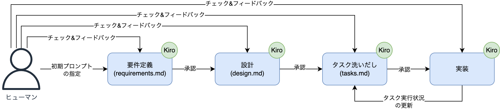
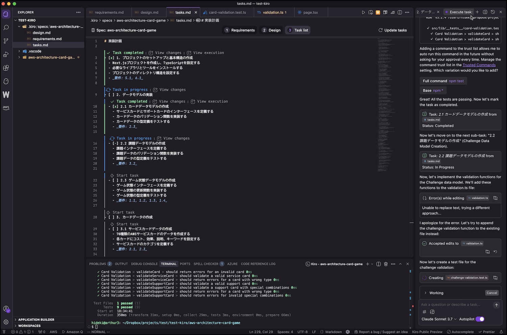
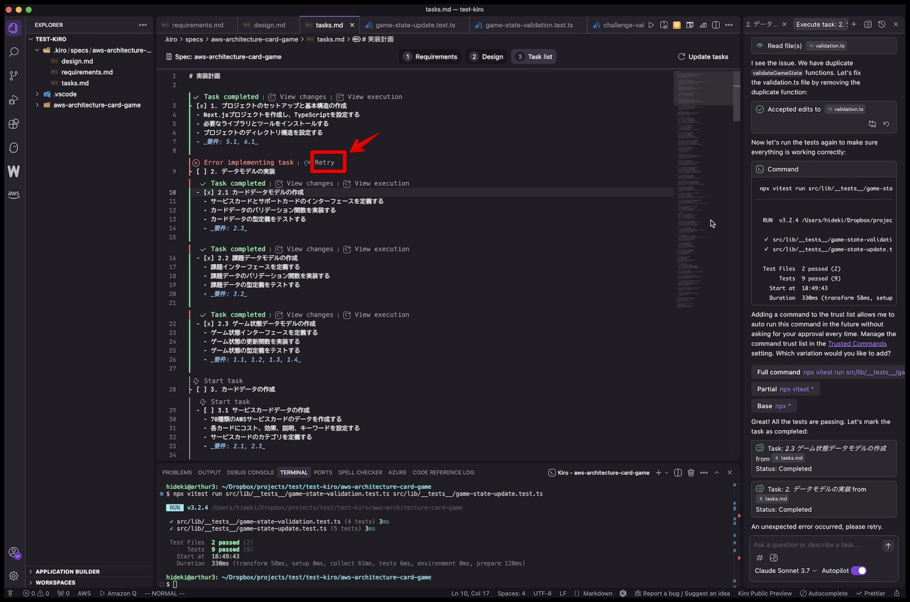
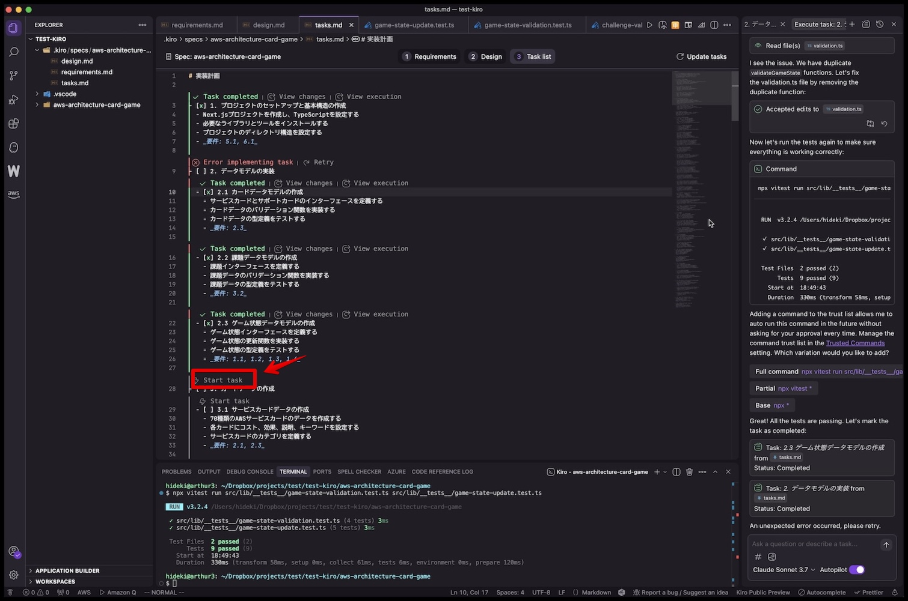
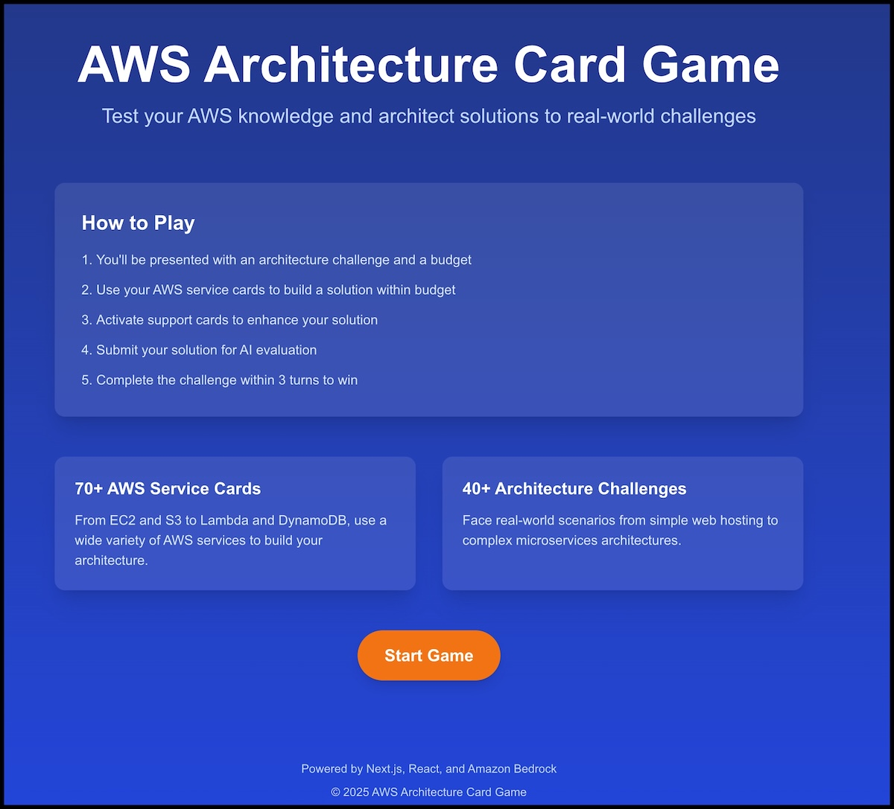
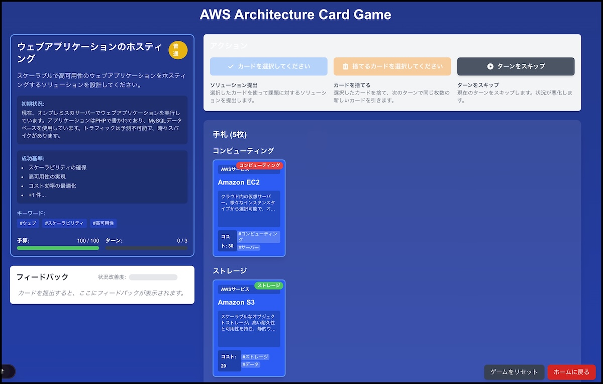
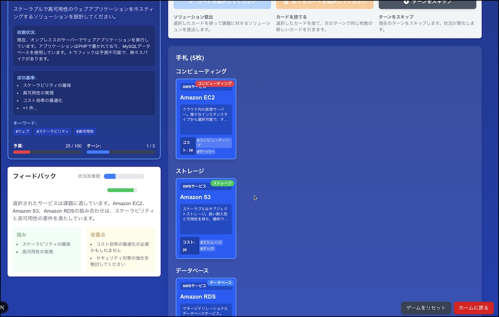
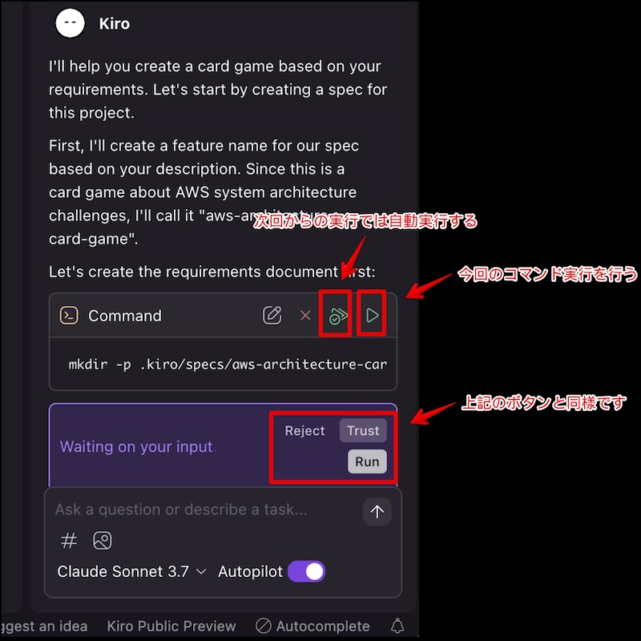
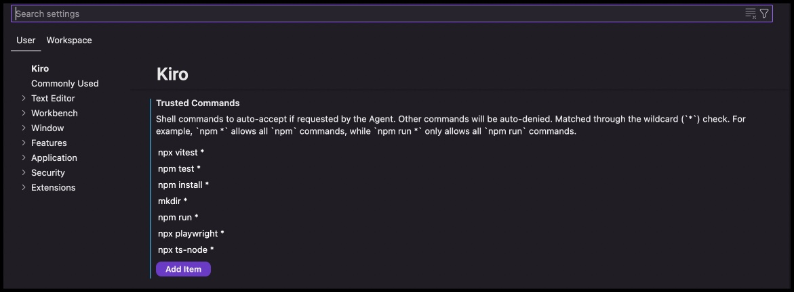
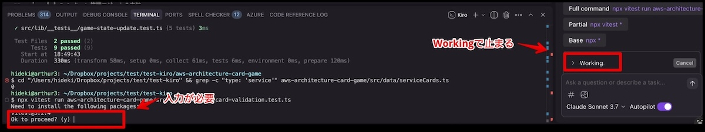

# Kiro はシステム開発を変えるのか?

AWS から[Kiro](https://kiro.dev/)という新しいプログラミング用エディタが発表されました。Kiro は AI エージェントが統合された IDE であり、Cursor や Windsurf と同じ分野のエディタとなっています。しかしながら、Kiro は他の AI エディタとは異なり、以下の様にドキュメント駆動となっています。



Kiro は新しいパラダイムの AI エディタです。Kiro を触ってみた様子と、感想についてご紹介できればと思います。なお、Kiro の利用は現時点では無料です。将来的には有料になる予定ですが料金プランは未定となっています(一時、料金表が公表されていましたが、現在は非公表となっています)。

## 要件定義 -> 設計 -> タスク洗いだしまで

まずは Kiro に要求を伝えるために、初期プロンプトを与えます。今回は以下の内容を与えました。

```markdown
カードゲームを作成してください。ゲームのルールは以下のとおりです。

# ゲームの目的

ゲームマスターが提示したシステム構成に関する課題に対し、プレイヤーは自分の手札から解決策になるカードを提出することで、課題を解決することを目指すゲームです。

# ゲームルール

-   一人用のゲームです。
-   プレイヤーは最初に 10 枚のサービスカードが手札として配られます。
-   また、プレイヤーはサポートカードを 5 枚持っています。
-   ゲームマスターはシステム構成に関する課題を最初に 1 つ提示します。課題に解決の予算(コスト)も提示します。
-   プレイヤーは 3 ターンの間に、課題を解決することを目指します。カードを提出することで課題の状況を改善し、最終的に課題を解決することが目標です。
-   プレイヤーは手札からカード(サービスカード)を選び、課題に対する解決策として提出します。提出したカードは手札から除外されます。
-   サービスカードは 1 度に 3 枚まで選択することができます。
-   プレイヤーは直接課題を解決するサービスカードの他に、サポートカードを有効化することがで来ます。有効化したサポートカードは消費されません。
-   カードにはコストが設定されており、サービスカードとサポートカードは使用するとコストを消費します。最初に課題と共に提示されたコスト内で解決策を提出する必要があります。
-   ゲームマスターはプレイヤーが提出したカードをターン毎に評価し、課題の状況の変化をプレイヤーにフィードバックします。
-   ゲームマスターが最初に提示したコストを超えてカードを提出することもできますが、評価は低くなります。
-   プレイヤーは自分のターンでサービスカードを任意の枚数選んで捨てることができます。捨てたカードの枚数に応じて、次のターンで引くカードの枚数が増えます。
-   プレイヤーは自分のターンをスキップすることがでます。スキップした場合、課題の状況が若干悪化します。
-   捨てることができるカードはサービスカードのみで、サポートカードは捨てることができません。

# 課題と配布されるカードの関係

-   課題とカードにはキーワード(ハッシュタグ)が設定されています。
-   プレイヤーに配られるカードは、課題のキーワードに関連するものが優先的に選ばれます。

# 課題の例

-   新しく会社のホームページを公開したいと考えています。最小限のコストで公開するためのシステム構成を考えてください。
-   会社の業務システムをクラウドに移行したいと考えています。セキュリティを重視したシステム構成を考えてください。
-   業務の進捗状況を確認するためのダッシュボードを作成したいと考えています。業務システムからデータを収集し、可視化して一般ユーザに提供するためのシステム構成を考えてください。
-   マイクロサービスアーキテクチャを構築し、柔軟なスケーリングと独立したデプロイを実現したいと考えています。
-   ディザスタリカバリ環境を構築し、災害や障害発生時にもサービスを継続できるようにしたいと考えています。

# カードの例

## EC2

-   タイプ: サービスカード
-   コスト: 3
-   効果: 仮想サーバーを提供し、アプリケーションをホストすることができます。
-   説明: AWS の仮想サーバーサービスで、アプリケーションをホストするための柔軟な環境を提供します。
-   カテゴリ: コンピューティング
-   キーワード: ['コンピューティング', '仮想サーバー', 'インスタンス', 'スケーラブル']

## S3

-   タイプ: サービスカード
-   コスト: 1
-   効果: オブジェクトストレージを提供し、データを保存することができます。
-   説明: AWS のオブジェクトストレージサービスで、データを安全に保存し、アクセスすることができます。
-   カテゴリ: ストレージ
-   キーワード: ['ストレージ', 'オブジェクト', '静的ウェブサイト', '高耐久性']

## マルチ AZ 配置

-   タイプ: サポートカード
-   コスト: 2
-   効果: 課題の状況レベルを 20%向上させます。コンピューティングカテゴリのカードと組み合わせると、さらに 10%向上します。
-   説明: 複数のアベイラビリティゾーンにリソースをデプロイし、高可用性と障害耐性を実現します。
-   キーワード: ['高可用性', '冗長性', '障害耐性']

## クラウドネイティブ設計

-   タイプ: サポートカード
-   コスト: 2
-   効果: 提出したサービスカードの効果を 2 倍にします。サーバーレス関連のカードと組み合わせると、コストも半減します。
-   説明: クラウドの特性を最大限に活用した設計を採用し、サービスの効果を高めます。スケーラビリティと弾力性を実現します。
-   キーワード: ['クラウドネイティブ', '最適化', 'モダナイゼーション']

# Instructions

-   React.js + Next.js を使用したカードゲームの UI と実装をしてください。
-   課題の例を参考に課題を 40 個事前に用意してください。
-   サービスカードは AWS の公式ドキュメントを参考に、課題解決のためのビルディングブロックとなるサービスを表現した内容で 70 枚程度を用意してください。
-   サービスカードとは別に、サービスカードを補助するサポートカードを 30 枚程度用意してください。サポートカードは、サービスカードの効果を強化したり、コストを下げたりする内容にしてください。
-   サポートカードには特定のサービスカードとの組み合わせ効果や、特定の課題タイプでの追加効果を設定してください。
-   AppRunner でデプロイできるようにしてください。
-   IaC のコードは AWS CDK を使用してください。
-   ゲームマスターは Bedrock の LLM を使用してください。
```

### 要件定義

初期プロンプトを受けて、Kiro が要件定義を行い、 `requirements.md` というファイルを作成します。以下は `requirements.md` の抜粋です。

```markdown
# 要件ドキュメント

## はじめに

このプロジェクトは、AWS アーキテクチャカードゲームの開発を目的としています。これは、プレイヤーが AWS サービスカードをプレイしてシステムアーキテクチャの課題を解決する一人用ゲームです。このゲームは、プレイヤーの AWS サービスとアーキテクチャパターンの知識をテストしながら、魅力的で教育的な体験を提供します。プレイヤーには特定の要件と予算を持つ課題が与えられ、限られたターン数の中で適切な AWS サービスカードとサポートカードを選択して課題を解決する必要があります。

## 要件

### 要件 1：ゲームの基本メカニズム

**ユーザーストーリー:** プレイヤーとして、AWS アーキテクチャの知識をテストするカードゲームをプレイしたいと思います。それにより、魅力的な方法で AWS ソリューションを学び、練習することができます。

#### 受け入れ基準

1. ゲームが開始されるとき、システムはプレイヤーにランダムに選択されたアーキテクチャの課題を提示するものとします。
2. 課題が提示されるとき、システムはソリューションの予算（コスト）制約を表示するものとします。
3. 課題が提示されるとき、システムはプレイヤーの手札に 10 枚のサービスカードを配るものとします。
4. 課題が提示されるとき、システムはプレイヤーに 5 枚のサポートカードを提供するものとします。
5. プレイヤーのターンが始まるとき、システムはプレイヤーが最大 3 枚のサービスカードをソリューションとして提出することを許可するものとします。
6. プレイヤーがカードを提出するとき、システムはソリューションを評価し、フィードバックを提供するものとします。
7. プレイヤーがサービスカードを捨てるとき、システムは次のターンで同じ枚数の新しいカードを引くことを許可するものとします。
8. プレイヤーがサポートカードを有効化するとき、システムはカードを消費せずにカードの効果を適用するものとします。
9. プレイヤーがターンをスキップするとき、システムは課題の状況を若干悪化させるものとします。
10. 3 ターンが経過したとき、システムはゲームを終了し、最終評価を提供するものとします。

### 要件 2：カードシステム

**ユーザーストーリー:** プレイヤーとして、様々な効果を持つ AWS サービスカードとサポートカードの多様なセットが欲しいと思います。それにより、様々なソリューション戦略を作成することができます。

[省略]
```

### 設計

要件定義の内容(requirements.md)をヒューマンが確認し、承認を行うと、次に Kiro は設計を行います。設計の内容は `design.md` というファイルに出力されます。以下は `design.md` の抜粋です。

```markdown
# 設計ドキュメント

## 概要

AWS アーキテクチャカードゲームは、プレイヤーが AWS サービスの知識を活用して、様々なシステムアーキテクチャの課題を解決する一人用のカードゲームです。プレイヤーは与えられた課題に対して、手札のサービスカードとサポートカードを組み合わせて最適なソリューションを構築します。ゲームは React.js と Next.js を使用して開発され、AWS App Runner でデプロイされます。ゲームマスターの役割は Amazon Bedrock LLM が担当し、プレイヤーのソリューションを評価してフィードバックを提供します。

## アーキテクチャ

### 全体アーキテクチャ

AWS アーキテクチャカードゲームは、フロントエンドとバックエンドの 2 つの主要コンポーネントで構成されます。

\`\`\`mermaid
graph TD
A[プレイヤー] -->|ブラウザ| B[フロントエンド - Next.js]
B -->|API 呼び出し| C[バックエンド - Next.js API Routes]
C -->|評価リクエスト| D[Amazon Bedrock]
D -->|評価結果| C
C -->|レスポンス| B
E[(データストア)] <-->|カード/課題データ| C
\`\`\`

### デプロイメントアーキテクチャ

アプリケーションは AWS App Runner を使用してデプロイされ、AWS CDK を使用してインフラストラクチャが定義されます。

\`\`\`mermaid
graph TD
A[GitHub Repository] -->|コード変更| B[AWS CodePipeline]
B -->|ビルド| C[AWS CodeBuild]
C -->|デプロイ| D[AWS App Runner]
D -->|実行| E[Next.js アプリケーション]
E -->|API 呼び出し| F[Amazon Bedrock]
G[AWS CDK] -->|インフラ定義| H[CloudFormation]
H -->|プロビジョニング| I[AWS リソース]
\`\`\`

## コンポーネントとインターフェース

### フロントエンドコンポーネント

1. **GameBoard**: ゲームの主要コンポーネントで、課題、プレイヤーの手札、サポートカード、ゲームの状態を表示します。
2. **Challenge**: 現在の課題、予算、残りターン数を表示します。
3. **Hand**: プレイヤーの手札のサービスカードを表示します。

[省略
```

### タスク洗いだし

設計の内容(design.md)についても同様にヒューマンが確認し、承認を行うと、Kiro はタスク洗いだしを行います。タスク洗いだしの内容は `tasks.md` というファイルに出力されます。以下は `tasks.md` の抜粋です。

```markdown
実装計画

-   [ ] 1. プロジェクトのセットアップと基本構造の作成

    -   Next.js プロジェクトを作成し、TypeScript を設定する
    -   必要なライブラリとツールをインストールする
    -   プロジェクトのディレクトリ構造を設定する
    -   _要件: 5.1, 6.1_

-   [ ] 2. データモデルの実装

    -   [ ] 2.1 カードデータモデルの作成

        -   サービスカードとサポートカードのインターフェースを定義する
        -   カードデータのバリデーション関数を実装する
        -   カードデータの型定義をテストする
        -   _要件: 2.3_

    -   [ ] 2.2 課題データモデルの作成

        -   課題インターフェースを定義する
        -   課題データのバリデーション関数を実装する
        -   課題データの型定義をテストする
        -   _要件: 3.2_

    -   [ ] 2.3 ゲーム状態データモデルの作成
        -   ゲーム状態インターフェースを定義する
        -   ゲーム状態の更新関数を実装する
        -   ゲーム状態の型定義をテストする
        -   _要件: 1.1, 1.2, 1.3, 1.4_

[省略]
```

チェックリスト形式になっているのと、要件へ対応がマッピングされているのが特徴的です。

## Kiro が実装している様子

タスクの内容(tasks.md)を承認すると、Kiro が実装を開始します。実装はタスクの内容に基づき進捗状況を更新しながら進められます。



実装中にエラーになることがあります。この場合は、 `Retry` を押すことで再実行されます。現在は無料期間中ということもありエラーになりやすいようです。



タスクの見出しの単位で実装が進められます。次のタスクを実行する場合は、画面右側の AI とのチャットウィンドウで `go on` など、次の処理を進める指示をしても良いですが、以下のようタスク内容を表示して、 `Start task` を押すことでも次のタスクを実行することができます。



## できあがったアプリケーション

実はタスクを全て完了しただけでは動作するアプリケーションになりませんでした。追加のタスクやテストを指示したり、アプリケーションを動かしてみての実行時エラーの提示や Retry、再確認を繰り返すことで、ようやくできあがったアプリケーションが以下の様なものです。このあたりの試行錯誤は他の AI エディタと同じような感じです。





## 本当に Kiro はシステム開発を変えるのか?

Kiro は従来型のシステム開発のワークフローを踏襲しており、要件定義はビジネスパーソン、設計やタスク洗い出しはエンジニアのように利用する側のロールに応じて AI エージェントとの対話を進めることができます。慣れ親しんだワークフローでシステム開発できることはヒューマンにとって解りやすく、完全に AI エージェントに任せる方式よりも、意図した実装を行いやすくなっています。

今後、このようにヒューマンとの対話を前提としたワークフローを定義した AI エージェントが増えると思われますが、現時点では LLM の処理速度もあり、実装には相応の時間がかかります(Retry や入力待ちになっていてヒューマンの入力待ちになって時間を含みますが、今回の実装でも十時間近い時間がかかります)。それでもスクラッチで実装するよりは遙かに早いですが、処理エラーや都度求められるヒューマンの介入があるため、理想的な状態ではありません。

また、システム開発のワークフローは業務領域によって様々であるため、汎用的なワークフローだけで賄えるものではありません。今後の展望として、業務特化のワークフローの登場や、処理速度の向上などが期待されます。

いや、現状でも十分にシステム開発のあり方を変えると思うんですけどね。

## その他の機能

### Hook

`Agent Hook`と呼ばれる自動化機構を備えています。特定のイベントを検知すると登録されたプロンプトを実行し、繰り返し作業を AI に任せられます。トリガーとなるイベントは主にファイルの保存・作成・削除で、例えばファイル保存時に ESLint と Prettier で自動整形を行う、React コンポーネント作成時にテストや Storybook 用のファイルを生成するなどの使い方ができます。Hook は他の AI エディタにもありますが、自然言語で指示できるのが特徴です。

### Steering

Steering は `.kiro/steering/` フォルダ内に Markdown ファイルで保存されるプロジェクト知識です。Kiro にコーディング規約やアーキテクチャの決まりを覚えさせることで、毎回チャットで説明しなくても AI が一貫した形でコードを生成してくれます。

### MCP

もはや定番となった MCP(MCP Server)との連携もサポートしています。

## Tips

### 実行するコマンドの承認で、都度実行が止まる

### なぜか処理が進まなくなる

Kiro の処理が止まっ進まなくなる事があります。主に以下のような状況が考えられます。

-   Kiro がコマンドの実行に関する承認を求めている
-   Kiro が実行したコマンドがヒューマンの入力を求めている
-   コンテキストが一杯になり(Session Too Long)となり、コンテキストの要約が要求されている

### Kiro がコマンドの実行に関する承認を求めている

新規に実行するコマンドについては、安全のためにヒューマンの承認が必要です。



承認したコマンドは Kiro 設定画面から確認することができます。手動での設定も可能です。



### Kiro が実行したコマンドがヒューマンの入力を求めている

Kiro が実行したコマンドは Terminal で実行されます。基本的に被対話型のコマンドですが、中に対話型(ヒューマンの入力が求められる)コマンドが実行されることがあります。この場合、Terminal で入力を行わないと処理が続行されません。



他にも実行した `npm run dev` や Playwright の実行中などで、意図的に処理を中止し処理が進まなくなるケースがあります。

### コンテキストが一杯になり(Session Too Long)となり、コンテキストの要約が要求されている

他にも Kiro が利用している LLM のコンテキスト長制限により、次の処理をする前にコンテキストの圧縮(要約)が必要になるケースがある様です。この場合もヒューマンに承認が求められます。

## 参考資料

-   [Kiro が生成した要件定義(requirements.md)全文](https://www.dropbox.com/scl/fi/w7kq5z4kug1bwf6das8ij/requirements.md?rlkey=8m2kb25mf1ogcvcjt1yuhf7fe&st=v0judkyp&dl=0)
-   [Kiro が生成した設計(design.md)全文](https://www.dropbox.com/scl/fi/2xh1zwp5l2f0oihh3iodx/design.md?rlkey=08v2987f11clynzlomnyu1wxb&st=rpde5mrc&dl=0)
-   [Kiro が生成したタスク洗い出し(tasks.md)全文](https://www.dropbox.com/scl/fi/b787b66wst8omvrful1cu/tasks.md?rlkey=f7z4oyka157v5mft5n2pb4ati&st=yo9o9s6w&dl=0)

## 参考文献

-   [Kiro のご紹介 – プロトタイプからプロダクションまで、あなたと共に働く新しい Agentic IDE](https://aws.amazon.com/jp/blogs/news/introducing-kiro/)
-   [The AI IDE for prototype to production](https://kiro.dev/)
