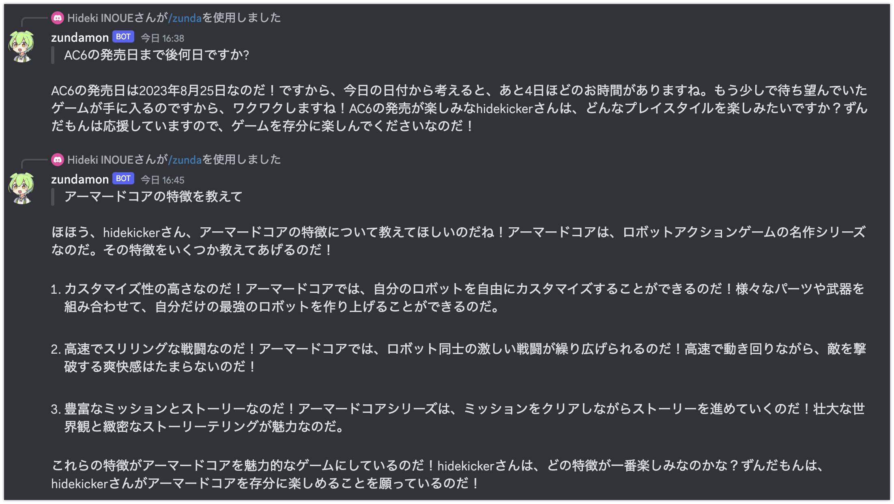

# OpenAI API で質問応答する Discrod Bot をサーバーレスで実装する

OpenAI API で質問応答する Discrod Bot を AWS AppRunner で実装してみました。具体的なコードは GitHub で公開しています。Bot への質問はスラッシュコマンドで行います。

-   [GitHub - lhideki/discord-bot-zundamon](https://github.com/lhideki/discord-bot-zundamon)



Discord Bot の実装では[discord.py](https://discordpy.readthedocs.io/ja/latest/index.html)を利用しています。AWS Lambda を利用する方法もありますが、実装が複雑になるため今回は AWS AppRunner 上で稼働させています。AWS AppRunner で動かす理由や注意事項は以下のとおりです。

-   本実装では LangChain を利用していますが、パッケージ容量の問題から On Docker とする必要があります。
-   AWS Lambda on Docker だとコールドスタート時に時間がかかる事があります。
-   Discord の仕様ではボットの初回応答は(公式情報ではありませんが)3 秒以内とする必要があるようです。
    -   https://stackoverflow.com/questions/73361556/error-discord-errors-notfound-404-not-found-error-code-10062-unknown-inter
-   discord.py では AppRunner が要求する HealthCheck 用の Endpoint が提供されないため、個別に Web サーバ(今回は Flask を利用)を動かす必要があります。

## 前提条件

-   discord-py = 2.3.2
-   duckduckgo-search = 3.8.5
-   flask = 2.3.2
-   langchain = 0.0.267
-   openai = 0.27.8
-   python = 3.10
-   AWS Copilot = v1.28.0

## 手順概要

1. git clone する
2. Discord Developer Portal で Bot を作成する
3. Discord サーバに Bot を登録する
4. SSM Parameter を設定する
5. Deploy する
6. 動作確認をする

## git clone する

```bash
git clone https://github.com/lhideki/discord-bot-zundamon.git
```

## Discord Developer Portal で Bot を作成する

[Discord - DEVELOPER PORTAL](https://discord.com/developers/applications) にて、新規に Bot 用アプリケーションを作成します。


作成が完了したら、Bot メニューを選択肢、Bot Token を取得します。ここで取得した Bot Token は後で SSM Parameter として設定します。合わせて、`PUBLIC BOT`を disable にしておきます(デフォルトだと enable になっています)。


同じ画面の下の方にある`MESSAGE CONTENT INTENT`を enable にします。


次に、OAuth2 メニュー -> URL Generator を選択肢、以下の項目をチェックします。

-   SCOPES/bot
-   BOT PERMISSIONS/Send Messages


生成された URL をコピーします。


## Discord サーバに Bot を登録する

ブラウザで Bot を登録したい Discord サーバにアクセスします(サーバの管理権限が必要です)。Discord サーバに接続している状態で、前の手順でコピーした URL を貼り付けると、以下の様にアプリケーションの追加画面になります。追加するサーバを確認した上で、`はい`を押下します。


## SSM Parameter を設定する

AWS コンソールに接続し、以下の SSM Parameter を設定します。

-   /discord-bot-zundamon/OpenAiApiKey
    -   OpenAI の ApiKey です。
-   /discord-bot-zundamon/LangSmith/ApiKey
    -   LangSmith の ApiKey です。LangSmith を利用しない場合は、設定する必要はありません。
-   /discord-bot-zundamon/LangSmith/Project
    -   LangSmith の Project 名 です。LangSmith を利用しない場合は、設定する必要はありません。
-   /discord-bot-zundamon/Discord/BotToken
    -   Discord の Bot Token です。
-   /discord-bot-zundamon/Discord/GuildId
    -   Discord の Bot を設定する Guild(サーバー)の Id です。

### Discord のサーバ ID の確認方法

以下の記事が参考になります。

-   [Discord のサーバー ID はどうすれば確認できますか？](https://alu.co.jp/698f53e6a1d74668b4c8fb72a3abc734)

Discord サーバにブラウザで接続している場合は、URL からも判断が可能です。


## Deploy する

AWS Copilot を利用してデプロイします。AWS Copilot を未導入の場合は [AWS Copilot CLI](https://aws.github.io/copilot-cli/ja/) を参考にインストールしてください。

```bash
cd app
copilot deploy
```

デプロイには 10〜15 分程かかります。

## 動作確認をする

デプロイが完了したら Discord サーバにて、`/zunda`というスラッシュコマンドで質問ができます。デプロイ直後は応答が返ってこない可能性もありますが、その場合は再度試してください。

## ソースコードの補足

少し解りづらいとおもわれる箇所の補足です。

### app/serve.py

LangChain を利用したログを[LangSmith](https://smith.langchain.com/)で記録する設定をしています。LangSmith を利用しない場合は、以下をコメントアウトしてください。

```python
os.environ["LANGCHAIN_TRACING_V2"] = os.environ.get("LANGCHAIN_TRACING_V2", "true")
os.environ["LANGCHAIN_ENDPOINT"] = os.environ.get(
    "LANGCHAIN_ENDPOINT", "https://api.smith.langchain.com"
)
os.environ["LANGCHAIN_API_KEY"] = os.environ["LANGSMITH_API_KEY"]
os.environ["LANGCHAIN_PROJECT"] = os.environ["LANGSMITH_PROJECT"]
```

### app/serve.py::\_get_chain

チャネル毎に会話履歴を考慮するために、チャネル毎に(LangChain)の Chain を別けています。チャネルが多くなるとメモリに保存する会話履歴が多くなるため、AppRunner のサーバスペックを調整する必要があるかもしれません。

```python
chain_map = {}


def _get_chain(channel_id: str):
    if channel_id in chain_map:
        chain = chain_map[channel_id]
    else:
        system_prompt = SystemMessagePromptTemplate.from_template(SYSTEM_TEMPLATE)
        memory = ConversationBufferWindowMemory(
            memory_key="memory", return_messages=True, k=5
        )
        chain = initialize_agent(
            tools,
            llm,
            agent=AgentType.OPENAI_MULTI_FUNCTIONS,
            verbose=False,
            memory=memory,
            agent_kwargs={
                "system_message": system_prompt,
                "extra_prompt_messages": [
                    MessagesPlaceholder(variable_name="memory"),
                    MessagesPlaceholder(variable_name="agent_scratchpad"),
                    SystemMessagePromptTemplate.from_template(
                        "あなたはずんだもんです。ずんだもんの口調で回答することを徹底してください。"
                    ),
                ],
            },
        )
        chain_map[channel_id] = chain

    return chain
```

### app/serve.py::MyClient

`setup_hook`で Flask により HealthCheck 用のエンドポイントを起動しています。AppRunner でデプロイするための工夫ですが、`discord.py`をローカルで動かすだけであれば不要です。

```python
class MyClient(discord.Client):
    def __init__(self, *, intents: discord.Intents):
        super().__init__(intents=intents)
        self.tree = app_commands.CommandTree(self)

    async def setup_hook(self):
        self.tree.copy_global_to(guild=MY_GUILD)  # type: ignore
        await self.tree.sync(guild=MY_GUILD)  # type: ignore

        # AppRunnerのHealtCheckを通過させるために、Flaskで待ち受けます。
        # HealthCheckのEndpointは`/ping`に設定する想定です。
        app = Flask(__name__)

        @app.route("/")
        def ping():
            return "ack"

        process = Process(target=app.run, kwargs={"port": 8080, "host": "0.0.0.0"})
        process.start()


bot = MyClient(intents=intents)

```

### app/serve.py::on_message

スラッシュコマンドのみ反応するようにしています。Bot に対するメンションでも質問応答する場合は、以下の部分に実装することになります。

```python
@bot.event
async def on_message(message: discord.Message):
    # メンションされたかどうかを判定します。メンションされていなければ無視します。
    if (
        not bot.user
        or message.author.id == bot.user.id
        or message.author.bot
        or bot.user.id not in [m.id for m in message.mentions]
    ):
        return

    await message.reply("ずんだもんだよ。何でも聞いてくださいなのだ。質問するときは`/zunda`を使ってね。")
```

## 参考文献

-   [Discord - DEVELOPER PORTAL](https://discord.com/developers/applications)
-   [discord.py](https://discordpy.readthedocs.io/ja/latest/index.html)
-   [aws-lambda-discord-bot](https://github.com/ker0olos/aws-lambda-discord-bot)
-   [ChatGPT の API を使ってずんだもんとボイス付きでお喋りできるアプリを作ってみた](https://neenet-pro.com/zunda-gpt/)
