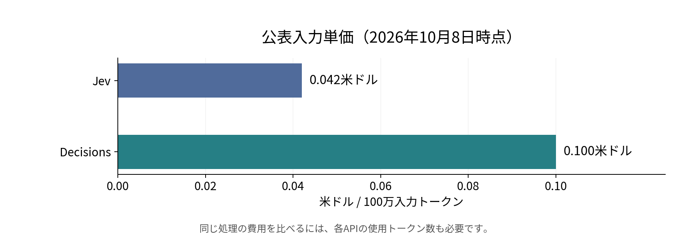
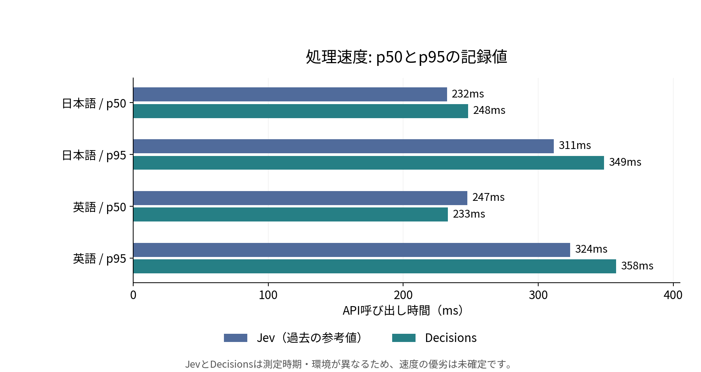

# OpenAI Decisions APIとJevを精度・コスト・処理速度で比較する

同じ文章から同じ候補を選ばせたとき、どちらが正確で、費用と待ち時間はどの程度違うのでしょうか。[前回のJev評価](https://www.inoue-kobo.com/llm/jev-graph-relation-evaluation/)と同じCoDEx由来のデータを使い、[OpenAI Decisions API](https://developers.openai.com/api/docs/guides/decisions)を比較しました。

対象は日本語1,418件、英語1,418件、関係候補36種類です。結果を先にまとめると、次のようになりました。

- **精度**: 今回は日英ともJevが高く、Accuracyで約7ポイントの差がありました。
- **コスト**: 公表入力単価はJevが低く、Decisionsの本評価は標準単価で約1.13米ドルでした。Jevの同じ処理にかかった費用は、使用トークン数がなく算出できません。
- **処理速度**: 記録上のp50は両APIとも約0.2秒台でした。Jevは過去の測定値なので、速度の優劣は同じ環境での再測定が必要です。

また、Decisionsでは36候補のどれも返さない「拒否」が、日本語で4件、英語で27件ありました。選択肢を固定するAPIでも、必ず関係名が得られるわけではありません。この挙動とJevの仕様の違いも確認します。

## 3つの比較軸を一覧で見る

| 比較軸・指標 | Jev | Decisions API |
| --- | --- | --- |
| 精度: Accuracy（日本語 / 英語） | 92.95% / 93.51% | 86.04% / 86.32% |
| コスト: 入力100万トークン単価 | 0.042米ドル | 0.10米ドル |
| コスト: 本評価2,836件の費用 | 未算出（トークン数未記録） | 標準単価換算で約1.13米ドル |
| 処理速度: p50（日本語 / 英語） | 232ms / 247ms | 248ms / 233ms |
| 処理速度: p95（日本語 / 英語） | 311ms / 324ms | 349ms / 358ms |

Accuracyは拒否回答も含む各1,418件が分母です。単価は2026年10月8日時点、費用は実測トークン数からの換算額で、請求額の照合はしていません。Jevの処理時間は測定環境を揃えていない過去の参考値です。

## 1. 精度: 今回はJevが高い

今回の関係選択では、AccuracyとMacro F1のどちらもJevが上回りました。


| 本文 | API | 正解 / 全件 | Accuracy | Macro F1 |
| --- | --- | ---: | ---: | ---: |
| 日本語 | Jev（保存結果） | 1,318 / 1,418 | 92.95% | 0.7478 |
| 日本語 | Decisions | 1,220 / 1,418 | 86.04% | 0.6833 |
| 英語 | Jev（保存結果） | 1,326 / 1,418 | 93.51% | 0.7295 |
| 英語 | Decisions | 1,224 / 1,418 | 86.32% | 0.6546 |

DecisionsとJevのAccuracyの差は、日本語で6.91ポイント、英語で7.19ポイントでした。Macro F1もJevの方が高く、日本語で約0.0645、英語で約0.0749の差がありました。

ただし、関係の件数には偏りがあります。上位3関係が全体の約62.3%を占め、10関係は各2件以下です。Macro F1も少数関係のわずかな正誤で変動するので、これだけで個別の関係に対する安定した精度を保証できるわけではありません。

### 同じレコードで正誤を比べる

全1,418件を、両方正解、片方だけ正解、両方とも正答なしに分けました。Decisionsの拒否もこの表に含めています。

| 本文 | 両方正解 | Jevだけ正解 | Decisionsだけ正解 | 両方とも正答なし |
| --- | ---: | ---: | ---: | ---: |
| 日本語 | 1,191 | 127 | 29 | 71 |
| 英語 | 1,205 | 121 | 19 | 73 |

Jevだけが正答したレコードが多いものの、Decisionsだけが正答したものも日本語29件、英語19件あります。誤るレコードの組合せは一致していません。

## 選択肢を選ぶAPIなのに、答えないことがある

Decisionsの`choice`には、候補を選ぶ回答とは別に**`refusal`（拒否）という応答型**があります。モデルがその質問への回答を断ったことを表し、質問単位で返されます。今回は1リクエストに1つの関係選択の質問を入れているため、拒否されたレコードには関係名がありません。[Decisions APIリファレンス](https://developers.openai.com/api/reference/resources/decisions/methods/create)

### 拒否はどのように返るか

通常の`choice`回答には、選択結果`choice`、候補ごとの`probabilities`、`confidence`が含まれます。一方、拒否の応答型で定義されているのは`type`と質問名`name`です。次は`answers`配列の1要素を示す説明用の例で、実測ログの引用ではありません。

```json
{
  "type": "refusal",
  "name": "relation"
}
```

質問に名前を付けなかった場合、`name`は`null`になります。この型には選択結果や確率、信頼度、拒否理由を説明するフィールドは定義されていません。そのため、**拒否が返ったことは分かっても、なぜ拒否したのかは、この応答だけでは分かりません。** 確認した公式仕様も具体的な発生条件を示しておらず、今回の31件を安全性フィルターや本文の曖昧さが原因だと断定することはできません。

### Jevとの違いと、混同しやすい4つの状態

Jevの`Choice`の成功応答は、`criteria`の中で最も確率の高い候補を`choice`として返し、候補ごとの確率と`confidence`を付ける構造です。2026年10月8日に確認した[公式の回答型定義](https://docs.typesafe.ai/sdk/python/api/types/responses)には、Decisionsのような`refusal`型は掲載されていません。ただし、これは「あらゆるリクエストで必ず選択肢が返る」という無条件の保証ではなく、[APIエラー](https://docs.typesafe.ai/api#errors)などは別に扱う必要があります。[Jev Choiceの応答仕様](https://docs.typesafe.ai/primitives/choice#response-structure)

| 状態 | Decisions API | Jev |
| --- | --- | --- |
| APIによる拒否 | 質問の回答として`type: "refusal"`を返し得る | 公開された回答型に同等の`refusal`型はない |
| 信頼度が低い選択回答 | `choice`は返る。採用を保留するかは呼び出し側で判断 | 同様に`choice`は返り、呼び出し側が閾値などで判断 |
| 「その他」「該当なし」への分類 | 必要なら候補として明示的に追加 | 必要なら`criteria`に候補として明示的に追加 |
| HTTP 429などのAPIエラー | 拒否回答とは別のリクエスト失敗 | 同様に、選択回答とは別のリクエスト失敗 |

「その他」が選ばれた場合は、用意した候補への通常の分類です。また、Jevの`criteria`の各候補の値に指定できる`null`は、説明文を省略する意味で、回答を棄権する指定ではありません。[Jev Choiceの説明](https://docs.typesafe.ai/primitives/choice)

信頼度による保留も、APIの拒否とは処理を分けます。JevのChoiceの`confidence`は、候補数を`n`、最大確率を`p_max`として、`(p_max - 1/n) / (1 - 1/n)`で計算されます。低い値でも選択回答自体は返り、その採用を控えて人手確認へ回すかは、利用側が決めます。[TypeSafeのconfidence説明](https://docs.typesafe.ai/confidence)

Decisionsも、信頼度を使った閾値の調整を案内しています。ただし、Jevと同じ計算式や同じ閾値で比較できるとは扱いません。実運用の閾値は、別途用意した業務データで決める必要があります。[Decisionsの回答の解釈](https://developers.openai.com/api/docs/guides/decisions#interpret-the-answers)

### 今回の拒否は精度にどう影響したか

| 本文 | Decisionsの選択回答 | 拒否（全件に対する割合） | 選択回答率 | 選択回答のみのAccuracy |
| --- | ---: | ---: | ---: | ---: |
| 日本語 | 1,414件 | 4件（0.28%） | 99.72% | 86.28% |
| 英語 | 1,391件 | 27件（1.90%） | 98.10% | 87.99% |

Jevの保存結果は日英とも1,418件すべてに選択回答がありました。これは今回の観測結果です。本評価のDecisionsにも通信・APIエラーはなく、上表の31件はHTTP 429などのエラーを数えたものではありません。また、こちらで低い`confidence`を拒否に振り分けたものでもありません。

主指標のAccuracyでは拒否を正答に数えず、各1,418件の分母に残しました。拒否を除いた選択回答だけで見ても、DecisionsのAccuracyはJevを下回っています。今回の差は拒否だけでは説明できません。

組み込む際には、まず応答型を確認し、拒否なら人手確認などの経路へ送ります。選択回答が得られた場合に、その後で信頼度や「その他」の扱いを判断します。**どれだけ正しいかに加えて、回答が得られない場合をどう処理するかも、APIを選ぶ際の確認点です。**

## 2. コスト: 単価と処理費用を分ける

まず、入力の公表単価と、この評価にかかった費用を分けて確認します。

### 公表入力単価

| API | 入力100万トークン当たり | 出力トークン料金 |
| --- | ---: | --- |
| Jev（現行モデル） | 0.042米ドル | 無料 |
| Decisions API | 0.10米ドル | なし |



2026年10月8日時点では、Jevの公表入力単価が低いことが分かります。出典は[TypeSafe Models](https://docs.typesafe.ai/models)と[Decisionsの料金説明](https://developers.openai.com/api/docs/guides/decisions#pricing-and-availability)です。Decisionsでは、地域別処理などの追加料金が適用される場合があります。

ただし、同じ文章でもAPIによってトークンの数え方やリクエスト形式が異なります。**単価の差が、そのまま同じ1件の処理費用の差になるとは限りません。** Jevの現行モデル`jev-1.13.0`も、過去の評価で使われたバージョンを特定する情報ではありません。

### 本評価の費用換算

Decisionsの全応答から、拒否も含めて入力トークン数を集計しました。標準単価0.10米ドル/100万入力トークンで換算すると、次のとおりです。

| 本文 | 入力トークン数 | 標準単価での換算額 |
| --- | ---: | ---: |
| 日本語 | 8,833,591 | 0.883359米ドル |
| 英語 | 2,470,749 | 0.247075米ドル |
| 合計 | 11,304,340 | 1.130434米ドル |

日英2,836件の本評価で、標準単価換算は**約1.13米ドル**でした。仮に10%の地域追加料金を適用すると約1.24米ドルですが、今回その追加料金が適用されたことや、実際の請求額は確認していません。

Jevの保存結果には使用トークン数がないため、同じ評価の費用は未算出です。今回比較できるのは公表入力単価までであり、実際の処理費用については両者の優劣を決められません。

## 3. 処理速度: p50とp95で見る

処理時間は、典型的な待ち時間を見る**p50**と、遅い側の応答も含めて見る**p95**に分けます。p50は半分、p95は95%の呼び出しがその時間以内に終わる目安です。



| 本文 | API | 呼び出しp50 | 呼び出しp95 |
| --- | --- | ---: | ---: |
| 日本語 | Jev（過去の参考値） | 232ms | 311ms |
| 日本語 | Decisions | 248ms | 349ms |
| 英語 | Jev（過去の参考値） | 247ms | 324ms |
| 英語 | Decisions | 233ms | 358ms |

記録値では、日本語のp50はJevが短く、英語のp50はDecisionsが短い結果です。p95は日英ともJevの方が短くなっています。Decisionsの本評価全体は約737秒、約12.3分でした。

計測はリクエスト開始から応答全体の読み取り・JSON解析までで、クライアント、ネットワーク、サーバーの処理を含みます。Decisionsは初回のTCP/TLS接続確立と拒否回答も含めた全リクエストを対象とし、前回と同じnearest-rank方式でp50/p95を計算しました。

**この表は、同じ環境での速度比較ではありません。** Jevは2026年9月の保存結果で、モデルのバージョン、SDK、実行元地域、接続再利用の条件などが不明です。速度を理由にAPIを選ぶ場合は、実際に使う同じクライアント環境で両方を測定する必要があります。

## 評価条件とAPIへの入力

対象は、主語と目的語が既知の状態で、両者の間に成立する関係を1つ選ぶ処理です。

```text
(主語, ?, 目的語) → 36種類の候補から関係を選択
```

主語・目的語の抽出や名寄せ、欠けたノードの検索は含めません。[CoDEx](https://github.com/tsafavi/codex)の公式リンク予測タスクとは異なる、本文を入力とする関係選択の評価です。

Jevの`Choice`とDecisionsの`choice`を対応させます。自由文を生成して関係名を後処理で抜き出す方式は使いません。

| 入力・出力 | Jev | Decisions API |
| --- | --- | --- |
| 本文 | `state` | `input` |
| 主語・目的語と指示 | `Choice.instructions` | 質問の`instructions` |
| 関係名と説明 | `criteria`のキーと値 | `choices`の`value`と`description` |
| 選択結果 | `choice` | `choice` |
| 候補ごとの確率 | `probabilities` | `probabilities` |

2026年10月8日時点のDecisionsはpublic betaで、モデルは`gpt-6-luna`、エンドポイントは`POST /v1/decisions`です。今回の全応答でも`gpt-6-luna`を確認しました。[公式APIリファレンス](https://developers.openai.com/api/reference/resources/decisions/methods/create)

### 固定した入力

CoDEx-Sのtest split 1,828件のうち、前回保存した日英共通の1,418件を使います。Wikipediaから本文を再取得せず、本文、指示文、候補名、説明、候補順を共通にしました。

| 項目 | 条件 |
| --- | --- |
| 評価件数 | 日本語1,418件、英語1,418件。同じtriple ID |
| 関係候補 | 対象データに含まれる36種類 |
| 本文 | 保存済みの日本語記事抜粋と英語extract |
| 指示文 | 前回の`run_jev.py`と同一 |
| 正解 | CoDEx/Wikidata由来の関係ID。APIには渡さない |
| 学習・例示 | ファインチューニングなし、few-shot例なし |

リクエストは必要なフィールドだけから構成します。正解ラベルやJevの予測を含むレコード全体を渡すことはしません。

```python
request = {
    "model": "gpt-6-luna",
    "input": row["articles"][language]["text"],
    "questions": [{
        "type": "choice",
        "name": "relation",
        "instructions": instructions(row, language),
        "choices": [
            {
                "value": relation["labels"][language],
                "description": relation["descriptions"][language],
            }
            for relation in relations
        ],
    }],
}
```

日本語の指示文は、前回と同じ次の形式です。

```text
日本語Wikipedia本文に基づき、主語「{主語の名称}」と目的語「{目的語の名称}」の間に成立する関係を候補から選んでください。
```

「その他」や「根拠なし」を追加するとタスクが変わるため、今回は36候補を維持しました。評価用データを見ながらの指示文調整や、レビュー閾値の最適化も行っていません。

### 指標と実行条件

Accuracyは、正解した件数を全1,418件で割ります。拒否回答を正答に数えず、分母には残します。Macro F1も固定した36関係で計算し、拒否は正解クラスのFalse Negativeとして扱います。分母が0になるクラスのF1は0とします。

有効な選択回答だけを分母にしたAccuracyは、補助値として別に表示します。拒否を除いた数値だけでは、回答が得られなかった問題が見えなくなるためです。

今回の本評価は2026年10月8日にmacOS上のPythonから逐次実行しました。HTTPS接続は可能な範囲で再利用し、ウォームアップと自動再試行はありません。本評価では通信・APIエラーは0件でした。事前の接続診断1件と、最初にHTTP 429で停止した試行は、本記事の2,836件の精度・時間・トークン数に含めていません。

入力ファイルのSHA-256とレコードIDを照合し、言語別のリクエストハッシュ、応答モデル、使用トークン数、完了件数を確認しています。Jevについては保存済みの予測ラベルから指標を再計算し、前回の結果と一致することを確認しました。

## 結果を解釈する際の制約

今回の比較には、次の制約があります。

- 対象は正例のtripleから選んだ36候補の閉じた選択問題です。「関係なし」の検出や候補外の関係の発見は評価していません。
- 正解はグラフ上の事実です。切り出した主語の記事に根拠が残っているかは全件について検証できておらず、事前知識で正解した可能性もあります。そのため、Accuracyをそのまま本文からの抽出精度とはみなせません。
- 日英の本文は翻訳対ではありません。日本語は平均約6,658文字、英語は約2,114文字で、日本語571件は10,000文字の上限に達しています。言語間の差には、情報量の差も含まれます。
- 主語は810種類です。同じ記事が複数のtripleで使われるので、1,418件すべてを独立した文書として扱うことはできません。複数回実行による安定性や統計的な有意差は検証していません。
- 保存されたJevの確率には丸めがあり、合計が0.99になる例もあります。今回は確率の較正や、信頼度によるレビュー閾値の優劣を比較していません。

## 評価スクリプトと集計結果

| ファイル | 内容 |
| --- | --- |
| [evaluate_relations.py](https://www.inoue-kobo.com/llm/decisions-jev-relation-comparison/sample/evaluate_relations.py) | 同じ本文・指示・候補からDecisionsを実行し、拒否を含めて記録・集計 |
| [run_experiment.py](https://www.inoue-kobo.com/llm/decisions-jev-relation-comparison/sample/run_experiment.py) | 日英の入力検証、マスク入力、合算予算確認、逐次実行 |
| [build_comparison.py](https://www.inoue-kobo.com/llm/decisions-jev-relation-comparison/sample/build_comparison.py) | 保存結果のオフライン集計と図の生成 |
| [aggregate-results.json](https://www.inoue-kobo.com/llm/decisions-jev-relation-comparison/sample/aggregate-results.json) | 記事に使った公開用の集計値と入力ハッシュ |
| [README.txt](https://www.inoue-kobo.com/llm/decisions-jev-relation-comparison/sample/README.txt) | 実行条件、検証・図の再生成手順、費用に関する注意 |

生のWikipedia本文、レコードごとの応答、リクエストID、APIキーは同梱していません。図は公開した集計JSONから再生成できます。同じ評価を行うには、記載したハッシュと一致する固定入力が必要です。WikipediaやWikidataから再取得すると、本文や候補の定義が変わる可能性があります。

Wikipedia本文の再配布条件はCoDExのコードのライセンスとは別です。また、公開記事にも宗教、民族、健康などの記述が含まれるため、業務データへ適用する場合は送信先と取扱条件を確認する必要があります。[Wikimediaの再利用案内](https://www.mediawiki.org/wiki/Wikimedia_APIs/Content_reuse)

## まとめ

今回の結果は、3つの軸で分けると読み取りやすくなります。

- **精度**: このデータではJevが日英とも高く、Accuracyで6.91〜7.19ポイント上回りました。
- **コスト**: 公表入力単価はJevが低く、Decisionsの本評価は標準単価で約1.13米ドルでした。Jevの実処理費用は未算出です。
- **処理速度**: 記録上はどちらもp50が約0.2秒台でした。測定環境が揃っていないため、速度の優劣は未確定です。

両APIとも、選択回答の採用・保留は信頼度などを基に利用側で判断します。Decisionsでは、それに加えて`refusal`型への分岐が必要です。この違いも、後続処理を設計する上で重要です。

この関係選択を同じ条件で使うなら、精度面ではJevを選びやすい結果です。別の業務データへ適用するときは、拒否を含む精度、実際の使用トークン数、同じ環境での待ち時間を揃えて確認することが重要だと思われます。
