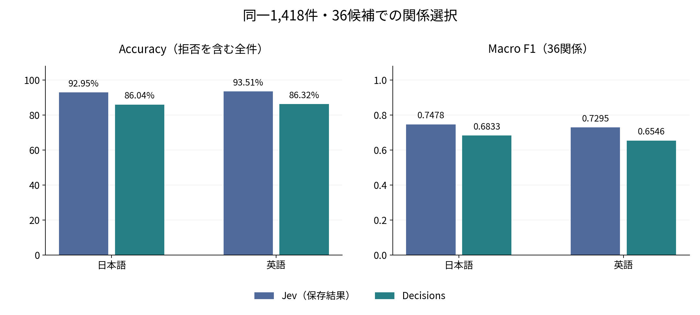
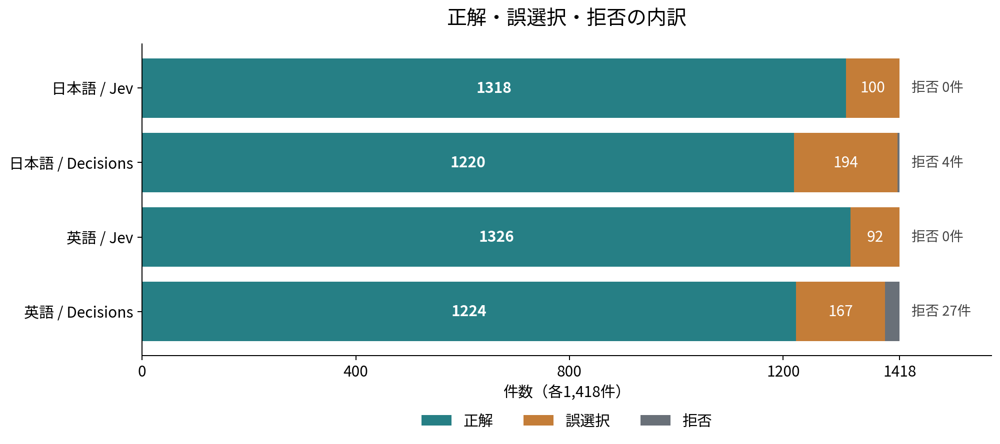

# OpenAI Decisions APIとJevを比較する - CoDExによる日英の関係選択評価

[前回の記事](https://www.inoue-kobo.com/llm/jev-graph-relation-evaluation/)では、TypeSafe AIのJevを使い、Wikipedia本文を入力として、主語と目的語の関係を36種類の候補から選びました。OpenAIの[Decisions API](https://developers.openai.com/api/docs/guides/decisions)も定義済みの候補を評価できるため、前回と同じデータで比較してみました。同じ本文と36候補を渡したとき、精度と待ち時間がどの程度違うかを確認します。

日英それぞれ1,418件を評価した結果、DecisionsのAccuracyは日本語86.04%、英語86.32%でした。保存済みのJev結果は92.95%、93.51%で、今回の関係選択ではJevの方が高精度でした。Decisionsには日本語4件、英語27件の拒否回答があり、これらも分母に残しています。



## 何を比較するか

対象は、主語と目的語が既知の状態で、両者の間に成立する関係を1つ選ぶ処理です。

```text
(主語, ?, 目的語) → 36種類の候補から関係を選択
```

主語・目的語の抽出や名寄せ、欠けたノードの検索は含めません。[CoDEx](https://github.com/tsafavi/codex)の公式リンク予測タスクとは異なる、本文を入力とする関係選択の評価です。

Jevの`Choice`とDecisionsの`choice`を対応させます。自由文を生成して関係名を後処理で抜き出す方式は使いません。

| 入力・出力 | Jev | Decisions API |
| --- | --- | --- |
| 本文 | `state` | `input` |
| 主語・目的語と指示 | `Choice.instructions` | 質問の`instructions` |
| 関係名と説明 | `criteria`のキーと値 | `choices`の`value`と`description` |
| 選択結果 | `choice` | `choice` |
| 候補ごとの確率 | `probabilities` | `probabilities` |

2026年10月8日時点のDecisionsはpublic betaで、モデルは`gpt-6-luna`、エンドポイントは`POST /v1/decisions`です。今回の全応答でも`gpt-6-luna`を確認しました。APIの仕様上、選択結果の代わりに拒否回答が返る場合があります。[公式APIリファレンス](https://developers.openai.com/api/reference/python/resources/decisions/methods/create)

## 同じ入力を使う

CoDEx-Sのtest split 1,828件のうち、前回保存した日英共通の1,418件を使います。Wikipediaから本文を再取得せず、本文、指示文、候補名、説明、候補順を共通にしました。

| 項目 | 条件 |
| --- | --- |
| 評価件数 | 日本語1,418件、英語1,418件。同じtriple ID |
| 関係候補 | 対象データに含まれる36種類 |
| 本文 | 保存済みの日本語記事抜粋と英語extract |
| 指示文 | 前回の`run_jev.py`と同一 |
| 正解 | CoDEx/Wikidata由来の関係ID。APIには渡さない |
| 学習・例示 | ファインチューニングなし、few-shot例なし |

リクエストは必要なフィールドだけから構成します。正解ラベルやJevの予測を含むレコード全体を渡すことはしません。

```python
request = {
    "model": "gpt-6-luna",
    "input": row["articles"][language]["text"],
    "questions": [{
        "type": "choice",
        "name": "relation",
        "instructions": instructions(row, language),
        "choices": [
            {
                "value": relation["labels"][language],
                "description": relation["descriptions"][language],
            }
            for relation in relations
        ],
    }],
}
```

日本語の指示文は、前回と同じ次の形式です。

```text
日本語Wikipedia本文に基づき、主語「{主語の名称}」と目的語「{目的語の名称}」の間に成立する関係を候補から選んでください。
```

「その他」や「根拠なし」を追加するとタスクが変わるため、今回は36候補を維持しました。評価用データを見ながらの指示文調整や、レビュー閾値の最適化も行っていません。

## 評価方法

Accuracyは、正解した件数を全1,418件で割ります。拒否回答を正答に数えず、分母には残します。Macro F1も固定した36関係で計算し、拒否は正解クラスのFalse Negativeとして扱います。分母が0になるクラスのF1は0とします。

有効な選択回答だけを分母にしたAccuracyは、補助値として別に表示します。拒否を除いた数値だけでは、回答が得られなかった問題が見えなくなるためです。

今回の本評価は2026年10月8日にmacOS上のPythonから逐次実行しました。HTTPS接続は可能な範囲で再利用し、ウォームアップと自動再試行はありません。本評価では通信・APIエラーは0件でした。事前の接続診断1件と、最初にHTTP 429で停止した試行は、本記事の2,836件の精度・時間・トークン数に含めていません。

入力ファイルのSHA-256とレコードIDを照合し、言語別のリクエストハッシュ、応答モデル、使用トークン数、完了件数を確認しています。Jevについては保存済みの予測ラベルから指標を再計算し、前回の結果と一致することを確認しました。

## 精度の比較

| 本文 | API | 正解 / 全件 | Accuracy | Macro F1 |
| --- | --- | ---: | ---: | ---: |
| 日本語 | Jev（保存結果） | 1,318 / 1,418 | 92.95% | 0.7478 |
| 日本語 | Decisions | 1,220 / 1,418 | 86.04% | 0.6833 |
| 英語 | Jev（保存結果） | 1,326 / 1,418 | 93.51% | 0.7295 |
| 英語 | Decisions | 1,224 / 1,418 | 86.32% | 0.6546 |

DecisionsとJevのAccuracyの差は、日本語で6.91ポイント、英語で7.19ポイントでした。Macro F1もJevの方が高く、日本語で約0.0645、英語で約0.0749の差がありました。

ただし、関係の件数には偏りがあります。上位3関係が全体の約62.3%を占め、10関係は各2件以下です。Macro F1も少数関係のわずかな正誤で変動するので、これだけで個別の関係に対する安定した精度を保証できるわけではありません。

### 拒否回答を分けて確認する

| 本文 | Decisionsの選択回答 | 拒否 | 選択回答率 | 選択回答のみのAccuracy |
| --- | ---: | ---: | ---: | ---: |
| 日本語 | 1,414件 | 4件 | 99.72% | 86.28% |
| 英語 | 1,391件 | 27件 | 98.10% | 87.99% |



拒否を除いても、今回のDecisionsのAccuracyはJevを下回っています。拒否だけが差の原因ではありません。一方、実際のシステムへ組み込む際には、関係名が返らない場合の扱いも必要です。例えば、拒否を別のレビュー経路へ送る処理を用意することになります。今回の集計から拒否の理由そのものは判断していません。

### 同じレコードで正誤を比べる

全1,418件を、両方正解、片方だけ正解、両方とも正答なしに分けました。Decisionsの拒否もこの表に含めています。

| 本文 | 両方正解 | Jevだけ正解 | Decisionsだけ正解 | 両方とも正答なし |
| --- | ---: | ---: | ---: | ---: |
| 日本語 | 1,191 | 127 | 29 | 71 |
| 英語 | 1,205 | 121 | 19 | 73 |

Jevだけが正答したレコードが多いものの、Decisionsだけが正答したものも日本語29件、英語19件あります。誤るレコードの組合せは一致していません。

## 呼び出し時間

計測対象は、HTTPSリクエストの開始から、応答全体の読み取りとJSON解析までです。クライアント、ネットワーク、サーバーの処理を含み、初回のTCP/TLS接続確立も含まれます。以下のDecisionsの値は拒否も含む全1,418リクエストを対象としています。p50とp95は、前回と同じnearest-rank方式で計算しました。

| 本文 | API | 呼び出しp50 | 呼び出しp95 |
| --- | --- | ---: | ---: |
| 日本語 | Jev（過去の参考値） | 232ms | 311ms |
| 日本語 | Decisions | 248ms | 349ms |
| 英語 | Jev（過去の参考値） | 247ms | 324ms |
| 英語 | Decisions | 233ms | 358ms |

Decisionsは今回の条件ではp50が約0.23〜0.25秒、p95が約0.35〜0.36秒でした。本評価の日英2,836件の実行全体は約737秒、約12.3分です。

Jevの値は2026年9月の保存結果で、実際に応答したモデルのバージョン、SDK、実行元地域、接続の再利用条件などは記録されていません。同じ日時・通信条件で測定した比較ではないため、この表から一律にどちらが高速とは判断できません。厳密な速度比較には、両APIを同じクライアントと条件で再測定する必要があります。

## 入力トークン数と費用

Decisionsの入力単価は、2026年10月8日時点で100万トークン当たり0.10米ドルです。出力やキャッシュの読み書きに追加のトークン料金はありません。地域別処理などの追加料金が適用される場合があります。[公式料金説明](https://developers.openai.com/api/docs/guides/decisions#pricing-and-availability)

本評価の全応答から、拒否を含めて入力トークン数を集計しました。

| 本文 | 入力トークン数 | 標準単価での換算額 |
| --- | ---: | ---: |
| 日本語 | 8,833,591 | 0.883359米ドル |
| 英語 | 2,470,749 | 0.247075米ドル |
| 合計 | 11,304,340 | 1.130434米ドル |

したがって、本評価の標準単価による換算額は約1.13米ドルです。仮に10%の地域追加料金を適用すると約1.24米ドルになりますが、今回その追加料金が適用されたことや、実際の請求額は確認していません。これは実測トークン数からの料金換算です。

同日に確認した[Jevの現行単価](https://docs.typesafe.ai/models)は入力100万トークン当たり0.042米ドルで、出力は無料でした。ただし、トークンの数え方やリクエスト形式は異なり、過去のJev結果には使用トークン数がありません。単価だけで「同じ1件の処理が何倍安い」と結論づけることはできません。なお、現行モデル`jev-1.13.0`は、保存済み結果の実行モデルを特定する情報ではありません。

## 結果を解釈する際の制約

今回の比較には、次の制約があります。

- 対象は正例のtripleから選んだ36候補の閉じた選択問題です。「関係なし」の検出や候補外の関係の発見は評価していません。
- 正解はグラフ上の事実です。切り出した主語の記事に根拠が残っているかは全件について検証できておらず、事前知識で正解した可能性もあります。そのため、Accuracyをそのまま本文からの抽出精度とはみなせません。
- 日英の本文は翻訳対ではありません。日本語は平均約6,658文字、英語は約2,114文字で、日本語571件は10,000文字の上限に達しています。言語間の差には、情報量の差も含まれます。
- 主語は810種類です。同じ記事が複数のtripleで使われるので、1,418件すべてを独立した文書として扱うことはできません。複数回実行による安定性や統計的な有意差は検証していません。
- 保存されたJevの確率には丸めがあり、合計が0.99になる例もあります。今回は確率の較正や、信頼度によるレビュー閾値の優劣を比較していません。

## 評価スクリプトと集計結果

| ファイル | 内容 |
| --- | --- |
| [evaluate_relations.py](https://www.inoue-kobo.com/llm/decisions-jev-relation-comparison/sample/evaluate_relations.py) | 同じ本文・指示・候補からDecisionsを実行し、拒否を含めて記録・集計 |
| [run_experiment.py](https://www.inoue-kobo.com/llm/decisions-jev-relation-comparison/sample/run_experiment.py) | 日英の入力検証、マスク入力、合算予算確認、逐次実行 |
| [build_comparison.py](https://www.inoue-kobo.com/llm/decisions-jev-relation-comparison/sample/build_comparison.py) | 保存結果のオフライン集計と図の生成 |
| [aggregate-results.json](https://www.inoue-kobo.com/llm/decisions-jev-relation-comparison/sample/aggregate-results.json) | 記事に使った公開用の集計値と入力ハッシュ |
| [README.txt](https://www.inoue-kobo.com/llm/decisions-jev-relation-comparison/sample/README.txt) | 実行条件、検証・図の再生成手順、費用に関する注意 |

生のWikipedia本文、レコードごとの応答、リクエストID、APIキーは同梱していません。図は公開した集計JSONから再生成できます。同じ評価を行うには、記載したハッシュと一致する固定入力が必要です。WikipediaやWikidataから再取得すると、本文や候補の定義が変わる可能性があります。

Wikipedia本文の再配布条件はCoDExのコードのライセンスとは別です。また、公開記事にも宗教、民族、健康などの記述が含まれるため、業務データへ適用する場合は送信先と取扱条件を確認する必要があります。[Wikimediaの再利用案内](https://www.mediawiki.org/wiki/Wikimedia_APIs/Content_reuse)

## まとめ

同じ1,418件・36候補による今回の関係選択では、Jevが日英ともAccuracyとMacro F1で上回りました。Decisionsはp50で約0.23〜0.25秒で応答し、本評価の標準単価換算は約1.13米ドルでしたが、日本語4件、英語27件の拒否も考慮する必要があります。

このデータと指示文をそのまま使う用途では、精度面ではJevを選びやすい結果です。別の関係体系や業務データに適用する際は、拒否を含む回答率、少数クラスの精度、実際の通信条件での待ち時間も確認することが重要だと思われます。
