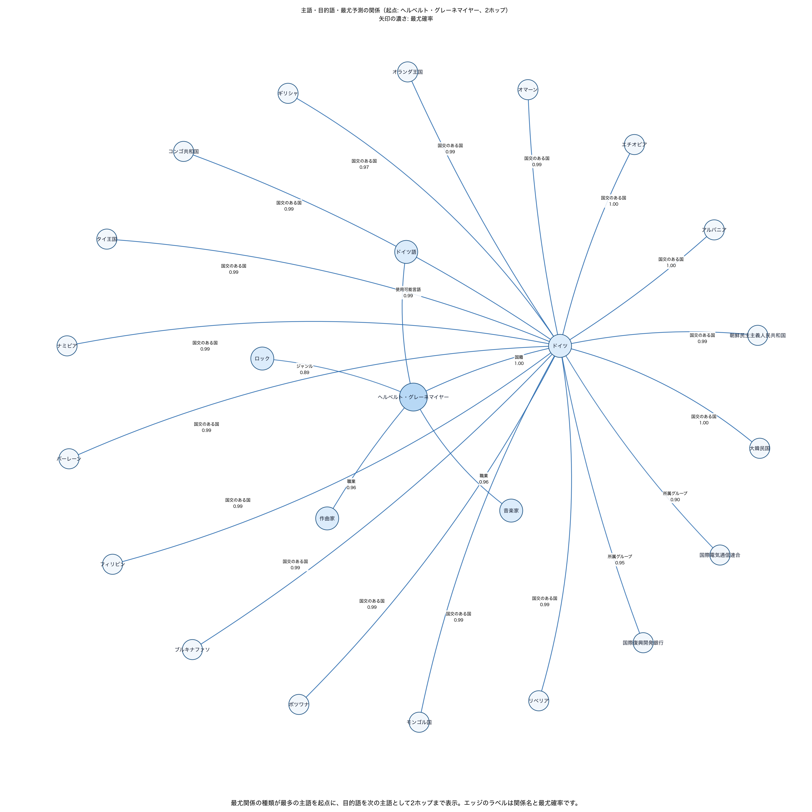
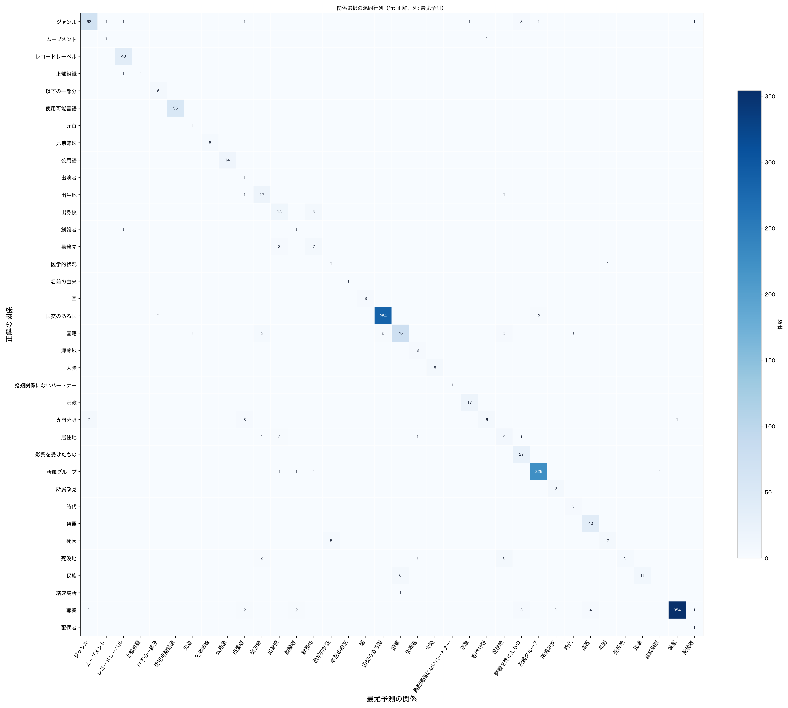

# Jevでナレッジグラフの関係を低レイテンシに評価する - CoDExを用いた精度検証

ナレッジグラフは、人・組織・製品・場所などをノード、その間の意味のあるつながりをエッジとして表すデータ構造です。文章だけでは検索や集計が難しい情報も、つながりを明示することで「ある会社の製品を探す」「人物が所属した組織をたどる」といった処理に利用できます。

## ナレッジグラフとtriple

ナレッジグラフのレコードは、`(主語, 関係, 目的語)`という3要素、すなわちtripleで表します。主語と目的語がノード、関係が両者を結ぶエッジの種類です。

| 要素   | 例       | 意味                     |
| ------ | -------- | ------------------------ |
| 主語   | 織田信長 | 関係の起点となる対象     |
| 関係   | 本拠地   | 主語と目的語の関係の種類 |
| 目的語 | 安土城   | 関係の相手となる対象     |

この例は、次のように書けます。

```text
(織田信長, 本拠地, 安土城)
```

同じ主語でも関係が違えば意味は変わります。例えば`(人物, 出生地, 都市)`と`(人物, 勤務先, 都市)`は別の事実です。グラフを正しく使うには、ノードを見つけるだけでなく、どの関係が成立するかを正しく決める必要があります。

次の図は、関係選択の結果を主語・目的語のグラフとして表した2ホップの部分グラフの例です。最尤関係の種類が最多の主語を起点に、目的語を次の主語としてたどっています。ノードが主語・目的語、エッジが最尤予測の関係です。エッジのラベルは関係名と最尤確率、濃さは確率を表しています。このように、ナレッジグラフは主語・目的語の組ごとに関係でつなぐ事で、文章から抽出した事実を構造化して表現できます。



## 高速なJevで関係を評価する

[TypeSafe AIのJev](/llm/typesafe-jev/)は、ゼロショット(ファインチューニングなしに)で分類や候補選択の結果を低レイテンシで返すことに特化したモデルです。ナレッジグラフへデータを取り込む際、主語・目的語の組ごとに関係を評価する処理を短時間で実行できれば、一次判定の自動化や人手レビューの絞り込みに利用できます。夜間バッチだけでなく、オンラインシステムで新規レコードやユーザー要求を受け取るたびに関係を判定し、後続の検索、承認、レビューへつなぐ用途にも組み込めます。

実務では、主語・目的語の識別と採用する関係体系の定義が先行しているケースがあります。例えば、名寄せや既存マスタによって「この人物」と「この組織」が特定済みで、`所属`、`勤務先`、`出身校`などの候補も定義済みという状態です。このとき残る課題は、本文を根拠に、二つのノードの間にどの関係が成立するかを評価することです。

この判定を人手だけで行うと、多大な労力がかかります。とはいえ、文章を生成するAIに関係名を任せると、表記ゆれや定義外の関係が混ざり、後続のグラフDB投入や検索条件が不安定になります。Jevの`Choice`で定義済みの候補から一つを選べば、結果を関係体系に制約できます。候補ごとの確率も得られるため、確信度が低いものだけを人手レビューへ送れます。

ただし、低レイテンシであっても、関係選択の精度が用途に足りなければ実用的ではありません。そこで、Jevが既存のナレッジグラフのtripleから関係を十分な精度で選べるか、またそのときの呼び出し時間がどの程度かを確認してみました。

## CoDExを関係選択の評価に応用する

[CoDEx](https://github.com/tsafavi/codex)は、ナレッジグラフ補完の評価に使われるデータセットです。各tripleには主語・目的語と正解の関係が含まれています。公式タスクはリンク予測ですが、これは既知の主語と関係から欠けた目的語を、または既知の関係と目的語から欠けた主語を候補エンティティから順位付けして補うタスクです。例えば、`(織田信長, 本拠地, ?)`の`?`に入る対象を予測します。

本記事の評価はこれとは異なり、主語と目的語を特定した上で、Wikipedia本文を根拠に両者の間に成立する関係を候補から選ぶというタスクとしました(`(織田信長, ?, 安土城)`の`?`に入る関係を選ぶ)。CoDExの正解の関係をラベル、関係の一覧を`Choice`の候補として使うことで、本文根拠の関係選択を評価できます。

対象は日英共通の1,418件です。日本語ではAccuracy 92.95%、Jev API呼び出し時間の中央値232msでした。

## 評価設計

候補選択の品質、1件ごとのレイテンシ、どの関係で誤りやすいかの3点を評価しました。

| 観点       | 確認する指標          | 実運用での意味                   |
| ---------- | --------------------- | -------------------------------- |
| 選択品質   | Accuracy、Macro F1    | 正解の関係を選べるか             |
| レイテンシ | API呼び出しのp50、p95 | 一次判定として待てる時間か       |
| 誤り方     | 関係別F1、混同行列    | 人手レビューが必要な関係はどれか |

評価には、CoDEx-Sのtest split 1,828 tripleのうち、主語・目的語の双方に日本語と英語のWikipedia記事があるものを利用しました。本文が取得できないものを除き、日英で同じ1,418 tripleを評価対象にしています。関係候補は、この対象に含まれる36種類です。

各レコードには、主語・目的語、日本語Wikipediaの固定版記事抜粋、英語Wikipedia extract、CoDEx/Wikidata由来の正解の関係を保持します。日本語本文は最大10,000文字です。

Jevには、記事本文を`state`として、主語・目的語を`instructions`として、36種類の関係候補を`criteria`として渡しました。以下は、評価データの先頭レコード（ガスパール・モンジュとフランス）で実際に構成した入力です。本文は1,385文字あり、表示では冒頭のみを示していますが、APIには省略せずに渡しています。

```python
state = (
    "'''ガスパール・モンジュ''' (、1746年5月9日 - 1818年7月28日）は、"
    "フランスの数学者・科学者・工学者・貴族。エコール・ポリテクニークの創設者。"
    "今日知られる微分幾何学を開発し、曲面方程式や曲線の微分方程式から3次元空間への"
    "曲面曲率線の概念を導入して幾何学的形状を解析するなど、微積分方面による曲面の研究で"
    "知られる。…（中略。実行時は本文1,385文字すべてを渡す）"
)

instructions = (
    "日本語Wikipedia本文に基づき、"
    "主語「ガスパール・モンジュ」と目的語「フランス」の間に"
    "成立する関係を候補から選んでください。"
)
```

実行時の`relation_choices`には、次の36候補を渡しました。

```text
専門分野、所属政党、医学的状況、職業、勤務先、創設者、埋葬地、楽器、ムーブメント、
ジャンル、名前の由来、宗教、使用可能言語、出演者、国、民族、出生地、死没地、時代、
配偶者、レコードレーベル、国籍、大陸、兄弟姉妹、元首、以下の一部分、公用語、
婚姻関係にないパートナー、所属グループ、死因、国交のある国、居住地、出身校、
影響を受けたもの、結成場所、上部組織
```

候補名だけでなく、関係を区別するための説明を`criteria`の値に指定します。

```python
relation_choices = {
    "出生地": "人、動物、架空の人物の生まれた場所（例えば、国ではなく都市、または都市ではなく病院）",
    "死没地": "人、動物、架空の人物の最も具体的な死亡場所（国ではなく市、市ではなく病院が望ましい）",
    "国籍": "その人物を自国の市民として認めている国",
    "居住地": "主題人物が居住している／いた場所。官公邸についてはP263を使用。",
    "出身校": "主題人物が学んだ教育機関",
    # 実行時は上記を含む36候補すべてを指定する
}
```

実装ではレコードごとに`state`、`instructions`、`relation_choices`を作ります。選択結果に加えて各候補の確率と呼び出し時間をJSON Linesに保存し、Accuracy、関係別のPrecision / Recall / F1、混同行列を集計しました。

```python
response = client.system_one(
    state=state,
    questions={
        "relation": Choice(
            instructions=instructions,
            criteria=relation_choices,
        ),
    },
)

answer = response.choices["relation"]
```

### 評価スクリプト

評価に使用したスクリプトは以下から参照できます。

| ファイル                                      | 役割                                                 |
| --------------------------------------------- | ---------------------------------------------------- |
| [build_dataset.py](./sample/build_dataset.py) | CoDEx-SとWikipediaから日英評価レコードを作成する     |
| [run_jev.py](./sample/run_jev.py)             | Jev `Choice`を実行し、選択結果とレイテンシを集計する |

## 結果

評価結果は以下のとおりでした。

| 本文の言語 |  件数 | 関係数 |  正解 | Accuracy | Macro F1 | API呼び出し p50 | API呼び出し p95 | 実行全体 |
| ---------- | ----: | -----: | ----: | -------: | -------: | --------------: | --------------: | -------: |
| 日本語     | 1,418 |     36 | 1,318 |   92.95% |   0.7478 |           232ms |           311ms |  342.3秒 |
| 英語       | 1,418 |     36 | 1,326 |   93.51% |   0.7295 |           247ms |           324ms |  362.1秒 |

## 結果をどう読むか

日本語の平均API呼び出し時間は241msで、逐次実行では毎秒4.14件でした。この条件で約0.2秒/件という値は、関係の一次判定と低確信結果のレビュー振り分けに使えるかを検討するための基礎値になります。主語・目的語の識別と本文の取得が済んだオンライン処理であれば、リクエストごとにJevで関係を選び、その結果を後続の検索や承認フローへ返す構成を検討できます。ここで示すのはJev API呼び出し時間であり、本文検索、ネットワーク、グラフDBへの書き込みを含むエンドツーエンドの応答時間はシステムごとに別途測定が必要です。

Accuracyは高く見えますが、関係の件数には偏りがあります。たとえば`職業`は368件、`国交のある国`は287件、`所属グループ`は229件である一方、1〜2件しかない関係もあります。そのため、少数の関係を同じ重みで見るMacro F1も確認する必要があります。日本語のMacro F1は0.7478であり、全体Accuracyだけでは少数関係の精度を十分に評価できないことを示しています。

日本語で目立った誤分類には、次の組み合わせがありました。

| 正解     | 予測       | 件数 |
| -------- | ---------- | ---: |
| 死没地   | 居住地     |    8 |
| 専門分野 | ジャンル   |    7 |
| 民族     | 国籍       |    6 |
| 出身校   | 勤務先     |    6 |
| 国籍     | 出生地     |    5 |
| 死因     | 医学的状況 |    5 |

これはもっともらしい近接概念での誤りです。実運用では、たとえば`国籍`と`出生地`、`勤務先`と`出身校`のような混同しやすい関係を重点的にレビュー対象にする設計が現実的と思われます。

### 日本語の関係選択の混同行列

行は正解の関係、列は最尤予測です。対角線上は正解、対角線外は誤分類を表します。[元の大きさで表示する](./images/confusion_matrix_ja.png)



## まとめ

低レイテンシで候補選択を行えるJevを、ナレッジグラフの関係評価へ適用できるか確認するため、CoDEx-Sの正解tripleを用いて評価しました。本文根拠の関係選択では、日本語1,418件・36種類の関係で92.95%のAccuracy、232msのp50を記録しました。このため、関係候補が定義済みで本文に根拠があるデータ取り込みに加え、主語・目的語が特定済みのオンラインシステムでリクエストごとに関係を一次判定する用途でも、Jevは実用的な選択肢と考えられます。

なお、[公式ドキュメントのLanguage support](https://docs.typesafe.ai/models#language-support)では、英語が主な学習言語で精度も現時点で最も高く、CJKを含む他言語は処理できるものの、同等の精度ではないと説明されています。今回のCoDEx-S評価では、英語は日本語よりAccuracyが0.56ポイント高い一方、日本語はMacro F1が0.0183高く、p50も15ms短い結果でした。この差だけで言語ごとの性能差を結論づけることはできませんが、日本語でも一定程度は機能すると思われます。

## 参考

- [TypeSafe AI: Jev](https://docs.typesafe.ai/introduction)
- [TypeSafe AI: Models - Language support](https://docs.typesafe.ai/models#language-support)
- [TypeSafe AI: Choice](https://docs.typesafe.ai/primitives/choice)
- [CoDEx: A Comprehensive Knowledge Graph Completion Dataset](https://github.com/tsafavi/codex)
