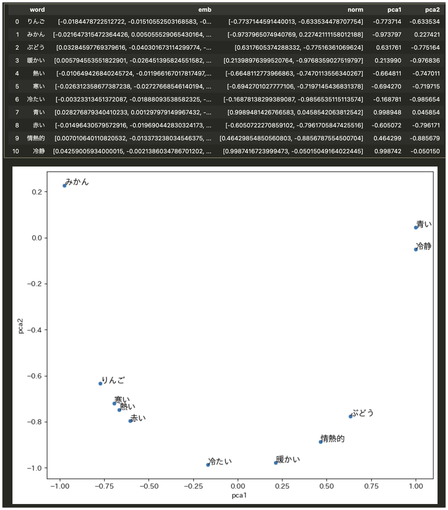

# OpenAI API Embeddings の dim 指定の実装方法を確認した

OpenAI API として新しくリリースされたベクトル表現取得用モデルである `text-embedding-3` では、出力の次元数を指定できるようになりました。どうやってるのかな?と気になったので、実装方法を確認してみました。結論から言うと、以下の公式ドキュメントに書いてある実装方法のショートカットでした(その旨がドキュメントに書いてあります)。

-   [OpenAI API - Embeddings/Reducing embedding dimensions](https://platform.openai.com/docs/guides/embeddings/use-cases)

> In general, using the dimensions parameter when creating the embedding is the suggested approach. In certain cases, you may need to change the embedding dimension after you generate it. When you change the dimension manually, you need to be sure to normalize the dimensions of the embedding as is shown below.

と言うわけで、公式ドキュメントのとおりとなるのですが、一応 PCA による次元削減もしてみたので、その結果も載せておきます。


## 前提条件

-   openai == 1.12.0

## ソースコード

### 準備

```python
import pandas as pd

words = [
    "りんご",
    "みかん",
    "ぶどう",
    "暖かい",
    "熱い",
    "寒い",
    "冷たい",
    "青い",
    "赤い",
    "情熱的",
    "冷静",
]

from openai import OpenAI

client = OpenAI()


def get_embedding(text, model="text-embedding-3-small", dim=None):
    text = text.replace("\n", " ")
    if dim is None:
        return client.embeddings.create(input=[text], model=model).data[0].embedding
    else:
        return (
            client.embeddings.create(input=[text], model=model, dimensions=dim)
            .data[0]
            .embedding
        )
```

### APIでdimensions=2を指定

```python
df = pd.DataFrame(words, columns=["word"])
df["emb"] = df["word"].apply(lambda x: get_embedding(x, dim=2))
```

```python
display(df)
df["pca1"] = df["emb"].apply(lambda x: x[0])
df["pca2"] = df["emb"].apply(lambda x: x[1])

plt.figure(figsize=(10, 8))
sns.scatterplot(data=df, x="pca1", y="pca2")
for i in range(len(df)):
    plt.text(df.pca1[i], df.pca2[i], df.word[i], fontsize=12)
plt.show()
```


### 公式ドキュメントの方法でdim=2

```python
def normalize_l2(x):
    x = np.array(x)
    if x.ndim == 1:
        norm = np.linalg.norm(x)
        if norm == 0:
            return x
        return x / norm
    else:
        norm = np.linalg.norm(x, 2, axis=1, keepdims=True)
        return np.where(norm == 0, x, x / norm)
```

```python
df = pd.DataFrame(words, columns=["word"])
df["emb"] = df["word"].apply(lambda x: get_embedding(x))
```

```python
df["norm"] = df["emb"].apply(lambda x: normalize_l2(x[:2]))
df["pca1"] = df["norm"].apply(lambda x: x[0])
df["pca2"] = df["norm"].apply(lambda x: x[1])

display(df)

plt.figure(figsize=(10, 8))
sns.scatterplot(data=df, x="pca1", y="pca2")
for i in range(len(df)):
    plt.text(df.pca1[i], df.pca2[i], df.word[i], fontsize=12)
plt.show()
```



### PCAで2次元に次元削減

```python
df = pd.DataFrame(words, columns=["word"])
df["emb"] = df["word"].apply(lambda x: get_embedding(x))
```

```python
import seaborn as sns
import matplotlib.pyplot as plt
from sklearn.decomposition import PCA
import japanize_matplotlib
import numpy as np


pca = PCA(n_components=2)
pca_result = pca.fit_transform(df["emb"].values.tolist())
df["pca1"] = pca_result[:, 0]
df["pca2"] = pca_result[:, 1]
df["shape"] = df["emb"].apply(lambda x: np.array(x).shape)

display(df)

plt.figure(figsize=(10, 8))
sns.scatterplot(data=df, x="pca1", y="pca2")
for i in range(len(df)):
    plt.text(df.pca1[i], df.pca2[i], df.word[i], fontsize=12)
plt.show()
```


### コサイン類似度

```python
df = pd.DataFrame(words, columns=["word"])
df["emb"] = df["word"].apply(lambda x: get_embedding(x))
```

```python
from sklearn.metrics.pairwise import cosine_similarity

cos_df = pd.DataFrame(
    cosine_similarity(df["emb"].values.tolist()), columns=df.word, index=df.word
)

display(cos_df)
```


## 参考文献

-   [OpenAI API - Embeddings/Reducing embedding dimensions](https://platform.openai.com/docs/guides/embeddings/use-cases)