# 機械学習の概要と基礎知識

## AIと機械学習(ML)の違い

AIと機械学習(ML)は同じような文脈で語られることが多いのですが、AIは専門家でも定義が曖昧なままとなっている概念であり、機械学習は具体的な手法となっています。AIを実現するために有効だと考えられている一つの手段として機械学習(ML)があり、さらに機械学習の中で深層学習(Deep Learning)という手法が存在しています。

### AIとは?

AIは`AI(Artificial Intelligence)`の略であり、日本語では`人工知能`と言います。AIの具体的な定義は研究者の間でも統一されていません。現時点ではAIの片鱗も見えておらず、人工的に知能を作り出すことが可能かどうかは実証されていないという状況です。

### 弱いAIと強いAI

弱いAI、強いAIは哲学者が考えた分類です。強いAIは汎用AI(AGI: Artificial general intelligence)ともいい、現時点では研究対象となっているものの実用化の目処は立っていません。現在実用されているAIは全て弱いAIに該当します。

弱いAIは自分で問題を定義することはできず(フレーム問題)、あくまで与えられた数理モデルの範囲で計算結果を返すプログラムです。

- 弱いAI: 世界と自分の境界が無く(自意識がなく)、事前に定義され、与えられた問題だけを解決することができるAIです。
- 強いAI: 世界と自分の境界があり(自意識があり)、自分で問題を定義して解決することができるAIです。

### AIの外観

以下は[人工知能学会 - AIマップ](https://www.ai-gakkai.or.jp/resource/aimap/)からの引用です。AIの研究分野は非常に広範であり広がり続けています。



### MLとは?

MLは`Machine Learning`の略称であり、日本語では`機械学習`と言います。MLはAIを構成する技術要素の一つです(AI関連技術)。現在AIを使っている公言しているサービスやプロダクトの多くはMLを利用しています。

このため、本書でも以後は主に機械学習(ML)に関して説明します。


### 機械学習でできること

機械学習でできる処理は、主に以下の4つに分類されます。実際にはこれらを組み合わせて複雑なタスクを実施することが多いため、あくまで基本的な構成要素に対する分類と考えてください。

- クラス分類(Classification) - 教師あり学習
- 回帰分析(Regression) - 教師あり学習
- クラスタ分析(Clustering) - 教師なし学習
- 次元削減(Dimensionality reduction) - 教師なし学習



#### クラス分類 - 教師あり学習

正解となるクラスと入力データの組み合わせで学習し、未知のデータのクラスを推論(分類)します。

動物の画像と、その画像が何の動物なのかという`ラベル(正解)`を学習させることで、未知の画像に写っている動物を推論するような場合です。

Yes/No(犬の画像であればYes、そうでなければNo)のように2種類に分類する場合を`二項分類(二値分類)`、3種類以上に分類する場合を`多項分類(多クラス分類)`と言います。 一つの入力データから複数のクラスを推論する、`マルチラベル(多ラベル分類)`と呼ばれる分類も可能です。

#### 回帰分析 - 教師あり学習

正解となる数値と入力データの組み合わせで学習し、未知のデータから連続値を推論します。

過去の労働時間を学習させることで、未来の労働時間のような連続値を推論するような場合です。

学習させる際の入力は、必ずしも連続値である必要は無く、例えば性別、年齢、役職などの情報と共に過去の労働時間を入力することで、 入力で使用した性別、年齢、役職などに応じた推論を行うことも可能です。

#### クラスタ分析 - 教師なし学習

入力データを何かしらの基準でグルーピングします。教師無し学習に分類されます。

ショッピングサイトの購入履歴を元に、特定の商品を購入した人の特性(性別、年齢、職業など)に何らかの傾向が見られるかを分析するような場合です。

入力データの数値的な距離によりグルーピングを行うため、人が理解できる分類になる保証はありません。 分類結果の意味は人が考える必要があります。

#### 次元削減(主成分分析) - 教師なし学習

高次元のデータを可視化や計算量削減などのために低次元にマッピングします。教師無し学習に分類されます。

イメージとしてはデータの要約です。似たような意味を持つデータを束ねて、より低い次元のデータとして表現することができるため、データ(の次元)数が減ります。3次元以下に縮約することで可視化を可能にしたり、他の分析アルゴリズムへ入力する際の前処理(特徴量選択、多重共線性の排除)として利用することが可能です。

### 機械学習は何を「学習」するのか

一般的なプログラミングは、データとデータを処理するためのルールをプログラムとして記載し、処理結果を得るためのものですが、機械学習は**データと処理結果から、ルールを自動的に得るための手法**です。

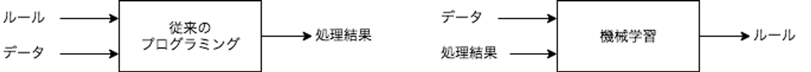

入力(x)からラベル(y)に変換するために、**重み(w)やバイアス(b)をデータから学習する**のが機械学習における学習の中身です。

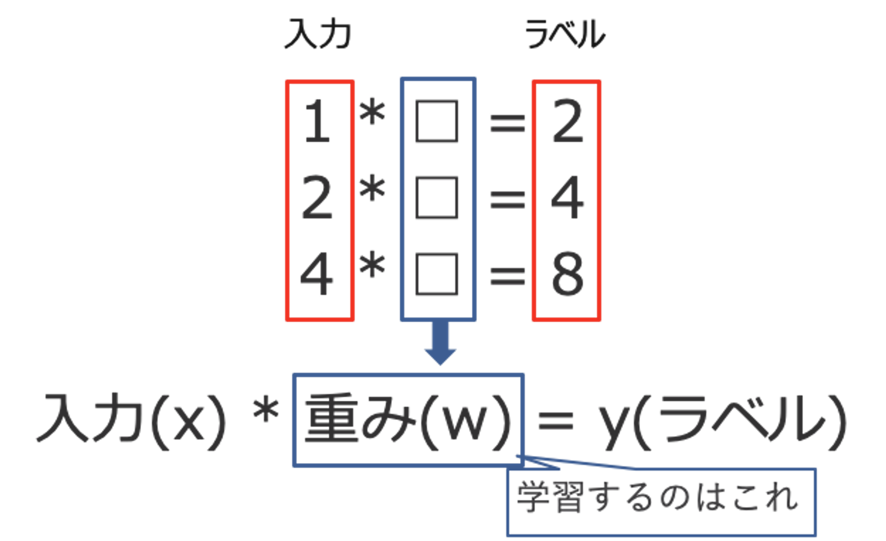

※ 上記はバイアス(b)を省略しています。

以下は回帰分析の実行例です。機械学習の文脈では、データの集合からルールとなる数式(関数: $y=f(x)$)を学習したということになります。

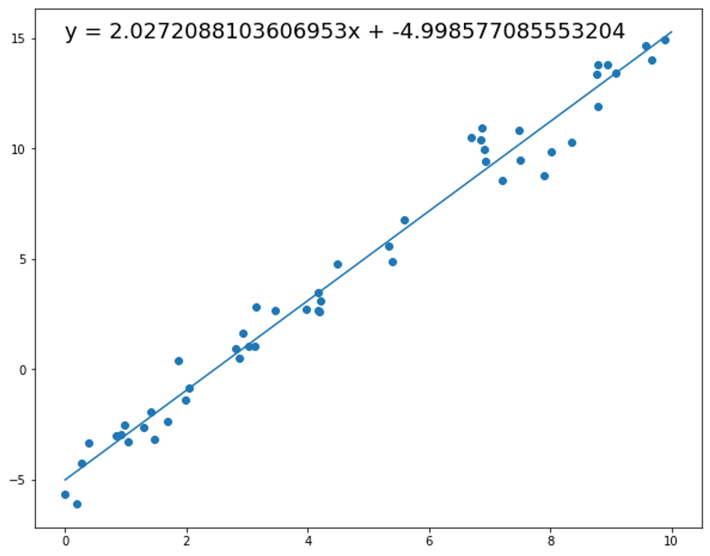

#### モデルという用語について

機械学習の分野では、`モデル`という言葉がよく使われます。この`モデル`とは、機械学習で解決したい問題(タスク)を数式で表現したものです。

例えば、$$y=ax+b$$という式は一つの単純なモデルです。ここで、aやbは機械学習の学習プロセスで計算される`パラメータ`です。この式を`数理モデル`と呼び、aやbが学習プロセスによって決まった状態を`学習済みモデル`と言います。

Deep Learningなどの複雑な機械学習モデルでは、パラメータの数が数百万から数億(現在は兆に至るものもあります)となり、数理モデルも非常に複雑になります。数理モデルが複雑になるほど、パラメータを計算するために必要なデータ量が増え、学習に必要な時間も増えることになります。

### 機械学習以外のAI/ML関連技術

AIを実現するための技術は機械学習以外にも様々なものがあります。現在はDeep Learningを中心とした機械学習が特に注目されていますが、以前からAI関連技術として研究されている技術や、確率論的プログラミングのようにより数理統計的なアプローチを重視した手法についても併用されています。

#### 確率論的プログラミング

機械学習の一種ですがDeep Learningのようにデータとモデルの表現能力を重視したアプリーチではなく、より数理モデルを重視した手法です。確率モデルを数式として定義した上で、実際に観測されたデータの事前分布から事後分布を計算して推論します。

統計モデリングと機械学習を組み合わせることで、実際に観測されていない事象についても意思決定を可能にします。このような特性からABテストなどを多用するマーケティングの分野で広く採用されています。

#### 論理プログラミング

制約プログラミングとも言います。事実と推論規則から構成される知識データベースの上で、自動推論することによって計算を行うためのプログラミング方式です。古くからあるAI関連技術の一つであり、エキスパートシステムとして第二次AIブームで期待された技術です。

#### ヒューリスティック探索

明らかに解では無い選択肢を除去することによって、探索範囲を狭めるのに役に立つ経験則をヒューリスティックと言います。このヒューリスティックに従って探索を導く手法です。

量子アニーリングのように物理的な仕組みを数理最適化の手段として用いることは、量子コンピュータの実用化として目処が立っている状態です。

#### 遺伝的アルゴリズム

固体をビット列で表現し、問題を解くビット列を見つける進化的アルゴリズムです。選択・交叉・突然変異を確率的操作を使って表現し、ビット列を操作しながら次の世代を作ります。世代交代を繰り返すことにより、より強い世代の個体群を生み出し問題を解くという手法です。

## 教師あり学習と教師なし学習の概要

機械学習の学習手法は大きく以下の3種類があります。

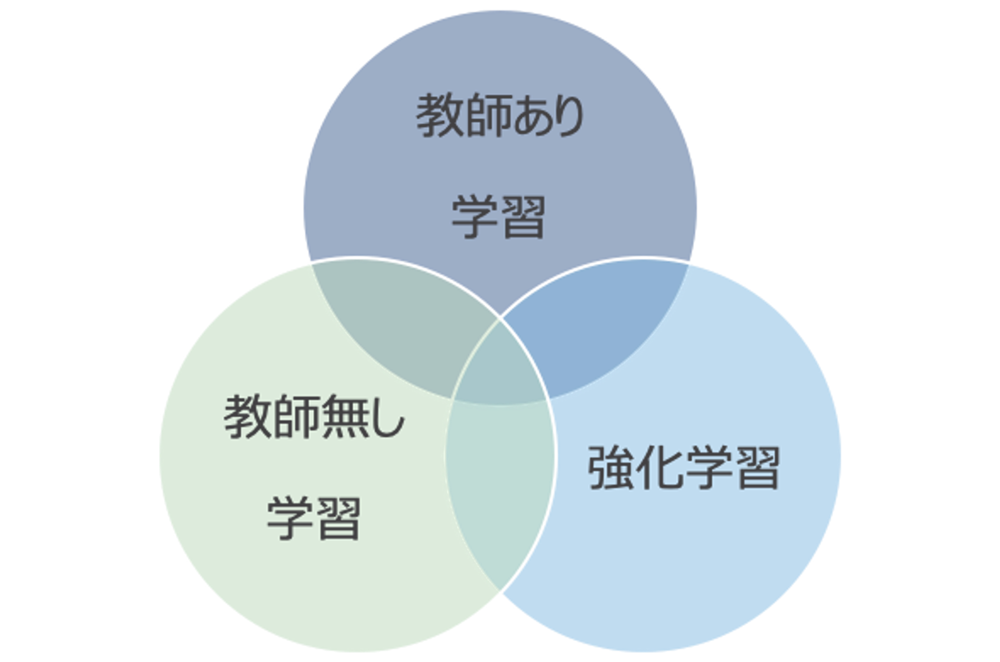

### 教師あり学習

最も一般的な機械学習の手法です。教師となるデータとラベル(正解)のセットを元に学習を行います。 データとラベルのセットは`ラベルデータ(教師データ)`と呼び、多くの場合は人の手で作成されます(データにラベルを付与する作業、あるいはラベルのことを`アノテーション`と呼ぶこともあります)。

### 教師なし学習

`ラベルデータ`を必要としない学習です。前述のクラスタ分析、次元削減、異常検知などが`教師なし学習`の例です。

多次元データを2〜3次元データに次元削減することで人が理解できるように視覚化したり、 グルーピングによりデータの特性を捉えるための準備を行うなど、データ分析で多用されます。

### 強化学習

何らかの行動を起こすことで状態が遷移し、遷移後の状態に応じた報酬を得られることができる環境において、最適な行動を学習する手法です。



取り得る行動と結果が決定的である囲碁や将棋などで人を超える性能が証明されており、 ゲーム以外にも自動運転やロボットの制御、空調の制御や最大効用を得るための広告の出稿などのように実世界への応用が進んでいます。

ChatGPTのような対話型AIの実現方式として用いられたことから、自然言語処理においても利用されるようになっています。

### その他の学習手法

自己教師あり学習や半教師あり学習、敵対的生成ネットワーク(GAN)のように、前述の内容では分類が難しい、あるいは複数組み合わせた手法も存在します。以降はそのような学習手法の一部です。

### 自己教師あり学習

入力データ自身を教師データとして利用する学習手法です。自然言語処理では、Wikipediaなどのオープンデータを利用し、単語の穴埋め問題のようなものを作成して解かせることで、単語の意味を学習させることが一般的です。このように学習したものを事前学習モデルといい、さらにラベルデータが存在するタスクで応用します。

GAN(後述)などの生成モデルも自己教師あり学習の一種として分類することがあります。

### 半教師あり学習

特定タスクにおけるデータのうち、少数の一部にのみラベル(教師)があるが、残りの大多数にはラベルがない状態で学習を行うための手法です。具体的な方法論は様々ありますが、以下はWrapper methodsと呼ばれる手法の概要です。

1. ラベルありデータを用いて予測モデルを構築する
2. そのモデルを用いてラベルなしデータに疑似ラベルを付与する
3. ラベルありデータと疑似ラベル付きデータを用いて予測モデルを構築する
4. 3で構築したモデルで、ラベルなしデータに疑似ラベルを付与する

### 転移学習

目的とするタスクとは異なるタスクあるいはドメインで学習したモデル(事前学習モデル)を再利用し、対象タスク用のモデルとして学習する手法です。(適切な事前学習モデルを選択できた場合は)ラベルデータが少ない場合も高い精度で推論できることが期待されます。

転移学習では事前学習モデルをそのまま利用するのではなく、対象タスクに合うようにモデルの構造を一部変更した上で、対象タスクのデータで再学習を行います。この再学習をファインチューニングと言います。

転移学習はAI/MLを実運用する上で最も重要な学習手法の一つです。

### 敵対的生成ネットワーク(GAN)

偽データを生成するネットワーク(Generator)と、生成されたデータの真偽を見破るネットワーク(Discriminator)を競わせながら学習を進める手法です。自己教師あり学習として分類されることがあります。

GeneratorはDiscriminatorを騙すためにより本物に近いデータを生成するようになります。この結果、現実には存在しないが、人が見分けるのが難しいほど精度の高い画像を生成するなどのタスクを実現します。

画像生成タスクとしての応用が有名ですが、自然言語処理でも利用されることがあります。

## 機械学習の評価方法

機械学習は確率統計の一種です。扱うのは確率であり決定論的な正解を出す仕組みではありません。このため、機械学習の推論結果に対しては正しいか否かの2択ではなく、精度を定量的に確認するための指標を設けて判断する必要があります。

また、機械学習モデルに期待するのは学習時に与えたデータのみに対する精度ではなく、未知のデータに対して高い精度で推論できることだというのは重要なポイントです。未知のデータに対しての性能を`汎化性能`といい、`汎化性能`の計測方法の選択も機械学習モデルの構築には欠かせない要素となっています。

<aside>
💡 前述のように機械学習では様々な学習手法があります。学習手法やタスク(用途)に応じて評価方法が異なるため、ここでは主に教師あり学習を前提としているとご理解ください。
</aside>

### 過学習(Overfitting)

学習データのみ正しく推論できる状態を`過学習`といいます。前述のように機械学習モデルに期待されるのは未知のデータに対する推論性能(汎化性能)であることから、`過学習`は最も注意すべき状態です。

以下では汎化性能を測るための手法について解説しますが、これは過学習を避けるための手法でもあります。ただし、過学習を避けることは簡単ではなく、データに対してモデルが複雑過ぎたり、学習に使用するデータが偏っていたりなど様々な理由があり、それぞれに対処方法が異なります。

### 汎化性能を測るためのデータ分割

原則として、機械学習は学習と推論は別プロセスで行います。学習時に使用するデータと推論で使用するデータに同じものを使用すると、当然ですが非常に高い精度がでます。しかし、実際の運用では未知のデータに対して推論するため、学習で使用したデータに対する精度に意味はありません。

実際の運用では学習していないデータに対して推論するという状況を、データの分割で表現します。つまり、学習用のデータと評価用(検証用)のデータを分割し、学習時には学習用のデータを、推論して性能を測る場合には評価用のデータのみを使用します。

汎化性能を計測するためのデータ分割には様々な種類がありますが、代表的なものの一部は以下の通りです。

- Hold-out法(Hold-out Validation)
- K-分割交差検証(K-fold Cross-validation)

#### Hold-out法(Hold-out Validation)

機械学習モデルの構築時に使用するデータセットに対し、学習用と検証用で分割します。検証用のデータセットは学習で使用せず、モデルの評価でのみ使用します。最も単純ですが、分割方法の選択によっては精度の計測結果に偏りがでることがあります。

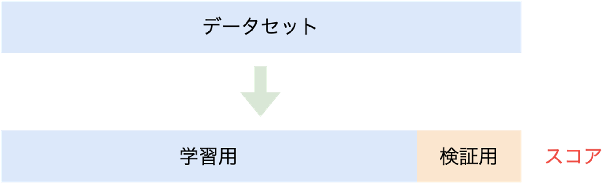

#### K-分割交差検証(K-fold Cross-validation)

データセットをK個に分割し、分割したデータセットを検証用として学習と評価を行います。K=5とした場合は以下の様に5個のデータセットがあると見なして、それぞれで学習と評価を行います(独立した5個の学習済みモデルを作成して評価するということです)。

`Hold-out法`と比較して精度の計測結果が安定しますが、単純にK倍の処理時間がかかる点がデメリットです。

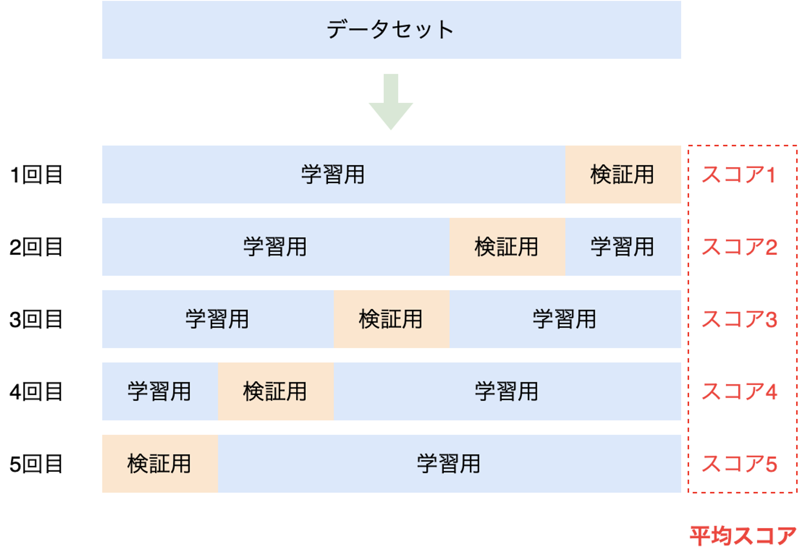

#### 学習・検証・評価としての分割

上記では学習用と検証用としてデータを分割していますが、実用上は学習・検証・評価用としてデータを3種類に分割することが一般的です。この際、データ量の比率は8:1:1などとします(9(学習用):1(評価用)に分割した後に、学習用をさらに9(学習用):1(検証用)分割するなど、比率は様々です)。学習プロセスにおいて学習用データを一通り学習する単位をepochといい、1epochの最後に検証用データで評価します。epochは複数回繰り返し、検証用データで十分に精度がでることを確認した後に、評価用のデータで最終的なスコアを計算します。

### 性能指標

性能評価のためのアルゴリズムは、正解データと推論結果との差を数値的に評価するための関数です。様々なものがありますが、代表的なアルゴリズムについていくつか紹介します。

#### 正答率(Accuracy)/再現率(Recall)/特異度(Specificity)/適合率(Precision)

健康診断の結果からガンであることを診断するモデルを評価するケースを考えてみます。健康診断の検査値を入力し、ガンである場合を**Positive**、ガンではない場合を**Negative**として推論結果として出力します。これはPositiveかNegativeかの2値分類であり、推論結果と事実との対応は以下の様なパターンが考えられます。

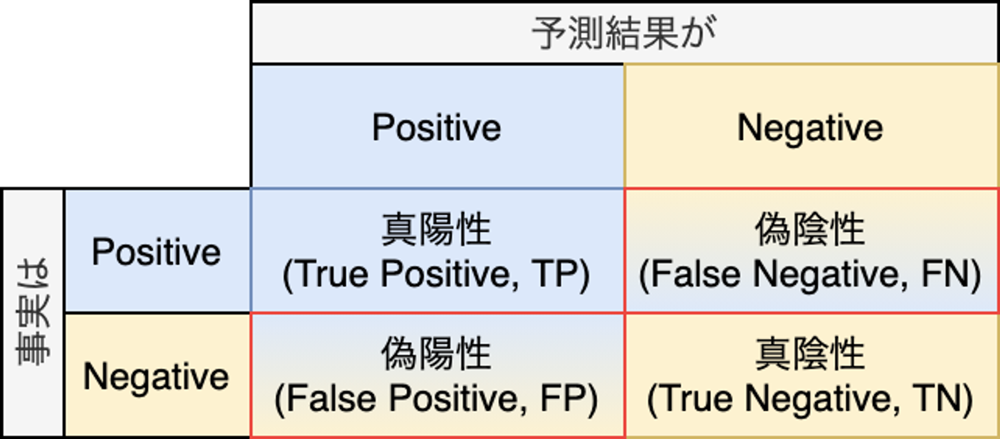

`正答率(Accuracy)`は`(TP + TN ) / (TP + FP + TN + FN)`です。妥当な指標に思えますが、一般に一回の健康診断のタイミングでガンである可能性は低いと考えられるため、全てガンではない(False)と一律で判断するモデルであっても高い精度となります。多値分類では有効な場合がありますが、2値分類では正答率だけで判断することは危険です。単に精度と言った場合は正答率を指すことも多いです。

`再現率(Recall)`は`TP / (TP + FN)`です。再現率が高いということは**ガンであることを見逃している確率が低い**ということです。`感度(Sensitivity)`とも言います。

`特異度(Specificity)`は`TN / (TN + FP)`です。再現率の反対です。

`適合率(Precision)`は`TP / (TP + FP)`です。ガンである前提で治療を受けた場合に、**実際に意味があった確立**を表しています。

それぞれの意味は以下のベン図での纏めが便利です。



#### F値

`適合率`と`再現率`はトレードオフの関係にあります。このため、`再現率`を上げるような調整を行った場合は、`適合率`が下がるという状況が発生します。このような`適合率`と`再現率`のバランスを考慮した指標が`F値(F-measure)`です。 `F値`を見る事でモデルの予測性能を定量的に評価することができます。

$$
F =\frac{2}{\frac{1}{Recall} + \frac{1}{Precision}} = \frac{2\mathrm{Recall}\cdot\mathrm{Precision}}{\mathrm{Recall}+\mathrm{Precision}}
$$

#### 混同行列

混同行列は定量的な評価指標ではありませんが、特に多値分類の際の推論精度を俯瞰する場合に役に立ちます。以下は0〜9の数字を手書きした画像に対し、画像に対応する数字である0～9として分類するモデルの推論結果を混同行列として表現した例です。

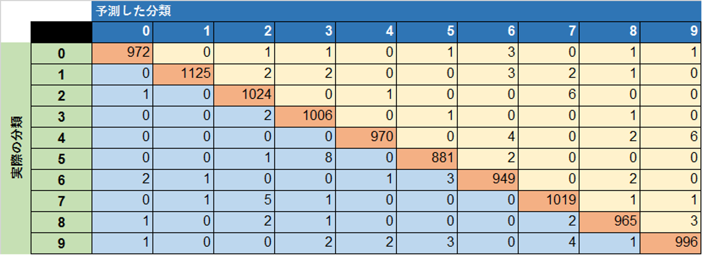

多値分類においては、混同行列を元に各分類先(クラス)に対してF値を計算したクラシフィケーションレポートが頻繁に用いられます。

```
                precision   recall    f1-score   support

0               0.99        0.99      0.99       980
1               1.00        0.99      0.99       1135
2               0.99        0.99      0.99       1032
3               0.99        1.00      0.99       1010
4               1.00        0.99      0.99       982
5               0.99        0.99      0.99       892
6               0.99        0.99      0.99       958
7               0.99        0.99      0.99       1028
8               0.99        0.99      0.99       974
9               0.99        0.99      0.99       1009

avg / total     0.99        0.99      0.99       10000
```

#### 決定係数(R2)

分類タスクではなく連続値を推論する回帰タスクで用いられる指標です。一般的な統計の回帰分析で用いられる`決定係数(R2)`と同じものです。決定係数には様々なバリエーションがありますが、多く用いられる計算式は以下の通りです。

$$
R^2 = \frac{\sum_{i=1}^{n}(\hat{y_i} - \bar{y})^2}{\sum_{i=1}^{n}({y_i} - \bar{y})^2} = 1 - \frac{\sum_{i=1}^{n}({y_i} - \hat{y_i})^2}{\sum_{i=1}^{n}({y_i} - \bar{y})^2}
$$

- n = データ数
- yi = 正解となるi番目のデータ
- y_ = 平均値
- yi^ = i番目のデータに対する推論値

推論結果が正しい場合は1に近い値をとります。推論値が単純な算術平均と変わらなければ0、平均よりも悪ければマイナスの値をとります。なお、0〜1の値をとると説明している資料もありますが、上記の数式上はマイナスの値もとります。0〜1の値に制限するバリエーションもあるため、R2と言っても具体的にどの計算式を採用しているかは確認が必要です。

#### ROC(Receiver Operating Characteristic)曲線

画像を入力して猫であるか否かを判断する2値分類タスクでは、猫である確率(あるいは猫ではない確率)を出力します。確率は0〜1の実数の連続値ですが、どの程度の確率で猫であると判断するかは決めごとです。50%以上を猫とすることも考えられますが、10%のようにより低い確率を閾値とした方が、現実に即している可能性もあります。

真陽性(True Positive)を多く判断できるように敷居を設定すると、偽陽性(False Positive)が増えます。前述のガンではないことを判断するモデルの例では、全員をガンではないと設定(閾値を0%)すれば真陽性も最大になりますが、偽陽性も最大になります。

このように閾値を変化させることで、真陽性と偽陽性がどのように変化するかを表したチャートを`ROC曲線`と言います。

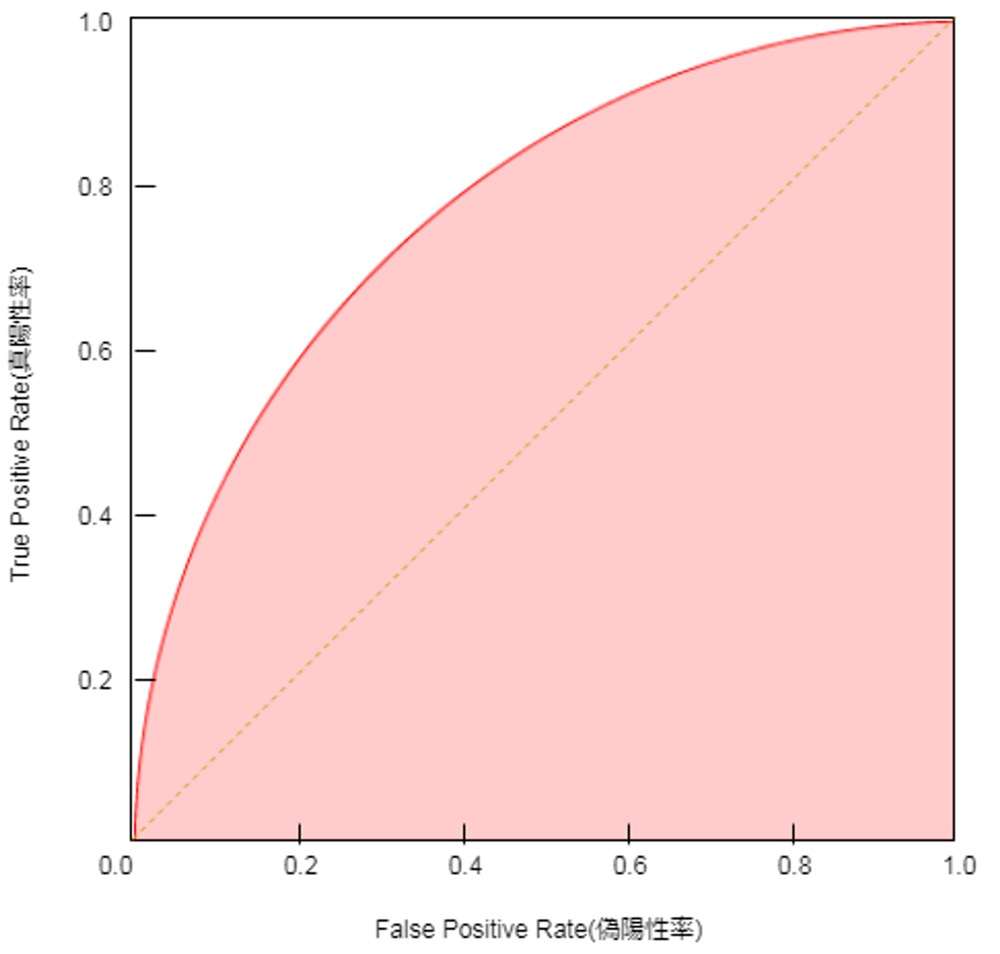

`ROC曲線`を利用する場合の定量的な評価として`AUC(Area Under the Curve)`があります。 `AUC`は上図で塗りになっている部分の面積です。`AUC`が0.5の場合は完全なランダムと同義であり、1に近いほど性能の良いモデルということです。

## Appendix

### よく見るAI/ML関連用語の定義と意味

AI、ML、生成AI、LLMなどAI/ML関連の用語をニュースなどでも見かけるようになりました。定義が曖昧なものもありますが、大まかな説明は以下の様になっています。

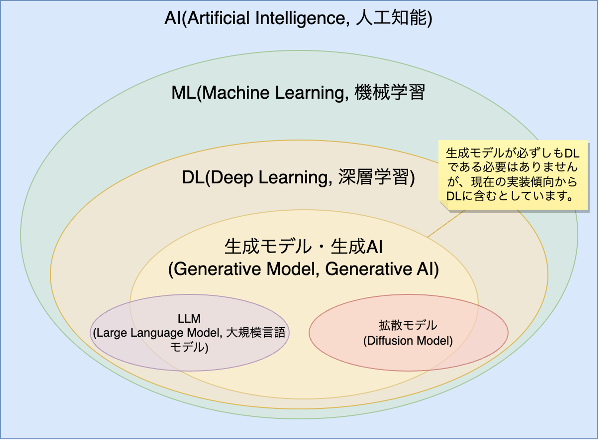

- AI(Artificial Intelligence, 人工知能): AIの具体的な定義は研究者の間でも統一されていませんが、一般的には人と同じようにタスクを実行できるITシステムを指します。よく見かける割には曖昧な用語であるため、専門家はAIという言葉を単独で使うことは避ける傾向にあります。
- ML(Machine Learning, 機械学習): MLはAIを構成する技術要素の一つです(AI関連技術)。現在AIを使っている公言しているサービスやプロダクトの多くはMLを利用しています。
- DL(Deep Learning, 深層学習): MLの一種であるニューラルネットワークの特殊なバージョンです。ニューラルネットワークの層が深いものを指します。
- 生成モデル・生成AI(Generative Model, Generative AI): データの生成プロセスを学習して、新しいデータを生成することができる種類の機械学習モデルです。必ずしもDLの一部ではありませんが、現在見られる仕組みの多くはDLを利用した深層生成モデルです。
- LLM(Large Language Model, 大規模言語モデル): DLを利用した言語モデル(LM)の実装です。LLM=生成モデルではありませんが、現在はChatGPTのようなLLMとしての生成モデルの実装が注目を集めています。
- 拡散モデル(Diffusion Model): 画像生成などで利用されることが多い機械学習モデルです。図ではLLMと拡散モデルを完全に別けていますが、LLMの実装に拡散モデルを使うことも可能です。

### WebサービスであるChatGPTとシステム開発で利用するOpenAI API/Azure OpenAI Serviceの違い、OpenAI社のモデルとの関係

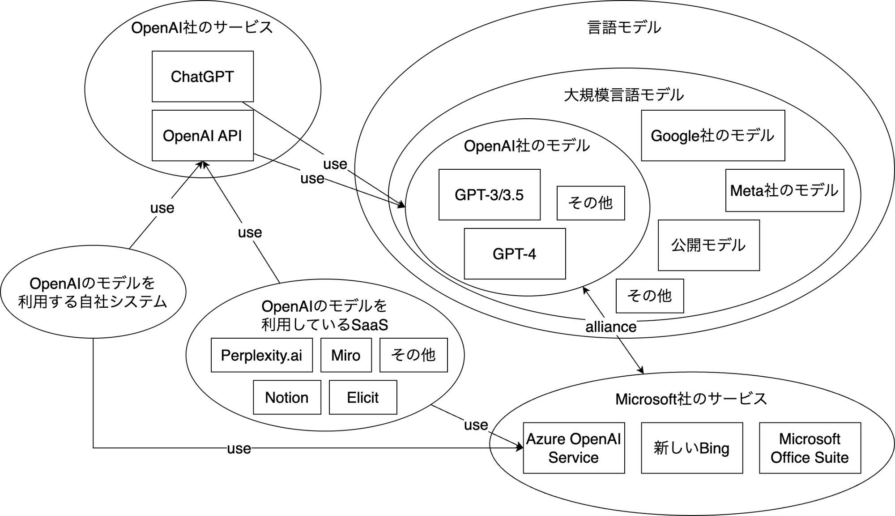

## 参考文献

- 有賀 康顕、中山 心太、西林 孝 著. 仕事ではじめる機械学習 第2版: オライリー・ジャパン
- [Qiita - Accuracy/Recall/Precisionってややこしくない??](https://qiita.com/K5K/items/5da52e99861483cae876)
- 阿部 真人. データ分析に必須の知識・考え方 統計学入門 仮説検定から統計モデリングまで重要トピックを完全網羅: ソシム
- 杉山 聡. 本質を捉えたデータ分析のための分析モデル入門 統計モデル、深層学習、強化学習等 用途・特徴から原理まで一気通貫!: ソシム
- 江崎 貴裕. 分析者のためのデータ解釈学入門 データの本質をとらえる技術: ソシム