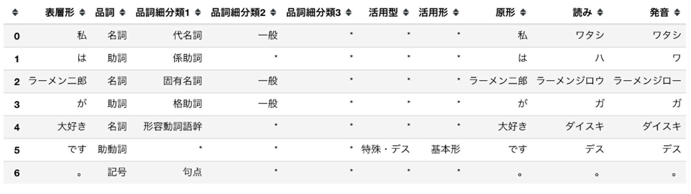
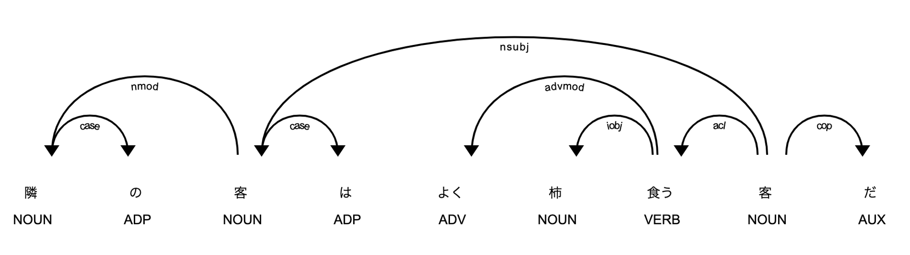
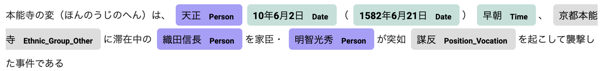
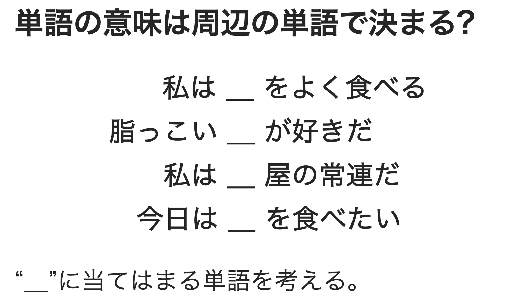
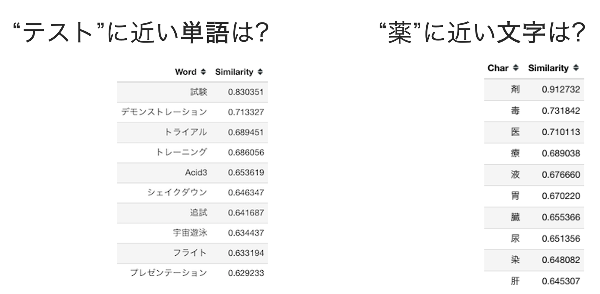
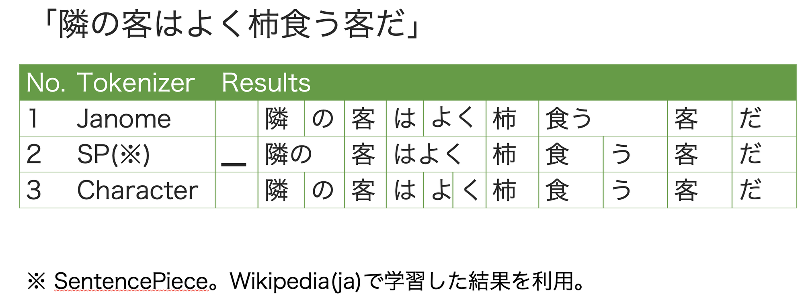
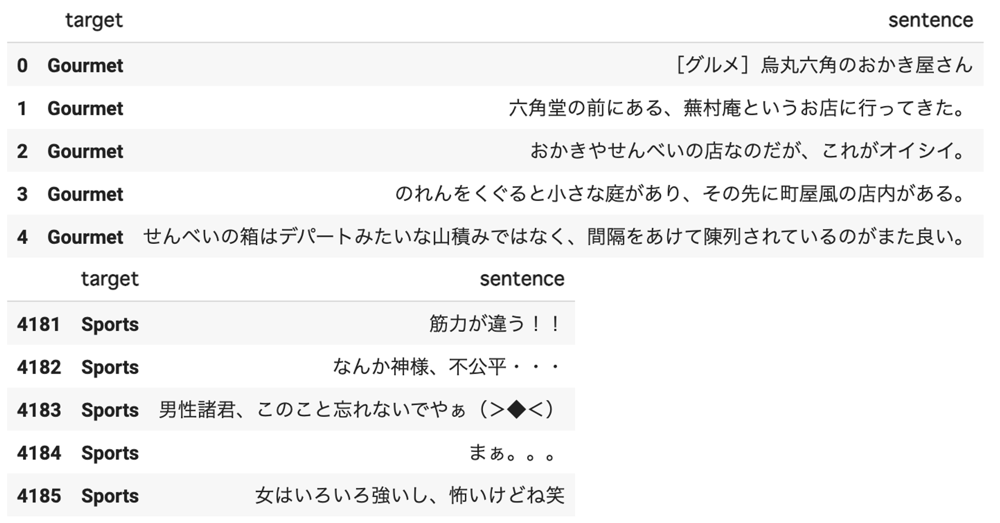
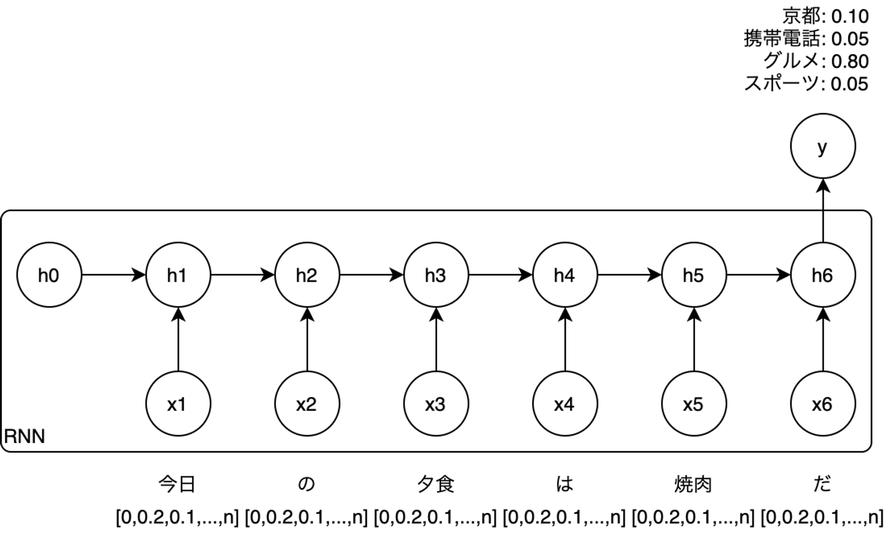

# 自然言語処理での応用

## 自然言語処理の概要

NLP(Natural Language Processing)とも言います。自然言語処理は、人の話す言葉をコンピュータに学習・理解させ、人の役に立つようにコンピュータに処理させることです。以下の様に様々な要素技術とその組み合わせにより構成されます。



自然言語処理の実装技術はAI/MLに限定されません。単純な文字列検索や置換、正規表現、全文検索なども自然言語処理の実装方法です。

### 単語分割

形態素解析などが実装技術の例になります。形態素は言葉として意味を持つ文字集合の最小単位です。文を構成する文字列を形態素として分割した上で、単語の品詞や活用形を判断します。以下は形態素解析の例です。

### 構文解析

SVOなどの文法や係り受け解析などを行います。以下は係り受け解析の例です。

- NOUN・・・名詞
- ADP・・・設置詞
- ADV・・・副詞
- VERB・・動詞
- AUX・・・助動詞
- case・・・格表示
- nmod・・名詞修飾語
- nsubj・・・主語名詞
- advmod・・・副詞修飾語
- iobj・・・間接目的語
- acl・・・名詞の節修飾語
- cop・・・連結詞

### 文書分類

SNSのコメントに対して肯定的か否定的かを判断するなどが文書分類の例です。ニュースや雑誌の記事に対してトピックやジャンルを判断するという応用もあります。

### 自動要約

長い文章を短い文章として要約します。重要な文のみ抜き出す`抽出型要約`と、要約文を新たに生成する`生成型要約`があります。生成型要約は自然な文章を生成する必要があるため、より難易度が高い技術です。以下は生成型要約の例(ELYZA DIGESTより)です。



### 情報抽出

`固有表現抽出(Named Entity Recognition: NER)`は情報抽出の一つです。固有表現は地名や人名、日付や時間、数量など事前に定義された言葉のグループに所属する個別の単語や句です。以下は固有表現抽出の例です。

### 機械翻訳

主に自然言語間の翻訳です。AI/MLが利用されるようになってから飛躍的に精度が高くなった分野です。AI/MLを利用した機械翻訳としては以下が有名です。現在、最も広く利用されている自然言語処理の一つとなっています。

- DeepL
- Google Translator

自然言語間だけではなく、自然言語からソースコードへの翻訳なども社会実装が進んでいます。

### 音声認識

人の発話を認識して文字起こしを行います。機械翻訳と並んで広く普及しており、AI/MLが利用されるようになってから飛躍的に精度が高くなったという点も同様です。以下のようなスマートスピーカーでの利用が有名です。

- Apple Siri
- Google Assistant
- Amazon Alexa

### 情報検索

全文検索は情報検索の実装技術として歴史があります。AI/MLを利用した情報検索では、問い合わせに含まれる単語そのものを検索するのではなく、単語の意味的な近さを認識して検索を行います。Google検索も現在はAI/MLが利用されています。従来の全文検索とAI/MLを利用した情報検索は排他ではありません。併用してお互いの短所を補完する関係です。

### 質問応答

様々な文章を学習したAI/MLモデルに対し、自然言語で質問をすると回答するというものです。以下はOpen AIが開発したGPT-3での例です。原文は英語ですが、日本語でも回答可能なモデルです(ただし、英語よりも精度は落ちます)。



### なぜ自然言語処理でAI/MLを利用するのか?

自然言語で記述された大量の文書から自分が必要な文書を効率的に探すために、全文検索を使用することは一般的となっています。しかし、目的とする文書に含まれる言葉を正確に知っているとは限りません。近い言葉は知っているが正確ではない場合、単純な文字列検索では見つけ出すことができません。このような場合、意味の近い言葉も同じように扱ってくれる仕組みがあると便利です。

自然言語処理はどの国の言語でも非常に曖昧であるため、曖昧さを何らかの形で定義する必要があります。AI/MLは情報を確率で表現するための手法であるため、自然言語処理の課題解決方法として適しています。

以降は主にAI/MLを前提とした自然言語処理について説明します。

## 自然言語を表現する言語モデル

AI/MLによる自然言語処理では言語モデルを利用します。言語モデルは文章の自然さを確率によって表現する数理モデルです。例として以下のような穴埋めを考えてみます。

`食べる`や`屋`、`脂っこい`などの単語が周辺にあることから、空白部分には食べ物にあたる単語が来る確率が高いことがわかると思います。このように空白部分の単語の出現確率は、周辺の単語から決定されると考えることができます。

これを数式で表すと以下のようになります。$w_i$が前述の穴埋め対象となる単語です。$w_i$の出現確率は周辺に現れた$w_i$以外の単語に依存すること(条件付き確率)を表しています。

$$
p(w_i|w_1,w_2,w_{i-1},w_{i+1},w_{i+2},\cdots,w_n)
$$

$w_i$以外の単語を全体として$c_i = (w_1,w_2,w_{i-1},w_{i+1},w_{i+2},\cdots,w_n)$と表し、`文脈(Context)`と言います。文を構成する各単語は、文脈により出現確率が決定することから、文全体の確率($p(S)$)は以下の様に表すことができます。この確率が高いものほど**自然な文**であるという事です。

$$
p(S) = \prod_{i=1}^np(w_i|c_i)
$$

言語モデルは上記のような考え方により、自然言語を数理モデルとして表現しています。

### 分布仮説

文脈(周辺の単語、$c_i$)により注目する単語($w_i$)の出現確率($p(w_i)$)が求められるということは、周辺の単語によって意味を成す単語が制限されるというです。注目する単語の意味はわからなくても、周辺の単語の意味を知っていれば利用のされ方(文脈を前提とした注目する単語の出現確率($p(w_i|c_i)$))から注目する単語の意味がわかるようになります。これは**単語の意味は周囲の単語によって形成される**と考えることができます。

このような考え方を`分布仮説`といい、AI/MLを利用した自然言語処理の主流となっています。

## 単語の意味を数値で表す

言語モデルの実装には様々なものがありますが、ニューラルネットワークを利用した言語モデルを世に広めたものとしてWord2Vecがあります。Word2Vecは単語の意味をベクトルとして表現するための手法です。以下は単語のベクトル表現の例です。

Word2Vecでは単語をn次元のベクトル(上記では300次元)として得ることができます。このように単語をベクトルとして表現することを**分散表現**と呼びます。分散表現は分布仮説の数的な表現であり、n次元の空間に単語を配置した際の座標を表しています。

特にWord2Vecをはじめとするニューラルネットワークを利用した言語モデルは、意味的に近い単語の配置(座標)は近く、遠ければ遠くなっており、空間内の単語同士の距離が意味的な距離となっています。

また、Word2Vecによる単語ベクトルは加減算することで意味的な加減算を表現することもでき(加法構成性)、以下の様な単語の計算が可能です。

- 王様 - 男 + 女 = 女王
- パリ - フランス + 日本 = 東京

なお、Word2Vecによるベクトル表現は**文脈非依存**です。これは以下の様に文脈が異なる場合も同じ意味の単語だと判断しているということです。

- 彼は舞台の`上手`に立った。
- 彼は料理`上手`だった。

`上手(かみて)`と`上手(じょうず)`は全く意味の異なる単語ですが、同じ単語ベクトルが得られます。また、`適当`のように同一の単語であっても文脈によって解釈の異なる単語も存在します。

このような問題に対応するために、現在主流になっているのは**文脈依存**のモデルです。文脈依存のモデルでは同じ単語であっても文脈によって得られるベクトルが異なります。以下は文脈依存のモデルとして有名なものです。

- ELMo
- BERT
- RoBERTa
- GPT-3
- T5
- ELECTRA

### 単語以外の分散表現

言語モデルは単語同士の関係を表していますが、厳密には単語ではなくトークンと呼ばれる単位で考えます。トークンは人間が利用する辞書に載っている単語に限定されません。トークンは言語モデルとして有効であればどのような文字の区切りでもよいため、形態素解析などで識別された単語とは異なる区切り方を用いることがあります。形態素解析による単語区切りを含め、以下の様なトークンの種類があります。

- 文字
- 単語(原文、活用形)
- 単語(原形、基本形)
- サブワード
- SentencePiece
- BPE(Byte-Level BPE)

以下はJanome(形態素解析)、SentencePiece、文字での区切りの例です。文字は当然ですが、SentencePiceもトークンを区切るために事前に辞書を必要としません。SentencePiceも一種の言語モデルであり、コーパスから自動的に文字の区切りを学習します(自分で辞書を作成すると言えます)。

辞書を前提としたトークンは、辞書にない単語が現れた場合に一律で未知語(Out of Vocabulary: OOV)を表す記号に置き換えることになります。つまり未知語は全て同じ単語として扱われてしまいます。未知語をなるべく減らすための手法がサブワードであり、事前の辞書準備を不用としてサブワード化する手法がSentencePieceです。

分散表現はトークンに対するものであり、実際にトークンがどのような文脈で使われているかからベクトルを得ます。このため、AI/MLを利用した自然言語処理ではSentencePieceのような手法が多く用いられます。

<aside>
💡 AI/MLを利用した自然言語処理では辞書が不要になったように思えますが、言語モデルの学習では利用することがあります。穴埋め問題のようなものを解くことで学習する言語モデル(マスク言語モデル)がありますが、この際にSentencePieceの区切りでは無く辞書による単語の区切りで穴埋め問題を作る方が学習効率が良いことが知られているためです(Whole Word Masking Model)。

</aside>

#### Byte-Level BPE

GPT-3.5/4のような最近の大規模言語モデルでは、多言語のデータソースを前提としており、トークンを区切るための手法としてByte-Level BPEが用いられています。Byte-Level BPEについては以下を参照してください。

- [Huggingface Transformers 入門 (8) - トークナイザー](https://note.com/npaka/n/nb08941a36c8b#rsjH1)

## AI/MLによる自然言語処理の流れ

AI/MLによる自然言語処理では、自然言語を機械学習モデルで扱えるようにするために前処理が必要です。典型的な例は以下のとおりです。

1. 単語辞書を準備する。
2. 分散表現学習用のコーパスを準備する。
3. コーパスをトークンに分解する。
4. トークンのベクトルを学習する。
5. タスク毎のラベルデータを準備する。
6. ラベルデータの入力文をトークンに分解する。
7. トークンのベクトルを取得する。
8. 機械学習モデルへの入力する。

### 単語辞書を準備する

トークンに分割するための辞書を準備します。SentencePieceを利用する場合は不要です。

### 分散表現学習用のコーパスを準備する

分散表現を学習するためのコーパス(特定目的で収集した文書群)を準備します。最終的に目的のタスクに応じたドメインのコーパスが適切です。ただし、多くの場合は事前に対象ドメインのコーパスを準備することが困難です。このような場合はWikipediaなどのオープンデータを使用します。

### コーパスをトークンに分解する

事前に準備した辞書を利用してコーパスをトークンに分割します。SentencePieceを利用する場合はこの段階でコーパスからトークンの区切りを学習して分割を行います。ここで分割したトークンにはそれぞれに一意なID(数字)が付与されます。以後の手順ではトークンとIDが全て一致していることが前提になります。

### トークンのベクトルを学習する

Word2VecやBERTなどの言語モデルでトークンのベクトル表現を得られるように学習を行います。

ここまではWikipediaなどのオープンデータを学習した事前学習済みモデルを利用することでスキップすることがあります。

### タスク毎のラベルデータを準備する

目的のタスクに応じたラベルデータを用意します。ここでは、ブログの文章から以下の分類として分類する文書分類のタスクを考えてみます。

- Kyoto(京都)
- Keitai(携帯電話)
- Gourmet(グルメ)
- Sports(スポーツ)

ラベルデータの例は以下のとおりです。[京都大学情報学研究科--NTTコミュニケーション科学基礎研究所 共同研究ユニットの解析済みブログコーパス](https://nlp.ist.i.kyoto-u.ac.jp/kuntt/)を利用しています。

### ラベルデータの入力文をトークンに分解する

ラベルデータの入力となる文を事前に分散表現を学習する際に利用したトークンと同じ単位で分割します。この際のトークンとトークンに対応する一意なIDは分散表現学習時と同一である必要があります。

### トークンのベクトルを取得する

トークン(正確にはトークンに付与されているID)からベクトルを取得します。分散表現の次元を300次元、ラベルデータの文を構成するトークン数の最大が50個だとした場合、1つの文は300 x 50の行列に変換されます。

### 機械学習モデルへの入力する

分類タスクを行う機械学習モデルに入力します。以下は再帰型ニューラルネットワークであるRNNを利用した分類タスクの学習時のイメージです。

## 事前学習済みモデルとファインチューニング

自然言語の分散表現は、どのようなドメインであっても言語毎に大まかには似通っていると考えられます。このため、Wikipediaなどのオープンデータで学習した分散表現用の言語モデルは、様々なタスクで再利用が可能です。

事前学習済みモデルを利用することで分散表現を得るための準備をスキップすることができます。また、法律や業務特化の特殊な文を扱う場合も、オープンデータで事前学習された学習済みモデルを利用することは有効です。

## デモンストレーション

- [LSTMによる分類タスクと簡単な自然言語生成](https://colab.research.google.com/drive/1_5K3s4qtKPT_crtjPTox4gYKN5wgn1qG?usp=sharing)
- [Huggingface Transformersによる日本語GPT-2モデルのrinnaを利用した推論の例](https://colab.research.google.com/drive/10sG-ncA878kVxpr3ywWleP3PE2M_VYwj?usp=sharing)

## 参考文献

- 近江崇宏 (著), 金田健太郎 (著), 森長誠 (著), 江間見亜利 (著). BERTによる自然言語処理入門: オーム社
- [Huggingface Transformers 入門 (8) - トークナイザー](https://note.com/npaka/n/nb08941a36c8b#rsjH1)