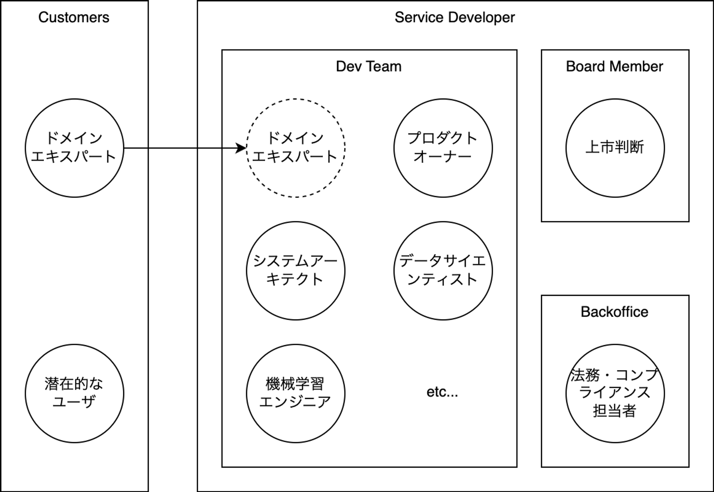
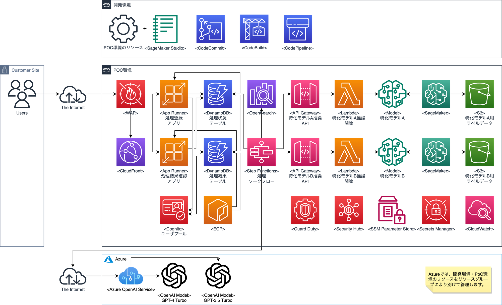

# 機械学習プロジェクトで必要な役割

## 前提とするフェーズ

- POCフェーズを想定しています。本格的な構築の際には、DevOps、SRAなど追加の役割が必要です。必要な知識の一覧についても同様です。
- システム開発プロジェクトで必要なロールに限定しています。マーケターやビジネスアナリストなど、主に企画段階で要求されるロールは含めていません。

## 前提とするプロジェクトコミュニティ

## 前提とするアーキテクチャ

## 開発チームのロール

[Roles](https://www.notion.so/3f8a81beed1c4d11942594a817fc66a1?pvs=21)

| Role | Description | Skills |
| --- | --- | --- |
| プロダクトオーナー | プロダクトビジョンの策定と優先順位付けを行い、ステークホルダーとの連携を取る。 | プロダクト管理、ステークホルダー管理、プライオリティ設定。 |
| スクラムマスター | プロジェクトの進行を促進し、スクラムプラクティスの実施を支援。 | アジャイル開発、スクラムプラクティス、コミュニケーション能力。 |
| ドメインエキスパート | 特定の業界や分野における専門知識を提供し、プロジェクトの指針となる。 | 専門的知識、分析能力、コンサルティングスキル。 |
| データエンジニア | データの収集、ストレージ、処理を設計し、データパイプラインを構築。 | データベース、ETL、プログラミング言語（SQL、Python等）。 |
| データサイエンティスト | データ分析やモデル開発を通じて洞察を抽出し、意思決定をサポート。 | 統計学、機械学習、データビジュアリゼーション。 |
| 機械学習エンジニア | 機械学習アルゴリズムの設計、トレーニング、デプロイを担当。 | 機械学習、ディープラーニング、プログラミング（Python、R等）。 |
| フロントエンドエンジニア | ユーザーインターフェースの開発を行い、ユーザー体験を向上させる。 | HTML/CSS、JavaScript、フレームワーク（React、Vue.js等）。 |
| バックエンドエンジニア | サーバーサイドのロジックとデータベースの管理を行う。 | プログラミング言語（Java、Python、SQL等）、API開発、データベース。 |
| システムアーキテクト | システム全体の設計を行い、技術選定とシステムの統合を担当。 | システム設計、クラウドサービス（AWS等）、アーキテクチャパターン。 |
| セキュリティエンジニア | システムのセキュリティを設計し、脅威から保護する対策を講じる。 | セキュリティプロトコル、侵入検知、リスク管理。 |
| QAエンジニア | 品質保証を行い、テスト計画の作成と実行を担当する。 | テスト自動化、デバッグ、ソフトウェアテスト技術。 |
| UIデザイナー | ユーザーインターフェースのビジュアルデザインを担当し、アプリケーションの見た目と感触を作成。 | グラフィックデザイン、ブランディング、インタラクティブデザイン、プロトタイピングツールの使用。 |
| UXデザイナー | ユーザーエクスペリエンスの設計を担当し、製品が提供する体験の全体的な流れと機能性を確立。 | ユーザーリサーチ、ワイヤーフレーミング、ユーザビリティテスト、情報アーキテクチャ。 |
| 法務・コンプライアンス担当者 | 法規制遵守を保証し、プロジェクトが法的要件を満たすようサポート。 | 法律知識、コンプライアンス、リスク分析。 |
| プロンプトエンジニア | 自然言語処理や会話型AIの設計・開発を行う。 | 自然言語処理、会話型AI、プログラミング（Python等）。 |

### 登場しないロール

アジャイル開発手法やクラウドを前提とすることもあり、従来のシステム開発で登場した以下のロールは定義されません。

- プロジェクトマネージャ
    - プロジェクト管理は開発チームメンバー全員の責務です。また、スケジュールやコストの制限による開発内容の調整はプロダクトオーナーが行います。このため、プロジェクトマネージャという役割は登場しません。ただし、企業内の事務処理上の理由でプロジェクトマネージャを設定することはあります。
- システムエンジニア
    - 設計と実装のように工程で役割をわけることはありません。開発するドメインの単位で、割り当てられたエンジニアが設計・実装・テスト・運用の全てをフルサイクルで対応します。
- プログラマー
    - システムエンジニアと同様です。プログラミングのみを担当することはありません。なお、(プロダクトオーナーを除き)一定のプログラミングスキルは全員が保持していることが求められます。
- インフラエンジニア・ネットワークエンジニア
    - 全く登場しないわけではないのですが、クラウドでは基本的にインフラやネットワークをコードで定義し、開発するドメインの単位でインフラ(ネットワーク含む)とアプリケーションをまとめて開発・管理します。インフラエンジニア、あるいはクラウドエンジニアの役割は、プロジェクトを跨いだクラウド全体の管理・運用です。
- テスト担当者
    - システムエンジニアと同様です。テストのみを担当することはありません。なお、品質保証(QA)エンジニアが登場しますが、QAエンジニアの役割は、テスト計画の策定、テストプロセスの自動化、および品質基準の維持など、品質保証の全体的な観点からプロジェクトに関わります。

## 開発チームに要求される知識

[Knowledge](https://www.notion.so/25779e7729cb4f9e9c1a05fe102a64d6?pvs=21)

| Title                              | Type               | Main Roles                                                                                                         | Description                                                                                                                                                                                                                                                                                                                                                                                                   | Note                                                                                                                                                   |
|------------------------------------|--------------------|--------------------------------------------------------------------------------------------------------------------|---------------------------------------------------------------------------------------------------------------------------------------------------------------------------------------------------------------------------------------------------------------------------------------------------------------------------------------------------------------------------------------------------------------|--------------------------------------------------------------------------------------------------------------------------------------------------------|
| モダンアプリケーション開発         | 知識               | 技術系ロール                                                                                                       | モダンアプリケーション開発は、技術系ロールにとって重要な知識です。この知識は、最新のアプリケーション開発の手法やベストプラクティスについて学びます。モダンアプリケーション開発には、クラウドテクノロジーやマイクロサービスアーキテクチャ、コンテナ化などが含まれます。これにより、スケーラビリティ、信頼性、セキュリティの高いアプリケーションを開発できます。                                                |                                                                                                                                                        |
| スクラム                           | 知識               | 全ロール                                                                                                           | スクラムはアジャイルソフトウェア開発のフレームワークであり、柔軟性と効率性を重視します。チームは短期間のスプリントごとに作業を計画し、進捗を定期的にレビューします。コミュニケーションと協力が重要な要素であり、透明性と自己組織化も促進します。                                                                                                                                                              |                                                                                                                                                        |
| AWS CDK                            | フレームワーク     | システムアーキテクト, バックエンドエンジニア, フロントエンドエンジニア                                             | AWS CDKは、インフラストラクチャのコード化に特化したフレームワークです。システムアーキテクトやバックエンドエンジニア、フロントエンドエンジニアなどが利用できます。CDKを使用することで、AWSリソースの設定やデプロイの自動化が簡単に行えます。コードベースでインフラストラクチャを管理するため、柔軟性と再利用性が高くなります。また、異なるプログラミング言語に対応しているため、お好みの言語で開発ができます。 |                                                                                                                                                        |
| Gradio                             | フレームワーク     | システムアーキテクト, バックエンドエンジニア, フロントエンドエンジニア, 機械学習エンジニア                         | Gradioは、簡単に機械学習モデルをデモンストレーションするためのライブラリです。インタラクティブなインターフェースを作成し、モデルの入力と出力を視覚化することができます。データサイエンティストや開発者にとって非常に便利なツールです。                                                                                                                                                                        |                                                                                                                                                        |
| Python                             | プログラミング言語 | 技術系ロール                                                                                                       | Pythonは人気のあるプログラミング言語で、シンプルな文法と豊富なライブラリが特徴です。幅広い用途に利用され、ウェブ開発、データ分析、機械学習などの領域で活躍しています。                                                                                                                                                                                                                                        |                                                                                                                                                        |
| JavaScript                         | プログラミング言語 | 技術系ロール                                                                                                       | JavaScript（ジャバスクリプト）は、ウェブページの動的な機能を作成するために使用されるプログラミング言語です。HTMLやCSSと組み合わせて使用され、ユーザーとの対話やデータの処理などを行うことができます。                                                                                                                                                                                                         |                                                                                                                                                        |
| SQL                                | プログラミング言語 | 技術系ロール                                                                                                       | SQL（Structured Query Language）は、データベース管理システムとのやり取りに使用されるプログラミング言語です。データの操作や取得、作成、変更、削除などが可能であり、データベースの管理やクエリの実行に重要な役割を果たします。                                                                                                                                                                                  |                                                                                                                                                        |
| Amazon API Gateway                 | クラウドサービス   | システムアーキテクト, バックエンドエンジニア                                                                       | Amazon API Gatewayは、AWSのマネージドサービスであり、開発者が簡単にAPIを作成、デプロイ、管理できるようにします。スケーラブルでセキュアなAPIを構築し、バックエンドのリソースにアクセスするためのエンドポイントを提供します。                                                                                                                                                                                   |                                                                                                                                                        |
| AWS Lambda                         | クラウドサービス   | システムアーキテクト, データエンジニア, バックエンドエンジニア                                                     | サーバーレスコンピューティングサービスの一つであり、アプリケーションを実行するためにサーバーのプロビジョニングや管理を必要とせず、コードの実行に対してのみ課金されるAWSのサービスです。                                                                                                                                                                                                                       |                                                                                                                                                        |
| AWS App Runner                     | クラウドサービス   | システムアーキテクト, バックエンドエンジニア, フロントエンドエンジニア                                             | AWS App Runnerは、コンテナー化されたアプリケーションを簡単にデプロイ・実行するためのサービスです。インフラストラクチャの管理やスケーリングについて心配することなく、アプリケーションの開発に集中できます。                                                                                                                                                                                                    | 本番運用を想定したシステム構築時にはApp Runnerは使用しない可能性が高いと思われます。あくまでPOCフェーズで使用するサービスです。                        |
| AWS WAF                            | クラウドサービス   | システムアーキテクト, セキュリティエンジニア, バックエンドエンジニア                                               | AWS WAFは、ウェブアプリケーションのセキュリティを向上させるためのマネージド型のウェブアプリケーションファイアウォールです。攻撃を検出し、遮断することで、ウェブアプリケーションの保護を実現します。                                                                                                                                                                                                           |                                                                                                                                                        |
| Amazon CloudFront                  | クラウドサービス   | セキュリティエンジニア, バックエンドエンジニア, フロントエンドエンジニア                                           | Amazon CloudFrontは、高速かつセキュアなコンテンツデリバリーサービスです。グローバルなユーザーに対して、コンテンツを高速に配信することができます。また、セキュリティ機能も備えており、コンテンツの保護を強化することができます。                                                                                                                                                                               |                                                                                                                                                        |
| Amazon Cognito                     | クラウドサービス   | システムアーキテクト, セキュリティエンジニア, バックエンドエンジニア                                               | Amazon Cognitoは、ユーザーアイデンティティとアクセス管理を提供するAWSのサービスです。ユーザーのサインアップ、サインイン、パスワードリセットなどの認証機能を簡単に追加できます。アプリケーションのユーザー管理を簡素化し、セキュリティを向上させます。                                                                                                                                                         |                                                                                                                                                        |
| Amazon VPC                         | クラウドサービス   | システムアーキテクト, セキュリティエンジニア, バックエンドエンジニア                                               | Amazon VPCは、Amazon Web Services（AWS）の仮想ネットワーキングサービスであり、セキュリティとプライバシーを保護しながら、カスタムの仮想ネットワーク環境を構築できます。VPCを使用することで、AWSクラウド内でリソースを起動し、自分のネットワークと同じように制御できます。                                                                                                                                      |                                                                                                                                                        |
| Amazon DynamoDB                    | クラウドサービス   | システムアーキテクト, データエンジニア, バックエンドエンジニア                                                     | Amazon DynamoDBは、マネージド型のNoSQLデータベースサービスです。スケーラビリティが高く、高速なパフォーマンスを提供します。柔軟なデータモデルと自動的なスケーリング機能により、アプリケーションの成長に対応します。                                                                                                                                                                                            |                                                                                                                                                        |
| Amazon OpenSearch Service          | クラウドサービス   | システムアーキテクト, データエンジニア, バックエンドエンジニア                                                     | Amazon OpenSearch Serviceは、オープンソースの検索・分析エンジンであり、スケーラブルな検索ソリューションを提供します。データのリアルタイム検索、ログ分析、監視、セキュリティ分析など、多様な用途に使用できます。                                                                                                                                                                                               |                                                                                                                                                        |
| AWS Step Functions                 | クラウドサービス   | システムアーキテクト, データエンジニア, バックエンドエンジニア, 機械学習エンジニア                                 | AWS Step Functionsは、ビジネスプロセスをビジュアルにモデル化し、効率的に自動化するためのサービスです。状態マシンの形式でプロセスを表現し、各ステップの依存関係と条件を定義します。これにより、リアルタイムのプロセスの可視化と監視、エラーハンドリングの自動化、スケーラビリティの向上が実現されます。                                                                                                        |                                                                                                                                                        |
| Amazon ECR                         | クラウドサービス   | システムアーキテクト, セキュリティエンジニア, データエンジニア, バックエンドエンジニア, フロントエンドエンジニア   | Amazon ECRは、AWSのコンテナレジストリサービスであり、Dockerコンテナイメージの保存と管理を提供します。ECRを使用すると、簡単にコンテナイメージを保存し、安全にデプロイできます。また、高可用性とスケーラビリティを備えており、コンテナイメージのプライベートリポジトリを作成できます。                                                                                                                          |                                                                                                                                                        |
| Amazon GuardDuty                   | クラウドサービス   | システムアーキテクト, セキュリティエンジニア                                                                       | Amazon GuardDutyは、AWSのセキュリティサービスであり、不正なアクティビティやマルウェアの検出、アカウントの異常な振る舞いの監視を行います。自動的にリアルタイムでセキュリティイベントを分析し、高度な脅威を検出することができます。セキュリティの向上とリソースの保護をサポートします。                                                                                                                         |                                                                                                                                                        |
| Amazon Inspector                   | クラウドサービス   | システムアーキテクト, セキュリティエンジニア                                                                       | Amazon Inspectorは、セキュリティ評価サービスであり、アプリケーションやインフラストラクチャに対して自動的にセキュリティの脆弱性を検出し、評価レポートを提供します。セキュリティの改善点を特定し、セキュリティを向上させるための貴重な情報を提供します。                                                                                                                                                        |                                                                                                                                                        |
| AWS Security Hub                   | クラウドサービス   | システムアーキテクト, セキュリティエンジニア                                                                       | AWS Security Hubは、AWS環境のセキュリティとコンプライアンスの状態を監視し、脅威やセキュリティ上の問題を検出するための統合サービスです。                                                                                                                                                                                                                                                                       |                                                                                                                                                        |
| Amazon CloudWatch                  | クラウドサービス   | QAエンジニア, システムアーキテクト, セキュリティエンジニア                                                         | Amazon CloudWatchは、AWSのモニタリングおよび観測サービスであり、リアルタイムのログ、メトリクス、イベントの収集、監視、および問題のトラブルシューティングを提供します。                                                                                                                                                                                                                                        | ログを管理する仕組みを含むため、基本的に全技術系ロールが触れますが、ここではCloudWatchの設計や運用に責任を持つロールを記載しています。                 |
| AWS Systems Manager                | クラウドサービス   | QAエンジニア, システムアーキテクト, セキュリティエンジニア, バックエンドエンジニア                                 | AWS Systems Managerは、Amazon Web Services（AWS）のマネージドサービスであり、インフラストラクチャの管理と自動化を提供します。システムの設定、パッチ適用、リソースの監視、セキュリティ対策など、さまざまなタスクを効率的に実行できます。                                                                                                                                                                       | SSM(Systems Manager)は非常に多くの機能があります。今回はParameter Storeの利用がメインです。                                                            |
| AWS Secrets Manager                | クラウドサービス   | システムアーキテクト, セキュリティエンジニア, バックエンドエンジニア                                               | AWS Secrets Managerは、AWSが提供するサービスの一つで、アプリケーションのシークレット情報（パスワード、APIキーなど）を安全に保存し、管理するためのソリューションです。セキュリティを強化し、開発者が簡単にシークレット情報へのアクセスを制御できるようにします。                                                                                                                                               |                                                                                                                                                        |
| Amazon SageMaker                   | クラウドサービス   | システムアーキテクト, 機械学習エンジニア                                                                           | Amazon SageMakerは、機械学習モデルの構築、トレーニング、デプロイメントを簡素化するフルマネージドなサービスです。データの前処理やモデルの学習・チューニング、推論のホスティングなど、機械学習ワークフローの全体をカバーしています。                                                                                                                                                                            | SageMakerは非常に多くの機能があります。ここでは一通り機能を把握しており、必要に応じて選択できる程度の知識を想定しています。                            |
| AWS Config                         | クラウドサービス   | システムアーキテクト, セキュリティエンジニア                                                                       | AWS Configは、AWSリソースの設定と変更の管理を自動化し、コンプライアンスの継続的評価を提供するサービスです。AWSリソースの設定の変更を追跡し、設定変更の履歴を保存し、アラートを設定することができます。これにより、セキュリティとコンプライアンスの観点からリソースの設定を監視し、問題を迅速に特定・修正することができます。                                                                                  |                                                                                                                                                        |
| AWS CloudTrail                     | クラウドサービス   | システムアーキテクト, セキュリティエンジニア, バックエンドエンジニア                                               | AWS CloudTrailは、AWSアカウント内でのアクティビティを監視し、ログを作成するサービスです。これにより、誰が何を行ったのかを追跡し、セキュリティとコンプライアンスを向上させることができます。                                                                                                                                                                                                                   |                                                                                                                                                        |
| AWS IAM                            | クラウドサービス   | システムアーキテクト, セキュリティエンジニア, バックエンドエンジニア                                               | AWS IAM（Identity and Access Management）は、AWSでの認証とアクセス制御を管理するサービスです。ユーザーの作成、ロールの割り当て、ポリシーの設定などを通じて、セキュリティとリソースの制御を実現します。                                                                                                                                                                                                        | システム開発としては、IAM Roleの利用がメインです。                                                                                                     |
| AWS Billing and Cost Management    | クラウドサービス   | システムアーキテクト                                                                                               | AWSの請求とコスト管理は、AWSのクラウドサービスの使用料金を効果的に管理するためのツールとプロセスです。これにより、コストの可視化、予算の設定、コストの最適化が可能となります。                                                                                                                                                                                                                                |                                                                                                                                                        |
| AWS Well-Architected Framework     | 知識               | システムアーキテクト                                                                                               | AWS Well-Architected Frameworkは、クラウドアーキテクチャの設計原則を提供し、AWSクラウド上で安定性、信頼性、パフォーマンス、セキュリティ、コスト効率性を確保するためのガイドラインです。                                                                                                                                                                                                                       |                                                                                                                                                        |
| AWS Well-Architected Tool          | クラウドサービス   | システムアーキテクト                                                                                               | AWS Well-Architected Toolは、AWSアーキテクチャの設計と評価のためのフレームワークです。このツールを使用すると、アーキテクチャのベストプラクティスに基づいてリソースを評価し、改善策を見つけることができます。アーキテクチャの信頼性、セキュリティ、パフォーマンス、コスト最適化などの要素を評価し、適切な解決策を見つけることができます。                                                                      |                                                                                                                                                        |
| AWS CodeCommit                     | クラウドサービス   | 技術系ロール                                                                                                       | AWS CodeCommitは、安全でスケーラブルなソースコードのホスティングおよびバージョン管理サービスです。チーム全体での協力を強化し、効率的な開発プロセスを実現します。                                                                                                                                                                                                                                              |                                                                                                                                                        |
| AWS CodeBuild                      | クラウドサービス   | システムアーキテクト, バックエンドエンジニア                                                                       | AWS CodeBuildは、AWS上での継続的なビルドプロセスを簡素化し、スケーラブルなビルドサービスを提供します。開発者は、CodeBuildを使用してアプリケーションのビルド、テスト、パッケージングを自動化できます。                                                                                                                                                                                                         |                                                                                                                                                        |
| AWS CodePipeline                   | クラウドサービス   | システムアーキテクト, バックエンドエンジニア                                                                       | AWS CodePipelineは、アプリケーションのリリースプロセスを自動化するためのフルマネージドの継続的デリバリーサービスです。コードのビルド、テスト、デプロイといったステップをパイプラインとして定義し、効率的な開発とデプロイメントを実現します。                                                                                                                                                                  |                                                                                                                                                        |
| Amazon S3                          | クラウドサービス   | システムアーキテクト, データエンジニア, バックエンドエンジニア                                                     | Amazon S3は、シンプルで耐久性のあるオブジェクトストレージサービスです。大容量のデータを安全に保存し、必要なときに簡単に取得できます。スケーラブルなストレージソリューションであり、高い可用性と耐久性を提供します。                                                                                                                                                                                           |                                                                                                                                                        |
| OpenAI API                         | クラウドサービス   | プロンプトエンジニア, 機械学習エンジニア                                                                           | OpenAI APIは、人工知能モデルを使用して開発者が様々なタスクを自動化するためのAPIです。テキスト生成、自然言語理解、翻訳などの機能を提供します。開発者は簡単にAPIを統合し、高品質なモデルを活用することができます。                                                                                                                                                                                              |                                                                                                                                                        |
| Amazon SageMaker Studio            | クラウドサービス   | データサイエンティスト, プロンプトエンジニア, 機械学習エンジニア                                                   | Amazon SageMaker Studioは、機械学習ワークフローをサポートする統合開発環境です。データの準備からモデルのトレーニング、デプロイまで、一元管理できる環境を提供します。操作しやすく、効率的な機械学習開発を実現します。                                                                                                                                                                                           |                                                                                                                                                        |
| Jupyter Notebook/Lab               | アプリケーション   | データサイエンティスト, プロンプトエンジニア, 機械学習エンジニア                                                   | Jupyter Notebook/Labは、データサイエンティスト、プロンプトエンジニア、機械学習エンジニアの主要な役割を果たすアプリケーションです。このツールを使用することで、コード、視覚化、ドキュメント作成を一つの環境で行うことができます。柔軟性とインタラクティブ性が高く、効率的なデータ解析やモデリングを支援します。                                                                                                |                                                                                                                                                        |
| Azure OpenAI Service               | クラウドサービス   | システムアーキテクト, バックエンドエンジニア, 機械学習エンジニア                                                   | Azure OpenAI Serviceは、高度な人工知能（AI）の機能を提供するクラウドベースのサービスです。開発者は、自然言語処理や機械学習を活用して、AIを組み込んだアプリケーションを構築することができます。このサービスは、スケーラブルで柔軟なAIソリューションの開発を支援します。                                                                                                                                        |                                                                                                                                                        |
| Azure Subscription                 | クラウドサービス   | システムアーキテクト                                                                                               | Azure Subscription（アズール サブスクリプション）は、マイクロソフトのクラウドプラットフォームであるAzureを利用するための契約です。Azureの機能やリソースを利用するためには、Azure Subscriptionが必要となります。契約に基づいて課金が行われ、利用料金が発生します。                                                                                                                                             |                                                                                                                                                        |
| Microsoft Entra ID                 | クラウドサービス   | システムアーキテクト, セキュリティエンジニア, バックエンドエンジニア                                               | Microsoft Entra IDは、Microsoftが提供するセキュリティソリューションです。このIDを使用することで、Microsoftのビジネス向け製品やサービスへのアクセスを管理し、セキュリティを強化することができます。                                                                                                                                                                                                            |                                                                                                                                                        |
| GitHub Flow                        | 知識               | 技術系ロール                                                                                                       | GitHub Flowは、ソフトウェア開発のためのワークフローであり、ブランチの作成、変更のコミット、プルリクエスト、マージの手順を組み合わせて効率的な開発を実現します。                                                                                                                                                                                                                                               |                                                                                                                                                        |
| Git                                | アプリケーション   | 技術系ロール                                                                                                       | Gitは分散型バージョン管理システムで、ソフトウェア開発における変更の記録や追跡を容易にします。チームでの協力やバージョン管理の効率化に役立ちます。                                                                                                                                                                                                                                                             |                                                                                                                                                        |
| Visual Studio Code                 | アプリケーション   | 技術系ロール                                                                                                       | Visual Studio Codeは、マイクロソフトが開発した高機能なテキストエディタであり、主に技術系のロールに向けて設計されています。拡張機能の豊富なサポートやシンタックスハイライト、デバッグ機能などを備えており、開発者が効率的にコーディング作業を行うためのツールです。                                                                                                                                            |                                                                                                                                                        |
| プロンプトエンジニアリング(LLM)    | 知識               | プロンプトエンジニア, 機械学習エンジニア                                                                           | プロンプトエンジニアリング(LLM)は、質問やプロンプトを使用して他者の思考を促進し、創造的な解決策を見つける手法です。この手法は、グループディスカッションや個人の思考プロセスで使用され、問題解決や意思決定を支援します。                                                                                                                                                                                       |                                                                                                                                                        |
| AWS SDK for Python (Boto3)         | フレームワーク     | データエンジニア, バックエンドエンジニア, フロントエンドエンジニア, 機械学習エンジニア                             | AWS SDK for Python（Boto3）は、Pythonを使用してAmazon Web Services（AWS）を操作するための公式のソフトウェア開発キット（SDK）です。Boto3を使用することで、PythonプログラムからAWSリソースへのアクセスや操作が簡単に行えます。                                                                                                                                                                                  |                                                                                                                                                        |
| Amazon SageMaker Python SDK        | フレームワーク     | 機械学習エンジニア                                                                                                 | Amazon SageMaker Python SDKは、機械学習モデルを構築、トレーニング、デプロイするためのPythonライブラリです。このSDKを使用することで、データの準備、モデルのトレーニング、モデルのデプロイなどのタスクを効率的に実行することができます。                                                                                                                                                                        |                                                                                                                                                        |
| Docker                             | アプリケーション   | システムアーキテクト, データサイエンティスト, バックエンドエンジニア, フロントエンドエンジニア, 機械学習エンジニア | Dockerはアプリケーションの実行環境をコンテナ化するツールで、システムアーキテクト、データサイエンティスト、バックエンドエンジニア、フロントエンドエンジニア、機械学習エンジニアなど、さまざまな役割の開発者にとって重要なツールです。コンテナ化により、アプリケーションの環境を簡単に再現・共有できるため、開発効率を向上させます。                                                                            |                                                                                                                                                        |
| Powertools for AWS Lambda (Python) | フレームワーク     | データエンジニア, バックエンドエンジニア                                                                           | AWS LambdaのためのPowertoolsは、Pythonで開発されたユーティリティライブラリです。これにより、Lambda関数のデバッグやモニタリング、トレーシングなどが容易になります。さまざまな機能を提供し、Lambda開発の効率を向上させます。                                                                                                                                                                                    |                                                                                                                                                        |
| LangChain                          | フレームワーク     | プロンプトエンジニア, 機械学習エンジニア                                                                           | LangChainは、プロンプトエンジニアと機械学習エンジニアの主要な役割を持つフレームワークです。プロンプトエンジニアは、自然言語のモデルを設計し、プロンプトの生成を担当します。機械学習エンジニアは、機械学習アルゴリズムを開発してモデルをトレーニングします。LangChainは、効率的で柔軟なプロンプトエンジニアリングを実現するためのフレームワークです。                                                          |                                                                                                                                                        |
| pytest                             | フレームワーク     | QAエンジニア, バックエンドエンジニア, フロントエンドエンジニア                                                     | pytestはPythonのテストフレームワークであり、効率的なテストの作成と実行をサポートします。シンプルな構文と豊富な機能を提供し、テストの自動検出やパラメータ化テストなどの便利な機能を備えています。pytestは柔軟で拡張性があり、テストの結果を豊富なレポート形式で表示することも可能です。                                                                                                                        |                                                                                                                                                        |
| 統計の基礎知識(統計検定3級程度)    | 知識               | QAエンジニア, データサイエンティスト, プロンプトエンジニア, 機械学習エンジニア                                     | 統計の基礎知識は、品質管理やデータ解析において重要な役割を果たします。統計検定3級程度の知識は、QAエンジニア、データサイエンティスト、プロンプトエンジニア、機械学習エンジニアなどに求められます。統計知識を持つことで、データの分析や品質の管理を効果的に行うことができます。                                                                                                                                 | 品質管理には一般に統計の知識も必要になるため、QAエンジニアも含めています。プロンプトエンジニアについては、プロンプトの検証で統計知識が必要になります。 |
| 業務知識                           | 知識               | ドメインエキスパート, プロダクトオーナー                                                                           |                                                                                                                                                                                                                                                                                                                                                                                                               |                                                                                                                                                        |
| Markdown記法                       | 知識               | 全ロール                                                                                                           | Markdown記法は、文書の書式を簡単に指定するための軽量マークアップ言語です。HTMLタグを使わずに、見出しや段落、リスト、強調表示などの要素を記述することができます。シンプルなテキストフォーマットで書かれた文書を、見やすく整形されたHTML文書に変換することができます。                                                                                                                                          | 利用するWikiによって方言があります。基本的なMarkdown記法を前提として、採用するWikiの方言も使うことが想定されます。                                     |
| ITS(Issue Tracking System)         | アプリケーション   | 全ロール                                                                                                           | ITS（Issue Tracking System）は、バグや問題の追跡、管理、解決を支援するアプリケーションです。バックログ、Asana、Jiraなどが一般的に使用されます。ITSは、プロジェクトの進行状況を追跡し、タスクの割り当てや優先順位付けを行うことができます。チーム全体でのコラボレーションを促進し、タスクの可視化と効率的な問題解決をサポートします。                                                                          | Backlog、Asana、Jiraなどの利用が想定されます。                                                                                                         |
| Wiki(CMS)                          | アプリケーション   | 全ロール                                                                                                           | Wiki(CMS)は、コンテンツ管理システムの一種であり、情報共有と編集を容易にするために使用されます。ユーザーはテキストや画像を追加し、編集することができます。Wiki(CMS)は、企業や組織内での情報の共有や文書の管理に役立ちます。                                                                                                                                                                                    |                                                                                                                                                        |
| Figma                              | アプリケーション   | UIデザイナー, UXデザイナー                                                                                         | FigmaはUIデザイナーやUXデザイナーのためのアプリケーションです。デザインツールとして利用され、ユーザーインターフェースのデザインやユーザーエクスペリエンスの設計に使用されます。                                                                                                                                                                                                                               |                                                                                                                                                        |
| データサイエンスの基礎知識         | 知識               | データサイエンティスト, 機械学習エンジニア                                                                         | データサイエンスの基礎知識について、簡潔な解説を以下に記載します。 データサイエンスは、データから有益な情報を引き出し、問題解決や意思決定に活用するための学問・技術です。統計学、機械学習、データベース、プログラミングなどの知識とスキルが必要であり、企業や組織にとって重要な役割を果たしています。                                                                                                      |                                                                                                                                                        |
| UXの基礎知識                       | 知識               | UXデザイナー, システムアーキテクト                                                                                 | UX（ユーザーエクスペリエンス）の基礎知識には、ユーザーのニーズを理解し、製品やサービスの使いやすさや満足度を向上させるための方法や手法が含まれます。UXデザインは、ユーザー中心のアプローチを取り入れて、ユーザーの視点や行動を考慮しながら製品やサービスを開発することを目指します。                                                                                                                          |                                                                                                                                                        |
| UIデザインの基礎知識               | 知識               | UIデザイナー, システムアーキテクト, フロントエンドエンジニア                                                       | UIデザインの基礎知識では、Titleの重要性が強調されます。Titleは、ユーザーにとって最初の印象を与える重要な要素です。適切なTitleは、コンテンツの内容を要約し、ユーザーの興味を引く役割を果たします。簡潔かつ明確なTitleを作成することで、ユーザーのナビゲーションと理解をサポートします。                                                                                                                        |                                                                                                                                                        |
| ITセキュリティの基礎知識           | 知識               | システムアーキテクト, セキュリティエンジニア                                                                       | ITセキュリティの基礎知識について、簡潔に解説します。このページでは、ITセキュリティに関する基本的な知識を学ぶことができます。情報セキュリティの重要性や脅威、セキュリティ対策の基本などが取り上げられています。ITシステムやデータを保護するために必要な知識を身につけましょう。                                                                                                                                |                                                                                                                                                        |
| ソフトウェアテストの基礎知識       | 知識               | QAエンジニア, システムアーキテクト                                                                                 | ソフトウェアテストの基礎知識は、ソフトウェア開発プロセスで品質を確保するための重要な要素です。テストの目的は、ソフトウェアのバグや問題を特定し、修正することです。テストは、バグの早期発見や品質向上に貢献します。テストの手法には、ユニットテスト、結合テスト、システムテストなどがあります。ソフトウェアテストは、信頼性やセキュリティの向上にも役立ちます。                                                |                                                                                                                                                        |
| マテリアルデザイン                 | 知識               | UIデザイナー, フロントエンドエンジニア                                                                             | マテリアルデザインは、Googleが提唱するユーザーインターフェースデザインのアプローチです。物理的な材料の特性を取り入れ、直感的で一貫性のあるデザインを実現します。影やエレベーションなどの要素を活用し、視覚的な階層性を表現します。マテリアルデザインは、美しさと機能性をバランスよく組み合わせ、優れたユーザーエクスペリエンスを提供します。                                                                  |                                                                                                                                                        |
| TensorFlow                         | フレームワーク     | データサイエンティスト, 機械学習エンジニア                                                                         | TensorFlowは、機械学習やディープラーニングのためのオープンソースのライブラリです。データフローグラフを使用して数値計算を実行し、大規模なニューラルネットワークモデルの訓練や展開を容易にします。柔軟性と拡張性に優れており、さまざまなプラットフォームで使用することができます。                                                                                                                              |                                                                                                                                                        |
| PyTorch                            | フレームワーク     | データサイエンティスト, 機械学習エンジニア                                                                         | PyTorchは、機械学習や深層学習のためのオープンソースのPythonライブラリです。柔軟なニューラルネットワークの構築とトレーニングをサポートし、GPUを使用して高速な計算が可能です。リアルタイムのデバッグやモデルの可視化など、開発者にとって便利な機能も提供しています。                                                                                                                                            |                                                                                                                                                        |
| Pandas                             | フレームワーク     | データサイエンティスト, 機械学習エンジニア                                                                         | Pandasは、データ操作と分析を簡単かつ効率的に行うためのPythonのライブラリです。データフレームとシリーズというデータ構造を提供し、データのフィルタリング、結合、集計などの操作を容易に行うことができます。                                                                                                                                                                                                      |                                                                                                                                                        |
| Matplotlib                         | フレームワーク     | データサイエンティスト, 機械学習エンジニア                                                                         | MatplotlibはPythonのデータ可視化ライブラリであり、グラフや図を作成するために使用されます。データの視覚化や分析に役立ち、直感的にわかりやすい図を作成することができます。                                                                                                                                                                                                                                      |                                                                                                                                                        |
| Seaborn                            | フレームワーク     | データサイエンティスト, 機械学習エンジニア                                                                         | SeabornはPythonのデータ可視化ライブラリで、美しいグラフとカラーパレットを提供します。統計的なデータの可視化やパターンの発見に役立ちます。簡単なコードで高品質なグラフを作成でき、データの洞察を得るのに便利です。                                                                                                                                                                                             |                                                                                                                                                        |
| ファシリテーティング               | 知識               | スクラムマスター                                                                                                   | ファシリテーティングは、グループやチームのコミュニケーションや意思決定をサポートする手法です。ファシリテーターは、議論の進行を促し、参加者の意見をまとめ、共通の目標に向けて協力を促します。効果的なファシリテーションは、円滑なコラボレーションと効率的な結果の達成に役立ちます。                                                                                                                            |                                                                                                                                                        |
| コーチング                         | 知識               | スクラムマスター                                                                                                   | コーチングは、個人やチームの成長や目標達成をサポートするプロセスです。コーチングは、クライアントとの対話や質問を通じて自己認識や洞察を促し、行動計画の策定や目標の達成を支援します。コーチングは、能力開発やパフォーマンス向上、自己啓発などに効果的な手法とされています。                                                                                                                                    |                                                                                                                                                        |
| AI開発に関連する法律知識           | 知識               | 法務・コンプライアンス担当者                                                                                       | AI開発に関連する法律知識について、簡潔に解説します。AI開発では、個人情報保護法や知的財産権法、労働法などの法律を考慮する必要があります。また、AIの利用による倫理的な問題や潜在的なリスクも注目されています。法的な規制や倫理的なガイドラインを遵守することが重要です。                                                                                                                                        |                                                                                                                                                        |
| AWS X-Ray                          | クラウドサービス   | QAエンジニア, システムアーキテクト, バックエンドエンジニア                                                         | AWS X-Rayは、分散アプリケーションのトレーシングとデバッグをサポートするサービスです。リクエストのフローを可視化し、ボトルネックやエラーの原因を特定することができます。アプリケーションパフォーマンスの向上とトラブルシューティングを容易にします。                                                                                                                                                           |                                                                                                                                                        |
| プロダクトマネジメント             | 知識               | UXデザイナー, プロダクトオーナー                                                                                   | プロダクトマネジメントは、事業戦略、IT開発、UXデザイン、マーケティングからチーム・組織運営まで、プロダクトのすべての側面を統括する役割です。                                                                                                                                                                                                                                                                  |                                                                                                                                                        |
| OpenAPI                            | フレームワーク     | システムアーキテクト, バックエンドエンジニア, フロントエンドエンジニア                                             | OpenAPIは、APIの設計と文書化を支援するためのフレームワークです。開発者がAPIの仕様を明確に定義し、自動化されたドキュメントを生成することができます。これにより、異なるアプリケーション間でのデータの共有や通信が容易になります。OpenAPIは、APIの可読性と保守性を向上させるための強力なツールです。                                                                                                             | POC段階では不要である可能性もありますが、前提知識としては必要です。                                                                                    |
| 機械学習の基礎知識                 | 知識               | データサイエンティスト, プロンプトエンジニア, 機械学習エンジニア                                                   | 機械学習は、コンピューターシステムがデータから学習し、パターンを抽出し、予測や意思決定を行うための手法です。データの特徴を自動的に学習し、予測モデルを構築することが可能です。これにより、画像認識、音声認識、自然言語処理などの応用が可能になります。                                                                                                                                                        |                                                                                                                                                        |
| ドメイン駆動開発(DDD)              | 知識               | 技術系ロール                                                                                                       | ドメイン駆動開発(DDD)は、ソフトウェア開発の手法であり、ビジネスドメインに焦点を当ててシステムを設計・開発することを目指します。ビジネスのルールやプロセスをモデル化し、それに基づいてソフトウェアを構築することで、ビジネス価値の向上や柔軟な変更への対応が可能となります。                                                                                                                                   |                                                                                                                                                        |
| クラウドデザインパターン           | 知識               | システムアーキテクト, セキュリティエンジニア, バックエンドエンジニア                                               | クラウドデザインパターンは、クラウドアーキテクチャの設計において一般的に使用される再利用可能なソリューションです。これらのパターンは、スケーラビリティ、可用性、セキュリティなどの要件を満たすために使用されます。クラウドデザインパターンは、クラウドベンダーに依存せずに適用できるため、異なるクラウドプロバイダ間での移行やポータビリティが容易になります。                                                |                                                                                                                                                        |
| デザインパターン                   | 知識               | 技術系ロール                                                                                                       | デザインパターンとは、ソフトウェア設計の問題を解決するための再利用可能なソリューションです。これらのパターンは、特定の状況や要件に適用することで、効率的で柔軟な設計を実現します。デザインパターンは、ソフトウェア開発者によって共有され、実践されることで、信頼性の高いソフトウェアの開発に貢献します。                                                                                                      |                                                                                                                                                        |