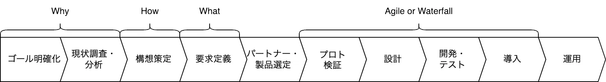

# 業務会社がシステム開発を外注する際の体制と要点

この資料では、業務会社がシステム開発を外注する際の体制と要点について説明しています。

## システム開発の全体像

以下は、業務会社がシステム開発を外注する際の全体プロセスと、各登場人物（組織）の役割分担例の例です。各プロセスの役割を明確にし、確実に実行することが重要です。

[システムを作らせる技術　エンジニアではないあなたへ](https://www.amazon.co.jp/gp/product/B099WCDCG6)より。一部追記。

|                   | ゴール明確化 | 現状調査・分析 | 構想策定 | 要求定義 | パートナー・製品選定 | プロト検証 | 設計 | 開発・テスト | 導入 | 運用 |
| ----------------- | ------------ | -------------- | -------- | -------- | -------------------- | ---------- | ---- | ------------ | ---- | ---- |
| 業務会社/業務部門 | RA           | RA             | RA       | RA       | RA                   | CI         | CI   | I            | I    | I    |
| 業務会社/情シ部門 |              |                |          | C        | C                    | C          | C    | C            | C    | A    |
| コンサル          | C            | C              | C        | C        | C                    |            |      |              |      |      |
| SIer              |              |                |          |          |                      | A          | A    | A            | A    | R    |
| 開発会社          |              |                |          |          |                      | R          | R    | R            | R    |      |

-   **R**esponsible(実行責任者), **A**ccountable(説明責任者), **C**onsulted(相談先), **I**nformed(報告先)

### ゴール明確化

企画の初期段階です。なぜシステム開発をするのか?という背景と目的(ゴール)、大まかなスコープ(開発範囲や対象業務の明確化)を検討します。

### 現状調査・分析

この段階では、現在の業務状況や使用中のシステムを詳細に調査・分析します。新規サービスの場合は、市場や競合についても調査を行います。重要なのは、この現状調査・分析の結果、システム開発を行う明確な理由が見出せない場合、そのプロジェクトの実施を再考すべきだということです。

### 構想策定

システム開発プロジェクトの企画をまとめ、計画書を作成する段階です。作成した企画書・計画書に基づいて、会社としてプロジェクトの実施可否を判断します。

この段階では、プロジェクトの具体的な目標、スケジュール、必要なリソース、予算、リスク、期待される成果などを詳細に記述します。また、プロジェクトの実現可能性や投資対効果(ROI)についても検討します。これにより、経営層や関係部門がプロジェクトの価値と実行可能性を適切に評価できるようになります。

### 要求定義

開発するシステムに対する要求をまとめる段階です。`要望・要求・要件`という似た言葉が混在しますが、これらには違いがあります。`要望`と`要求`はユーザーや顧客の視点から見た必要性や希望を表します。一方、`要件`は、これらの要求や要望を実現するための具体的な条件を指します。`要求`と`要望`は似たように扱われますが、業務の現場にヒアリングした結果を`要望`、それを整理した結果を`要求`と使い分けることがあります。いずれにしても、用語の定義は関係者間で共有できるよう、明確にしておくことが重要です。

また、 `要件定義`という言葉も広く用いられますが、前述の定義の要件だけを羅列すると問題が生じます。システムを開発する側が、なぜそのような条件を満たす必要があるのか理解できなくなり、専門知識を活かせずにシステム開発が破綻しやすくなるのです。そのため、必ず背景となる要望・要求も合わせてまとめる必要があります。

### パートナー・製品選定

要求定義で明確になったシステム開発への要求・要件に基づき、RFI(情報提供依頼書)や RFP(提案依頼書)を作成します。これらの文書を通じて、潜在的なパートナーや製品ベンダーから詳細な情報や具体的な提案を収集します。その後、収集した情報を評価し、プロジェクトの目標と要件に最も適したパートナーや製品を選定します。運用まで含めると 5 ～ 10 年継続するパートナーを選ぶプロセスです。この段階でプロジェクトの成否がほぼ決まります。

### プロト検証

この段階では、開発を委託したパートナーにプロトタイプを作成してもらいます。業務の現場の利用者も含めて、開発予定のシステムが業務上の要求を満たせるかを検証します。プロトタイプは `モック`と呼ばれる紙芝居形式でも構いません。システムを利用するユーザーが、開発するシステムを使用した際の業務成果をイメージできることが重要です。

プロトタイプによる検証は、要件が正しいかを確認する重要な機会です。ユーザーがシステムの利用が難しいと判断した場合は、要求定義から見直すことも考慮する必要があります。

### 設計

システムを設計する段階です。設計は専門知識を持ったパートナーが主に行いますが、設計時にも業務やコストに影響する判断は多く発生します。発注する側が適切に判断するためには、設計の基本的な知識や、業務への影響を評価する能力が必要です。また、パートナーとのコミュニケーションを通じて、設計の方向性を確認することも重要です。

### 開発・テスト

開発・テスト段階も専門知識を持つパートナーが主に担当しますが、この段階では予期せぬ技術的課題や要件の変更が最も頻繁に発生します。特にテストに関しては、システムの実際のユーザーの参加を適切に調整しないと、導入後に大きな手戻りが生じる可能性があります。

### 導入

システム開発の山場です。既存システムからの移行の場合、業務への影響を最小限に抑えるため、新システム導入のための綿密な移行計画が不可欠です。導入の可否を判断する際は、前工程のテスト結果を踏まえ、全ステークホルダーの合意が必要となります。

### 運用

システムは運用してからが本番です。日々の業務を通じて新たな要求や改善点が明らかになります。そのため、システムの継続的な改善と最適化が重要です。また、運用中に発生する問題に迅速に対応し、システムの安定性と効率性を維持するための体制が重要になります。

## システム開発に必要なスキル

システム開発には企画から設計・構築、運用まで幅広知識が求められます。全ての知識領域を自部問で担う体制が維持できない場合は、他部門や外部の会社などの支援を受けて、システム開発に必要なスキルを充足させることになります。登場人物(組織)毎に主に期待されるスキルの例は以下のとおりです。

### 業務会社/企画・業務部門

-   **戦略的思考力:** 事業目標を明確化し、全体のビジョンを策定する能力。
-   **ビジネス分析力:** 現状の業務プロセスを分析し、改善点を特定する能力。
-   **要求定義能力:** ビジネス要件を正確に整理し、ドキュメント化するスキル。
-   **意思決定力:** パートナーや製品の選定において迅速かつ的確な判断を下す能力。
-   **コミュニケーション力:** 他部門や外部パートナーとの円滑な協業を促進する能力。
-   **プロジェクトマネジメントスキル:** プロジェクトの進行を管理し、目標達成に導く能力。

### 業務会社/情シ部門

-   **技術的専門知識:** システムインフラや既存システムに関する深い理解。
-   **協業・調整力:** 他部門や外部ベンダーとの技術的な調整を行う能力。
-   **運用管理スキル:** システムの安定稼働を維持するための管理能力。
-   **問題解決力:** 技術的な問題や課題を迅速に解決する能力。
-   **セキュリティ知識:** 情報セキュリティに関する最新の知識と対応力。

### コンサル

-   **専門的知見:** 業界動向やベストプラクティスに関する深い知識。
-   **分析力:** データや情報を分析し、洞察を提供する能力。
-   **提案力:** クライアントの課題に対する効果的なソリューションを提案する能力。
-   **コミュニケーション力:** 複雑な情報をわかりやすく伝える能力。
-   **プロジェクトマネジメントスキル:** プロジェクトの計画と進行をサポートする能力。

### SIer

-   **システム統合能力:** 複数のシステムやコンポーネントを統合するスキル。
-   **プロジェクトマネジメントスキル:** 大規模プロジェクトの計画、実行、監視を行う能力。
-   **技術的リーダーシップ:** 技術チームを指導・管理する能力。
-   **品質管理スキル:** プロジェクトの品質を確保するためのプロセスと手法の理解。
-   **運用管理スキル:** システムの安定稼働を維持するための管理能力。
-   **リスク管理能力:** プロジェクトにおけるリスクを特定し、対策を講じる能力。

### 開発会社

-   **ソフトウェア開発スキル:** プログラミング言語や開発フレームワークの専門知識。
-   **設計能力:** システム要件を技術的な設計に落とし込む能力。
-   **テストスキル:** ソフトウェアの品質を確保するためのテスト計画と実施能力。
-   **問題解決力:** 技術的な課題を迅速に解決する能力。
-   **協業力:** 他チームやパートナーと円滑に協力する能力。

## よくある業務システム開発の例

よくある業務システムの例です。基幹システム刷新などの大型のシステム開発プロジェクトで採用されることが多い形式です。

|                   | ゴール明確化 | 現状調査・分析 | 構想策定 | 要求定義 | パートナー・製品選定 | プロト検証 | 設計 | 開発・テスト | 導入 | 運用 |
| ----------------- | ------------ | -------------- | -------- | -------- | -------------------- | ---------- | ---- | ------------ | ---- | ---- |
| 業務会社/業務部門 | RA           | RA             | RA       | RA       | RA                   | CI         | CI   | I            | I    | I    |
| 業務会社/情シ部門 |              |                |          | C        | C                    | C          | C    | C            | C    | A    |
| コンサル          | C            | C              | C        | C        | C                    |            |      |              |      |      |
| SIer              |              |                |          |          |                      | A          | A    | A            | A    | R    |
| 開発会社          |              |                |          |          |                      | R          | R    | R            | R    |      |

-   **R**esponsible(実行責任者), **A**ccountable(説明責任者), **C**onsulted(相談先), **I**nformed(報告先)

### 良いところ

-   大規模なシステム開発プロジェクトを外部リソースを活用して実施できるため、業務会社の内部リソースだけでは難しい大規模な開発が可能になります。
-   専門性の高い外部パートナーの知見を活用することで、最新の技術やベストプラクティスを取り入れやすくなります。
-   各フェーズで適切な役割分担がされているため、それぞれの強みを生かしたプロジェクト推進が可能になります。

### 悪いところ

-   複数の外部パートナーが関与するため、コミュニケーションや調整に時間とコストがかかる可能性があります。
-   業務会社の内部リソースへの依存度が低くなり、長期的には社内のシステム開発スキルが低下する可能性があります。
-   外部パートナーへの依存度が高くなるため、将来的なシステム変更や拡張に柔軟に対応できない可能性があります。

## 医薬品リスク分析パッケージ開発の例

業務会社の情報システム部門が主導してパッケージ製品を開発した例です。情報システム部門の人員不足を補うため、外部から要員を調達し、さらに一部の機能開発を外部会社に委託しました。

|                   | ゴール明確化 | 現状調査・分析 | 構想策定 | 要求定義 | パートナー・製品選定 | プロト検証 | 設計 | 開発・テスト | 導入 | 運用 |
| ----------------- | ------------ | -------------- | -------- | -------- | -------------------- | ---------- | ---- | ------------ | ---- | ---- |
| 業務会社/業務部門 | RA           | RA             | RA       | RA       | I                    | CI         | CI   | I            | I    | I    |
| 業務会社/情シ部門 | C            | C              | C        | C        | RA                   | RA         | RA   | RA           | RA   | RA   |
| 開発会社          |              |                |          |          |                      |            | R    | R            |      |      |

-   **R**esponsible(実行責任者), **A**ccountable(説明責任者), **C**onsulted(相談先), **I**nformed(報告先)

### 良いところ

-   部門は分かれていますが、内製化されているため、システム開発の最大の難所である要求の理解に問題が生じにくくなっています。
-   外部から要員を調達していますが、基本的には情報システム部門の一員として活動するため、組織内にノウハウが蓄積されやすくなっています。
-   一部の開発を外注することでコスト最適化を行っています。

### 悪いところ

-   情報システム部門に求められる役割が多岐にわたるため、間接部門としてコスト高になりやすい傾向があります。
-   同一会社内であっても、業務部門との関係性次第では、要求の理解不足やプロジェクト推進に課題が生じる可能性があります。

## AI/ML による専門用語推論サービス開発の例

業務部門が企画から開発、運用まで一貫して担当した例です。人員不足を補うため外部から要員を調達しましたが、プロジェクト全体は同一組織内で完結させました。

|                   | ゴール明確化 | 現状調査・分析 | 構想策定 | 要求定義 | パートナー・製品選定 | プロト検証 | 設計 | 開発・テスト | 導入 | 運用 |
| ----------------- | ------------ | -------------- | -------- | -------- | -------------------- | ---------- | ---- | ------------ | ---- | ---- |
| 業務会社/業務部門 | RA           | RA             | RA       | RA       | RA                   | RA         | RA   | RA           | RA   | RA   |

-   **R**esponsible(実行責任者), **A**ccountable(説明責任者), **C**onsulted(相談先), **I**nformed(報告先)

### 良いところ

-   アジャイル開発に最適な体制が整っています。
-   要求の理解と開発の進行が迅速に行えるため、開発サイクルを短縮できます。
-   同一組織内で完結するため、ノウハウを確実に蓄積できます。

### 悪いところ

-   技術的な専門知識の多くを外部要員に依存することになります。
-   業務部門が IT 統制に関するすべての調整を担当する必要があります。

## 研究部門クラウド環境構築の例

このプロジェクトは研究基盤の構築・運用を目的としているため、DevOps アプローチを採用し、継続的な改善と運用を前提としています。SIer のサポートを受けていますが、明確な役割分担ではなく、ワンチームとして一体的に推進しました。

|                   | ゴール明確化 | 現状調査・分析 | 構想策定 | 要求定義 | パートナー・製品選定 | プロト検証 | 設計 | 開発・テスト | 導入 | 運用 |
| ----------------- | ------------ | -------------- | -------- | -------- | -------------------- | ---------- | ---- | ------------ | ---- | ---- |
| 業務会社/業務部門 | RACI         | RACI           | RACI     | RACI     | RACI                 | RACI       | RACI | RACI         | RACI | RACI |
| SIer              | RACI         | RACI           | RACI     | RACI     | RACI                 | RACI       | RACI | RACI         | RACI | RACI |

-   **R**esponsible(実行責任者), **A**ccountable(説明責任者), **C**onsulted(相談先), **I**nformed(報告先)

### 良いところ

-   DevOps に最適な体制が整っています。
-   継続的な改善と運用を前提としているため、長期的な視点でシステムの進化と最適化が可能になります。
-   外部から要員を調達していますが、基本的には情報システム部門の一員として活動するため、組織内にノウハウが蓄積されやすくなっています。

### 悪いところ

-   SIer との役割分担が明確でないため、責任の所在が不明確になる可能性があります。
-   長期的なプロジェクトになるため、人員の入れ替わりによってノウハウの継承が難しくなる可能性があります。

## 医療機器開発の例

業務会社が開発した治療法を実施する医療機器を、開発会社に依頼して製作した例です。企画段階までを業務会社で行い、設計および開発の全工程を開発会社に委託したケースです。

|                   | ゴール明確化 | 現状調査・分析 | 構想策定 | 要求定義 | パートナー・製品選定 | プロト検証 | 設計 | 開発・テスト | 導入 | 運用 |
| ----------------- | ------------ | -------------- | -------- | -------- | -------------------- | ---------- | ---- | ------------ | ---- | ---- |
| 業務会社/業務部門 | RA           | RA             | RA       | RA       | RA                   | CI         | CI   | CI           | CI   | RA   |
| 開発会社          |              |                |          |          |                      | RA         | RA   | RA           | RA   |      |

-   **R**esponsible(実行責任者), **A**ccountable(説明責任者), **C**onsulted(相談先), **I**nformed(報告先)

### 良いところ

-   業務会社は医療機器やシステムに関する専門的な技術要員を社内に抱える必要がありません。
-   開発会社の専門知識と経験を活用することで、高品質な医療機器を効率的に開発できます。
-   業務会社は自社の強みである治療法の開発に集中し、医療機器の開発は専門家に任せることで、リソースを最適に配分できます。

### 悪いところ

-   業務会社と開発会社の間でコミュニケーションの齟齬が生じる可能性が高まります。
-   開発過程での柔軟な変更や調整が難しくなり、新たなアイデアや要求を即座に反映させることが困難になります。
-   医療機器に関する技術的な知識やノウハウが社内に蓄積されにくくなり、長期的には自社の競争力に影響を及ぼす可能性があります。

## 参考文献

-   [システムを作らせる技術　エンジニアではないあなたへ](https://www.amazon.co.jp/gp/product/B099WCDCG6)
