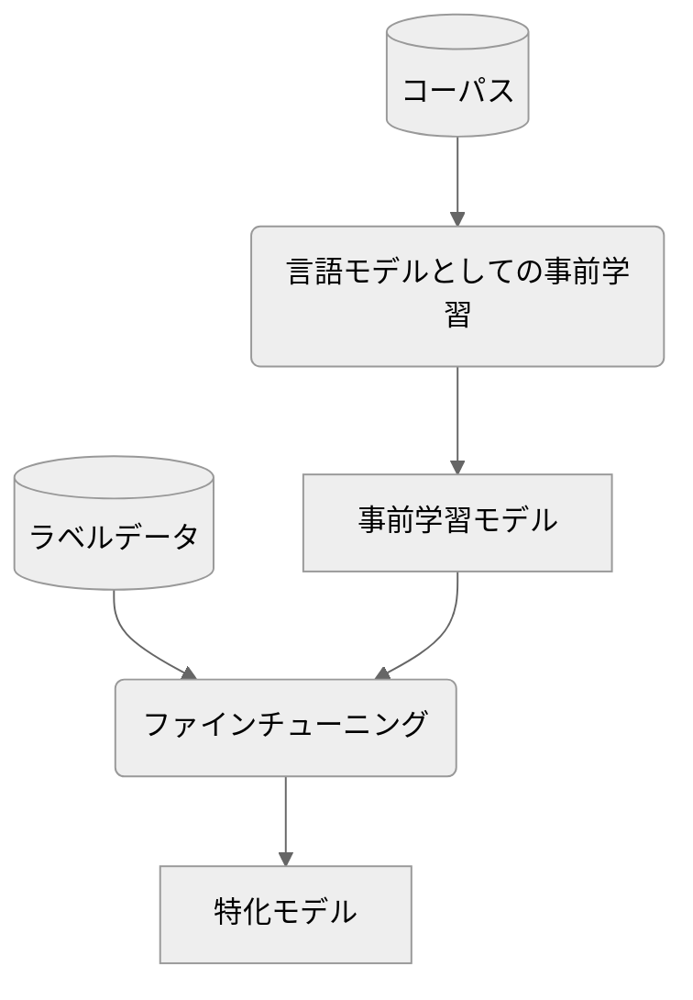
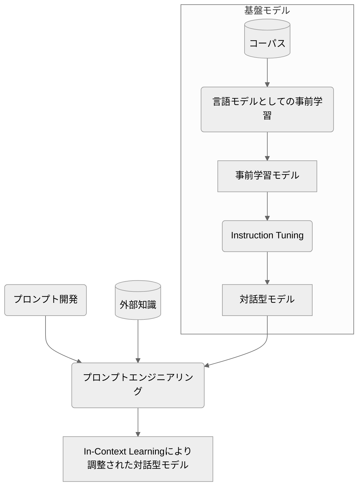

# LLMの発展によるAI/ML開発の変化

## 従来のLLMによるシステム開発

従来のLLM(Large Language Model, 大規模言語モデル)では、大量のコーパスにより事前学習モデル(これが言語モデル)を作成し、特定のタスクに特化した少量のラベルデータによりファインチューニングを行うことを想定していました。



事前学習モデルを作るためには大量のコーパスと膨大な計算リソースが必要ですが、ファインチューニングは少量のデータで学習ができるため、少ない計算リソースにより学習ができます。このため、大手のベンダーや研究機関が作成した事前学習モデルを利用し、各企業で個別タスクに特化したモデルをファインチューニングして利用することが一般的でした。

事前学習モデルをファインチューニングせずに、事前学習モデルから出力された意味ベクトルのみを利用、個別の機械学習モデルとして学習する場合もありますが、何れにしても解決したいタスク別にラベルデータと学習を行い、個別の特化モデルを作るというのが基本でした。

<aside>
💡 事前学習モデルの学習で必要とされるコーパスとは、言語モデルの構築に必要とされる大量の文章のことです。具体的には本やWikipediaなどが該当します。特にWikipediaは誰でも簡単に利用ができるため、ほとんどの事前学習モデルの学習で利用されています。
</aside>

## GPTモデルで確認されたゼロショット学習能力

実際の利用ではファインチューニングで特化モデルを作成するにしても、事前学習モデルの性能が高いほど精度が高くなるため、事前学習モデルの性能向上が試みられていました。事前学習モデルの性能はモデルのパラメータ数、学習するコーパスの量、利用可能な計算リソースによって決定するため、大手のベンダーが大規模な事前学習モデルの作成に取り組んでいましたが、2019年にOpenAI社がGPT-2に関する論文を公表した際に、`ゼロショット学習(Zero-shot learning)`という言葉が広く知られるようになりました(ゼロショット学習自体は2009年あたりに発表された論文が初出のようです)。

2020年にGPT-3に関する論文を発表した際には、`フューショット学習(Few-shot Learning)`という概念も提示されており、いずれもファインチューニングを行わずに事前学習モデルをそのまま利用する場合であっても、特定のタスクを解決する能力があるということが示されました。

このようにファインチューニングをせずに特定のタスクに特化した動作をする能力を`コンテキスト内学習(In-Context Learning)`と呼ぶこともあります。

### モデルの肥大化と利用方法の変化

In-Context Learningは、大規模(パラメータ数が多く、学習したコーパスが多い)な言語モデルにのみ見られる能力です。このため、現在の言語モデルでは以前とは比較にならないほど巨大なものとなっており、以前のようなファインチューニングがそもそも難しいという状況が発生しています。


https://speakerdeck.com/1never/ibis2023tiyutoriaru-da-gui-mo-yan-yu-moderuhuo-yong-ji-shu-nozui-qian-xian

<aside>
💡 言語モデルの肥大化は学習時だけでは無く、推論時にも膨大な計算リソースを要求します。このことから、より小さいLLMの開発というテーマも注目を集めています。

</aside>

現在のLLMでは、In-Context Learningを活用することで(ファインチューニングせずに)、特定のタスクに特化した動作をさせるということが前提となっています。



### GPTモデルの動作

現在のLLMの多くはTransformerというアーキテクチャを利用したものとなっており、Transformerの利用の仕方でEncoderモデル、Decorderモデル、あるいはEncoder/Decoderモデルというように分類されます。ここではTransformerや各モデルの詳細は触れませんが、GPTはDecoderモデルとなっており、以下のように事前に入力された文の次の言葉(厳密にはトークン)を推測するという(厳密には自然な文としてどのような言葉が続くのが適切かという確率分布を計算する)、動作としては単純なものとなっています。


https://speakerdeck.com/hirosatogamo/0421dsxie-hui-chatgptniyotutemiao-kareruwei-lai-toaikai-fa-nobian-qian

### プロンプトエンジニアリング

In-Context Learningを最大限発揮するためには、LLMに与える命令を工夫する必要があります。このLLMに与える命令を`プロンプト`といい、特定のタスクに特化した動作をさせるための工夫を`プロンプトエンジニアリング`と言います。プロンプトはLLMに与える命令であり、以下のような自然言語の文となっています。

```
Q：ロジャーはテニスボールを5個持っている。彼はさらに2つのテニスボール缶を買った。
それぞれの缶には3個のテニスボールが入っている。彼は今何個のテニスボールを持っていますか？
A: 11個
Q: 食堂には23個のリンゴがあった。昼食に20個使い、さらに6個買ったとすると、りんごは
何個あるか。
A:
```

上記のプロンプトの続きとして、GPTモデルは以下のように推測します(実際の出力は利用するモデルやパラメータによるため、実行毎に若干異なります)。

```
A: 食堂には最初に23個のリンゴがあり、昼食に20個使った後、残りは3個になります。その後、さらに6個を買ったので、合計で3個 + 6個 = 9個のリンゴがあります。
```

最初に与えたプロンプトでは、問題の解き方の例を(彼は今何個のテニスボールを持っていますか?の質問と回答例)含めており、次に本当に解かせたい問題を提示しています。これはFew-shot promptingの具体的な例です。

プロンプトエンジニアリングには以下のような種類があります。これらは一部の例であり、現在も研究が進められていることから、実用性の評価や新規の手法が急速に進化している状況です。

| テクニック名                     | 概要                                                                                                                                                                                            | 詳細リンク                                              |
| -------------------------------- | ----------------------------------------------------------------------------------------------------------------------------------------------------------------------------------------------- | ------------------------------------------------------- |
| Zero-shotプロンプティング        | 大量のデータでトレーニングされたLLMは、例を提供しなくてもタスクを実行できる。                                                                                                                   | https://www.promptingguide.ai/jp/techniques/zeroshot    |
| Few-shotプロンプティング         | プロンプト内のデモを提供して、モデルをより高い性能に導く文脈学習を可能にする。                                                                                                                  | https://www.promptingguide.ai/jp/techniques/fewshot     |
| Chain-of-Thoughtプロンプティング | 中間的な推論ステップを介して複雑な推論能力を可能にする。                                                                                                                                        | https://www.promptingguide.ai/jp/techniques/cot         |
| 自己整合性（Self-Consistency）   | Few-shot CoTを通じて複数の多様な推論パスをサンプリングし、生成物を使用して最も整合的な回答を選択する。                                                                                          | https://www.promptingguide.ai/jp/techniques/consistency |
| 知識生成プロンプティング         | モデルが予測を行う前に知識を生成し、これを用いてタスクを実行する。                                                                                                                              | https://www.promptingguide.ai/jp/techniques/knowledge   |
| Tree of Thoughts (ToT)           | 言語モデルを用いた問題解決のための中間ステップとして機能する思考の探求を促進するフレームワーク。                                                                                                | https://www.promptingguide.ai/jp/techniques/tot         |
| 検索により強化された生成 (RAG)   | タスクを完遂するために外部の知識ソースにアクセスする言語モデルベースのシステム。                                                                                                                | https://www.promptingguide.ai/jp/techniques/rag         |
| 自動プロンプトエンジニア（APE）  | 自動指示生成と選択のためのフレームワーク。指示生成問題を自然言語合成としてアドレスし、推論モデルを用いて指示候補を生成。                                                                        | https://www.promptingguide.ai/jp/techniques/ape         |
| ReAct                            | LLMが交互に推論トレースとタスク固有のアクションを生成するフレームワーク。推論トレースの生成により、モデルはアクション計画を誘導、追跡、更新し、外部ソースとのインターフェースや情報収集が可能。 | https://www.promptingguide.ai/jp/techniques/react       |

## AI/MLを利用したシステム開発における新しい流れ

LLMの発展により、自然言語処理だけではなくAI/MLを利用したシステム開発は大きく変化しました。ここでは変化した内容や課題について、主立ったものを説明します。

### プロンプトエンジニアリングの難しさ

プロンプトエンジニアリングは歴史が浅い分野ということもあり、本当の意味で再現性のあるエンジニアリング技術として確立されていません。実用性の評価が定まっていないものも多く、実現したいタスクや具体的なデータを利用して個別のプロジェクトで検証することが必須となっています。

これは、論文に書いてあることをそのまま利用することはできず、他のプロジェクトでの成功例も今のプロジェクトでは適用できない可能性が高いということです。また、プロンプトエンジニアリングは仕組み上利用するLLMに依存しています。プロンプトが同じでもLLMが代われば結果が全く違ったことになるため、利用するLLM毎に検証が必要です。

また、同じLLMといってもモデルのバージョンが変化することがあります。特にOpenAI APIなどサードパーティが提供するSaaS経由でLLMを利用する場合、厳密なモデルの変化を確認できないことがあります。運用中に突然動作が変化する可能性を考慮したシステム設計・運用が必要です。

### LLMに道具を与えるという実装

プロンプトエンジニアリングの一種として、LLMに特定のタスクを実現するための道具を与え、その利用の判断をLLM自体に行わせるという実装方式があります。このような仕組みを`エージェント`といい、特に対話型のアプリケーションで利用されます。

以下はエージェントの実行例です。検索エンジン(Google Search)と計算機(Calculator)を道具として与え、ユーザからの質問に回答するまでの動作となっています。

```
最新のドル円為替レートを2で割った計算結果を教えてください。
```

```
> Entering new AgentExecutor chain...
 現在の為替レートを確認する必要がある
Action: Google Search
Action Input: 最新のドル円為替レート
Observation: 【NQNニューヨーク=川上純平】22日のニューヨーク外国為替市場で円相場は3営業日ぶりに反発し、前日比10銭円高・ドル安の1ドル=134円85～95銭で取引を終えた。 通貨（通貨単位）, 為替レート（円）. 外貨→円貨（TTB）, 円貨→外貨（TTS）. 米ドル（1 USD）, 134.32, 135.32. ユーロ（1 EUR）, 142.61, 144.01. お取り引きの際は、必ずログイン後のお取り引き画面にて最新の為替レートをご確認 ... 【円からはじめる限定金利提供中！】＜米ドル・豪ドル・NZドル・南アランド＞. また、ロシアルーブル/円のみ現在新規注文受付停止になっているのでご留意ください。 ※GMOクリック証券のトルコリラ円、ユーロポンド、カナダドル円、スイスフラン円の ... また、最近では「有事のドル買い」といった格言も定着しつつあり、地政学リスクが高まった場合の緊急避難先として選考されるケースも見られます。 主な経済指標: FOMC（ ... PGF生命が死亡保険金・解約返戻金・年金等を円でお支払いする際に適用される為替レートです。 【書類の受理日、年金受取日、年金開始日】. 2023年 2月 ... 3 days ago ... USドル/円の為替レートの推移をグラフ及び時系列表にて掲載しています。 1USドル → 130.3444円 (参考: 1円 → 0.0077USドル) ※2023年1月の平均レート ... Feb 15, 2023 ... 通貨名, TTS （日本円→外貨）, TTB （外貨→日本円）. 001, USD（米ドル）, 133.20, 132.70. 020, EUR（ユーロ）, 142.82, 142.32. お客さまが外貨建の保険料などを円でお払込みいただく場合の為替レートです。メットライフ生命指定口座へ着金した日の為替レートが適用されます。 1USドル, 1ユーロ ... 米ドル・豪ドル・ユーロなど全9通貨の外国為替相場チャート表です。最新の為替レートや過去からの推移をご確認いただけます。実際の取引時に適用される為替レートは、 ...
Thought: 現在の為替レートを確認できた
Action: Calculator
Action Input: 134.85/2

> Entering new LLMMathChain chain...
134.85/2Answer: 67.425
> Finished chain.

Observation: Answer: 67.425
Thought: 答えが出た
Final Answer: 最新のドル円為替レートを2で割った計算結果は67.425です。

> Finished chain.
'最新のドル円為替レートを2で割った計算結果は67.425です。'
```

LLMは最初に`現在の為替レートを確認する必要がある` と考えてGoogle Searchを利用してWebからの検索結果を得ています。次にCalculatorを利用して計算を行い、その結果がユーザからの質問への回答として適切であることを確認しています(Final Answerの判定)。このような思考プロセスを経てユーザからの質問に回答していることがわかります。

<aside>
💡 `エージェント`という用語は特定のフレームワーク(LangChain)で採用された定義に基づいていますが、一般的な定義として認識されていない可能性があることはご注意ください。なお、`自律型エージェント`という用語もあり、こちらは与えられたゴールに対して、LLMが自分で必要なタスクの定義し、行動計画を立て、それを実行して成果物を生成するという仕組みを指しています。

</aside>

### 従来型の特化モデルとの住み分け

GPT-3.5/4などのIn-Context Learningを前提としたLLMの登場により、従来型の特化モデルが不要になった訳ではありません。従来型の特化モデルは、特定のタスクを解決するための性能が安定しており、比較的軽い計算リソースで稼働するため費用対効果に優れるという特性があります。

前述のエージェントとして振る舞うためにLLMに与える道具として特化モデルを利用するなど、併用することで、より高度で安定性の高いシステムを構築することができます。

### RAGによる外部知識の利用

現在のLLMは大規模であり、従来のようにタスク毎にファインチューニングしたモデルを作成することが多くの場合で現実的な選択肢ではありません。しかしながら、事前学習モデル(基盤モデルともいう)作成時に全ての知識を学習することも不可能です。

このため、LLMが学習していない可能性のある外部知識(新規知識)を利用するためにもIn-Context Learningの能力を活用します。外部知識の利用には`RAG(Retrieval Augmented Generation)`と呼ばれる手法が広く用いられます。


RAGではベクトルストアという仕組みを利用することがあります。ベクトルストアの構築と運用はシステムエンジアリングの範疇です。

### 現在のLLMにおけるファインチューニングの意義

OpenAI社が提供するGPT-3.5/GPT-4ではファインチューニングの仕組みが提供されています。プロンプトエンジニアリングやRAGだけでは対処できないタスクに対する解決策です。ただし、これは従来のLLMで想定していた(フルパラメータの)ファインチューニングとは異なる仕組みだと考えられます。

OpenAI社が提供するファインチューニングの詳細は公表されていませんが、想定されるモデルの規模やファインチューニング実行時の(非常に安い)利用料から、`PEFT(Pre-training with Effective Fine-Tuning)` ではないかと推測されます。

PEFTではパラメータの一部のみ調整することで効率的な学習が可能ですが、事前学習時のパラメータは固定されます(量子化を伴う場合がありますが、ファインチューニング時に事前学習モデル部分のパラメータを更新することはありません)。LLMにおける知識の大部分は事前学習時に獲得していると考えられていることから、新規知識の獲得には適しておらず、出力スタイルの調整など限定的な用途に制限される可能性があります。


https://arxiv.org/abs/2309.14717

<aside>
💡 OpenAI社ではGPT-4の[カスタムモデルを作成するサービス](https://openai.com/form/custom-models)を提供しています。これはフルパラメータの調整を行うことが可能だと思われますが、コストが$2-3 millionからとなっており、非常に高額です。

</aside>

### ランダム性を考慮した評価方法の検討

LLMの出力には以下の理由によるランダム性があります。このランダム性は完全に無くすことができません。

- 推論時にモデルに与えるパラメータによる意図的なランダム性
- 計算誤差によるランダム性

`推論時にモデルに与えるパラメータによる意図的なランダム性` は文字通り意図的なものであり、推論時に与えるパラメータで抑制することが可能です(GPT-3.5/4であればTemperatureなどが該当します)。

一方、`計算誤差によるランダム性`は原理的に抑制することができません。このため、同じプロンプト、同じデータによる入力であっても結果の一致は保証されないということになります(単純な出力であれば一致することもありますが、複数回実行すると必ず異なる出力が発生します)。

LLMの出力結果が決定論的ではないことから、システム開発におけるテストでは、従来のように想定実行結果との比較という単純な手法をとることができません。未知の入力を扱うというAI/MLの特性から従来でも同様の課題がありましたが、LLMによるシステム開発ではさらに複雑性が増しています。

想定実行結果を複数候補用意しておき確率的な動作の妥当性を定義する、人による評価を行う、あるいはLLMによる評価する(LLMによる評価方法の確立自体がプロンプトエンジニアリングになります)などの手法を組み合わせて検討する必要があります。

### コスト計算をどのようにするのか

現在のLLMは非常に大規模であり、学習だけではなく推論時に必要となる計算リソースも大きくなっています。オープンソースや無料で利用可能な公開モデルを利用することで、学習に関するコストを削減し、推論で必要となるコストを一定にする選択肢もありますが、現在のところ公開モデルの性能はOpenAI社やAnthropic社などが提供するLLMに及びません。

また、推論のための計算リソースも高性能GPUを持ったサーバが必要になることから、OpenAI社などのサードパーティが提供するAPI経由でのLLM利用が、コストパフォーマンスに優れています。

ただし、サードパーティが提供するAPI経由でのLLM利用では、多くが入力および出力されたトークン数による従量課金となっています。ユーザの入力量が想定できる場合も、LLMの特性上、出力結果が決定できないからコスト計算にも統計的な試算が必要になります。特に複雑なプロンプトエンジニアリングを行う場合は中間入出力の量が想定できないため、テストデータによる検証とコスト計算モデルの確立が必要になります。

### LLMOpsの登場

従来のMLOpsは、機械学習モデルの開発から運用に至るまでのライフサイクルを管理し、モデルの継続的なトレーニング、評価、デプロイを自動化するプロセスを構築しました。MLOpsは、機械学習モデルを迅速に市場投入し、運用の効率化を図るための基盤を提供してきました。しかし、GPT-3.5やGPT-4などのLLMの出現により、これまでの運用手法を再考する必要が生じています。

LLMOpsは、LLMに特化した開発・運用(DevOps)プロセスです。この新しいアプローチは、従来のMLOpsの実践を大規模言語モデルに適用させたもので、LLMの独自の特性を最大限に活用します。LLMOpsでは、プロンプトエンジニアリングやRAGといった新規の技術を取り入れ、LLMを利用したシステムの品質と効率を維持する方法を提供します。

## 参考文献

- [大規模言語モデル活用技術の最前線](https://speakerdeck.com/1never/ibis2023tiyutoriaru-da-gui-mo-yan-yu-moderuhuo-yong-ji-shu-nozui-qian-xian)
- [LanguageModelsareUnsupervisedMultitaskLearners](https://cdn.openai.com/better-language-models/language_models_are_unsupervised_multitask_learners.pdf)
- [Language Models are Few-Shot Learners](https://arxiv.org/abs/2005.14165)
- [Zero-shot Learning（ゼロショット学習）とは？](https://atmarkit.itmedia.co.jp/ait/articles/2307/27/news033.html)
- [Qiita - LLMのプロンプト技術まとめ](https://qiita.com/fuyu_quant/items/157086987bd1b4e52e80)
- [Prompt Engineering Guide](https://www.promptingguide.ai/jp)
- [LLMOps：基盤モデルに基づくアプリケーション開発のワークフロー](https://note.com/wandb_jp/n/n1aa6d77f33cf)
- [ChatGPTによって描かれる未来とAI開発の変遷](https://speakerdeck.com/hirosatogamo/0421dsxie-hui-chatgptniyotutemiao-kareruwei-lai-toaikai-fa-nobian-qian)
- [ChatGPTの出力結果が毎回異なる理由](https://note.com/it_navi/n/n7fd040d8fc50)
- [QA-LoRA: Quantization-Aware Low-Rank Adaptation of Large Language Models](https://arxiv.org/abs/2309.14717)