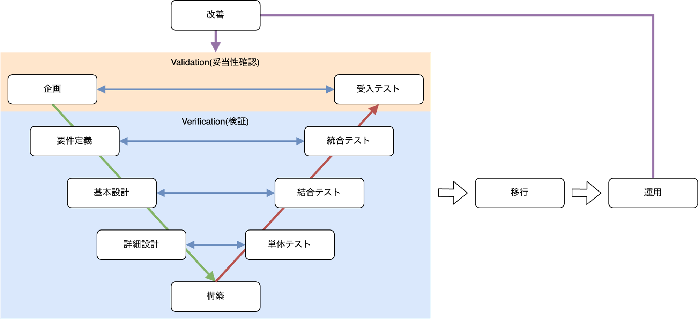

# 従来型システム開発のプロジェクトマネジメント基礎

本書では、スコープが固定され、予算や納期の達成が重視される従来型のシステム開発に焦点を当て、プロジェクトのプロセス概要とプロジェクトマネージャーの基本的な役割について解説します。新規事業開発や変化の激しい環境で要求されるリーンスタートアップ型のシステム開発については、別資料を参照してください。

## プロジェクトマネジメントの基本概念

### プロジェクトマネジメントとは

プロジェクトマネジメントとは、目標達成のためにプロジェクトを計画、実行、管理する活動です。プロジェクトマネージャは、QCD(品質: Quality、コスト: Cost、納期: Delivery)の観点からリソース割当の優先度を調整し、プロジェクトの目的と成果物の達成に向けてリソースを効果的に配分する役割を果たすことが期待されます。

### 固定スコープのプロジェクトの特徴

固定スコーププロジェクトは、プロジェクト開始時に確定した範囲(スコープ)を変更せずに完了することを想定したプロジェクトです。この形態は以下のような特徴と状況で用いられます。

- **スコープの確定:** プロジェクトの範囲や要件が明確に定義され、変更しないことが前提となっています。
- **適用される状況:** 社内にシステム開発の体制がなく、年間予算が先に決定されている場合などに適用されます。
- **具体例:** 既存システムの改善やリプレースなど、要求事項がはっきりしているプロジェクトに適しています。
- **メリット:** スコープが固定されているため、予算やスケジュールの管理がしやすくなります。また、最初に設定された目標に対する達成度が明確に評価できます。
- **デメリット:** スコープが変更できないため、新たな要求や変更への対応ができません。市場などの環境の変化に対応できず、実績の無い新規技術の採用が難しいことから費用対効果は限定的です。
- **管理方法:** プロジェクトの計画段階で詳細な仕様やスケジュールを策定します。また、スコープ変更ができないため、リスク管理を強化し、問題発生時の対応策の事前準備が重要です。

固定スコーププロジェクトでは、初期段階での詳細な計画とリスク評価が成功の鍵となります。スコープ変更を最小限に抑えるために、要件定義の段階で関係者全員の合意を得ることが重要です。

### プロジェクトと通常業務の違い

プロジェクトとは、特定の目標を達成するための一時的な活動であり、通常業務とはその性質や目的が異なります。

通常業務は、組織の継続的な運営を目的とした日常的な活動です。これらの業務は業務マニュアルや標準化された手順に基づいて遂行され、効率的で一貫した作業が求められます(Operational Excellence)。通常業務はルーチン作業が中心であり、例外的な対応が少なく、安定した業務フローを維持することが期待されます。

一方、プロジェクトは独自の目標を達成するための一時的な取り組みであり、その性質上、各プロジェクトが個別の要件や条件に応じて設計されます。プロジェクトの目的やスコープは明確に定義されているものの、その達成手段や実行手順はプロジェクトごとに異なり、事前に確立されたマニュアルに基づくことは少なく、プロジェクトの進行中に必要な手順や対策を都度検討しながら進める必要があります。このように、プロジェクトは新しい挑戦や変化を伴うことが多く、柔軟な対応が求められます。

## **従来型システム開発のフェーズ**

### 主なフェーズ

従来型のシステム開発におけるフェーズは以下の様になっています。各フェーズの呼称は各社で呼び方が異なる場合がある点に注意してください。

| フェーズ | 目的 | 活動内容 |
| --- | --- | --- |
| 企画 | プロジェクトの目標を定義し、全体像を明確にする | 要求事項の収集、プロジェクトの目標設定、初期計画の策定 |
| 要件定義 | ユーザーのニーズを具体的なシステム要件に変換 | 要件の詳細な分析と文書化、システムの機能要件および非機能要件の確立 |
| 基本設計 | システムの全体構造を設計 | システムアーキテクチャの設計、データベース設計、インターフェース設計 |
| 詳細設計 | 基本設計を基に、システムの詳細部分を設計 | モジュール設計、詳細なデータフロー設計、プログラム仕様書の作成 |
| 構築 | 設計に基づき、システムを実際に構築 | プログラミング、ユニットテストの実施、コードの統合 |
| 単体テスト | 各モジュールが設計通りに機能するかを検証 | 個々のプログラムやモジュールのテスト、バグ修正 |
| 結合テスト | 複数のモジュールが正しく連携するかを検証 | モジュール間のインターフェーステスト、統合テストケースの実行 |
| 統合テスト | システム全体が要件通りに機能するかを検証 | システム全体のテスト、ユーザーストーリーに基づくテスト |
| 受入テスト | ユーザーがシステムを受け入れられるかを確認 | ユーザーによるテスト、システムの最終確認 |
| 移行 | 新システムへの切り替えを行う | データ移行、システムの導入、ユーザーへのトレーニング、リリース、カットオーバー |
| 運用 | システムの継続的な運用と保守を行う | システムの監視、定期メンテナンス、改善提案 |
| 改善 | 運用中に見つかった問題点や改善点をフィードバックし、システムの改善を行う | 改善提案の実施、フィードバックの収集 |

### **Validation(受当性確認)とVerification(検証)**

`Validation(受当性確認)`は、システムがユーザーの要求を満たしているかを確認するプロセスです。受入テストなどで行います。
`Verification(検証)`は、システムが設計通りに機能しているかを確認するプロセスです。各フェーズに対応するテストとして行います。

### 見積もりの不確実性

見積もりの不確実性とは、プロジェクトの進行に伴い、プロジェクトのスケジュールやコストに対する見積もりがどの程度確実であるかを示す概念です。特にシステム開発の初期段階では、不確実性が高くなる傾向があります。

以下は `不確実性のコーン` と呼ばれる図です。縦軸はプロダクトスケジュールの見積もり倍率を示し、横軸はプロジェクトの進行段階を示しています。図の灰色の領域が不確実性の範囲を示しており、プロジェクトが進むにつれてその範囲が収束していく様子を表しています。



初期コンセプトの段階(企画段階)では、0.25倍から4倍までの振れ幅があります。これは初期コンセプトでの見積もりは、最大16倍の差が生じることを表しています(1,000万円の見積もりが、実績として16,000万円になる可能性があるということです)。

### 見積もり精度を向上するための方法

まず、見積もりは点推定では無く区間推定とする必要があります。独自の手法では無く、`三点見積り(最頻値・楽観値・悲観値を設定し、値を掛け合わせて工数を算出する手法)` のような確立された見積もり手法を採用してください。

また、前述の不確実性のコーンで注目すべきは、各フェーズの見積もりの幅で、現在の見積もりがどの倍率であるかわからないという点です。なるべく`1.0x` に近くなるように、統計的な手法を用いる必要があります。

プロジェクトの進行状況に応じて、都度再見積もりすることも重要です。

より具体的な手法に興味のある方は「[ソフトウェア見積り　人月の暗黙知を解き明かす](https://www.amazon.co.jp/%E3%82%BD%E3%83%95%E3%83%88%E3%82%A6%E3%82%A7%E3%82%A2%E8%A6%8B%E7%A9%8D%E3%82%8A-%E4%BA%BA%E6%9C%88%E3%81%AE%E6%9A%97%E9%BB%99%E7%9F%A5%E3%82%92%E8%A7%A3%E3%81%8D%E6%98%8E%E3%81%8B%E3%81%99-%E3%82%B9%E3%83%86%E3%82%A3%E3%83%BC%E3%83%96-%E3%83%9E%E3%82%B3%E3%83%8D%E3%83%AB-ebook/dp/B00KR96M6K)」の参照をお薦めします。

## **プロジェクトマネージャーの役割**

### プロジェクトマネージャーの責任

プロジェクトマネージャーは、リーダーシップを発揮してプロジェクトの成功を導き、ステークホルダーとの良好な関係を維持しながら価値を最大化することが求められます。さらに、全体の視野でプロジェクトを把握し、リスクと品質の管理を徹底します。また、プロジェクトの性質に応じてアプローチを柔軟に調整し、最適な結果を目指します。このようにして、プロジェクトが組織に最大の価値を提供できるようにします。

### 予算・期間の管理方法

システム開発プロジェクトにおいて、予算と期間の管理は極めて重要な要素です。プロジェクトマネージャーは、限られたリソースの中で品質、費用、納期をバランスよく管理することが求められます。特に、品質(Q: Quality)、費用(C: Cost)、納期(D: Delivery)のうち、優先できるのは常に2つのみという制約があります(選択した2つの中でも優先度をつける必要があります)。これをQCDトライアングルと呼びます。



- **品質 (Q: Quality)**: 顧客が求める品質の製品を提供することは重要です。ただし、高い品質を追求する場合、費用が増加するか、納期が延びる可能性があります。
- **費用 (C: Cost)**: 決められた予算内でプロジェクトを完了する必要があります。ただし、コストを抑えるためには、品質の調整や納期の延長が必要になることがあります。
- **納期 (D: Delivery)**: 必要なタイミングで製品を提供することが求められます。ただし、納期を厳守するためには、費用の増加や品質の調整が必要になることがあります。

### プロジェクトマネージャのスキルセット

以下はプロジェクトマネージャに求められるスキルセットについて、PMBOK第7版のパフォーマンス領域の定義と、参考文献である「[プロジェクトマネジメントの基本が全部わかる本 交渉・タスクマネジメント・計画立案から見積り・契約・要件定義・設計・テスト・保守改善まで](https://www.amazon.co.jp/gp/product/B0BF3TMDSS)」に記載のスキルセットをまとめた表です。

| プロジェクト・パフォーマンス領域 | スキルセット名 | スキルセット解説 |
| --- | --- | --- |
| ステークホルダー | 提案／合意形成 | 各フェーズで必要な提案を行い、フィードバックを取りまとめて合意形成を行う |
|  | ステークホルダーの利害調整 | 関係者の利害調整を行う |
| チーム | 座組の整理 | 関係者の役割分担や意思決定のプロセスを整理する |
|  | プロジェクト全体像の共有 | メンバーに要件定義で合意したプロジェクトの全体像を伝える |
| 開発アプローチとライフサイクル | 開発アプローチの選定 | プロジェクトに最適な開発アプローチとライフサイクルを選定する |
|  | ライフサイクル管理 | プロジェクトのライフサイクルに合わせて計画と実行を調整する |
| 計画 | マイルストーンの設定 | スケジュールにおいてマイルストーンとなるポイントを設定する |
|  | 実行計画の作成 | 見積もった工数をスケジュールに落とす |
| プロジェクトワーク | タスクの洗い出し | プロジェクトを遂行するために必要なタスクを洗い出す |
|  | タスクアサイン | メンバーにタスクをアサインする |
|  | 進捗管理 | 各メンバーのタスクの進捗状況をリアルタイムで把握する |
| デリバリー | 要件定義 | ビジネス要件を合意できるかを確認する |
|  | 追加要件のハンドリング | 当初想定されていなかった追加要件のハンドリングを行う |
| 測定 | プロジェクトリスクの整理 | プロジェクトを実施するにあたって想定されるリスクを洗い出して関係者に共有する |
|  | QCDの調整 | 発生したリスクや対応コストを説明し、品質／予算／納期の調整を行う |
| 不確実性 | リスク管理 | プロジェクトリスクを整理し、関係者と共有する |
|  | テスト計画の作成・レビュー | テストをどのように進めるか、何を重点的に確認するかの計画を作成、またはレビューを行う |

- **ステークホルダー**: ステークホルダーとの合意形成や利害調整を行い、プロジェクトの進行を円滑にします。
- **チーム**: チームの役割分担やプロジェクトの全体像を共有し、チームの効率的な運営を図ります。
- **開発アプローチとライフサイクル**: プロジェクトに最適な開発アプローチを選定し、ライフサイクルを管理します。
- **計画**: マイルストーンの設定や実行計画の作成を通じて、プロジェクトの計画を策定します。
- **プロジェクトワーク**: タスクの洗い出し、タスクアサイン、進捗管理を行い、プロジェクトの実行をサポートします。
- **デリバリー**: 要件定義や追加要件のハンドリングを通じて、プロジェクトの成果物を確実にデリバリーします。
- **測定**: プロジェクトリスクの整理やQCDの調整を行い、プロジェクトの成果を測定します。
- **不確実性**: リスク管理やテスト計画の作成・レビューを通じて、プロジェクトの不確実性を管理します。

## まとめ

- 固定スコーププロジェクトは、プロジェクトの範囲や要件が明確に定義され、変更しないことが前提となっています。
- プロジェクトは特定の目標を達成するための一時的な活動であり、通常業務とはその性質や目的が異なります。
- 従来型のシステム開発におけるフェーズには、企画、要件定義、基本設計、詳細設計、構築、単体テスト、結合テスト、統合テスト、受入テスト、移行、運用、改善などがあります。
- 見積もりの不確実性とは、プロジェクトの進行に伴い、プロジェクトのスケジュールやコストに対する見積もりがどの程度確実であるかを示す概念です。
- プロジェクトマネージャーは、リーダーシップを発揮してプロジェクトの成功を導き、ステークホルダーとの良好な関係を維持しながら価値を最大化することが求められます。

## 用語解説

| 用語 | 解説 |
| --- | --- |
| リーンスタートアップ | 不確実性の高い環境下で、短いサイクルで検証と改善を繰り返しながら製品開発を行う手法 |
| QCD | 品質(Quality)、コスト(Cost)、納期(Delivery)の頭文字で、プロジェクト管理における重要な要素 |
| ユニットテスト | 個々のプログラムやモジュールが意図した通りに機能するかを検証するテスト |
| ユーザーストーリー | ユーザーの視点で機能要件を簡潔に記述したもの |
| Validation(受当性確認) | システムがユーザーの要求を満たしているかを確認するプロセス |
| Verification(検証) | システムが設計通りに機能しているかを確認するプロセス |
| 不確実性のコーン | プロジェクトの進行に伴い、見積もりの不確実性がどのように変化するかを示す図 |
| QCDトライアングル | 品質、コスト、納期のバランスを取る必要性を示す概念 |
| PMBOK | Project Management Body of Knowledge の略で、プロジェクトマネジメントに関する知識体系 |
| マイルストーン | プロジェクトの重要な節目となる時点や成果物 |
| タスクアサイン | プロジェクトのタスクをチームメンバーに割り当てること |

## 参考文献

- [プロジェクトマネジメントの基本が全部わかる本 交渉・タスクマネジメント・計画立案から見積り・契約・要件定義・設計・テスト・保守改善まで](https://www.amazon.co.jp/gp/product/B0BF3TMDSS)
- [図解入門 よくわかる 最新 PMBOK第7版の活用](https://www.amazon.co.jp/%E5%9B%B3%E8%A7%A3%E5%85%A5%E9%96%80-%E3%82%88%E3%81%8F%E3%82%8F%E3%81%8B%E3%82%8B-%E6%9C%80%E6%96%B0-PMBOK%E7%AC%AC7%E7%89%88%E3%81%AE%E6%B4%BB%E7%94%A8-%E9%88%B4%E6%9C%A8%E5%AE%89%E8%80%8C-ebook/dp/B0CHY1216P/)
- [ソフトウェア見積り　人月の暗黙知を解き明かす](https://www.amazon.co.jp/%E3%82%BD%E3%83%95%E3%83%88%E3%82%A6%E3%82%A7%E3%82%A2%E8%A6%8B%E7%A9%8D%E3%82%8A-%E4%BA%BA%E6%9C%88%E3%81%AE%E6%9A%97%E9%BB%99%E7%9F%A5%E3%82%92%E8%A7%A3%E3%81%8D%E6%98%8E%E3%81%8B%E3%81%99-%E3%82%B9%E3%83%86%E3%82%A3%E3%83%BC%E3%83%96-%E3%83%9E%E3%82%B3%E3%83%8D%E3%83%AB-ebook/dp/B00KR96M6K)
