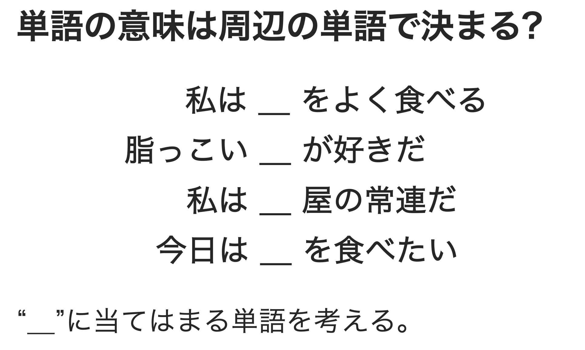
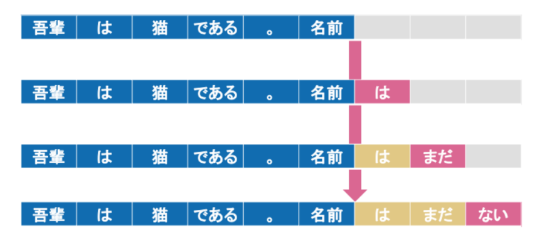

# LLMの最新トレンド - 2025年3月

## そもそもLLMとは?

LLMは `Large Language Model` の略であり、日本語では大規模言語モデルと表記します。要は言語モデルの大きいものという意味ですが、そもそも言語モデルとは何でしょうか。LLMのトレンドをご紹介する前に、LLMそのものの理解を深めた方がわかりやすいため、簡単にLLMの中身について説明します。

### 言語モデルの概要

AI/MLによる自然言語処理では言語モデルを利用します。言語モデルは文章の自然さを確率によって表現する数理モデルです。例として以下のような穴埋めを考えてみます。

`食べる`や`屋`、`脂っこい`などの単語が周辺にあることから、空白部分には食べ物にあたる単語が来る確率が高いことがわかると思います。このように空白部分の単語の出現確率は、周辺の単語から決定されると考えることができます。

これを数式で表すと以下のようになります。 `w_i` が前述の穴埋め対象となる単語です。 `w_i` の出現確率は周辺に現れた `w_i` 以外の単語に依存すること(条件付き確率)を表しています。

$$
p(w_i|w_1,w_2,w_{i-1},w_{i+1},w_{i+2},\cdots,w_n)
$$

`w_i` 以外の単語を全体として

$$
c_i = (w_1,w_2,w_{i-1},w_{i+1},w_{i+2},\cdots,w_n)
$$

と表し、`文脈(Context)`と言います。文を構成する各単語は、文脈により出現確率が決定することから、文全体の確率( `p(S)` )は以下の様に表すことができます。この確率が高いものほど`自然な文`であるという事です。

$$
p(S) = \prod_{i=1}^np(w_i|c_i)
$$

言語モデルは上記のような考え方により、自然言語を数理モデルとして表現しています。

### 言語モデルを応用した生成モデル

前述のように、言語モデルは単語列の出現確率を学習・予測する仕組みです。この言語モデルの考え方を応用して、新しい文章を自動的に生成するものが`(自然言語処理における)生成モデル`です。従来の言語モデルが`与えられた単語列や文の自然さ(確率)を評価する`ことを目的としていたのに対し、生成モデルは`次に来る単語を予測して連続的に出力する`ことで、文章全体を自動生成することを目指しています。

https://www.skillupai.com/blog/tech/about-llm/

1. 初期文脈となる文章の一部やテーマ、キーワードなどの入力となる文脈を与えます。この初期文脈は一般にプロンプトと呼ばれ、モデルはプロンプトに続く単語(トークン)を予測し、出力します。
2. 逐次的なトークンの生成モデルは出力した単語を新たな文脈として活用し、`これまで生成した単語列＋元の入力文脈`を考慮しながら、次に最も自然な単語を一つずつ予測・生成していきます。
3. テキスト全体の完成までこの過程を繰り返すことで、一つの自然な文章が生成されます。文章の長さや完了のタイミングは、EOS(End of Sentence)トークンや確率的な打ち切りなどのモデルの設定により制御されます。

<aside>
💡 上記では単語とトークンを同じものとして説明していますが、実際にはトークンは単語とは一致しません。トークンは単語の一部分(サブワード)、文字、記号などのより小さな言語単位として分割されることがあり、時には文字コードを表すByte単位での分割も行われます。たとえば、`internationalization`という単語は`inter` `national` `ization`のように複数のトークンに分割される可能性があります(逆に複数の単語をまとめて1トークンとすることもあります)。

</aside>

## LLMの進化

これまで、LLMが`言語モデル`として文章をどのように理解・生成するのかを概観してきました。ここからは、登場以来急速に高度化してきたLLMの進化過程と、その背景について解説します。

### ファインチューニング前提の特化型モデル

#### 登場時期と背景

- **2018年頃から:** BERT(Google)やGPT(OpenAI)シリーズを先駆けとする大規模言語モデルが注目を集め、一般的な自然言語処理能力を備えたLLMの開発が加速しました。
- **2019年～2020年:** 企業や研究機関が汎用LLMを特定の業務用データで再訓練(ファインチューニング)することで、医療・法務・金融などの分野に特化したモデルを次々とリリースし、実務での活用が本格化し始めました。

#### 仕組みと特徴

`ファインチューニング`とは、汎用LLMを基盤として特定分野のデータで追加訓練を行う手法です。これにより、医療分野向けLLMは医学用語や最新論文への対応が可能に、法務分野向けLLMは法律文書や判例に関する精確な回答が可能になります。このように、高度な専門性が求められる業務においても、詳細な対応が実現できます。

### インコンテキスト学習によるゼロショットモデル

#### 登場時期と背景

- **2020年頃:** OpenAIのGPT-3の公開により、 `ゼロショット推論`という概念が広く認知されるようになりました。GPT-3は大規模なパラメータと膨大な学習データを活用し、タスクごとの追加学習(ファインチューニング)なしでも、単なるテキスト指示だけで多様なタスクを実行できることを実証しました。
- **2021年以降:** 複数の企業がインコンテキスト学習を実装したLLMをリリースし、事前学習の負担を大きく軽減できる"軽量導入"が実務界で注目されるようになりました。

#### 仕組みと特徴

`インコンテキスト学習`は、モデルの再訓練を必要とせず、与えられた文脈(コンテキスト)と指示(プロンプト)に基づいてタスクを遂行します。特に`ゼロショットモデル`は、未経験のタスクでも適切な指示があれば即座に対応できるのが特徴です。企業での活用例として、社内FAQをインプットするだけで問い合わせ対応が可能となり、システム導入の工数とコストを大幅に削減できます。

### RAG (Retrieval-Augmented Generation) の発展

#### 登場時期と背景

- **2021年～2022年頃:** 大規模言語モデルが、事前学習段階で得た知識だけではなく、外部データベースやドキュメントを動的に参照する必要性が高まり始めました。たとえば社内ナレッジベースやウェブ上の情報をリアルタイムに取り込み、より正確かつ最新の回答を行うソリューションが模索されるようになりました。
- **背景:** ファインチューニングやインコンテキスト学習だけではカバーしきれない大量の外部知識や機密性のある企業データを、モデル内部に組み込まずに参照・利用できる仕組みを求める声が増加しました。

#### 仕組みと特徴

**Retrieval-Augmented Generation (RAG)** は、LLMが推論を行う際に必要となる情報を **外部ソースから検索** (リトリーバル) し、その検索結果をコンテキストとして再度モデルに与えることで、より正確かつ網羅的な回答を生成する手法です。

1. **外部データベースと連携:** ベクトルデータベースや文書リポジトリから関連情報を検索し、LLMに提示することで、モデル自体を再学習せずに追加知識を付与できます。
2. **最新情報の取り込み:** 従来のLLMが学習後に更新される知識を十分に扱えない問題を緩和し、リアルタイムもしくは最近公開された情報に基づく回答が可能となります。
3. **セキュリティとスケーラビリティ:** 機密文書や大量のドキュメントをモデルの外側で管理するため、データの扱いを柔軟にコントロールでき、モデルサイズの際限ない拡大を抑えられます。

一方、検索結果にノイズが混入すると誤った文脈で推論が進む可能性があり、検索精度や情報の信頼性担保が大きな課題となっています。これに対応するために、事前のデータクリーニングや再ランキング(フィルタリング)などの仕組みが取り入れられています。

### マルチモーダル対応の進化

#### 登場時期と背景

- **2021年～2022年頃:** テキストだけでなく、画像や音声を同時に扱う大規模モデルが研究段階から商用化へと急速に発展。画像理解機能を搭載したLLMの実証実験が行われ、ロボティクスや製造業分野での応用が検討されました。
- **2023年以降:** クラウドサービスや各種プラットフォームで `マルチモーダルAI` が相次いで登場し、チャットボットやサポートAIにおける画像・音声対応が一般的になりつつあります。

#### 仕組みと特徴

`マルチモーダル対応`とは、従来テキストのみを扱っていたLLMが、画像・音声・動画などの多様な形式の情報を総合的に理解・生成できるようになった進化を指します。例えば、ユーザーが製品写真をアップロードすると、その不具合箇所や故障原因を分析して解決策を提案するサポートAIなどが実用化されています。このように複数の情報源を組み合わせて活用することで、カスタマーサポートや商品レコメンデーションなど、ビジネスの様々な場面で新しい価値を生み出しています。

<aside>
💡 従来のマルチモーダル音声モデルでは、音声をテキストに変換（音声認識）し、そのテキストを翻訳や要約のモデルに渡すという段階的なパイプライン処理が一般的でした。

一方、最近では音声から音声へ、または音声から他の情報へ `直接`推論を行う`End-to-End`のマルチタスクモデルが登場しています。これらのモデルはテキスト変換を介さずに学習・推論を行うため、処理速度の向上とノイズの低減が実現できます。さらに、音声特有の抑揚や感情、イントネーションといった要素を含めた高度な解析・生成が可能となり、言語理解だけでなく、コミュニケーション体験全体を大きく進化させる可能性を秘めています。

</aside>

### PAL (Program Aided Language) の台頭

#### 登場時期と背景

- **2023年頃～現在:** 思考型モデル(Reasoning Model)による複雑な推論や数理的タスクが注目される中で、LLMが生成したコードを実行・検証し、その結果を再度モデルにフィードバックするアプローチが広がり始めました。
- **背景:** LLM単体での計算や推論には限界があり、特に数式処理やプログラムの実行結果を要するタスクでは、外部環境(実行エンジン)との連携が不可欠となりました。AIエージェントの高度化とも密接に関連しています。

#### 仕組みと特徴

**Program Aided Language (PAL)** とは、LLMが生成したスクリプトやコードを、Pythonなどの外部環境で実行し、その結果(数値計算の解やテストの成功・失敗など)をモデルに返すことで、より正確かつ検証可能な応答を得る手法です。

1. **コード生成と実行のループ:** モデルが問題をテキストベースで解析し、必要に応じてコードを生成→実行→結果を再評価といった工程を繰り返すことで、段階的に精度を高めます。
2. **数理・統計タスクへの有効性:** 数式やグラフ生成、データ解析など、モデル内部のみで完結しにくいタスクに外部エンジンを組み合わせることで、誤答リスクを減らします。
3. **自己修正能力の向上:** 実行ログやエラーメッセージから得られるフィードバックを活用し、モデルが手順や仮説を修正することにより、最終的な回答の信頼性が向上します。

このアプローチは、ソフトウェア開発支援や数理問題の解決だけでなく、AIエージェントが複数のタスクを自己完結的に行うための基盤技術として注目されています。一方で、コード実行環境とのやり取りが増えるため、セキュリティ対策やリソース管理、実行性能の最適化など、運用上の課題も同時に検討される必要があります。

### コンテキスト長の拡張

#### 登場時期と背景

- **2023年～2024年頃:** GPT-4やClaudeなど、一度に処理できるトークン数(コンテキストウィンドウ)を従来の数千から数万〜十数万トークンへ大幅に拡張する動きが加速しました。
- **背景:** 企業・研究機関で扱う文書やコードのボリューム増大に伴い、より長大な文脈情報を一度に参照して推論・要約できるニーズが高まりました。また、Reasoning Model(思考型モデル)の高度な推論を支えるために、十分な文脈保持能力の重要性が再認識されています。

#### 仕組みと特徴

コンテキスト長の拡張により、より大規模な入力文書やプログラムコードを一括処理し、一貫性のある応答や要約を生成できるようになりました。具体的には以下の点が挙げられます。

- **大規模ドキュメントの処理:** 企業内の数百ページに及ぶレポートや契約書、学術研究の長文論文などを分割せずにモデルに与え、高精度の要約や分析を行うことが可能となります。
- **複雑なコードベースへの対応:** 多数のファイルや依存関係を含むソフトウェアプロジェクトを、単一の入力コンテキストとして取り込み、まとめてリファクタリングやバグ修正の指示を行いやすくなります。
- **高度な一貫性:** 物語生成や長期的な対話において、過去の文脈が切れにくくなり、一貫したキャラクター設定やプロット展開が期待できます。

一方で、コンテキストを拡大するほど推論時の計算負荷が増大するほか、大量の文脈中に含まれる不要情報や誤情報に影響されるリスクが高まるという課題も存在します。こうした問題を緩和するために、メモリアーキテクチャの最適化や重要部分のみを抽出する手法などが研究・導入されつつあります。

### Reasoning Model(思考型モデル)の登場

#### 登場時期と背景

- **2022年頃～現在:** 高度な推論能力を持つモデルが登場し、 `Chain-of-Thought(思考の連鎖)`という、モデル自身が思考過程を明示的に扱う手法が研究されるようになりました。
- **2023年以降:** GPTシリーズをはじめとする先端モデルが、論理的な理由づけと段階的な推論能力を強化し、法務・財務・研究開発など幅広い分野での活用が広がっています。

#### 仕組みと特徴

`Reasoning Model（思考型モデル）`は、従来の単純なQ&A型LLMとは一線を画し、問題に対して複数段階の推論と論理的根拠に基づいて最適な回答を導き出します。

たとえば法律相談において、このモデルは事案を詳細に分析し、関連する判例や法令を検討したうえで、結論に至った理由を明確に説明することができます。このような体系的な思考プロセスを備えたモデルは、ビジネスにおける意思決定や説得力のある提案、リスク評価において特に効果を発揮します。

## 直感型から思考型へ

### 思考型モデルとは?

`思考型モデル`とは、LLMが回答を生成する際に人間のように`論理的に考える`プロセスを取り入れたモデルです。従来の`直感型モデル(従来型のLLM)`は、大量のデータから学習したパターンに基づいて次の単語を予測し、素早く回答を生成します。この直感型アプローチは、表面的にもっともらしい答えを即座に返せますが、複雑な問題に対しては推論の飛躍や誤りを生じることがあります。一方、思考型モデルは、段階的な推論(Step-by-Step Reasoning)や連鎖的思考(Chain-of-Thought)といった技術を用いて中間ステップを踏み、問題を細かく分解しながら解答に導きます。

### なぜ直感型から思考型への変化が必要なのか

直感型モデルは多くの業務シーンで優れた性能を発揮してきましたが、以下のような課題が指摘されています。

1. **ビジネス的要求への対応:** ビジネス現場では、単に `もっともらしい` 回答では不十分で、意思決定の根拠となる論理的なプロセスや明確な説明が求められています。特に金融分析や法的判断では、結論に至った論理的根拠が重要であり、これが信頼性と説得力の基盤となります。
2. **スケーリング則の限界:** 従来の直感型モデルは、パラメータ数や学習データの規模を拡大することで性能を向上させてきました。しかし、スケーリングを進めても、データやモデルサイズの追加による効果は徐々に逓減していきます。このため、単純な規模の拡大では、高度な論理的推論や複雑なタスクへの対応が困難になっています。
3. **ラベルデータ不足:** 高精度な直感型モデルには大量のラベル付きデータが必要ですが、特定の業界や専門分野ではこうしたデータの入手が困難です。思考型モデルは段階的な推論プロセスを内部に持つことで、このデータ不足を補完し、未学習のタスクにも論理的に対応できます。

### 思考型モデルの例

こうした背景を受け、OpenAIは新たなアプローチとして、内部に明示的な推論プロセスを組み込んだモデルの開発に着手しました。その成果が`OpenAI o1`です。このモデルは、従来の`直感型`アプローチを超えて、`Chain-of-Thought`と呼ばれる中間推論のステップを明示的に扱う仕組みを採用しています。これにより、入力に対する応答だけでなく、その論理的根拠も示すことが可能になりました。

OpenAI o1の開発は、単なるパラメータ数やデータ量の増加を超えた、より本質的な課題への対応を目指しています。複雑なタスクに対して、直感的な予測だけでなく段階的な思考プロセスを経て回答を導き出すことで、モデルの透明性と信頼性が向上しました。このアプローチにより、ビジネスにおける高度な意思決定支援やリスク評価など、説明責任が重要な分野での活用可能性が大きく広がっています。

## 最新のLLMの紹介

最新のLLMは、直感型と思考型の2つのアプローチを組み合わせながら進化を続けています。以下の表は、主要な開発企業が提供する最新のLLMモデルとその特徴をまとめたものです。特に注目すべきは、従来の直感型モデルに加えて、Chain-of-Thoughtを実装した思考型モデルや、両方のアプローチを組み合わせたハイブリッドモデルが増加している点です。

| 開発会社           | モデル名                 | 提供形態  | 直感型・思考型     | モデルの特徴                                                                                                                                                                                                                                            |
|--------------------|--------------------------|-----------|--------------------|---------------------------------------------------------------------------------------------------------------------------------------------------------------------------------------------------------------------------------------------------------|
| OpenAI             | GPT-4.5                  | API       | 直感型             | 広範な知識と高度な文脈理解を有し、自然な対話と創造的な文章生成が可能。画像および音声入力をサポートし、誤情報の低減に注力している。                                                                                                                        |
| OpenAI             | GPT-o3                   | API       | 思考型             | Chain‑of‑Thought手法を積極的に採用し、複雑な論理的推論と自己検証を実現。数学やプログラミングなどの高難度タスクで高い精度を発揮する。                                                                                                                    |
| OpenAI             | GPT-4.1              | API       | 直感型         | (2025/04/17追記) コーディング性能が従来比で向上し、最大100万トークンを扱う長大コンテキスト処理が可能。指示追従性と推論能力を強化。                                                                                                                                                                                                                                                   |
| OpenAI             | GPT-o4-mini              | API       | 思考型 | (2025/04/17追記) 小型化と高速化を両立したモデル。画像・音声・コードなど複数モーダルを統合し、Webブラウザやコード実行などのツール連携をサポート。                                                                                                                                                                                                                                   |
| Google             | Gemini 2.0 Flash         | API       | 直感型・思考型     | 高速な応答と長大なコンテキストの処理能力を持ち、画像および音声解析を統合したマルチモーダル機能を搭載。直感的な生成と段階的推論の両面を兼ね備えている。                                                                                                  |
| Google             | Gemini 2.5 Pro           | API       | 直感型・思考型     | (2025/04/17追記) 高度な思考プロセスを内部に組み込み、複雑な問題を多段階で推論。数理・科学ベンチマークでトップ性能を示し、コード生成にも優れる。テキスト・音声・画像・動画・コードのマルチモーダル入力に対応し、100万トークンの長大コンテキスト処理を実現（将来的に200万トークンへ拡張予定）。 |
| Anthropic          | Claude 3.7               | API       | 直感型・思考型     | 自然な対話生成と必要に応じた段階的推論(Chain‑of‑Thought)を行うハイブリッドモデル。長文の文脈処理や複雑なタスクにも柔軟に対応する。                                                                                                                  |
| xAI                | Grok3                    | API       | 直感型・思考型     | 大規模学習と強化学習により、直感的な生成と高度な論理推論を両立。リアルタイム情報統合および画像解析機能も備え、複数ステップの推論で高精度な応答を実現する。                                                                                                |
| DeepSeek           | R1                       | 公開・API | 思考型             | 強化学習と微調整により、Chain‑of‑Thoughtを通じた自己検証と高度な推論能力を獲得。数学やコード生成などで高い安定性と精度を示す。                                                                                                                      |
| Meta               | Llama 3.3                | 公開      | 直感型             | 大規模パラメータ群を活用した次世代基盤モデル。多様なタスクへの対応力が高く、一部モデルはマルチモーダル機能も実装。研究コミュニティ向けにオープン提供されている。                                                                                        |
| Amazon             | Nova                     | API       | 直感型             | AWS Bedrock上で提供されるマルチモーダルモデル。テキスト、画像、動画の入力に対応し、用途に応じた複数サイズのラインナップで高精度かつ効率的な推論を実現する。                                                                                            |
| Preferred Networks | PLaMo                    | 公開      | 直感型             | 日本語と英語に最適化された大規模言語モデル。豊富な学習データにより専門領域でも高い性能を発揮し、研究および商用利用向けにオープンソースで提供される。                                                                                                    |
| Mistral AI         | Mixtral 8×7B / 8×22B     | 公開      | 直感型             | Sparse Mixture‑of‑Expertsアーキテクチャを採用し、限られた活性化パラメータで高速推論を実現。多言語対応や長文コンテキスト処理に優れ、高い効率性と最先端性能を両立している。                                                                                  |
| Cohere             | Command R+               | 公開・API | 直感型             | エンタープライズ向けに最適化された大型モデル。長大なコンテキスト処理と複数ステップのタスク実行に優れ、外部ツールとの連携による複雑な問題解決を可能にする。                                                                                             |
| AI21 Labs          | Jurassic‑2               | API       | 直感型             | サイズごとに最適化されたバリエーションを持つ第二世代LLM。指示調整により高品質な応答を実現し、多言語対応と低レイテンシを特徴とする。                                                                                                                    |
| IBM                | watsonx Granite シリーズ | API       | 直感型             | 企業向けに設計された基盤モデル群。対話や指示追従に特化し、業務データに基づく情報抽出や要約、分類タスクで高い実用性を発揮。安全性と効率性が重視されている。                                                                                              |
| Alibaba            | Qwen‑72B                 | 公開      | 直感型             | 720億パラメータ級の大規模モデルで、多言語および長文コンテキスト処理に優れる。大規模な事前学習と指示微調整により、対話、翻訳、創造的生成など幅広いタスクで高い性能を示す。                                                                              |

<aside>
💡 DeepSeekは独自の強化学習、MoE技術、効率的なモデル蒸留を組み合わせ、低コストで最先端の推論性能を実現しています。 `高性能AI＝莫大なGPU投入` という常識に挑戦し、OpenAIの最先端モデルに匹敵する性能を低予算で達成しました。

この革新により、投資家は半導体需要低下を懸念し、NVIDIAなどのAI向け半導体企業の株価が一時下落。AI市場のパラダイムシフトとして注目されました。

一方で、安全性と倫理面での懸念から、各国政府はDeepSeekのAPI・クラウドサービスの利用を制限。イタリア、台湾、オーストラリア、韓国では公的機関での使用が禁止され、日本でも同様の動きが広がっています。また、文化的・政治的バイアスや有害コンテンツ生成のリスクも指摘されています。

ただし、公開モデルであるため、他の開発者によるバイアス解消の取り組みも進んでおり、基盤技術として依然注目されています。

</aside>

## AIエージェントの登場

AIエージェントには厳密な定義はありませんが、主にAI(現在はLLM)が自律的にタスクを実行する仕組み全般を指します。LLMの開発や運用には莫大なコストがかかるため、OpenAIをはじめとするLLMの先進企業の多くが赤字経営となっています。そのような中、AIエージェントは、LLMのビジネス活用を促進し、収益性の改善につながる取り組みとして注目されています。

| 開発会社           | AIエージェント名            | 分類         | 主な用途と特徴                                                                                                                                                                                                      |
| ------------------ | --------------------------- | ------------ | ------------------------------------------------------------------------------------------------------------------------------------------------------------------------------------------------------------------- |
| OpenAI             | OpenAI Operator             | タスク特化型 | ブラウザ内でのウェブ操作を自律的に実行し、フォーム入力や商品注文などの反復作業を代行。ウェブページの閲覧・クリック操作を含むタスクを自動で完遂する。                                                                |
| OpenAI             | OpenAI Deep Research        | 情報検索型   | ChatGPTに研究分析機能を付加し、ウェブ検索、情報収集、分析を自律的に行い、引用付きの詳細なレポートを生成する。                                                                                                       |
| xAI                | Grok3 DeepSearch            | 情報検索型   | 膨大なウェブ情報を自律的に検索・分析し、必要なデータを高速で収集、レポートとしてまとめる。                                                                                                                          |
| Google             | Google Gemini Deep Research | 情報検索型   | 複雑なトピックに関するマルチステップ調査を実施し、重要な知見と出典付きの包括的レポートを提供する。                                                                                                                  |
| Perplexity AI      | Perplexity Deep Research    | 情報検索型   | 数多くの検索と情報源の分析を経て、構造化されたレポートを自動生成。金融やマーケティングなど、専門分野の調査を効率的に支援する。                                                                                      |
| Cline              | Cline                       | コード支援型 | オープンソースのVS Code向け自律コーディングエージェント。計画立案と実行の2段階プロセスで、ファイル生成、編集、ターミナルコマンド実行などを自動化し、開発作業を支援する。                                            |
| Cognition Labs     | Devin                       | コード支援型 | 「世界初のAIソフトウェアエンジニア」として、長期的な論理推論と計画により複雑な開発タスクを自律的に実行。シェル、コードエディタ、ブラウザなどを統合し、コードの生成、テスト、デプロイを自動で行う。                  |
| GitHub (Microsoft) | GitHub Copilot Agent        | コード支援型 | VS Code上で自律的にマルチステップのコーディングタスクを遂行。プロジェクト全体を解析し、ファイル編集の提案、テスト実行、エラー修正を自動で行うことで開発効率を向上させる。                                           |
| Microsoft          | Microsoft 365 Copilot       | タスク特化型 | Microsoft 365アプリに統合された生成AIアシスタント。Word、Excel、Outlookなどの日常業務アプリ内で、文章作成、メール要約、データ分析などのタスクを支援し、生産性の向上に貢献する。                                     |
| Amazon             | Amazon Alexa+               | 汎用対話型   | 次世代音声アシスタントとして、スマートホーム管理、予約手配、情報検索、音楽・ニュース提供など幅広い用途に対応。自然な会話と柔軟な対話生成でユーザー体験を向上させる。                                                |
| Salesforce         | Salesforce Einstein GPT     | タスク特化型 | SalesforceのCRM向け生成AI。営業、サービス、マーケティングなど各部門で、個別化されたメール文面、サポート回答、マーケティングコンテンツの自動生成、さらにはプラットフォーム上でのコード生成まで幅広い業務を支援する。 |

<aside>
💡 2025年3月、OpenAI社が月額300万円でAIエージェントを提供する計画があるとの報道がありました。このサービスの市場受容性は未知数ですが、もし実用性が実証された場合、従業員の雇用に代わってAIエージェントの採用が現実的な選択肢となる可能性があります。なお、現時点では公式発表ではない点に注意してください。

* [OpenAI、AIエージェントを月額150万〜300万円で提供する方針か](https://miralab.co.jp/media/openai_ai_agents_high_pricing_possibility/)

</aside>

## まとめ

- LLMは大量のテキストデータを確率的に学習する言語モデルで、文章の自然さの評価や新しいテキストの自動生成に幅広く活用されています。
- 特化型モデルを生み出すファインチューニングや、インコンテキスト学習を用いたゼロショットモデルの登場により、事前学習の負担を抑えながら専門領域への迅速な適用が可能になっています。
- 画像や音声などの情報を統合するマルチモーダル対応の進展により、製品サポートやレコメンデーションといった業務において、より高度なサービス提供が実現しています。
- Reasoning Model(思考型モデル)は、複雑な問題に対して段階的な推論と論理的根拠を示す能力を備え、金融や法務など説明責任が重要な分野での信頼性を高めています。
- DeepSeekは強化学習とMoE技術を組み合わせ、低コストで高性能なモデルを実現しており、既存のビジネスモデルや投資戦略に大きな影響を与えています。
- AIエージェントは、LLMを用いて自律的にタスクを実行する仕組みとして注目を集めており、ウェブ操作やコード生成などの実用化を通じて、LLM開発企業の収益化と業務効率の向上に寄与することが期待されています。

## 用語解説

| 用語                          | 解説                                                                                                                                                                                  |
| ----------------------------- | ------------------------------------------------------------------------------------------------------------------------------------------------------------------------------------- |
| LLM(Large Language Model)     | テキストデータを大量に学習し、大規模なパラメータで言語の確率的特徴を捉えることで、多様な自然言語処理タスクを高精度にこなすモデル。                                                    |
| 言語モデル                    | 単語列の出現確率を学習し、テキストの自然さを数理的に評価・生成する仕組み。文章の一部を予測したり、新しい文章を生成したりするための基盤技術。                                          |
| 生成モデル                    | 言語モデルの考え方を応用し、次に来る単語を予測して逐次出力することで文章全体を自動生成する技術。ChatGPTなどに代表される。                                                             |
| ファインチューニング          | 事前学習済みのLLMに対して、特定の分野やタスクのデータを追加訓練する手法。医療、法務、金融など専門領域に合わせて性能を最適化できる。                                                   |
| インコンテキスト学習          | モデルを再訓練することなく、与えられた文脈(コンテキスト)や指示(プロンプト)だけで新しいタスクに対応させる技術。ゼロショットや少ショット推論を可能にする。                              |
| ゼロショットモデル            | タスク専用の訓練データを用意しなくても、指示を与えるだけで様々なタスクに対応できるLLM。代表例としてGPT-3が高い汎用性を実証した。                                                      |
| マルチモーダル対応            | テキストに加え、画像、音声、動画など複数の形式のデータを同時に理解・生成できるよう進化したLLMの機能。製品サポートやレコメンデーションなど、さまざまな用途において精度向上に寄与する。 |
| Reasoning Model(思考型モデル) | 複雑な問題を段階的な推論や論理的根拠に基づいて解答に導く高度なLLM。金融、法務など説明責任が重要な場面での利用が期待される。                                                           |
| Chain-of-Thought(思考の連鎖)  | モデルが内部で思考ステップを明示的に扱う手法。問題を小さな論点に分解し、逐次推論を重ねることで複雑な課題への対応力と回答の透明性を高める。                                            |
| AIエージェント                | LLMが自律的にタスクを実行する仕組みの総称。ウェブ操作やコード生成などを自動化し、ビジネスの生産性向上やLLM開発企業の収益化に貢献すると期待されている。                                |

## 参考文献

- [大規模言語モデル（LLM）とは？仕組みや種類一覧、活用サービス、課題を紹介](https://www.skillupai.com/blog/tech/about-llm/)