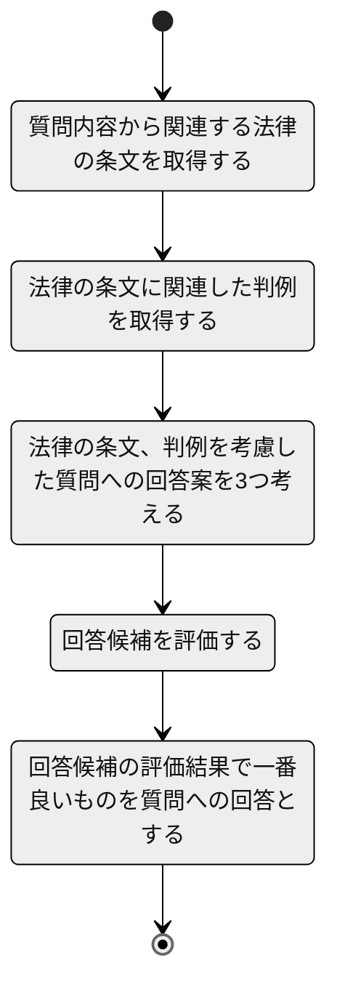

# 最新のLLMを利用したシステム開発

## LLMOpsのワークフロー

LLMを利用したシステム開発では、LLM自体から開発する(基盤モデルの構築)、学習済みのLLMに対し、独自に収集したラベルデータで特定タスク向けに調整する(特定タスクへのファインチューニング)、学習済みのLLMをそのまま利用するが、RAGなどの仕組みで知識を補完する(独自データからの知識統合)という選択肢があります。



### 基盤モデルの構築

独自、あるいはオープンソースとして構造が公開されているLLMを利用し、独自のデータによる学習を行います。LLMの学習はSFT、Reward Model、RLHFなどの様々な手法を用います。独自の基盤モデル構築は大量のデータ、膨大な計算リソースが必要となる非常に高コストな手段です。

### 特定タスクへのファインチューニング

独自に構築した基盤モデルを利用する場合もありますが、ほとんどの場合は公開されている学習済みのLLMを利用し、特定タスク向けに準備したデータでファインチューニングを行います。ここでのファインチューニングは、(従来のLLMで一般的であった)フルパラメータのファインチューニングではなく、PEFTと呼ばれる、より少ない計算リソースで学習できる手法を用いることがほとんどです。

### 独自データからの知識統合

独自のデータベース、ナレッジベース、外部ツール(Web検索やSaaSのCRUD操作など)を利用し、学習済みのLLMでは扱えない情報を利用できるようにします。RAG、プロンプトエンジニアリングなどを用いたIn-Context LearningによりLLMの能力を拡張します。また、前述のファインチューニングを併用することもあります。

本資料では、この`独自データからの知識統合`について主に解説します。

## LLMチェインの設計

LLMチェインは、複数のLLMやプロンプトエンジニアリング手法、RAG、外部ツールなどを組み合わせることで、LLMが特定タスクの実行能力を獲得するためのプロセスフローです。

### LLMチェインの設計

以下は法律に関する質問を受け、法律の条文や判例を参照して回答するというタスクを実現する場合のLLMチェインの例です。

このように、実現するタスクに応じたチェインを設計します。なお、チェインではLLMや外部詰式の検索、外部ツールの呼び出しを何回も行うことになります。特にLLMは処理速度が比較的遅いため、複雑なチェインの場合はオンラインでの処理ができないことがあります。

並列処理などの様々な工夫を行っても限界があるため、LLMチェインの設計はUI/UXにも大きな影響を与えます。

### モデルの選択

LLMはコストと性能、性能と処理速度などでトレードオフがあります。性能の高いLLMのみではコストが高くなり、処理速度も遅くなるため、軽量なLLMにも役割があります。各チェインで実現する個別のタスクに応じてモデルを選択する必要があります。

### 評価系の構築

ファインチューニングを行わない場合も、LLMチェインの設計が適切であるかを確認するために、実現するタスクのラベルデータが必要です。また、LLMの特性から評価手法についても、実現するタスクに応じた手法を個別に検討する必要があります。

評価系の構築で用いる手法としては、ROC、F1、ROUGE、BLUEなどの統計的評価手法だけではなく、人による評価、評価手法自体にLLMを用いる、Ragasのような評価用フレームワークなど様々な手法があります。

## データ準備

ここで準備するデータはファインチューニングや評価用のデータでは無く、LLMチェインの中で参照する外部知識です。

### 独自データの集約

実現するタスクで必要となるデータを集約します。

### データクレンジング

RAGなどの手法で必要な外部知識を参照する際に、生データのままではHTMLのタグなど不要な情報が多く、適切な知識として参照ができない場合があります。このため、必要な外部知識を見つけやすくしたり、LLMが参照しやすくするようにデータのクレンジングを行います。

### ベクトルDB(ベクトルストア)の作成

RAGなどの手法で利用する外部知識について、入力に関連した情報を検索しやすいようにベクトルDB(ベクトルストア)という仕組みで管理することがあります。ベクトルストアにはPinecone、QdrantのようなSaaS(MaaS)、PostgreSQLなどの既存のRDBのプラグイン、ElasticSearchのような全文検索エンジンを利用する方法があります。

## アプリケーション構築

設計したLLMチェインについて、フレームワーク、プロンプトエンジニアリング、RAG、外部ツールなどを利用しながら実装します。

### LLMチェインの構築

LLMチェインの構築ではLangChainなどのフレームワークを利用することがあります。以下はLangChainの簡単な解説です。

[**大規模言語モデルを利用したサービス開発時における検討事項とLangChainによる実装**](https://www.notion.so/LangChain-d668c08c7d014250858ae1a302558ad6?pvs=21)

### プロンプトエンジニアリング

プロンプトエンジニアリングの具体的な手法は以下を参照してください。

- [Prompt Engineering Guide](https://www.promptingguide.ai/jp)

### 品質・脆弱性評価

品質チェックは構築時のテストだけではなく、運用中の性能評価方法も合わせて構築する必要があります。推論結果について、ユーザからのフィードバックを受ける手段(推論結果の訂正手段の提供やいいねなどの明示的フィードバック手段)を用意することも大事です。また、LLMを利用したシステム開発ならではの脆弱性があります。以下の様なものです。

- プロンプトインジェクション
- プロンプトリーク
- ジェイルブレイク

これらの脆弱性対策や影響評価についても行う必要があります。

## 実際の進め方

実際の開発では、設計・準備・構築のようにシーケンシャル進めることはなく、様々な手法を構築した評価系で評価しながら、実装していくことになります。具体的な内容は以下の動画・解説記事を参照してください。

- [Qiita - 「A Survey of Techniques for Maximizing LLM Performance」の内容をまとめてみる(1/n)](https://qiita.com/s3kzk/items/de393e27b014ceaf0871)

<iframe width="560" height="315" src="https://www.youtube.com/embed/ahnGLM-RC1Y?si=o64uq9Lhr1NzgJMj" title="YouTube video player" frameborder="0" allow="accelerometer; autoplay; clipboard-write; encrypted-media; gyroscope; picture-in-picture; web-share" referrerpolicy="strict-origin-when-cross-origin" allowfullscreen></iframe>

## 参考文献

- [Qiita - 「A Survey of Techniques for Maximizing LLM Performance」の内容をまとめてみる(1/n)](https://qiita.com/s3kzk/items/de393e27b014ceaf0871)
- [LLMOps：基盤モデルに基づくアプリケーション開発のワークフロー](https://note.com/wandb_jp/n/n1aa6d77f33cf)
- [Prompt Engineering Guide](https://www.promptingguide.ai/jp)