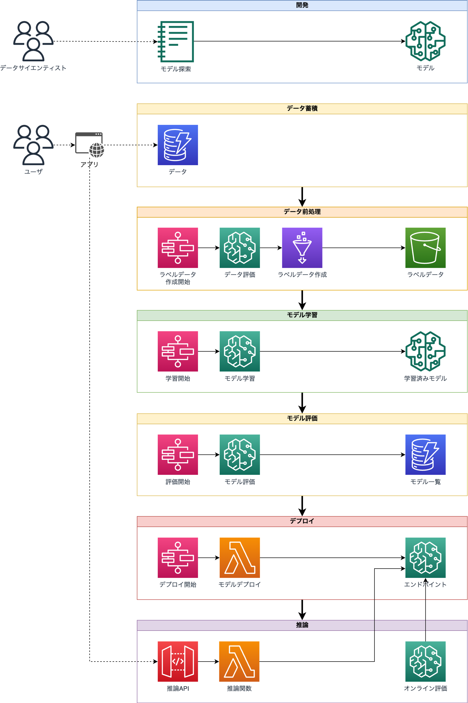

# MLOpsの概要

## MLOpsとは

MLOpsは機械学習(Machine Learning, ML)の開発と運用を統合する実践であり、ソフトウェア開発でのDevOpsの原則と手法を機械学習モデルのライフサイクルに適用したものです。MLOpsの主な目的は、機械学習を利用したシステムの品質保証にあります。

MLOpsでは機械学習モデルの開発工程と運用工程をパイプライン化し、データ処理やモデルのバージョン管理、評価、デプロイを自動化することで、継続的なモデルの改善と安定運用を実現します。

## なぜMLOpsが必要なのか

機械学習モデルは運用中、現実世界のデータ傾向の変化によって陳腐化するリスクがあります。この現象は「ドリフト」と呼ばれ、開発時には想定されていなかった新たなデータパターンの出現や、既存データの意味合いの変化によって引き起こされます。時間が経つにつれ、このドリフトは増大し、結果として機械学習モデルは定期的な再学習または継続的な学習が不可欠となります。

加えて、機械学習モデルの学習プロセスは多岐にわたり複雑であり、手作業での遂行は運用の負担増加、コストの上昇、そしてヒューマンエラーによる障害を引き起こす可能性があります。これに対処するため、MLOpsではデータ取得、前処理、モデルの学習と評価、デプロイメントを含むワークフロー全体を包括する機械学習パイプラインを定義し、それを自動化することが求められます。

## 機械学習パイプラインの構成要素

### 開発

既に収集されたオフラインデータを使用してモデルを開発します。この段階で確立されたデータ前処理手法、モデル構築手順、評価基準を用いて、機械学習パイプラインを設計します。開発過程で多岐にわたる前処理手法、アルゴリズム、パラメータの試行錯誤が行われ、その記録の整理と管理には実験管理ツールが用いられることが一般的です。

### データ蓄積

機械学習モデルを組み込んだアプリケーションを通じて、ユーザーのインタラクションデータを収集し、蓄積します。このプロセスでは、モデルの推論結果と実際のユーザー行動との両方を記録します。

### データ前処理

蓄積されたデータをモデルの入力として利用可能な特徴量へと変換するために前処理を施します。この段階では、データがモデル開発時の仮定と一致するかを評価し、必要に応じてトレーニングセットとテストセットへの分割を行います。

### モデル学習

前処理済みのデータを使用して、モデルの学習を実行します。

### モデル評価

学習済みのモデルをテストデータセットで評価し、その性能指標をもとにモデルをカタログ化(モデル一覧)します。

### **デプロイ**

評価指標に基づき、新たに学習したモデルが既存のモデルを上回る場合は、アプリケーションで利用できるようエンドポイントとしてデプロイします。デプロイ手法には以下のようなものがあります。

- ブルー・グリーンデプロイメント：新旧モデルを並行して稼働させ、トラフィックを新モデルへと段階的に切り替えます。旧モデルは予備として稼動し続け、問題発生時にはトラフィックを迅速に戻すことができます。
- カナリアリリース：新モデルに初めは一部のトラフィックのみを流し、問題がないことを確認した上で徐々に全トラフィックへ切り替えます。
- シャドウデプロイメント：新旧モデルに同時にトラフィックを流し、新モデルの挙動を監視しますが、ユーザーには旧モデルのレスポンスを提供します。

### **推論**

機械学習モデルは通常、エンドポイントとしての独立したサーバインスタンスにデプロイされます。アプリケーションはAPIゲートウェイを介してREST APIなどを用いてエンドポイントにリクエストを送信します。

前述のデータ蓄積の節で触れたように、推論結果とユーザーの実際の行動を比較することで、モデルのオンライン評価を行うことがあります。

## MLOpsで使用する道具の例

MLOpsでは、データ処理からモデルの展開まで、幅広いツールが用いられます。これらはデータサイエンスと機械学習のプロジェクトに特化しており、従来のソフトウェア開発ではあまり使用されないものも含まれます。以下に、MLOpsの各段階で利用される典型的なツールを紹介します。

| カテゴリ | ツール/機能名 | 説明 |
| --- | --- | --- |
| ETL (Extract, Transform, Load) | AWS Glue | AWS提供のサーバレスETLサービスで、データ変換を自動化します。 |
|  | Apache Spark | 高速なメモリ内計算を特徴とする統合分析エンジンです。 |
| データ品質管理 | Deequ | AWSが開発したライブラリで、大量のデータセット品質を検証・分析します。 |
| バージョン管理 | DVC (Data Version Control) | データセットとMLモデルの変更を管理するためのツールです。 |
|  | Git | コードのバージョン管理に広く使われる分散型システムです。 |
| 実験管理 | SageMaker Experiments | 実験管理やモデル系統の追跡をサポートするAWSサービスです。 |
|  | Weights & Biases | 実験追跡、バージョニング、結果の視覚化を行うプラットフォームです。 |
| モデルトレーニング | TensorFlow | Googleが開発したオープンソース機械学習フレームワークです。 |
|  | PyTorch | 研究と本番環境に適したMetaのオープンソース機械学習フレームワークです。 |
| モデル評価 | SageMaker Clarify | モデルのバイアス検出と透明性向上を目指すツールです。 |
| モデル監視 | SageMaker Model Monitor | モデルのパフォーマンス監視と品質低下の検出を行うサービスです。 |
| フィーチャーストア | SageMaker Feature Store | 特徴量の中央管理と再利用を目的としたサービスです。 |
| モデルレジストリ | SageMaker Model Registry | モデルのバージョンとライフサイクル管理を支援するツールです。 |
| ワークフロー・パイプライン | Apache Airflow | データパイプラインの自動スケジューリングと監視を提供します。 |
|  | SageMaker Pipelines | ML開発のためのCI/CDサービスで、パイプラインを構築・管理します。 |
|  | MLflow | トレーニング、パラメータ追跡、アーティファクトログのプラットフォームです。 |
| インフラストラクチャ | Kubernetes | コンテナのオーケストレーションを自動化するシステムです。 |
|  | Docker | アプリケーションのコンテナ化と互換性を確保するプラットフォームです。 |
| モデルサービング | TensorFlow Serving | トレーニング済みモデルの効率的なデプロイメントを可能にします。 |
| データラベリング | SageMaker Ground Truth | 高品質なデータセット構築のためのラベリングサービスです。 |
| 可視化・監視 | Grafana | データの監視と可視化に特化したオープンソースツールです。 |
|  | Prometheus | メトリクス収集とアラート生成を行う監視システムです。 |
| モデル開発 | Amazon SageMaker Studio | ML開発の全工程をサポートする統合開発環境です。 |
| ベクトルストア | Pinecone | 高性能なベクタ検索アプリケーションの構築をサポートするツールです。 |
|  | Qdrant | 埋め込みデータの格納、検索、管理を行うベクタ類似性検索エンジンです。 |
|  | Weaviate | オブジェクトとベクトルの格納に使えるクラウドネイティブデータベースです。 |
| ストレージ | Amazon S3 | 高可用性と耐久性に優れたオブジェクトストレージサービスです。 |
|  | Amazon FSx for Lustre | 高性能なファイルシステムで、大規模なデータワークロードに適しています。 |

## MLOpsの成熟度レベル

MLOpsは複雑なプロセスを伴うため、段階的に導入していくことが想定されます。以下はMicrosoftによるMLOpsの成熟度レベルの定義です。PoC段階ではLevel 0の場合が多いのですが、システムとして運用する段階では、最低限Level 2に到達していることが必要です。

| Level | タイトル | ハイライト | テクノロジ |
| --- | --- | --- | --- |
| 0 | [MLOps なし](https://learn.microsoft.com/ja-jp/azure/architecture/ai-ml/guide/mlops-maturity-model#level-0-no-mlops) | • 機械学習モデルのライフサイクル全体を管理することは困難 • チームは別々で、リリースは困難 • ほとんどのシステムは "ブラック ボックス" として存在し、デプロイ時およびデプロイ後のフィードバックはほとんどなし | • 手動によるビルドとデプロイ • モデルおよびアプリケーションの手動によるテスト • モデルのパフォーマンスの一元的追跡なし • モデル トレーニングは手動 |
| 1 | [DevOps あり、MLOps なし](https://learn.microsoft.com/ja-jp/azure/architecture/ai-ml/guide/mlops-maturity-model#level-1-devops-no-mlops) | • "MLOps なし" よりもリリースの苦労は少ないが、新しいモデルごとにデータ チームに依存 • 運用段階でのモデルのパフォーマンスに関するフィードバックは依然として限られる • 結果の追跡および再現が困難 | • 自動ビルド • アプリケーションコードの自動テスト |
| 2 | [トレーニングの自動化](https://learn.microsoft.com/ja-jp/azure/architecture/ai-ml/guide/mlops-maturity-model#level-2-automated-training) | • トレーニング環境は完全に管理され、追跡可能 • モデルの再現が容易 • リリースは手動であるが、摩擦は少ない | • 自動化されたモデルのトレーニング • モデルトレーニングのパフォーマンスを一元的に追跡 • モデル管理 |
| 3 | [モデル デプロイの自動化](https://learn.microsoft.com/ja-jp/azure/architecture/ai-ml/guide/mlops-maturity-model#level-3-automated-model-deployment) | • リリースは低摩擦で自動 • デプロイから元のデータまで完全に追跡可能 • 環境全体 (トレーニング > テスト > 運用) を管理 | • デプロイのためのモデルのパフォーマンスに関する A および B テストを統合 • すべてのコードのテストを自動化 • モデルトレーニングのパフォーマンスを一元的に追跡 |
| 4 | [MLOps の再トレーニングの完全自動化](https://learn.microsoft.com/ja-jp/azure/architecture/ai-ml/guide/mlops-maturity-model#level-4-full-mlops-automated-retraining) | • システムを完全自動化し、監視を容易化 • 運用システムは、改善方法に関する情報を提供。場合によっては、新しいモデルで自動的に改善 • ゼロ ダウンタイム システムに近づく | • モデル トレーニングとテストを自動化 • デプロイされたモデルからの詳細で一元化されたメトリック |

## まとめ

- 品質保証のためにMLOpsが必要。
- AI/MLモデルは継続的に改善する必要がある。
- MLパイプラインにはパターンがある。
- MLOpsで使う道具は多様。
- MLOpsの目指すところは自動化。

## 参考文献

- [【開催報告 & 資料公開】AWS AI/ML サービス事例祭り ~最新アップデートとお客様活用事例をまとめてご紹介~](https://aws.amazon.com/jp/blogs/news/aws-aiml-jirei-june/)
    - [AWSサービスのみでMLOps成熟度モデルLevel 4を⽬指す話](https://pages.awscloud.com/rs/112-TZM-766/images/20220602-aiml_2_epcroir_MLOps_lv4.pdf)
- [機械学習システムデザイン](https://www.oreilly.co.jp/books/9784814400409/)
- [入門 機械学習パイプライン](https://www.oreilly.co.jp/books/9784873119519/)
- [Machine Learning 用の成熟度モデル](https://learn.microsoft.com/ja-jp/azure/architecture/ai-ml/guide/mlops-maturity-model)