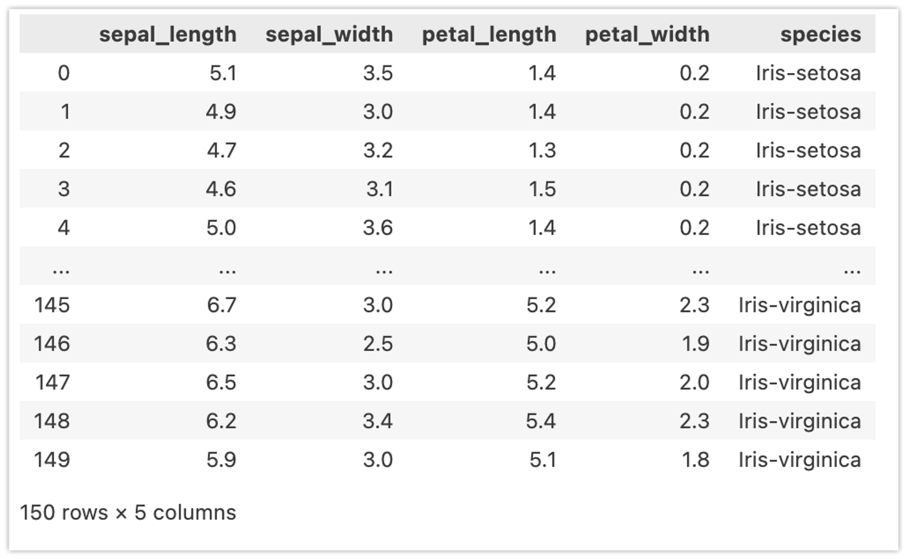
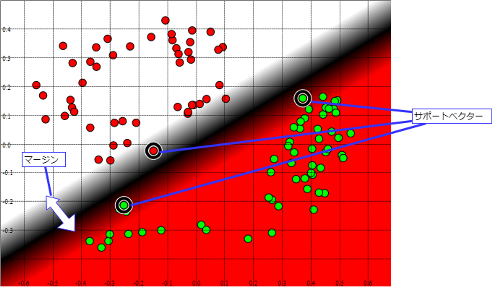

# 教師あり学習・教師なし学習の概要

## 教師あり学習の概要

教師となるデータとラベル(正解)のセットを元に学習を行います。 教師あり学習で可能となる代表的なタスクは以下の通りです。

- クラス分類(Classification)
- 回帰分析(Regression)

それぞれ、具体的な例を見ていければと思います。

### クラス分類(Classification)の例

Iris(アヤメ)データセットを用いたクラス分類の例です。`sepal_length(がく片の長さ)`、`sepal_width(がく片の幅)`、`petal_length(花びらの長さ)`、`petal_width(花びらの幅)`の4つの特徴と、対応する`species(アヤメの種類)`を持ったデータセットです。4つの特徴(説明変数)から`species(アヤメの種類)`を分類するタスクとして利用します。speciesはsetosa、versicolor、virginicaの3種類(目的変数, ラベル, クラス)の何れかになります。

種類毎の分布(ヒストグラム)と説明変数の相関は以下の様になっています。

例えばロジスティック回帰(厳密には3分類なので多項ロジスティック回帰)のモデルとして学習することで、分類器を作成することができます。Irisデータセットのデータ個数は150ですが、その内(ランダムに選んだ)105のデータを使って学習しています。

以下は作成した分類器による分類の様子を表しています。学習に使用しなかった残りの45(150-105)のデータによる評価結果です。

以下はクラシフィケーションレポートです。F1平均: 0.96程度の性能の分類器を得ることができています。

上記はテーブルデータ(表データ)の例ですが、画像を分類するタスクも教師あり学習のクラス分類タスクとして実装されます。

#### Fashion-MNIST

60,000 サンプルの訓練セットと 10,000 サンプルのテストセットから成る、Zalando の記事の画像のデータセットです。各サンプルは 28×28 グレースケール画像で、10 クラスからのラベルと関連付けられています。



### 回帰分析(Regression)の例

カリフォルニア住宅価格データセットを使った回帰分析の例です。以下の特徴量(説明変数)からPrice(目的変数)を予測します。

- MedInc: 収入の中央値
- HouseAge: ブロック(地域)内の家の中央年齢
- AveRooms: 平均部屋数
- AveBedrms: ベッドルームの平均数
- Population: ブロック(地域)人口
- AveOccup: 平均住宅占有率
- Latitude: ブロック(地域)の緯度
- Longitude: ブロック(地域)の経度

各特徴量と目的変数の分布(ヒストグラム)は以下の通りです。なお、ブロックの緯度(Latitude)・経度(Longitude)は分析対象から除いています。

同じく緯度と経度を除いた特徴量・目的変数の相関係数は以下の様になっています。

簡単のために目的変数であるPriceと相関の強いMedIncのみを説明変数として使用し、単回帰分析を行ってみます。機械学習のタスクとして行うため、クラス分類と同じようにデータを事前に分割します。学習に使用するデータ数は14,448、評価用(テスト用)は6,192です。

学習用データセットにより学習した単回帰分析モデルの(評価用データセットによる)評価結果は以下のとおりです。R2(決定係数)が0.472となります。

#### より高度なアルゴリズムを用いた場合

先の例ではMedIncという説明変数のみ利用しましたが、緯度・経度などを含めた全ての説明変数を用い、さらにLightGBMというアルゴリズムを用いた場合、R2は0.839になります。

説明変数が多ければ多いほど良いということではありませんが、適切な前処理と適切なアルゴリズムを選択することで、予測精度は大きく上昇することが確認できます。

## 教師あり学習のアルゴリズム

機械学習で用いられるアルゴリズムは多様であり現在も増え続けています。ここではアルゴリズムの一部について概要レベルで解説します。なお、教師あり学習で利用されるアルゴリズムであっても、(若干改変して)教師なし学習で利用されることがあります。必ずしも教師あり学習専用ということではない点に注意してください。

- 線形回帰と正則化
- SVM(Support Vector Machine)
- 決定木・ランダムフォレスト
- 勾配ブースティング
- ニューラルネットワーク(およびディープラーニング)

### 線形回帰と正則化

モデルの複雑さを抑制するための工夫を正則化といいます。正則化にはいくつかの種類がありますが、パラメータの変動を抑えるために利用されるのがL1/L2正則化です(L0、L-Infinityのように一般化されます)。線形回帰と組み合わせた場合はLasso回帰(L1正則化)、Ridge回帰(L2正則化)と呼ぶことがあります。

L1正則化はパラメータそのものを削減する効果があるため、特徴量選択・スパースモデリングで用いられます。また、L1・L2を組み合わせたElasticNetというバリエーションがあります。



ロジスティック回帰やニューラルネットワークなど他のアルゴリズムと組み合わせて利用することも多く、機械学習アルゴリズムの基礎的な要素となっています。

### SVM(Support Vector Machine)

与えられたデータを線形分割する際に、分割したクラス同士の間の幅(マージン)が最大になるような係数を選択します。 この`マージン`と係数を決定する根拠となったデータを`サポートベクター`と言います。

最も単純な`SVM`は線形分割しかできませんが、`カーネルトリック(Kernel Trick)`と呼ばれる手法と組み合わせることで、 非線形分割も可能です。

SVMは教師あり学習のアルゴリズムですが、教師なし学習として異常検知を行うためのOne Class SVMというバリエーションもあります。

### 決定木・ランダムフォレスト

`決定木(Decision Tree)`は、(可能な限り)ラベルデータに適合するデータのみを含むように分割するための閾値を決定し、 閾値未満か以上で別けていくことで二分木として構成する機械学習の手法です(n>2分木として構成する手法もあります)。

決定木系のアルゴリズムは人が見て解釈が容易であり、データの種類によってはDeepLearning系アルゴリズムの精度を上回ることがあります。このため、現在も主要な機械学習アルゴリズムの一つです。



ランダムフォレストは決定木とアンサンブル学習を併用したアルゴリズムです。アンサンブル学習の手法として主にバギング(重複有りのデータ分割による弱分類器の作成)が利用されています。処理速度と精度のバランスが良く、機械学習が有効かどうかを判断するための比較対象とするためのシンプルなモデル(ベースラインモデル)として広く利用されます。



なお、決定木系のアルゴリズムは特徴量のスケーリング(標準化・正規化)が不要という特徴があります。

### 勾配ブースティング

決定木系のアルゴリズムのバリエーションです。ランダムフォレストのように複数の弱分類器を作成、それらを組み合わせる(アンサンブル)ことで高度な分類器を作成しますが、弱分類器を直列に繋いで前の誤差を後の分類器で修正していくイメージです。

テーブルデータにおいては最新のDeep Learning系アルゴリズムの精度を上回ることがあり、とりあえず勾配ブースティング系のアルゴリズムを選択しておけば大丈夫というほど信頼性が高いアルゴリズムとなっています。以下は勾配ブースティング系アルゴリズムとして有名なものです。

- XGBoost
- LightGBM
- CatBoost

### ニューラルネットワーク(およびディープラーニング)

第三次AIブームの火付け役になった`Deep Learning`はNeural Networkの特別な場合です。現在のAI関連技術の主役の一人と言えます。以下はシンプルなNeural Networkの例です。

xi(x1, x2, x3)は入力を表し、bi(b1, b2, b3)がバイアス、yi(y1, y2)が推論結果を表しています。Neural Networkは層(Layer)という考え方で列毎に計算を行い、次の層にそれぞれの層の計算結果を渡していきます。厳密な定義はありませんが、Neural Networkにおいて入力層を除いて層が3層以上ある場合を`Deep Learning`と呼びます。

各層は複数のユニットで構成し、ユニット毎に様々なアルゴリズムを使用しますが、以下は単純な全結合とよばれるアルゴリズムの計算例です。

層は複数のパラメータを持つため行列(上記の場合はベクトル)計算になりますが、(全結合層においては)計算式自体は単純な一次方程式です。各ユニットの計算結果については活性化関数と呼ばれる非線形変換を行うための関数で変換した上で次の層に渡されます。

#### Neural Networkの構成要素

Neural Networkでは全結合層以外にも様々なアルゴリズムが利用されます。各ユニットの接続方法も様々であり、どのようなアルゴリズムをどのように組み合わせるかはタスクに応じて調整することになります。



#### 全結合(Dense, Full Connected; FC)

`全結合層(Full Connected Layer)`では、構成するノードが手前の層の全ての出力と結合します。 `全結合層`では同じ層のノード同士が接続することはありません。



#### 畳み込み層(Convolutional Neural Network; CNN)

`畳み込み層(Convolutional Layer)`は主に`畳み込みネットワーク(Convolutional Neural Network, CNN)`で使用される層です。 `畳み込み層`では`フィルタ`を通して`移動不変性`を持った特徴量を得ることができます。

#### プーリング層

`プーリング層`は`畳み込み層`と一緒に`畳み込みネットワーク`で使用されます。 `プーリング層`により`畳み込み層`で得た特徴量をさらに小さな空間に集約します。以下は`最大値プーリング`の例です。

#### RNN(Recurrent Neural Network)

`RNN(Recurrent Neural Network)`は、同一層内のノード同士を接続します。 これにより入力信号の入力順に応じた出力(時系列など)を得ることができます。

#### LSTM(Long Short-Term Memory)

`LSTM(Long Short-Term Memory)`は`RNN`における`勾配消失`および`勾配爆発`問題に対応するために考えられた`ゲート付きRNN`です。

`LSTM`は単純に言うと、同一層内のノード間の接続に忘れるというゲート(忘却ゲート)を追加した`RNN`です。 `LSTM`では同一層内で接続する直前のノードの出力が、現ノードに対する入力にどれだけ類似していたかに基づいて、次のノードに流す出力量を調整します。



#### Dropout

`Dropout`はラベルデータのみ適合して、未知のデータに対する汎化能力を得ることができない`過学習(Overfitting)`を抑制するための学習方法です。

厳密には層ではなく、層の間の接続の方法に関するアルゴリズムです。 `Dropout`では、指定した確率に基づいてノードが存在しない前提で学習を行います。 これにより、全結合層であっても、複数のパターンでノードが接続された状態による学習と推論を行うことができます(結果、汎化能力を高めることができます)。



`Dropout`を0.5とした場合、上図の赤と青に関する重みとバイアスを交互に学習することになります。

#### Attention

Attentionは機械学習における重要な概念の1つで、特に自然言語処理においてよく使われます。Attentionは、入力の一部に注目しながら、より精密な予測を行うための仕組みです。

Attenntionを応用したTransfomerという仕組みは、現在の大規模言語モデルにおける重要な構成要素となっています(Transfomerは画像処理などでも応用されています)。



## 教師なし学習の概要

`ラベルデータ`を必要としない学習です。前述のクラスタ分析、次元削減、異常検知などが`教師なし学習`の例です。データの可視化や分析の前処理などで利用することがあります。教師なし学習の代表的なタスクは以下の通りです。

- クラスタ分析(Clustering)
- 次元削減(Dimensionality reduction)
- 異常検知(Anomaly Detection)

それぞれ、具体的な例を見ていければと思います。

### クラスタ分析(Clustering)の例

以下は前述のIrisデータセットをクラスタ分析した結果です。`species(アヤメの種類)`を除いたデータでクラスタリングを行い決定されたクラスと、speciesの対応を表しています。

クラスタ分析は教師なし分析であるためspeciesを認識することなくクラスタを決定していますが、教師あり学習であるクラス分類と似たような結果を得られることがわかります。

### 次元削減(Dimensionality reduction)の例

前述のクラスタ分析の例では、次元削減を利用して2つの特徴量に縮約することで二軸のグラフとして可視化していますが、データ分析の前処理としても広く用いられる手法です。例えばそのままでは多重共線性が懸念される場合も、次元削減により得られた主成分により回帰分析を行うことで、多重共線性の影響を排除することが可能です。

以下はカリフォルニア住宅価格データセット(緯度・経度を除く)に対してVIF(分散拡大要因)を計算した結果です。右は(Priceを除いた)相関係数ですが、どちらからもAveRoomsとAveBedrmsに高い相関があることがわかります。





次元削減により5つに特徴量を削減した場合(実際は6→6のままでも大丈夫です)、VIFは以下の様になります。



### 異常検知(Anomaly Detection)の例

データの組み合わせとして希なものを識別します。以下はカリフォルニア住宅価格データセット(緯度・経度を除く)に対して異常検知をした結果です。Anomaly_Scoreが異常検知結果であり、値が大きいほど希であることを表しています(AnomalyはAnomaly_Scoreが0より大きい場合1となっています)。

赤枠が各特徴量の平均値です。Anomaly_Scoreが高いほど全体的に平均値から乖離していることが確認できます。

以下はAnomaly_Scoreが低いデータです。平均値と近い値になっていることが確認できます。

## 教師なし学習のアルゴリズム

教師なし学習で用いられるアルゴリズムも非常に多くの種類があります。代表的だと思われるものについて概要レベルでご紹介します。

- クラスタリング: k-means
- クラスタリング: 階層的クラスタリング
- 主成分分析: PCA(Principal Component Analysis)・t-SNE・UMAP
- 異常検知: Isolation Forest

### クラスタリング: k-means

クラスタ分析のための手法です。 指定したクラスタ(特定のクラスとして分類されたデータの集まり)の数になるように、データ間の距離の中心を計算します。`k-means`は分割するクラスター数(グループ数)を人が指定します。どの程度のクラスター数が適しているかを判断するための手法として、`エルボー法`、`シルエット法`などがあります。

クラスタ分析に関するアルゴリズムの中には、クラスター数を自動的に決定できるものがあります。

### クラスタリング: 階層的クラスタリング

最も似ている組み合わせから順番にまとまり(クラスター)にしていく方法で、途中過程が階層のようになります。樹形図(デンドログラム)を作る事ができます。

](http://data-analysis-stats.jp/wp-content/uploads/2020/06/Hierarchical_clustering02.gif)

[https://data-analysis-stats.jp/機械学習/scikit-learnを用いた階層的クラスタリング-hierarchical-clusteringの解説/](https://data-analysis-stats.jp/%E6%A9%9F%E6%A2%B0%E5%AD%A6%E7%BF%92/scikit-learn%E3%82%92%E7%94%A8%E3%81%84%E3%81%9F%E9%9A%8E%E5%B1%A4%E7%9A%84%E3%82%AF%E3%83%A9%E3%82%B9%E3%82%BF%E3%83%AA%E3%83%B3%E3%82%B0-hierarchical-clustering%E3%81%AE%E8%A7%A3%E8%AA%AC/)

### 主成分分析: PCA(Principal Component Analysis)・t-SNE・UMAP

次元削減(主成分分析)を行うアルゴリズムです。データの軸毎の分散を可能な限り保ったまま、低次元に射影することができます。クラスタリングと同様に様々なアルゴリズムが存在しますが、まずは処理速度の早いPCAを試し、続いてt-SNE/UMAPを試すという方針が考えられます。



### 異常検知: Isolation Forest

以下の記事がわかりやすいと思います。

https://hogetech.info/machine-learning/algorithm/forest#toc13

## サンプルコード

- [fashion-mnist.ipynb](https://colab.research.google.com/drive/1JgmJti1mHtEoFF-TrZT-Z6rh82htkuL1?usp=sharing)
- [table-data-with-automl.ipynb](https://colab.research.google.com/drive/1LOXzxx4mURWDc4EshFztEeAaocYLRz5t?usp=sharing)
- [regression.ipynb](https://drive.google.com/file/d/1-QcEnD6oeZQ8jJVCLrhwCZnPjScR_gfu/view?usp=sharing)
- [classification.ipynb](https://drive.google.com/file/d/1JgqFaWFPYRIA5Tjt1cXcHaBJXVj6SyAK/view?usp=sharing)
- [clustering.ipynb](https://drive.google.com/file/d/15vKf64H-ONXcG0DPPq4pBMbLWixR0A98/view?usp=sharing)
- [dim-reduction.ipynb](https://drive.google.com/file/d/1b5a7D62CaILHcHwDojBNxuxChUq_9zFM/view?usp=sharing)
- [anomaly-detection.ipynb](https://drive.google.com/file/d/1A7KqxUf__1CP4zgnBEUwhGizy5ZZoL7L/view?usp=sharing)

## 参考文献

- [PyCaret](https://pycaret.org/)
- [scikit-learn](https://scikit-learn.org/stable/index.html)
- 杉山 聡. 本質を捉えたデータ分析のための分析モデル入門 統計モデル、深層学習、強化学習等 用途・特徴から原理まで一気通貫!: ソシム
- 有賀 康顕、中山 心太、西林 孝 著. 仕事ではじめる機械学習 第2版: オライリー・ジャパン