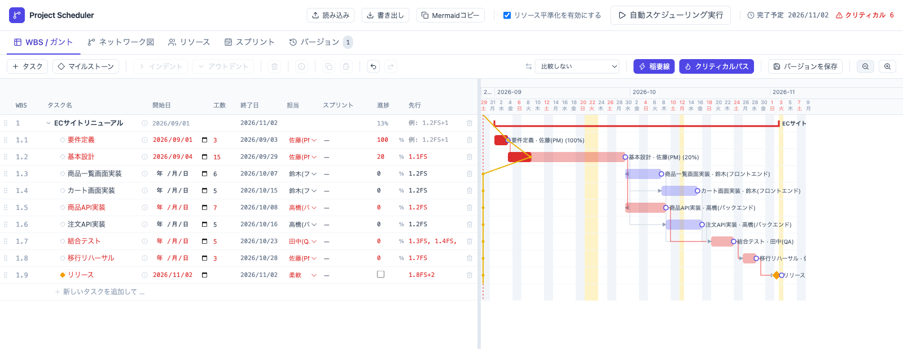
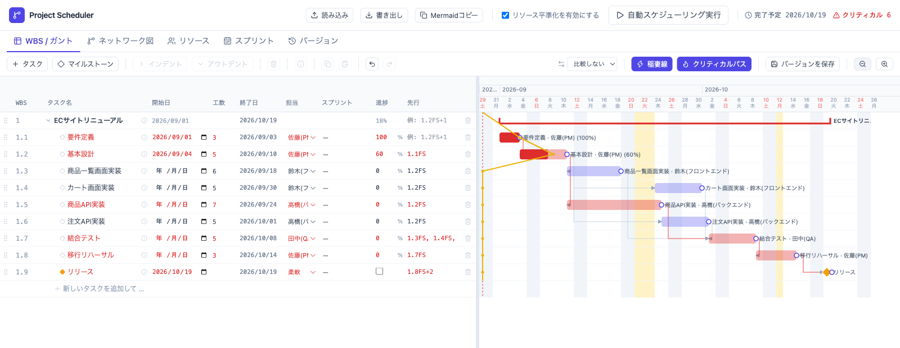
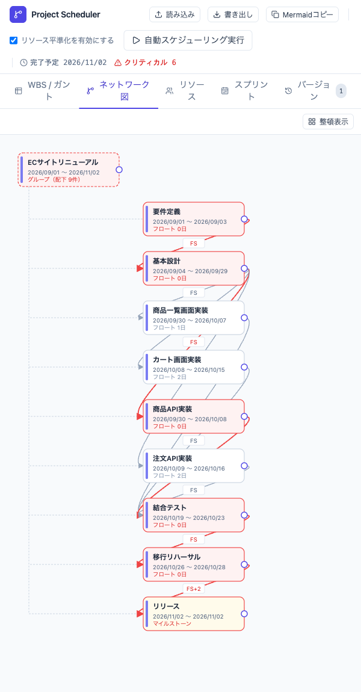
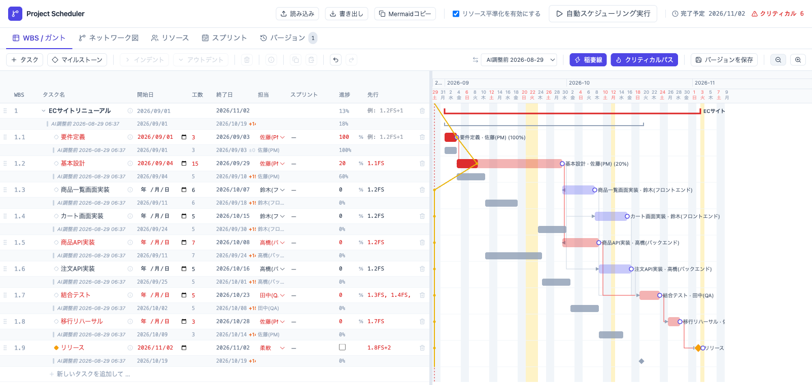
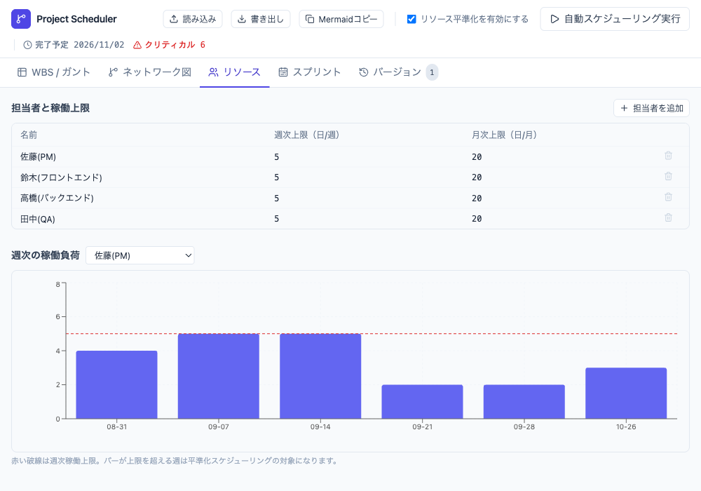

# 進行中のガントチャートをAIで引き直す - Claude CodeとProject Schedulerによるスケジュール調整

プロジェクト開始後のスケジュール変更は、計画時より難しくなります。完了済みタスクの実績は変えず、着手済みタスクの開始日も維持したまま、残りの計画だけを引き直す必要があるためです。

`Project Scheduler` には、保存した計画をClaude Codeから調整するためのSkill `schedule-adjust` が同梱されています。AIエージェントを利用して自然言語による計画変更、依存関係、進捗率、担当者の負荷を考慮した日程の再計算を行うことができます。

この記事では、進行中のECサイトリニューアルを題材に、Skillの標準フローで日程を調整します。要件定義は100%完了し、基本設計は5人日のうち3人日を消化して進捗60%になっている計画です。定例会で基本設計の総工数を15人日へ見直したケースとして、後続タスクやマイルストーンを再計算します。



この記事で使用するLive Demo、機能説明、サンプル計画は、次のリンクから開けます。

* [Project Scheduler Live Demo](https://lhideki.github.io/project-scheduler/)
* [GitHub - AIエージェントでスケジュールを調整する](https://github.com/lhideki/project-scheduler#ai%E3%82%A8%E3%83%BC%E3%82%B8%E3%82%A7%E3%83%B3%E3%83%88%E3%81%A7%E3%82%B9%E3%82%B1%E3%82%B8%E3%83%A5%E3%83%BC%E3%83%AB%E3%82%92%E8%AA%BF%E6%95%B4%E3%81%99%E3%82%8B)
* [調整前の進行中プロジェクト](sample/ec-renewal-before.json)
* [AI調整後のプロジェクト](sample/ec-renewal.json)

## AIエージェントとProject Schedulerの役割

自然言語の依頼を計画の変更へ置き換える部分と、日程を計算する部分を分けます。AIエージェント自身が稼働日を数えるのではなく、Project Schedulerの計算機能を利用するため、確実な日程調整が可能です。

| 担当 | 役割 |
| --- | --- |
| AIエージェント | 依頼内容を解釈し、工数、進捗率、依存関係、担当者などの変更案を作ります。再計算の結果を、人が読める影響レポートにまとめます。 |
| Project Scheduler | 計画データに矛盾がないか確認し、依存関係、担当者の負荷、スプリントの条件を使って日程を再計算します。 |
| プロジェクト管理者 | 変更内容、完了予定日、動くタスク、進捗率、警告を確認し、保存するか判断します。 |

Skillは変更案を作成して影響レポートを提示し、保存前に承認を求めます。最終的な保存と計画上の判断は、プロジェクト管理者が行います。

## 前提条件

この記事では、2026年8月29日時点の `schedule-adjust` を使用しました。次の環境を前提としています。

* Claude Codeを利用できること。
* Project Schedulerから書き出した計画ファイルを用意すること。
* 担当者の負荷を日程へ反映する場合は、週次・月次の作業上限を登録すること。

## 進行中の計画を確認する

今回の例では、2026年9月8日の定例会時点を想定します。調整前の計画に矛盾はなく、担当者の作業上限を考慮する設定も有効になっています。

| WBS | タスク | 実開始日 | 総工数 | 進捗率 | 状態 |
| --- | --- | --- | ---: | ---: | --- |
| 1.1 | 要件定義 | 9月1日 | 3人日 | 100% | 完了済み |
| 1.2 | 基本設計 | 9月4日 | 5人日 | 60% | 3人日を消化して着手中 |
| 1.3〜1.9 | 実装、テスト、移行、リリース | 未着手 | 計31人日 | 0% | 依存関係から計算 |

調整前の完了予定日は10月19日です。プロジェクト全体の進捗率は18%と表示されます。



計画が始まった後は、進捗率だけでなく実開始日も重要です。Skillは進捗率が入力されたタスクを着手済みとして扱い、現在の実開始日を維持します。未着手の後続タスクは、変更後の工数と依存関係から再計算します。

## AIエージェントへ変更を依頼する

「基本設計が遅れた」だけでは、開始日を変えるのか、総工数を増やすのか、残工数を増やすのか判断できません。今回は完了量と新しい総工数を明示して、次のように依頼します。

```text
ec-renewal-before.jsonのスケジュールを調整してください。

現在は2026年9月8日の定例会時点です。
- WBS 1.1「要件定義」は完了済み。進捗率100%と実開始日は変えない
- WBS 1.2「基本設計」は9月4日に着手し、3人日を消化している
- 基本設計の総工数を5人日から15人日へ見直す
- 完了量3人日を維持し、新しい総工数に合わせて進捗率を見直す
- 完了済みタスクと着手済みタスクの実績日は変えない
- 未着手の後続タスクは依存関係から再計算する
- 現在の担当者と作業上限を維持する

完了予定日、日程が動くタスク、クリティカルパス、警告を報告してください。
元の計画ファイルはまだ書き換えず、保存前に影響を確認してください。
```

### AIが提示した進捗率の補正根拠

Project Schedulerへ登録する工数は、残工数ではなく総工数です。AIは、進捗率60%の5人日タスクへ残り12人日をそのまま足すのではなく、完了量を維持して総工数と進捗率を整合させます。

今回の完了量は `5 × 60% = 3人日` です。新しい総工数15人日に対して同じ完了量を維持するため、進捗率は `3 ÷ 15 = 20%` へ更新します。

| 項目 | 変更前 | 変更後 | 理由 |
| --- | ---: | ---: | --- |
| 基本設計の実開始日 | 9月4日 | 9月4日 | 着手済みの実績として固定 |
| 基本設計の総工数 | 5人日 | 15人日 | 再見積もり結果を反映 |
| 基本設計の進捗率 | 60% | 20% | 完了量3人日を維持 |
| 要件定義の進捗率 | 100% | 100% | 完了実績を維持 |

進捗率と工数の意味は組織ごとに異なる場合があります。進捗率を成果物の完成度として入力している場合は、単純な人日換算をせず、その定義を依頼へ含めます。

実際にSkillを適用したところ、AIエージェントから次の影響レポートが返りました。これは想定した返答例ではなく、`schedule-adjust` が `ec-renewal-before.json` へ変更条件を適用し、同梱CLIの `plan` で再計算した結果を整形したものです。

```text
変更案を作成しました。元の計画ファイル（ec-renewal-before.json）は書き換えていません。
平準化ON（週5人日・月20人日）の条件で再計算しています。

依頼した編集
- WBS 1.2「基本設計」 総工数: 5人日 → 15人日
- WBS 1.2「基本設計」 進捗率: 60% → 20%（完了量3人日を維持）
- 実開始日はすべて変更なし（要件定義・基本設計の実績を固定）

完了予定日
- プロジェクト完了予定日: 2026-10-19 → 2026-11-02

日程が動くタスク: プロジェクト全体を含む9件
- 1.2 基本設計         09-04〜09-10 → 09-04〜09-29（開始固定、終了 +10営業日）
- 1.3 商品一覧画面実装  09-11〜09-18 → 09-30〜10-07（+10営業日）
- 1.4 カート画面実装    09-24〜09-30 → 10-08〜10-15（+10営業日）
- 1.5 商品API実装       09-11〜09-24 → 09-30〜10-08（+10営業日）
- 1.6 注文API実装       09-25〜10-01 → 10-09〜10-16（+10営業日）
- 1.7 結合テスト        10-02〜10-08 → 10-19〜10-23（+10営業日）
- 1.8 移行リハーサル    10-09〜10-14 → 10-26〜10-28（+10営業日）
- 1.9 リリース          10-19       → 11-02（+10営業日）

- クリティカルパスに入る、または外れるタスク: なし
- スプリントの矛盾: なし（前後とも0件）
- 担当者の負荷に関する警告: なし（前後とも0件）
- 保存時に「AI調整前 2026-08-29 06:37」スナップショットを versions[] へ1件追加

この内容で保存しますか。
```

## 変更による影響を確認する

影響レポートでは、プロジェクト全体、基本設計、7件の後続タスクを合わせた9件の日程変更が報告されました。基本設計の開始日は変わらず、終了予定だけが延びています。まず、変更対象である基本設計と、最終的なリリース日の2行を確認します。

| WBS | タスク | 変更前 | 変更後 |
| --- | --- | --- | --- |
| 1 | ECサイトリニューアル | 9月1日〜10月19日 | 9月1日〜11月2日 |
| 1.2 | 基本設計 | 9月4日〜9月10日 | 9月4日〜9月29日 |
| 1.3 | 商品一覧画面実装 | 9月11日〜9月18日 | 9月30日〜10月7日 |
| 1.4 | カート画面実装 | 9月24日〜9月30日 | 10月8日〜10月15日 |
| 1.5 | 商品API実装 | 9月11日〜9月24日 | 9月30日〜10月8日 |
| 1.6 | 注文API実装 | 9月25日〜10月1日 | 10月9日〜10月16日 |
| 1.7 | 結合テスト | 10月2日〜10月8日 | 10月19日〜10月23日 |
| 1.8 | 移行リハーサル | 10月9日〜10月14日 | 10月26日〜10月28日 |
| 1.9 | リリース | 10月19日 | 11月2日 |

プロジェクト全体の完了予定日は10月19日から11月2日へ変わります。クリティカルパスへ新たに入る、または外れるタスクはなく、スプリントや担当者の負荷にも問題はありませんでした。

基本設計の実開始日は変わらず、終了予定と後続タスクの日程だけが更新されました。プロジェクト管理者はこの結果を確認し、問題がなければ保存を承認します。

### 後続タスクへの波及を確認する

ネットワーク図で見ると、基本設計の終了予定が後ろへ動き、実装、結合テスト、移行リハーサル、リリースへ影響する関係が分かります。赤い経路は、要件定義、基本設計、商品API実装、結合テスト、移行リハーサル、リリースです。調整後もこの経路を構成するタスクは変わりませんでした。

<p style="text-align: center;">
  <a href="images/live-demo-adjusted-network.png">
    
  </a>
</p>

図を選択すると、全体を拡大して確認できます。

### プロジェクト全体の進捗率を確認する

調整前のプロジェクト全体の進捗率は18%、調整後は13%と表示されました。これは完了した作業が減ったのではなく、基本設計の総工数を見直し、進捗率を60%から20%へ補正した結果です。

プロジェクト全体の表示は、工数で重み付けした出来高ではありません。AIエージェントのレポートでは、全体の数値だけで判断せず、個別タスクの進捗率と日程を確認します。

## 変更内容を確認してから保存する

`schedule-adjust` は、次の順番で処理します。

1. 変更前の計画と現在の日程を確認します。
2. 元の計画を変更せず、工数と進捗率を反映した変更案を作ります。
3. 変更案に矛盾がないか確認し、後続タスクの日程を再計算します。
4. 完了予定日、日程が動くタスク、クリティカルパス、警告を影響レポートとして提示します。
5. プロジェクト管理者が保存を承認した場合だけ、変更前のスナップショットとともに保存します。

この分離により、AIの解釈が意図と違った場合や、リリース日の変更を受け入れられない場合に、元の計画を変更せず止められます。

影響を確認し、変更を受け入れられると判断したら、AIエージェントへ保存を依頼します。

```text
内容を確認しました。この変更案を保存してください。
```

保存を依頼すると、`schedule-adjust` は `plan` が返した提案JSON（`proposed`）を指定したファイルへ書き込みます。ここでは調整前の計画を残すため `ec-renewal.json` を保存先に指定しました。実際に返ってきた保存後の応答は次のとおりです。

```text
ec-renewal.json として保存しました。

- WBS 1.2「基本設計」 総工数 15人日 / 進捗率 20% を反映
- versions[] に「AI調整前 2026-08-29 06:37」スナップショット（変更前の全タスク・リソースを含む）を1件追加
- 完了予定日は 2026-11-02

Live Demoの「読み込み」で ec-renewal.json を取り込むと、再計算後の日程と変更前スナップショットの比較を確認できます。
```

## Live Demoで変更前後を比較する

保存を承認すると、変更前の状態がスナップショットとして残ります。Live Demoで[AI調整後の計画](sample/ec-renewal.json)を読み込むと、進捗率と再計算後の日程を確認できます。

比較リストから「AI調整前」を選ぶと、現在の行の下へ変更前の行が表示されます。基本設計では、現在の進捗率20%に対して基準行が60%となり、終了予定と後続タスクの移動も同時に確認できます。

比較リストに表示される2026年8月29日は検証日です。サンプル計画の変更条件は、9月8日の定例会時点を想定しています。



## 進行中のプロジェクトで注意すること

### 基準日を明示する

進捗率だけでは「いつ時点の状況か」や「未着手タスクを今日より前へ置いてよいか」を判断できません。定例会の日付、実績集計日、再計画の基準日などを依頼に含めます。未着手タスクを基準日以降に置きたい場合は、その条件も明示します。

### 実績と予測を分ける

完了済みタスクの実開始日、実終了日、進捗率100%は実績です。着手済みタスクの実開始日も、原則として動かしません。一方、総工数、残りの終了予定、未着手タスクの日程は予測として調整します。

### 進捗率の定義を決める

Project Schedulerは進捗率を0〜100の数値として保持しますが、それが消化人日、成果物の完成度、チケット完了率のどれを表すかまでは判断しません。AIへ工数と進捗率を同時に変更させる場合は、計算方法を依頼へ含めます。

### リソース平準化の状態を維持する

担当者の負荷が日程へ影響する計画では、平準化ON/OFFが変わると比較条件も変わります。今回は現在のONを維持し、週5人日・月20人日の上限で計算しました。AIのレポートにも、どちらの条件で計算したかを残します。

今回の計画では、4名とも週5人日・月20人日を上限としています。調整後の佐藤(PM)の週次負荷は赤い破線の上限を超えておらず、担当者の負荷に関する警告がないという影響レポートと一致しています。



### 計画データの確認と意思決定を分ける

Skillは、タスクの依存関係や担当者など、計画データの矛盾を確認します。一方、「この進捗率は正しいか」「本当に15人日必要か」「リリースを2週間動かせるか」は判断できません。データに矛盾がなくても、計画上の判断は関係者が行います。

## schedule-adjustを導入して試す

Project SchedulerのリポジトリをClaude Codeで開くと、同梱されたSkillを利用できます。別の作業環境へ導入する場合は、Claude Codeで次のコマンドを実行します。

```shell
/plugin marketplace add lhideki/project-scheduler
/plugin install schedule-adjust@project-scheduler
```

導入後は、調整したい計画ファイルと変更条件をClaude Codeへ伝えると、Skillが変更前の確認から影響レポートの作成まで進めます。

## まとめ - AIを計画調整の入口にする

進行中のプロジェクトでは、すべての日付を最短日程へ並べ直せばよいわけではありません。完了済みの実績と着手済みタスクの開始日を固定し、総工数と進捗率の関係を整理したうえで、着手済みタスクの残りと未着手タスクの日程を引き直す必要があります。

今回の試行では、要件定義100%、基本設計60%の計画に対し、基本設計の総工数を5人日から15人日へ変更しました。完了予定日は10月19日から11月2日となり、プロジェクト全体を含む9件への影響を確認することができています。

ポイントは、プロジェクトの状況を自然言語で伝えることで、プロジェクトの前提に基づいた確実な日程変更案を計算できることです。Excelで作成したガントチャートの編集ミスを気にする必要は無く、専門ツールの操作性を意識する必要もありません。

[調整前の進行中プロジェクト](sample/ec-renewal-before.json)をClaude Codeへ渡し、この記事の依頼文でスケジュール調整を試してみてください。AIエージェントが提示する影響を確認してから保存し、その結果を[Project Scheduler Live Demo](https://lhideki.github.io/project-scheduler/)で確認できます。
