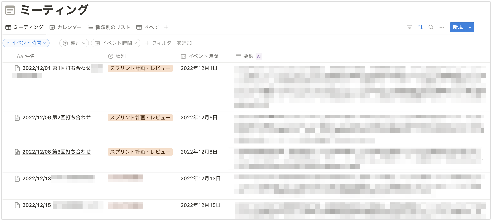

# Notion に記録した議事録をデータベースに変換するスクリプト

Notion に記録した議事録をデータベースに変換するスクリプトを作成しました。以下のように普通のページとして Notion に議事録を記録しているとします。


これを以下のようなデータベースに変換するためのスクリプトです。



## モジュールの準備

```bash
pip install notion-client
pip install python-dotenv
```

## ソースコード

```python
import re
from datetime import datetime
import os
from dotenv import load_dotenv
from notion_client import Client
from concurrent.futures import ThreadPoolExecutor
import time

load_dotenv()


def copy_block(block, notion, new_page_id):
    block_type = block["type"]
    if block_type == "table":
        # tableブロックの場合は、新しいtableブロックを作成し、cellsをコピー
        table_children = get_all_child_blocks(block["id"], notion)
        table_width = block["table"]["table_width"]
        table_block = {
            "type": "table",
            "table": {
                "table_width": table_width,
                "has_column_header": block["table"]["has_column_header"],
                "has_row_header": block["table"]["has_row_header"],
                "children": [
                    {
                        "type": "table_row",
                        "table_row": {"cells": row["table_row"]["cells"]},
                    }
                    for row in table_children
                ],
            },
        }
        new_block = notion.blocks.children.append(
            block_id=new_page_id, children=[table_block]
        )
        new_block_id = new_block["results"][0]["id"]
    else:
        # その他のブロックはそのままコピー
        new_block = {"type": block["type"], block["type"]: block[block["type"]]}
        new_block = notion.blocks.children.append(
            block_id=new_page_id, children=[new_block]
        )
        new_block_id = new_block["results"][0]["id"]

        # 再帰的に子ブロックをコピー
        if block["has_children"]:
            child_blocks = get_all_child_blocks(block["id"], notion)
            # child_blocks = notion.blocks.children.list(block_id=block["id"])
            for child_block in child_blocks:
                copy_block(child_block, notion, new_block_id)


def process_child_page(child_page, target_database_id, notion):
    # Child Pageの内容を取得
    page_id = child_page["id"]
    page = notion.pages.retrieve(page_id)

    # 件名からタイトルを取得
    title = "".join(
        [t["plain_text"] for t in page["properties"]["title"]["title"]]  # type: ignore
    )
    print(f"Processing: {title}")

    # 件名から日付部分を抽出
    date_match = re.search(r"\d{4}/\d{2}/\d{2}", title)
    event_date = None
    if date_match:
        event_date = datetime.strptime(date_match.group(), "%Y/%m/%d").date()

    # 新しいページを作成するためのプロパティを準備
    new_page_properties = {
        "件名": {"title": [{"text": {"content": title}}]},
        "種別": {"select": {"name": "スプリント計画・レビュー"}},
    }

    # イベント時間が抽出された場合は設定
    if event_date:
        new_page_properties["イベント時間"] = {
            "date": {"start": event_date.isoformat()}
        }

    # 新しいページを指定したデータベースに作成
    new_page = notion.pages.create(
        parent={"database_id": target_database_id}, properties=new_page_properties
    )

    # Child Pageのブロックを再帰的にコピー
    child_page_blocks = get_all_child_blocks(page_id, notion)
    for block in child_page_blocks:
        copy_block(block, notion, new_page["id"])

    return new_page


def get_all_child_blocks(block_id: str, notion):
    all_pages = []
    child_pages = notion.blocks.children.list(block_id=block_id)
    all_pages.extend(child_pages["results"])
    while child_pages["has_more"]:
        child_pages = notion.blocks.children.list(
            block_id=block_id, start_cursor=child_pages["next_cursor"]
        )
        all_pages.extend(child_pages["results"])

    return all_pages


def duplicate_child_pages(
    source_page_id: str, target_database_id: str, notion, parallel=True
):
    # 指定したPageIdのページ配下のChild Pageを取得
    child_pages = get_all_child_blocks(source_page_id, notion)

    if parallel:
        with ThreadPoolExecutor(max_workers=3) as executor:
            futures = []
            for child_page in child_pages:
                if child_page["type"] != "child_page":
                    continue
                future = executor.submit(
                    process_child_page, child_page, target_database_id, notion
                )
                # time.sleep(30)
                futures.append(future)

            for i, future in enumerate(futures):
                processed_page = future.result()
                processed_page_title = "".join(
                    [
                        t["plain_text"]
                        for t in processed_page["properties"]["件名"]["title"]  # type: ignore
                    ]
                )
                print(
                    f"Processed: page = '{processed_page_title}', {(i + 1)} / {len(child_pages)}"
                )
    else:
        for i, child_page in enumerate(child_pages):
            if child_page["type"] != "child_page":
                continue
            processed_page = process_child_page(child_page, target_database_id, notion)
            processed_page_title = "".join(
                [
                    t["plain_text"]
                    for t in processed_page["properties"]["件名"]["title"]  # type: ignore
                ]
            )
            print(
                f"Processed: page = '{processed_page_title}', {(i + 1)} / {len(child_pages)}"
            )


notion = Client(auth=os.environ["NOTION_TOKEN"])

source_page_id = "page_id_changeme"
target_database_id = "database_id_changeme"

duplicate_child_pages(source_page_id, target_database_id, notion, False)
```

## スクリプトの使い方

1. 移行先データベースを作成する
2. Notion API トークンを取得する
3. 元ページの Page ID を取得する
4. 移行先データベースの Database ID を取得する
5. 親ページにインテグレーションを接続する
6. スクリプトを実行する

### 移行先データベースを作成する

元ページと移行先データベースは同じページ配下にある前提です。元ページを持つ親ページ配下にデータベースを作成してください。以下のプロパティを持つデータベースを前提としています。

-   件名(タイトル): データベースの各レコードのタイトルです。
-   種別(セレクト): 議事録の種別です。スクリプトでは無条件で `スプリント計画・レビュー` を設定します。
-   イベント時間(日付): 打ち合わせの日付です。元ページに記載のタイトルから日付を抽出して設定します。

### Notion API トークンを取得する

以下を参照してください。

-   [Notion API を使用したインテグレーションの作成](https://www.notion.so/ja-jp/help/create-integrations-with-the-notion-api)

取得した API トークンは`.env`ファイルに保存してください。

### 元ページの Page ID を取得する

以下を参照してください。

-   [Notion ユーザー必見! ページ id とブロック id の確認方法を簡単に解説](https://chicolog.net/notion-pageid-blockid)

### 移行先データベースの Database ID を取得する

以下を参照してください。

-   [[作成済み DB への連携 2] データベース ID の取得と設定](https://booknotion.site/setting-databaseid)

### 親ページにインテグレーションを接続する

親ページ(元ページと移行先のデータベースを子に持つページ)に Notion API トークン発行時に設定したインテグレーションを接続してください。


### スクリプトを実行する

ソースコードをファイルに保存し、以下のコマンドを実行してください。ここでは `convert2notion-meeting-db.py` というファイル名で保存したと仮定しています。

```bash
python convert2notion-meeting-db.py
```

## 備考

-   調べた範囲ではページを単純にコピーする方法が見つかりませんでした。このため、ページ内のブロックを再帰的にコピーする方法を採用しています。
-   ブロックのコピーについて、(シンプル)テーブルは個別に処理する必要がありました。他にもコピーできないブロックの種類があるかもしれません。
-   苦労してデータベースに変換しなくても、[Notion Wiki](https://notion-lab.jp/2023-04-23-new-release-wiki/)への変換で良い気もします。一応、データベース化はインライン表示できるというメリットがあります。
-   `duplicate_child_pages` 関数の `parallel` 引数を `True` にすると、並列処理で処理を行います。ただし、Notion API の制限に注意してください。