# I Built a Browser-Only WBS/Gantt Chart Project Management Tool

Even in agile development, there are moments when you need to work out a schedule while keeping track of cross-sprint dependencies, release dates, and who's available when. Issue trackers like JIRA or Backlog are great for day-to-day task management, but when you need to reason about a WBS hierarchy, task dependencies, and each person's workload together, you often end up putting the plan together separately anyway. And every time a single task's schedule changes, re-checking the knock-on effect on downstream tasks and everyone's workload gets tedious fast.

`Project Scheduler` is a WBS/Gantt-chart-style project management tool that can automatically schedule a plan while taking dependencies, milestones, resources, and sprints into account. There's no server, account, or install required. Just open the Live Demo in your browser and you can start working out a schedule. If you'd rather work offline, you can download the single-file `project_scheduler.html`. The UI can be switched between Japanese and English, and if you use the accompanying Skill for Claude Code, you can even hand schedule adjustments and Backlog syncing off to an AI agent.

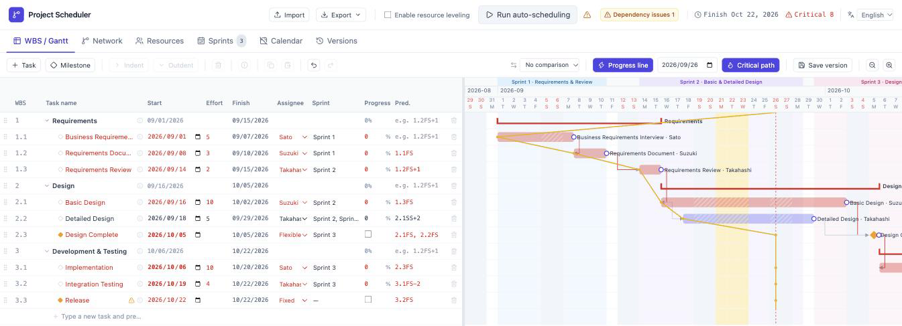

If you just want to try it out, start with the Live Demo. Once you've gotten a feel for it using the sample WBS, you can follow the hands-on tutorial to build a WBS from an empty plan. The source code and the single-file HTML build are both published on GitHub.

* [Project Scheduler Live Demo](https://lhideki.github.io/project-scheduler/)
* [Project Scheduler Hands-On Tutorial](https://www.inoue-kobo.com/webservice/tutorial-project-scheduler/) (Japanese)
* [GitHub - lhideki/project-scheduler](https://github.com/lhideki/project-scheduler)

## Motivation

Even in agile development, there are times you need to explain to your team or product owner "when will what be done." Even when you're working sprint by sprint, once you factor in coordination with outside teams, release deadlines, and work spread across multiple people, you need a plan that accounts for dependencies and resources.

A full-featured project management tool like Microsoft Project is a solid option, but adopting a dedicated tool can feel like a lot of overhead for a small team or project that just wants to try out a schedule first. So I built a lightweight tool you can open straight in a browser, one that lets you check the WBS and Gantt chart whenever you need to.

JIRA and Backlog are great for day-to-day task management, but they're not always convenient for defining a WBS or getting a clear view of a schedule that includes dependencies and resources. So this tool also ships with a Skill for Claude Code, meant to serve as a baseline for integrating with those task-management tools. It syncs bidirectionally with Backlog through the bundled Skill, and the idea is that each team can use an AI agent and customize it further with whatever fields or rules they need.

## Prerequisites

* A modern browser such as Chrome, Edge, or Safari.
* If you want to use it offline, you'll need to have already downloaded `project_scheduler.html` from GitHub.

## Launching Project Scheduler

Open the Live Demo in your browser. If there's no saved data yet, a sample WBS will appear — start by changing the effort for "Basic Design" from 6 person-days to 10, then choose "Run auto-scheduling" at the top of the screen. You'll see the downstream tasks' dates, the projected finish date, and the critical path all update.

Whatever you enter is saved automatically to your browser's local storage. The Live Demo and a downloaded HTML file use separate storage areas, so even on the same device, what you enter isn't shared automatically between them. If you want to move your data to another device or browser, move it between the Live Demo and the downloaded version, or just take a backup, use "Export" at the top of the screen to save it as a JSON file, then "Import" it wherever you're moving to.

Your data can be lost if you're in a private browsing window or if site data gets cleared. Export important plans to a JSON file regularly. You can check the JSON fields and import conditions in the [JSON save format](https://github.com/lhideki/project-scheduler/blob/master/docs/json-format.md) docs on GitHub.

## Key Features

| Feature | Description |
| --- | --- |
| WBS / Gantt chart | Manage tasks hierarchically and view start dates, finish dates, effort, assignees, and progress on a Gantt chart. Supports day/week/month zoom levels, plus tooltips on hover or keyboard focus of a task bar. |
| WBS editing | Arrow-key cell navigation, cell/row copy-paste, and undo/redo. |
| Dependencies and milestones | Four dependency types (FS/SS/FF/SF), lead/lag, and flexible or fixed milestones. |
| Dependency issue detection | Circular references, dependencies on nonexistent predecessors, start dates that violate a dependency's conditions, and fixed milestones that have been overrun — all flagged in both the WBS table and the Gantt chart. |
| Critical path | Computes float and the critical path via CPM, so you can see which tasks have the biggest impact on the schedule. |
| Network diagram | Displays task dependencies as a network diagram, which you can copy out in Mermaid format. |
| Resource leveling | Takes each assignee's weekly/monthly caps into account and allocates effort day by day, starting from the earliest available day. Extends the duration on days where the cap is hit, and shows unallocated days with hatching on the Gantt chart. |
| Calendar editing | Overrides the working-day calendar with weekends and Japanese public holidays, plus your own company holidays or scheduled working days. |
| Sprint management | Define sprint periods and themes, link them to tasks, and display them on the Gantt chart. |
| Version comparison & data import/export | Save a snapshot of the plan at any point in time and compare or restore it against the current plan. Also supports export/import in JSON format. |
| Multi-language support | Switch the UI between Japanese and English. The Live Demo also has dedicated pages that always open in Japanese or always open in English. |
| Shareable HTML export | Export the current plan embedded in a single HTML file. Whoever receives it can open it straight in a browser — no JSON file needed. |
| AI agent integration | Ships with a Skill for Claude Code, so an AI agent can handle rescheduling the saved JSON or bidirectional syncing with Backlog. |

## How to Use It

### Build a schedule from tasks, effort, and dependencies

Register tasks in the WBS and enter each task's effort in person-days. Set an assignee, and if a task has a predecessor, specify its WBS number in the "Pred." column.

Dependencies are entered like, say, `1.2FS+1`. That means "start one working day after WBS 1.2 finishes." Besides FS, you can also specify SS/FF/SF relationships and lead/lag.

Once that's set, choose "Run auto-scheduling" at the top of the screen, and the start/finish dates are calculated from the dependencies, effort, and working-day calendar. You can check the results in the Gantt chart on the right and the finish dates in the task list.

#### Before running it

Before you run it, each task still shows whatever start date was entered. In the example below, we've just changed "Basic Design"'s effort from 6 to 10 person-days — the downstream tasks' dates haven't caught up yet, so a "Dependency issues" warning appears in the header.

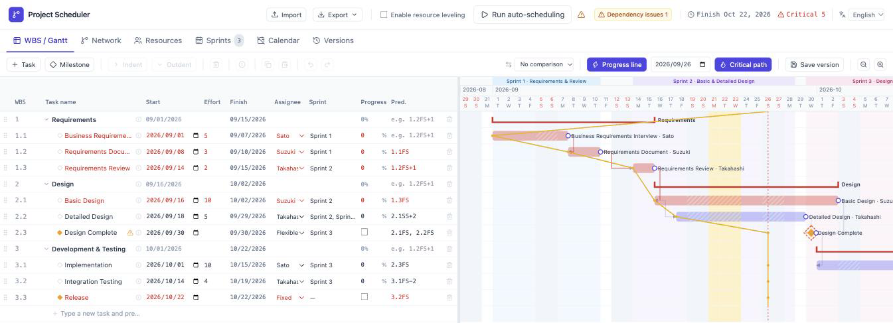

#### After running it

Once you run it, each task's start date is updated to reflect the predecessor's finish date and the sprint start date, and the Gantt chart — including downstream tasks — is recalculated. In the example below, everything from Basic Design onward has been pushed back to match the dependencies. This particular change pushes things past the "Release" milestone's fixed date (2026/10/22), so the dependency-issue warning is still showing. We'll look at the details of that warning in the next section, "Warning about dependency conflicts."

### Getting warned about dependency conflicts

Typos in a predecessor field or a change in plans can leave your dependencies in an inconsistent state. `Project Scheduler` automatically detects the following four kinds of conflicts in both the WBS table and the Gantt chart, flagging them with a warning icon or a dashed border:

* Circular references (including cycles that pass through a group)
* Dependencies on a predecessor task that no longer exists (for example, one that's been deleted)
* A displayed start date that doesn't satisfy the dependency's conditions (FS/SS/FF/SF, lead/lag)
* A fixed milestone whose date has been overrun

Open the list dialog from "Dependency issues" at the top of the screen to see the affected task and the cause for each type of conflict — clicking an item jumps to that task. Schedules aren't fixed automatically, so you resolve a conflict with the dependency's own conditions by running "Run auto-scheduling"; circular references and dependencies on nonexistent tasks need to be fixed directly in the "Pred." field. A fixed-date overrun is resolved by revisiting the date, the assignee, or the effort.

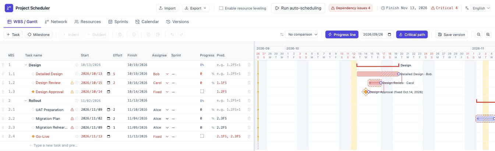

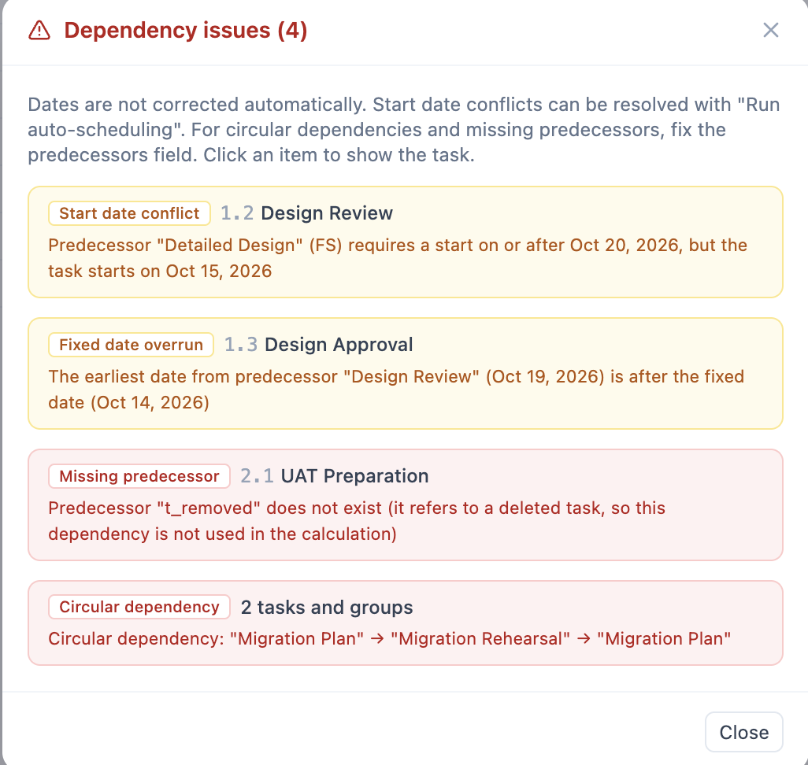

### Level the schedule against resource constraints

On the "Resources" screen, you can set a weekly/monthly working-day cap for each assignee. After assigning people to tasks on the WBS/Gantt screen, choose "Enable resource leveling" at the top of the screen, then press "Run auto-scheduling."

On the weekly workload chart, the red dashed line marks the weekly cap. A week where work piles up past that cap is shown in red and becomes a target for leveled scheduling.

#### Before leveling

In the example below, we've set Sato's weekly cap to 4 person-days for illustration. The week of October 5 has 5 person-days of work assigned, which you can see exceeding the cap as a red bar.

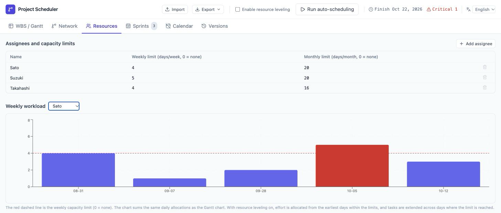

#### After leveling

Once leveling is enabled, the work is spread across multiple weeks so each week's load stays within the cap. In this example, the work from the over-capacity week is redistributed to the weeks before and after it, fitting within the plan without overrunning the fixed date. If staying within the cap would make it impossible to meet the release's fixed date, a warning appears at the top of the screen — so you can see cases where a resource constraint and a fixed milestone can't both be satisfied, and decide whether to adjust the assignee, the effort, or the date.

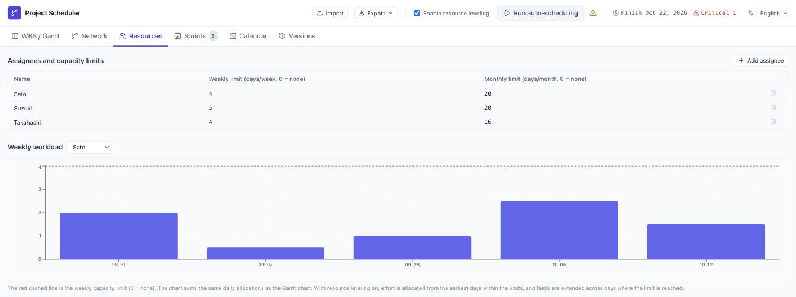

Leveling works by allocating effort day by day, starting from the earliest possible day, based on the remaining daily/weekly/monthly working capacity. A task's duration is extended around any day where the cap is hit, and days with no allocation are shown with a cross-hatch pattern inside the task's Gantt bar. Hover over the bar, or focus it with the keyboard, to see a tooltip explaining why a day has no allocation — it's either taken up by another task, or it hit the weekly or monthly cap.

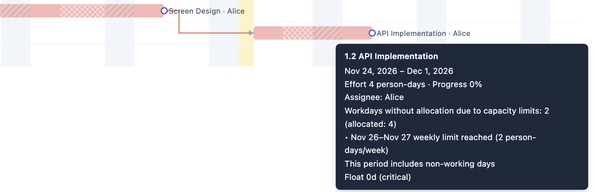

### Schedule with sprints linked in

On the "Sprints" screen, define each sprint's name, theme, start date, and finish date. Link a defined sprint from the "Sprint" column on each task on the WBS/Gantt screen.

#### Defining sprints

Enter a theme and a period for each sprint. The timeline at the bottom of the screen shows how the sprints overlap and how long each one runs.

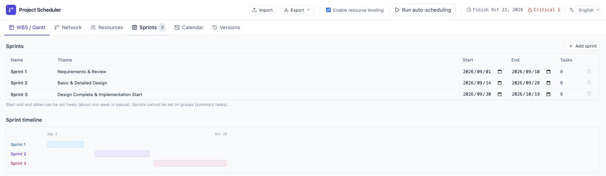

#### After linking tasks

Once a task is linked to a sprint, scheduling takes into account that the task shouldn't start before that sprint's start date. You can check the link in the WBS's "Sprint" column, and the sprint's period is shown as a band on the Gantt chart. If a task's schedule falls outside its sprint's period, you'll see an alert.

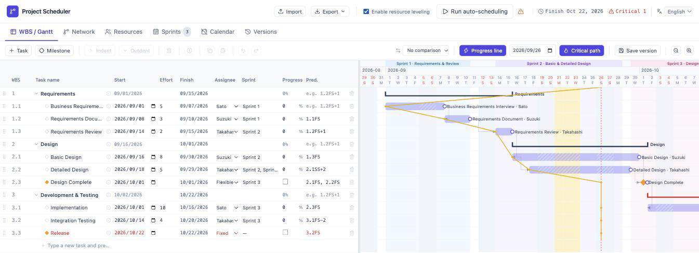

### Save a version to track how the schedule changes

When you've agreed on an initial plan, or before making a change, click "Save version" on the WBS/Gantt screen to keep a snapshot. This saves not just the tasks, but the resource and sprint settings too, as they stood at that moment.

After that, once you've changed the effort, dependencies, assignees, or whatever else and rescheduled, pick a saved version from the comparison list in the toolbar. The current tasks are matched up against the saved version by WBS number, and a row for the baseline version is shown underneath each task. You can also see the difference in finish dates, which makes it easy to track how many days behind the baseline plan each task has slipped.

In the figure below, we're comparing a baseline "Version 1" against the plan after rescheduling with a revised effort estimate for "Requirements Document." The lighter baseline row sits right under each current row, and you can see that the finish dates for downstream tasks like Basic Design and Integration Testing have slipped 9 days from the baseline.

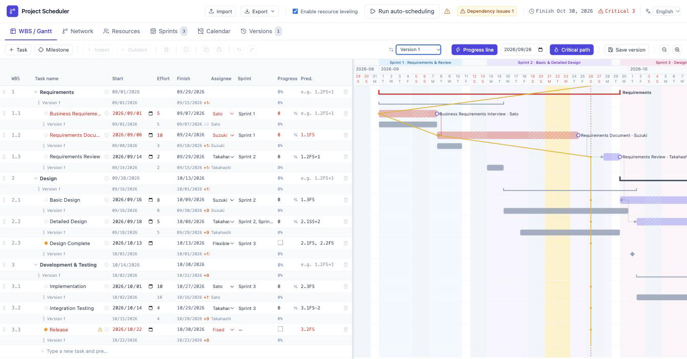

You can rename a saved version from the "Versions" screen, and restore the tasks, resources, and sprints back to that point in time if you need to. This is handy for checking the before-and-after impact of a change before you explain it to the team.

### Switch the UI between Japanese and English

Use the language switcher in the top-right of the header to switch the UI between Japanese and English. On first load, it follows your browser's language setting, and whichever language you pick is saved in your browser (it isn't stored in the project's JSON). Switching languages only affects interface text — menus, dialogs, tooltips, and so on. Whatever you've typed into your own plan — task names, assignee names, and so on — stays exactly as you typed it, and Japanese public holidays keep their Japanese names either way.

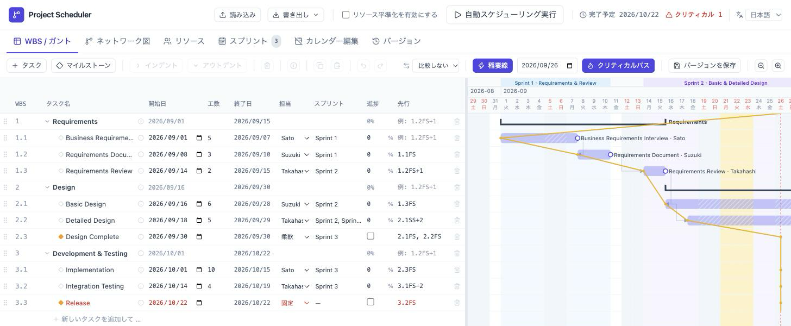

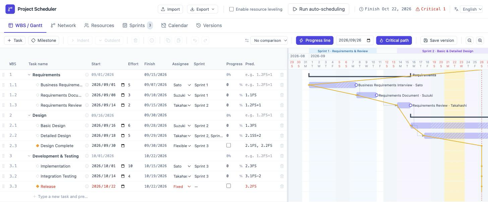

The Live Demo also has a `/ja/` page that always opens in Japanese and an `/en/` page that always opens in English. These are handy if you're sharing the same project with overseas team members and everyone wants to open it in the language they're most comfortable with.

* [Live Demo (Japanese-only)](https://lhideki.github.io/project-scheduler/ja/)
* [Live Demo (English-only)](https://lhideki.github.io/project-scheduler/en/)

## AI-Agent Scheduling and Backlog Integration

`Project Scheduler` ships with a Skill for Claude Code. Since it can read and write the saved JSON directly (the `schemaVersion: 1` format produced by "Export"), you can hand off requests like "push this task back two weeks and auto-adjust the dependent tasks," "level the workload so nobody's double-booked," or "redraw the schedule accounting for the delay on this task that's already in progress" to an AI agent without touching the UI at all. CPM recalculation, resource leveling, and consistency checks are handled by the bundled CLI, and the Skill shows you a report of the intended changes before it writes anything to the JSON, once you approve it. The state before the change is automatically saved as a snapshot, so you can check it from the app's own version comparison/restore feature.

The same plugin also bundles a Skill that syncs the saved JSON with a [Backlog](https://backlog.com/) project — direct integration with JIRA/Backlog starts with Backlog first.

* **Scheduler → Backlog**: Creates and updates issues from the plan. It reflects the already-computed start/due dates, so the JSON format itself doesn't change.
* **Backlog → Scheduler**: Pulls in issue progress and redraws and saves the schedule.

The mapping to Backlog (project key, type/status mapping, assignee mapping, and so on) is managed in a sidecar file kept alongside the saved JSON, so Project Scheduler's own JSON schema is never changed. Writes to Backlog are shown as a diff report first, and only proceed once you approve them. Issues are never deleted automatically — an issue whose corresponding task has disappeared from the Scheduler side is just listed as "orphaned." If the two sides disagree, nothing is auto-merged either; you're asked which side should win, task by task and field by field.

JIRA integration isn't implemented yet, but the same approach used for Backlog — pull an issue's status, remaining work, assignee, and due date, and translate that into WBS, dependency, and sprint information — should extend to other task-management tools the same way. It makes sense to start any read from an issue tracker as read-only, with a human reviewing and approving the proposed changes before they're applied. The people on the project should keep ownership of planning decisions, while an AI agent can be used to widen the set of options for replanning.

## Wrap-up

With `Project Scheduler`, defining a task's effort and dependencies is enough to get the WBS and Gantt chart's schedule computed automatically. Conflicts like circular references or start dates that don't satisfy a dependency show up as warnings you can check, and setting a working-day cap per assignee gets you resource leveling based on day-by-day allocation too. Link sprints in and you can see the iteration schedule alongside everything else, and saving a plan as a version lets you check the before-and-after schedule difference task by task. When something can't be satisfied alongside a constraint like a fixed date, you'll see it as a warning, so you can weigh the trade-offs of each constraint as you revise the plan.

Since it runs entirely in the browser with no server to set up, it's useful for working out release plans in agile development or organizing a schedule proposal locally before sharing it with the team. The UI can be switched between Japanese and English, so a team that includes members overseas can share the same plan. Start with the [Live Demo](https://lhideki.github.io/project-scheduler/), and check the [hands-on tutorial](https://www.inoue-kobo.com/webservice/tutorial-project-scheduler/) (Japanese) for the specifics of building a plan.

With the Skill for Claude Code, you can hand off scheduling and bidirectional Backlog syncing to an AI agent. Direct JIRA integration isn't implemented yet, but the plan is to keep growing this — using AI agents along the way — on top of the published HTML and bundled Skill, adapted to how each team actually works. I think this is useful not just for building the initial plan, but for ongoing replanning too. The source code is published under the MIT License.
