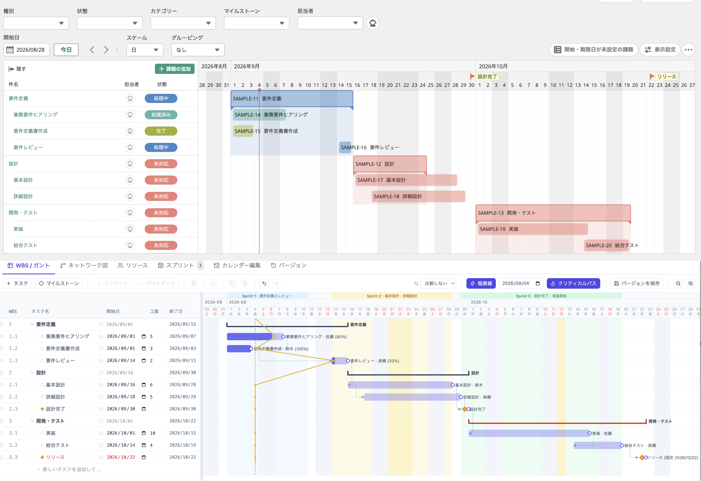
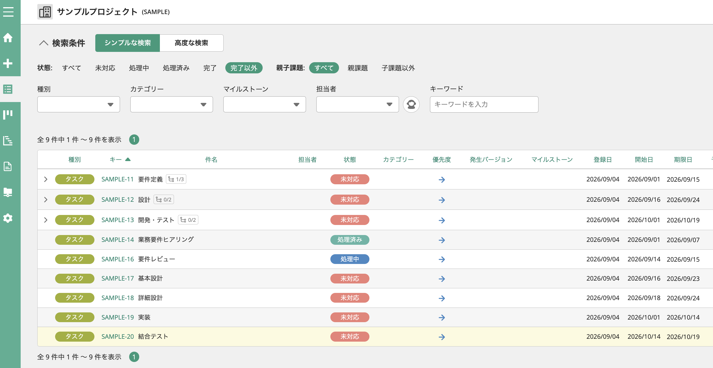
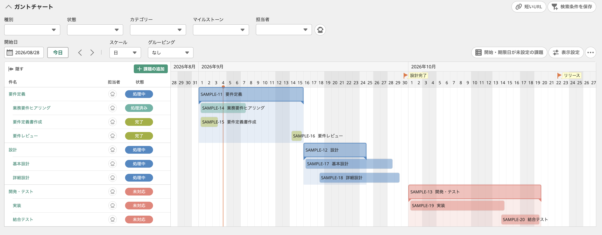
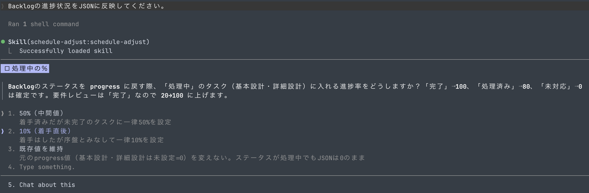
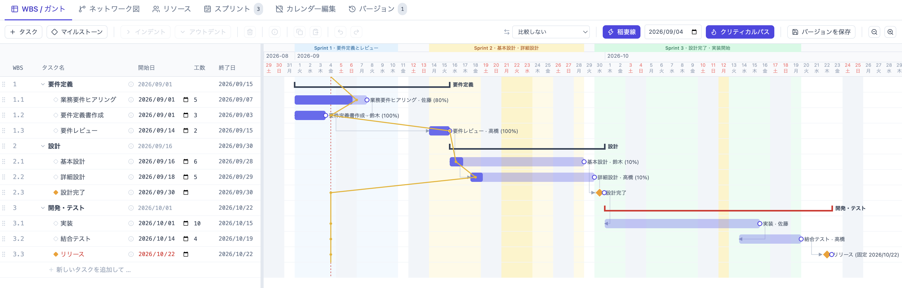

# プロジェクトのスケジュールをProject Schedulerで調整し、タスクをBacklogで管理する

プロジェクト管理ツールとして有名な [Backlog](https://backlog.com/) 用のCLIツールとして [bee](https://nulab.github.io/bee/getting-started/) がリリースされました。CLIツールは単独で使っても便利ですが、最近はAIエージェントから利用することを想定しており、ご多分に漏れずbeeもAIエージェント用のSkillを提供しています。

今回、Backlog用のCLIツールであるbeeを利用し、[Project Scheduler](https://github.com/lhideki/project-scheduler) で作成したプロジェクトスケジュールをBacklogに反映させる方法について試してみました。CPM(クリティカルパス法)に基づくスケジューリングはProject Schedulerで行い、個々のタスク管理をBacklogで行うという運用を想定しています。



## bee をインストールする

まず、beeをインストールします。以下のコマンドを実行してください。`Node.js 20.18 以上` が必要です。

```bash
npm install -g @nulab/bee
```

今回は、AIエージェントからbeeを利用するため、Skillについても導入します。以下のコマンドを実行してください。

```bash
npx skills add nulab/bee --skill using-bee
```

## bee でログインする

beeを利用するには、まずBacklogにログインする必要があります。以下のコマンドを実行してください。

```bash
bee auth login
```

以下のパラメータの入力が求められます。事前に準備をお願いします。

* BacklogのスペースURL
* APIキー

### BacklogのスペースURLの確認方法

* https://help-center.backlog.com/%E3%82%B9%E3%83%9A%E3%83%BC%E3%82%B9ID-6a1d4d7f3abb3ada78c56587

### APIキーの取得方法

* https://support-ja.backlog.com/hc/ja/articles/360035641754-API%E3%81%AE%E8%A8%AD%E5%AE%9A

## Project Scheduler のスケジュールを用意する

Project Scheduler はStandalone HTMLとして利用が可能なブラウザベースのプロジェクトスケジューリングツールです。以下のURLからアクセスできます。全てのデータはローカルに保存され、サーバーに送信されることはありません。

* [Project Scheduler](https://lhideki.github.io/project-scheduler/)

今回、サンプルプロジェクトを用意しています。以下のファイル(JSONファイル形式)をダウンロードし、Project Schedulerで開いてください。

* [サンプルプロジェクト](./project-scheduler_2026-09-04.json)

Project Schedulerの画面上部の読み込みボタンから、先ほどダウンロードしたサンプルプロジェクト(JSONファイル形式)を選択することができます。


## Backlog にタスクを登録する

サンプルプロジェクト(JSONファイル形式)をダウンロードしたディレクトリに移動し、Claude Codeを起動してください。サンプルプロジェクト(JSON形式)を `project-scheduler_2026-09-04.json` というファイル名で保存している前提で、Claude Codeに以下のプロンプトを入力すると、Backlogにタスクを登録することができます。

```
@project-scheduler_2026-09-04.json の内容をBacklogに登録してください。

* 対象プロジェクト: <対象のプロジェクト名で置き換えてください>
* 開始日と終了日を合わせてください。
* タスクの進捗が80%は処理済み、100%は完了として反映してください。0%より大きい場合は処理中としてください。
* グループタスクと子タスクを親子タスクとして反映してください。
* マイルストーンはタスクでは無くマイルストーンとして登録してください。
```

以下のようにBacklogに登録されます。



Backlogのガントチャート画面では、Project Schedulerと同じように日程が調整されていることを確認することができます。


## Backlog の進捗を元に Project Scheduler のスケジュールを更新する

今度はBacklogのステータス(進捗状況)を元にProject Schedulerのスケジュールを更新してみます。以下のようにBacklog側のステータスを更新します。



Claude Codeにて、以下のように指示してください。

```
Backlogの進捗状況をJSONに反映してください。
```

Backlogのステータスと進捗率の対応付けについて質問されるため、想定の進捗率を入力してください。ここでは10%を選択しています。



更新されたJSONを読み込み直すと、Project Schedulerの進捗率がBacklogのステータスに基づいて更新されていることが確認できます。



## まとめ

プロジェクトにおけるチームでのタスク管理はBacklogのようなSaaSが欠かせません。しかしながら、スケジュール調整はプロジェクトマネージャが担うことが多く、チームメンバー全員に高価なスケジュール管理ツールは不要です。Project SchedulerはOSSであり、無料で利用可能です。Standalone HTMLとして動作するため、インストールも不要で手軽に利用できます。

Project Scheduler + Backlog + beeを利用することで、CPM(クリティカルパス法)に基づいた高度なスケジュール管理を行いながら、チームメンバーは普段使いなれたタスク管理ツールでタスク管理を行うことができます。

## 参考文献

* [Backlog](https://backlog.com/)
* [bee](https://nulab.github.io/bee/getting-started/)
* [Project Scheduler](https://github.com/lhideki/project-scheduler)