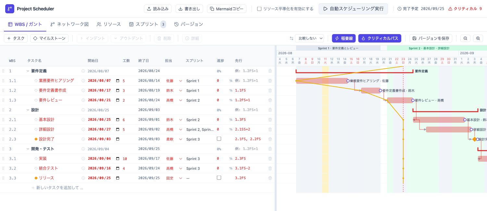
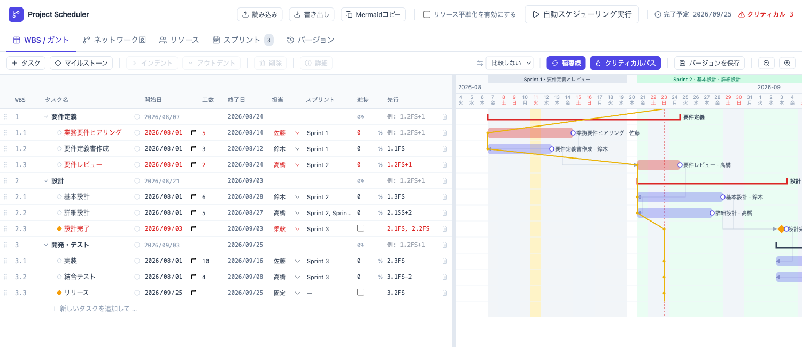
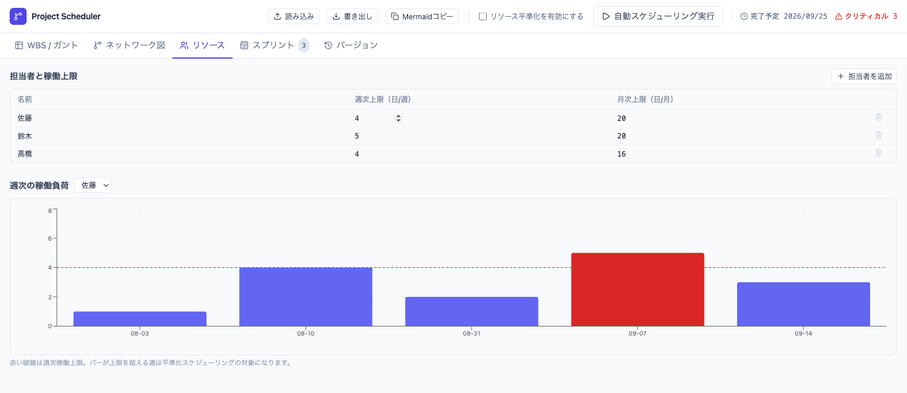
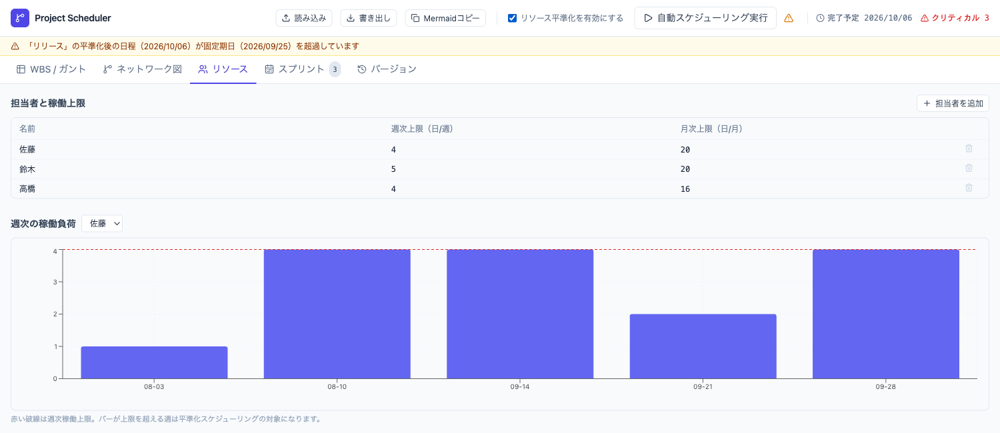
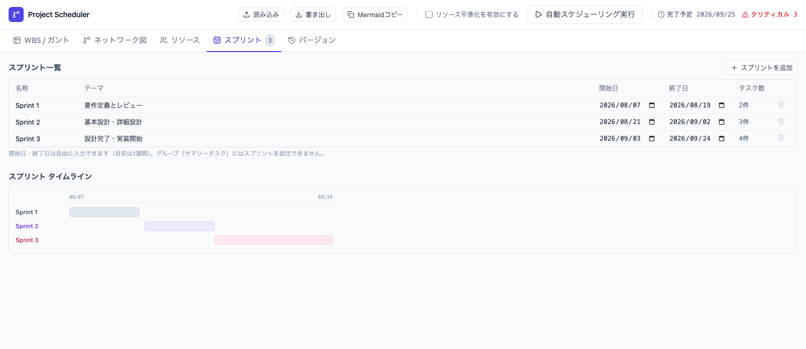
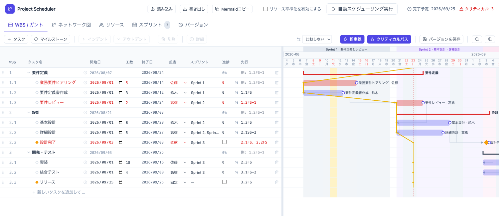
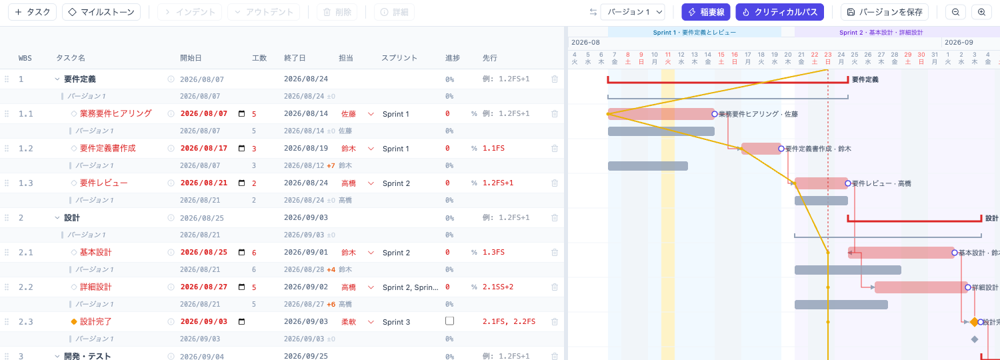

# ブラウザだけで使えるWBS／ガントチャート型プロジェクト管理ツールを作成しました

アジャイル開発でも、スプリントをまたぐ依存関係、リリース予定、担当者の稼働状況を見通しながら計画を調整したい場面があります。課題をJIRAやBacklogで管理していても、WBSの階層やタスクの依存関係、担当者の負荷を含めて日程を検討するには、別途計画を整理することが少なくありません。あるタスクの日程を変更するたびに、後続タスクや担当者の負荷を確認し直すのは手間がかかります。

`Project Scheduler` は、依存関係、マイルストーン、リソース、スプリントを考慮して自動スケジューリングできる、WBS／ガントチャート型のプロジェクト管理ツールです。サーバーやアカウント登録、インストールは必要ありません。`project_scheduler.html` をブラウザで開くだけで、日程案を検討できます。

ソースコードはGitHubで公開しています。

* [GitHub - lhideki/project-scheduler](https://github.com/lhideki/project-scheduler)

## モチベーション

アジャイル開発でも「いつ、何を完了させるか」をチームやプロダクトオーナーに説明する場面があります。スプリント単位で開発を進めていても、外部チームとの連携、リリース期限、複数の担当者にまたがる作業を考えると、依存関係とリソースを含めた計画が必要です。

Microsoft Projectのような高機能なプロジェクト管理ツールは有力な選択肢ですが、専用ツールの導入は敷居が高く、まず日程案を試したい小規模なチームやプロジェクトでは負担に感じられることがあります。そこで、ブラウザで開くだけで使え、必要なときにWBSとガントチャートを確認できる軽量なツールを作成しました。

また、JIRAやBacklogは日々のタスク管理に適していますが、WBSの定義や依存関係・リソースを含むスケジュールの見通しを立てる用途には、そのままでは扱いにくいことがあります。本ツールは、それらのタスク管理ツールと連携する実装を始めるためのベースラインです。各現場でAIエージェントを利用し、必要な項目やルールを追加してカスタマイズしていくことを想定しています。

## 前提条件

* GitHubから `project_scheduler.html` をダウンロード済みであること。
* Chrome、Edge、Safariなどのモダンブラウザを利用できること。

## Project Schedulerを起動する

ダウンロードした `project_scheduler.html` をブラウザで開きます。初回起動時にはサンプルのWBSが表示されるため、画面の各項目を確認しながら自分のプロジェクトのタスクに置き換えていきます。

入力した内容は、開いているブラウザのローカルストレージに自動保存されます。別の端末で利用する場合やバックアップを取る場合は、画面上部の「書き出し」からJSONファイルとして保存します。

## 主な機能

| 機能 | 概要 |
| --- | --- |
| WBS／ガントチャート | タスクを階層的に管理し、開始日・終了日・工数・担当者・進捗をガントチャートで確認できます。 |
| 依存関係とマイルストーン | FS／SS／FF／SFの4種類の依存関係、リード・ラグ、柔軟／固定のマイルストーンを設定できます。 |
| クリティカルパス | CPMにより余裕日数とクリティカルパスを計算し、日程への影響が大きいタスクを確認できます。 |
| ネットワーク図 | タスクの依存関係をネットワーク図で表示し、Mermaid形式でコピーできます。 |
| リソース平準化 | 担当者ごとの週次・月次上限を設定し、負荷が集中しないように日程を調整できます。 |
| スプリント管理 | スプリントの期間とテーマを定義し、タスクに紐付けてガントチャート上に表示できます。 |
| バージョン比較とデータ入出力 | 任意の時点の計画をスナップショットとして保存し、現在の計画と比較・復元できます。JSON形式での書き出し・読み込みにも対応しています。 |

## 使い方

### タスク、工数、依存関係からスケジュールを作成する

WBSにタスクを登録し、各タスクの工数を人日で入力します。担当者を設定し、先行タスクがある場合は「先行」列にWBS番号を指定します。

依存関係は、たとえば `1.2FS+1` のように入力します。これは「WBS 1.2の完了後、1稼働日を空けて開始する」という意味です。FSのほか、SS／FF／SFの関係やリード・ラグも指定できます。

設定後に画面上部の「自動スケジューリング実行」を選択すると、依存関係、工数、稼働日を考慮して開始日・終了日が計算されます。計算結果は、右側のガントチャートとタスク一覧の終了日で確認できます。

#### 実行前

実行前は、各タスクに入力した開始日がそのまま表示されています。先行タスクと工数、担当者、スプリントの指定内容を確認してから実行します。

#### 実行後

実行すると、先行タスクの完了やスプリントの開始日を踏まえて各タスクの開始日が更新され、後続タスクを含むガントチャートが再計算されます。以下の例では、要件定義書作成以降のタスクが依存関係に合わせて後ろ倒しになっています。

### リソースを考慮して平準化する

「リソース」画面では、担当者ごとに週次・月次の稼働上限を設定できます。WBS／ガント画面でタスクに担当者を割り当てた後、画面上部の「リソース平準化を有効にする」を選択し、「自動スケジューリング実行」を押下します。

週次の稼働負荷グラフでは、赤い破線が週次上限です。作業量が集中して上限を超える週は赤く表示され、平準化スケジューリングの対象になります。

#### 平準化前

以下の例では、説明用に佐藤の週次上限を4人日に設定しています。9月7日の週は5人日の作業が割り当てられており、上限を超えていることが赤いバーで確認できます。

#### 平準化後

平準化を有効にすると、作業が複数週に分散され、各週の負荷が上限内に収まります。一方で、この例ではリリースの固定期日に間に合わなくなるため、画面上部に警告が表示されます。リソース制約と固定マイルストーンを両立できない場合を確認し、担当者・工数・期日のどれを見直すか判断できます。

### スプリントを紐付けてスケジューリングする

「スプリント」画面で、スプリント名、テーマ、開始日、終了日を定義します。定義したスプリントは、WBS／ガント画面の各タスクの「スプリント」列から紐付けます。

#### スプリントを定義する

スプリントごとにテーマと期間を入力します。画面下部のタイムラインでは、各スプリントの重なりや期間を確認できます。

#### タスクを紐付けた後

タスクにスプリントを紐付けると、そのスプリントの開始日より前にタスクを開始しないように考慮してスケジューリングされます。WBSの「スプリント」列で紐付けを確認でき、ガントチャート上ではスプリント期間が帯で表示されます。予定がスプリント期間から外れる場合は、アラートで確認できます。

### バージョンを保存して、日程の変化を確認する

初回の計画を合意したときや、計画を変更する前には、WBS／ガント画面の「バージョンを保存」をクリックしてスナップショットを残します。タスクだけでなく、リソースとスプリントの設定もその時点の状態で保存されます。

その後、工数・依存関係・担当者などを変更して再スケジューリングしたら、ツールバーの比較用リストから保存済みのバージョンを選択します。現在のタスクと保存時点のタスクをWBS番号で突き合わせ、各タスクの下に基準バージョンの行を表示します。終了日の差分も確認できるため、「どのタスクが基準計画から何日遅れているか」を追いやすくなります。

下図では、基準の「バージョン 1」と自動スケジューリング後の計画を比較しています。現在の行の直下に薄い色の基準行が重なり、要件定義書作成では終了日が基準より7日遅くなったことを確認できます。

保存済みのバージョンは「バージョン」画面から名前を変更でき、必要に応じてその時点のタスク・リソース・スプリントの状態へ戻すこともできます。計画変更をチームへ説明する前に、変更前後の影響を確認する用途に便利です。

## 現場に合わせた拡張: JIRA／BacklogとAIエージェント

現時点では、JIRAやBacklogとの直接連携は実装していません。本ツールをベースに、現場で使っているタスク管理ツールとつなぎ、AIエージェントを利用してチームに合わせてカスタマイズすることを想定しています。

たとえば、JIRAやBacklogから課題のステータス、残作業、担当者、期限、ブロッカーを取得し、現場のルールに沿ってWBS、依存関係、スプリントの情報に変換します。AIエージェントを実装の補助に使えば、独自フィールドの対応、担当者の稼働ルール、課題とWBSの対応付けなどを、必要な範囲から追加できます。

連携後は、AIエージェントを日程案の推奨にも利用できます。依存関係・リソース上限・スプリント予定と実績を突き合わせ、「期限に間に合わせるにはどのタスクを分割するか」「どの担当を変更すれば負荷を平準化できるか」「スプリントの範囲をどう見直すか」といった複数の計画案と、その根拠を提示します。

課題管理ツールからの情報取得は、まず読み取り専用で始め、人が提案内容を確認・承認してから反映する形が適切です。プロジェクトごとに異なる項目や運用ルールを扱えることが、このベースラインを現場で利用する価値だと考えています。計画の判断責任はプロジェクトの関係者が持ちつつ、AIエージェントを再計画の選択肢を増やす補助として利用できます。

## まとめ

`Project Scheduler` では、タスクの工数と依存関係を定義するだけで、WBSとガントチャートの予定を自動計算できます。担当者ごとの稼働上限を設定すればリソース平準化もでき、スプリントを紐付ければイテレーションの予定も含めて日程を確認できます。計画をバージョンとして保存すれば、変更前後の日程差分をタスク単位で確認できます。固定期日などの条件と両立できない場合は警告で確認できるため、制約ごとのトレードオフを把握しながら計画を見直せます。

サーバーを用意せずにブラウザだけで利用できるため、アジャイル開発におけるリリース計画や、チームで共有する日程案をまずローカルで整理したい場合に利用できます。JIRAやBacklogとの直接連携は未実装ですが、公開されたHTMLをベースに、AIエージェントも活用しながら現場の運用に合わせて育てていくことを想定しています。計画作成だけでなく、継続的な再計画にも活用できると考えています。ソースコードはMIT Licenseで公開しています。
