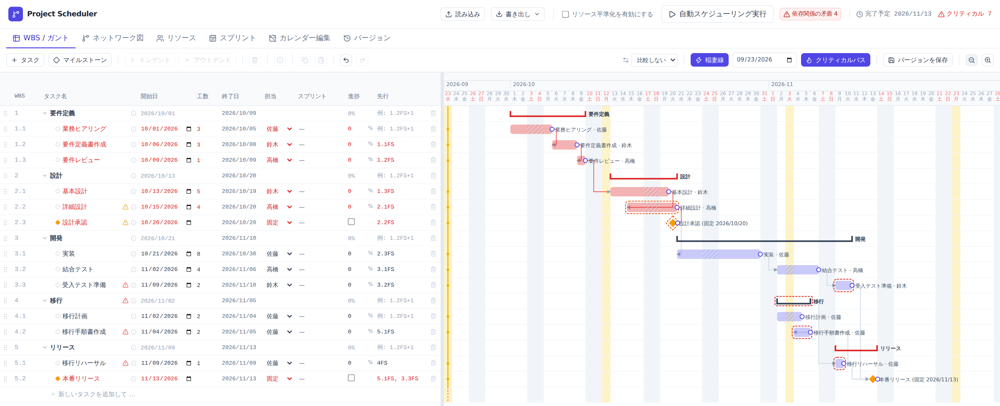
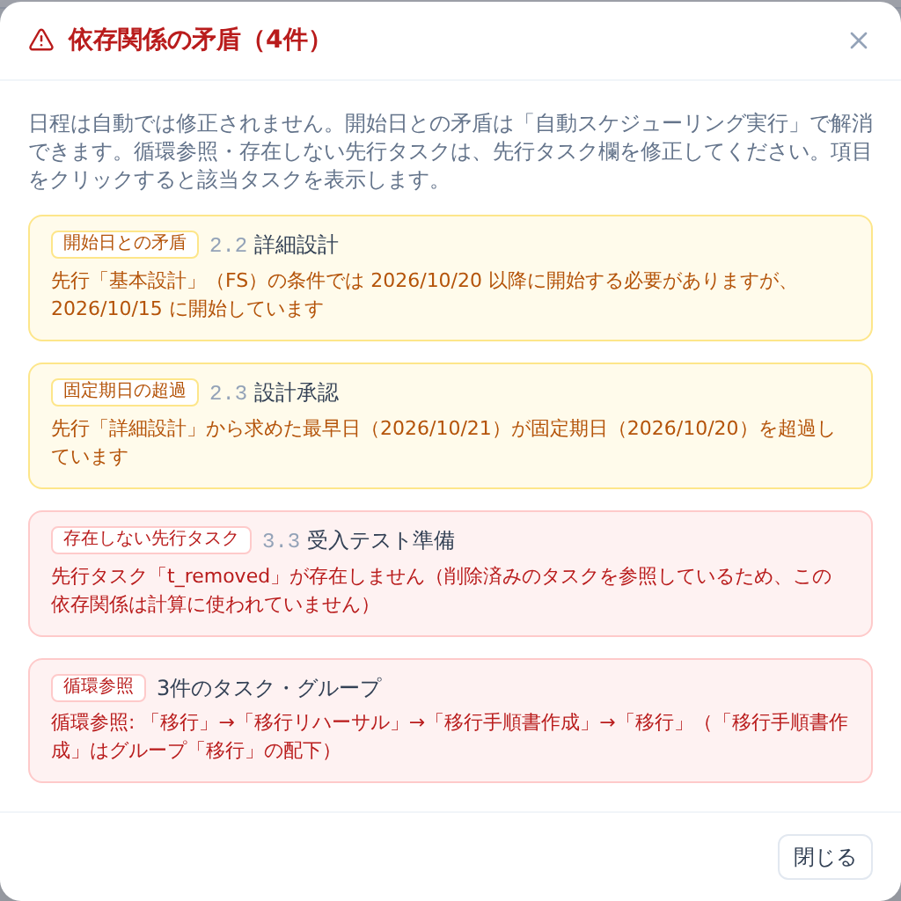
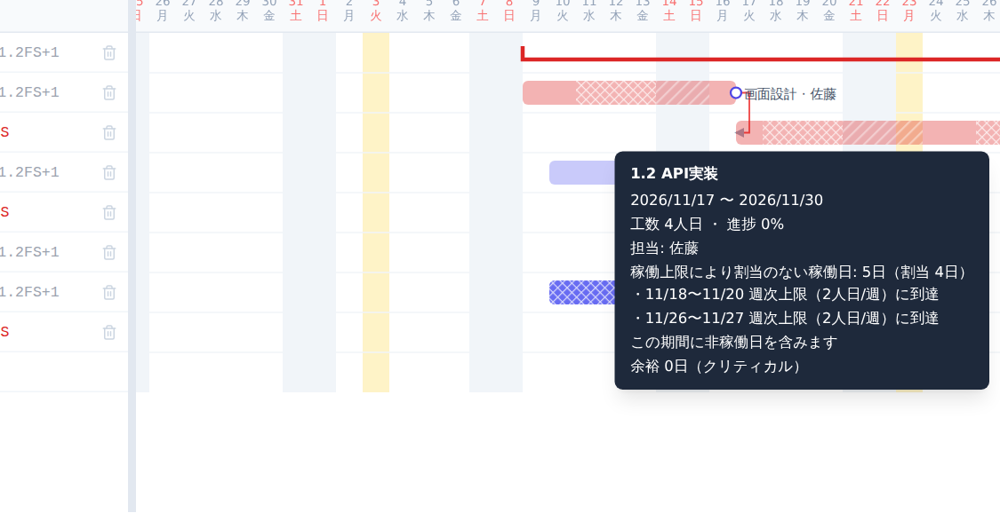
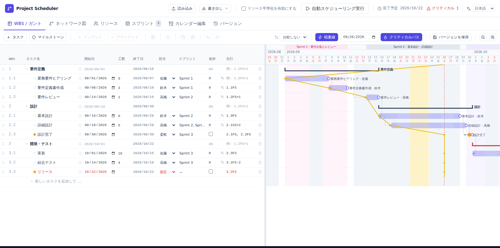
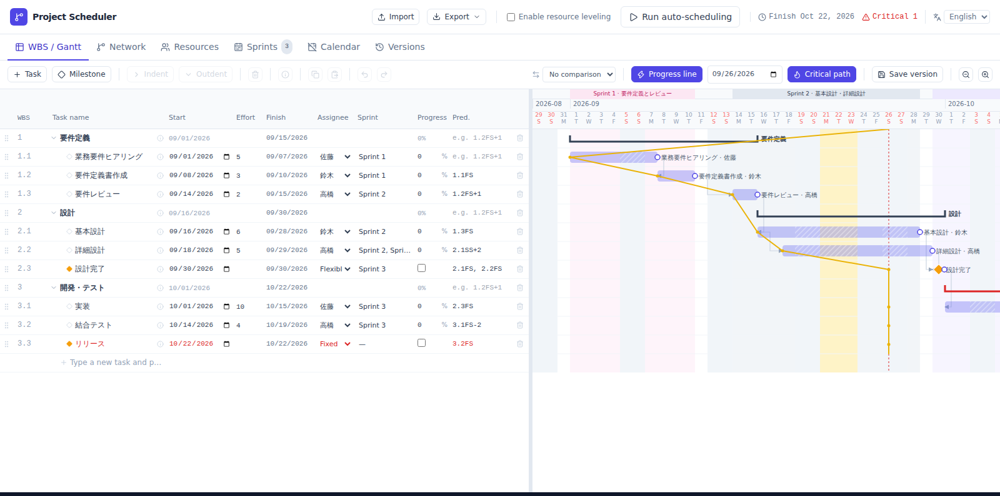

# ブラウザだけで使えるWBS／ガントチャート型プロジェクト管理ツールを作成しました

アジャイル開発でも、スプリントをまたぐ依存関係、リリース予定、担当者の稼働状況を見通しながら計画を調整したい場面があります。課題をJIRAやBacklogで管理していても、WBSの階層やタスクの依存関係、担当者の負荷を含めて日程を検討するには、別途計画を整理することが少なくありません。あるタスクの日程を変更するたびに、後続タスクや担当者の負荷を確認し直すのは手間がかかります。

`Project Scheduler` は、依存関係、マイルストーン、リソース、スプリントを考慮して自動スケジューリングできる、WBS／ガントチャート型のプロジェクト管理ツールです。サーバーやアカウント登録、インストールは必要ありません。Live Demoをブラウザで開くだけで、日程案を検討できます。オフラインで利用したい場合は、単一HTML版の `project_scheduler.html` をダウンロードできます。画面表示は日本語・英語を切り替えられ、Claude Code向けのSkillを使えばAIエージェントに日程調整やBacklogとの同期を任せることもできます。

まず試す場合はLive Demoを開いてください。サンプルWBSを使って操作を確認した後、実践チュートリアルに沿って空の計画からWBSを作成できます。ソースコードと単一HTML版はGitHubで公開しています。

* [Project Scheduler Live Demo](https://lhideki.github.io/project-scheduler/)
* [Project Scheduler実践チュートリアル](https://www.inoue-kobo.com/webservice/tutorial-project-scheduler/)
* [GitHub - lhideki/project-scheduler](https://github.com/lhideki/project-scheduler)

## モチベーション

アジャイル開発でも「いつ、何を完了させるか」をチームやプロダクトオーナーに説明する場面があります。スプリント単位で開発を進めていても、外部チームとの連携、リリース期限、複数の担当者にまたがる作業を考えると、依存関係とリソースを含めた計画が必要です。

Microsoft Projectのような高機能なプロジェクト管理ツールは有力な選択肢ですが、専用ツールの導入は敷居が高く、まず日程案を試したい小規模なチームやプロジェクトでは負担に感じられることがあります。そこで、ブラウザで開くだけで使え、必要なときにWBSとガントチャートを確認できる軽量なツールを作成しました。

また、JIRAやBacklogは日々のタスク管理に適していますが、WBSの定義や依存関係・リソースを含むスケジュールの見通しを立てる用途には、そのままでは扱いにくいことがあります。本ツールは、それらのタスク管理ツールと連携するためのベースラインとしても使えるように、Claude Code向けのSkillを同梱しています。Backlogとは同梱のSkillで双方向同期でき、各現場でAIエージェントを利用し、必要な項目やルールを追加してカスタマイズしていくことを想定しています。

## 前提条件

* Chrome、Edge、Safariなどのモダンブラウザを利用できること。
* オフラインで利用する場合は、GitHubから `project_scheduler.html` をダウンロード済みであること。

## Project Schedulerを起動する

Live Demoをブラウザで開きます。保存済みデータがない場合はサンプルのWBSが表示されるため、まずは「基本設計」の工数を6人日から10人日に変更し、画面上部の「自動スケジューリング実行」を選択します。後続タスクの日程、完了予定日、クリティカルパスが変化することを確認できます。

入力した内容は、開いているブラウザのローカルストレージに自動保存されます。Live DemoとダウンロードしたHTMLは保存領域が異なるため、同じ端末でも入力内容は自動共有されません。別の端末やブラウザへ移す場合、Live Demoとダウンロード版の間で移す場合、バックアップを取る場合は、画面上部の「書き出し」からJSONファイルとして保存し、移行先で「読み込み」を実行します。

ブラウザのプライベートモードやサイトデータの削除によって入力内容が消える場合があります。重要な計画は定期的にJSONファイルへ書き出してください。JSONのフィールドと読み込み条件は、GitHubの[JSON保存形式](https://github.com/lhideki/project-scheduler/blob/master/docs/json-format.md)で確認できます。

## 主な機能

| 機能 | 概要 |
| --- | --- |
| WBS／ガントチャート | タスクを階層的に管理し、開始日・終了日・工数・担当者・進捗をガントチャートで確認できます。日・週・月単位のズームや、タスクバーのホバー／キーボードフォーカスで表示するツールチップにも対応しています。 |
| WBS編集操作 | 矢印キーによるセル移動、セル・行単位のコピー＆ペースト、Undo／Redoに対応しています。 |
| 依存関係とマイルストーン | FS／SS／FF／SFの4種類の依存関係、リード・ラグ、柔軟／固定のマイルストーンを設定できます。 |
| 依存関係の矛盾検知 | 循環参照、存在しない先行タスクへの依存、依存条件を満たさない開始日、固定マイルストーンの期日超過を、WBS表とガントチャートで警告します。 |
| クリティカルパス | CPMにより余裕日数とクリティカルパスを計算し、日程への影響が大きいタスクを確認できます。 |
| ネットワーク図 | タスクの依存関係をネットワーク図で表示し、Mermaid形式でコピーできます。 |
| リソース平準化 | 担当者ごとの週次・月次上限を考慮し、空き容量に応じて工数を早い日から日別に割り当てます。上限に達した日は期間を延長し、割当のない日はガントチャートで網掛け表示します。 |
| カレンダー編集 | 土日・日本の祝日に加えて、会社独自の休日や休日出勤を個別に指定し、稼働日カレンダーを上書きできます。 |
| スプリント管理 | スプリントの期間とテーマを定義し、タスクに紐付けてガントチャート上に表示できます。 |
| バージョン比較とデータ入出力 | 任意の時点の計画をスナップショットとして保存し、現在の計画と比較・復元できます。JSON形式での書き出し・読み込みにも対応しています。 |
| 多言語対応 | 画面表示を日本語・英語で切り替えられます。Live Demoは、常に日本語・英語で開く専用ページも公開しています。 |
| 共有用HTML書き出し | 現在の計画を埋め込んだ1つのHTMLファイルを書き出せます。受け取った人はJSONファイルなしでブラウザから開いて確認できます。 |
| AIエージェント連携 | Claude Code向けのSkillを同梱し、保存JSONの日程調整や、Backlogとの双方向同期をAIエージェントに任せられます。 |

## 使い方

### タスク、工数、依存関係からスケジュールを作成する

WBSにタスクを登録し、各タスクの工数を人日で入力します。担当者を設定し、先行タスクがある場合は「先行」列にWBS番号を指定します。

依存関係は、たとえば `1.2FS+1` のように入力します。これは「WBS 1.2の完了後、1稼働日を空けて開始する」という意味です。FSのほか、SS／FF／SFの関係やリード・ラグも指定できます。

設定後に画面上部の「自動スケジューリング実行」を選択すると、依存関係、工数、稼働日を考慮して開始日・終了日が計算されます。計算結果は、右側のガントチャートとタスク一覧の終了日で確認できます。

#### 実行前

実行前は、各タスクに入力した開始日がそのまま表示されています。以下の例では「基本設計」の工数を6人日から10人日に変更した直後の状態を示しており、後続タスクの日程がまだ以前のまま残っているため、ヘッダーに「依存関係の矛盾」の警告が表示されています。

#### 実行後

実行すると、先行タスクの完了やスプリントの開始日を踏まえて各タスクの開始日が更新され、後続タスクを含むガントチャートが再計算されます。以下の例では、基本設計以降のタスクが依存関係に合わせて後ろ倒しになっています。今回の変更では、後ろ倒しの結果「リリース」の固定期日（2026/10/22）を超過するため、依存関係の矛盾が引き続き警告されます。この警告の詳細は次の「依存関係の矛盾を警告する」で確認できます。

### 依存関係の矛盾を警告する

先行タスクの入力ミスや計画変更によって、依存関係に矛盾が生じる場合があります。`Project Scheduler` は、以下の4種類の矛盾をWBS表とガントチャートで自動的に検出し、警告アイコンや破線の枠線で示します。

* 循環参照（グループを介した循環を含む）
* 存在しない先行タスクへの依存（削除済みタスクを参照している場合など）
* 表示中の開始日が依存関係の条件（FS／SS／FF／SF・リード／ラグ）を満たしていない
* 固定マイルストーンの期日超過

画面上部の「依存関係の矛盾」から一覧ダイアログを開くと、矛盾の種類ごとに該当タスクと原因を確認でき、項目をクリックすると該当タスクを表示します。日程は自動では修正されないため、依存条件との矛盾は「自動スケジューリング実行」で解消し、循環参照や存在しない先行タスクへの依存は先行タスク欄を修正します。固定期日の超過は、期日・担当者・工数のいずれかを見直して解消します。

### リソースを考慮して平準化する

「リソース」画面では、担当者ごとに週次・月次の稼働上限を設定できます。WBS／ガント画面でタスクに担当者を割り当てた後、画面上部の「リソース平準化を有効にする」を選択し、「自動スケジューリング実行」を押下します。

週次の稼働負荷グラフでは、赤い破線が週次上限です。作業量が集中して上限を超える週は赤く表示され、平準化スケジューリングの対象になります。

#### 平準化前

以下の例では、説明用に佐藤の週次上限を4人日に設定しています。10月5日の週は5人日の作業が割り当てられており、上限を超えていることが赤いバーで確認できます。

#### 平準化後

平準化を有効にすると、作業が複数週に分散され、各週の負荷が上限内に収まります。この例では、上限を超えていた週の作業が前後の週に振り分けられ、固定期日を超過することなく計画に収まっています。上限を超えたままではリリースの固定期日に間に合わなくなる場合は、画面上部に警告が表示されるため、リソース制約と固定マイルストーンを両立できないケースも確認しながら、担当者・工数・期日のどれを見直すか判断できます。

平準化は、工数を探索開始日から早い日順に、日次・週次・月次の残り稼働容量に応じて日単位で割り当てる方式です。上限に達した日を挟んでタスクの期間が延長され、割当のない日はガントチャートのタスクバー内に格子模様で網掛け表示されます。バーにカーソルを合わせるかキーボードでフォーカスすると、割当のない理由（他タスクで埋まっている・週次上限・月次上限のいずれか）をツールチップで確認できます。

### スプリントを紐付けてスケジューリングする

「スプリント」画面で、スプリント名、テーマ、開始日、終了日を定義します。定義したスプリントは、WBS／ガント画面の各タスクの「スプリント」列から紐付けます。

#### スプリントを定義する

スプリントごとにテーマと期間を入力します。画面下部のタイムラインでは、各スプリントの重なりや期間を確認できます。

#### タスクを紐付けた後

タスクにスプリントを紐付けると、そのスプリントの開始日より前にタスクを開始しないように考慮してスケジューリングされます。WBSの「スプリント」列で紐付けを確認でき、ガントチャート上ではスプリント期間が帯で表示されます。予定がスプリント期間から外れる場合は、アラートで確認できます。

### バージョンを保存して、日程の変化を確認する

初回の計画を合意したときや、計画を変更する前には、WBS／ガント画面の「バージョンを保存」をクリックしてスナップショットを残します。タスクだけでなく、リソースとスプリントの設定もその時点の状態で保存されます。

その後、工数・依存関係・担当者などを変更して再スケジューリングしたら、ツールバーの比較用リストから保存済みのバージョンを選択します。現在のタスクと保存時点のタスクをWBS番号で突き合わせ、各タスクの下に基準バージョンの行を表示します。終了日の差分も確認できるため、「どのタスクが基準計画から何日遅れているか」を追いやすくなります。

下図では、基準の「バージョン 1」と、要件定義書作成の工数を見直して再スケジューリングした後の計画を比較しています。現在の行の直下に薄い色の基準行が重なり、基本設計や結合テストなど後続タスクの終了日が基準より9日遅くなったことを確認できます。

保存済みのバージョンは「バージョン」画面から名前を変更でき、必要に応じてその時点のタスク・リソース・スプリントの状態へ戻すこともできます。計画変更をチームへ説明する前に、変更前後の影響を確認する用途に便利です。

### 画面表示を日本語・英語で切り替える

ヘッダー右上の言語切り替えから、画面表示を日本語・英語で切り替えられます。初回はブラウザの言語設定に合わせて表示され、選んだ言語はブラウザに保存されます（プロジェクトのJSONには含まれません）。サンプルデータや祝日名は日本語のままですが、メニューやダイアログ、ツールチップなどの画面文言は選んだ言語で表示されます。

Live Demoは、常に日本語で開く `/ja/` ページと、常に英語で開く `/en/` ページも公開しています。海外メンバーと同じプロジェクトを共有しつつ、それぞれが見慣れた言語で画面を開きたい場合に利用できます。

* [Live Demo（日本語固定）](https://lhideki.github.io/project-scheduler/ja/)
* [Live Demo（英語固定）](https://lhideki.github.io/project-scheduler/en/)

## AIエージェントによるスケジュール調整とBacklog連携

`Project Scheduler` は、Claude Code向けのSkillを同梱しています。保存JSON（「書き出し」で生成する`schemaVersion: 1`形式）を直接読み書きできるため、「このタスクを2週間後ろ倒しして依存タスクを自動調整」「担当者がかぶらないように平準化」「着手済みの遅延を踏まえて引き直す」といった依頼を、画面操作なしでAIエージェントに任せられます。CPM再計算・リソース平準化・整合性チェックは同梱のCLIが担当し、Skillは変更内容のレポートを提示してから、承認後にJSONへ書き込みます。変更前の状態はスナップショットとして自動保存されるため、アプリのバージョン比較・復元から確認できます。

同じプラグインには、保存JSONと[Backlog](https://backlog.com/)のプロジェクトを同期するSkillも同梱しており、JIRA／Backlogとの直接連携は、まずBacklog向けに実現しています。

* **Scheduler → Backlog**: 計画から課題を作成・更新します。計算済みの開始日・期限日を反映するため、JSON形式は変わりません。
* **Backlog → Scheduler**: 課題の進捗状況を取り込み、日程を引き直して保存します。

Backlogとの対応関係（プロジェクトキー、種別・ステータスの対応、担当者のマッピングなど）は、保存JSONの隣に置くサイドカーファイルで管理し、Project SchedulerのJSONスキーマ自体は変更しません。Backlogへの書き込みは差分レポートを提示し、承認を得てから行います。課題を自動で削除することはなく、Scheduler側から消えたタスクに対応する課題は「孤児」として一覧提示するだけにとどめています。双方向で内容が食い違った場合も自動でマージせず、タスク・フィールドごとにどちらを優先するか確認します。

JIRAとの連携は現時点では未実装ですが、Backlog向けの実装と同様に、課題のステータス・残作業・担当者・期限を取得してWBS、依存関係、スプリントの情報に変換する構成であれば、他のタスク管理ツールにも同じ考え方で広げられます。課題管理ツールからの情報取得はまず読み取り専用で始め、人が提案内容を確認・承認してから反映する形が適切です。計画の判断責任はプロジェクトの関係者が持ちつつ、AIエージェントを再計画の選択肢を増やす補助として利用できます。

## まとめ

`Project Scheduler` では、タスクの工数と依存関係を定義するだけで、WBSとガントチャートの予定を自動計算できます。循環参照や依存条件を満たさない開始日などの矛盾は警告として確認でき、担当者ごとの稼働上限を設定すれば日別の割当に基づくリソース平準化もできます。スプリントを紐付ければイテレーションの予定も含めて日程を確認でき、計画をバージョンとして保存すれば、変更前後の日程差分をタスク単位で確認できます。固定期日などの条件と両立できない場合は警告で確認できるため、制約ごとのトレードオフを把握しながら計画を見直せます。

サーバーを用意せずにブラウザだけで利用できるため、アジャイル開発におけるリリース計画や、チームで共有する日程案をまずローカルで整理したい場合に利用できます。画面表示は日本語・英語を切り替えられるため、海外メンバーを含むチームでも同じ計画を共有できます。まずは[Live Demo](https://lhideki.github.io/project-scheduler/)で試し、具体的な計画の作り方は[Project Scheduler実践チュートリアル](https://www.inoue-kobo.com/webservice/tutorial-project-scheduler/)で確認してください。

Claude Code向けのSkillを使えば、日程調整やBacklogとの双方向同期をAIエージェントに任せられます。JIRAとの直接連携は未実装ですが、公開されたHTMLと同梱のSkillをベースに、AIエージェントも活用しながら現場の運用に合わせて育てていくことを想定しています。計画作成だけでなく、継続的な再計画にも活用できると考えています。ソースコードはMIT Licenseで公開しています。
