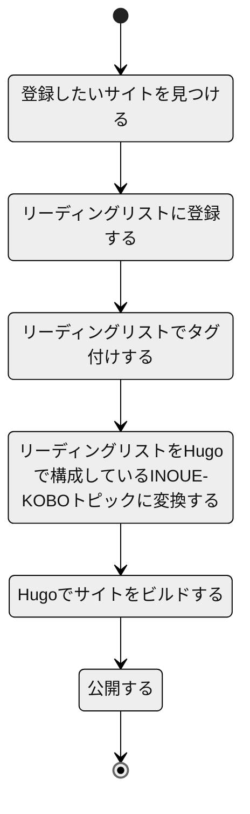
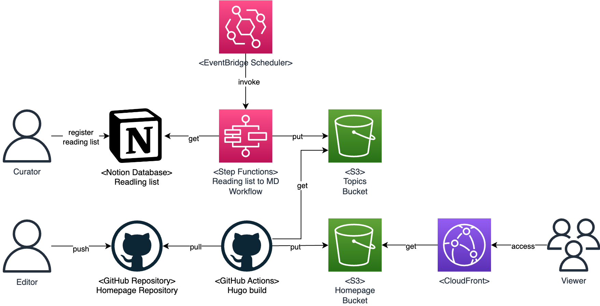
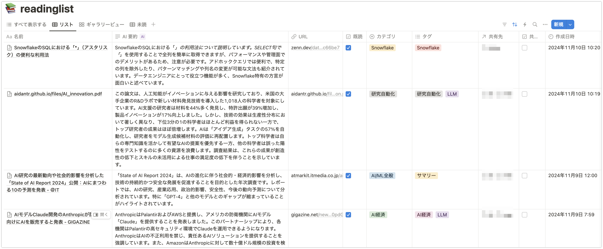
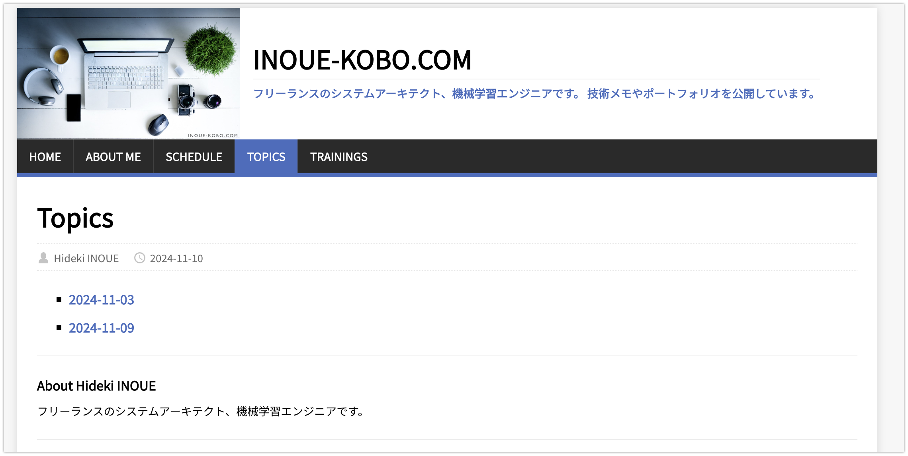
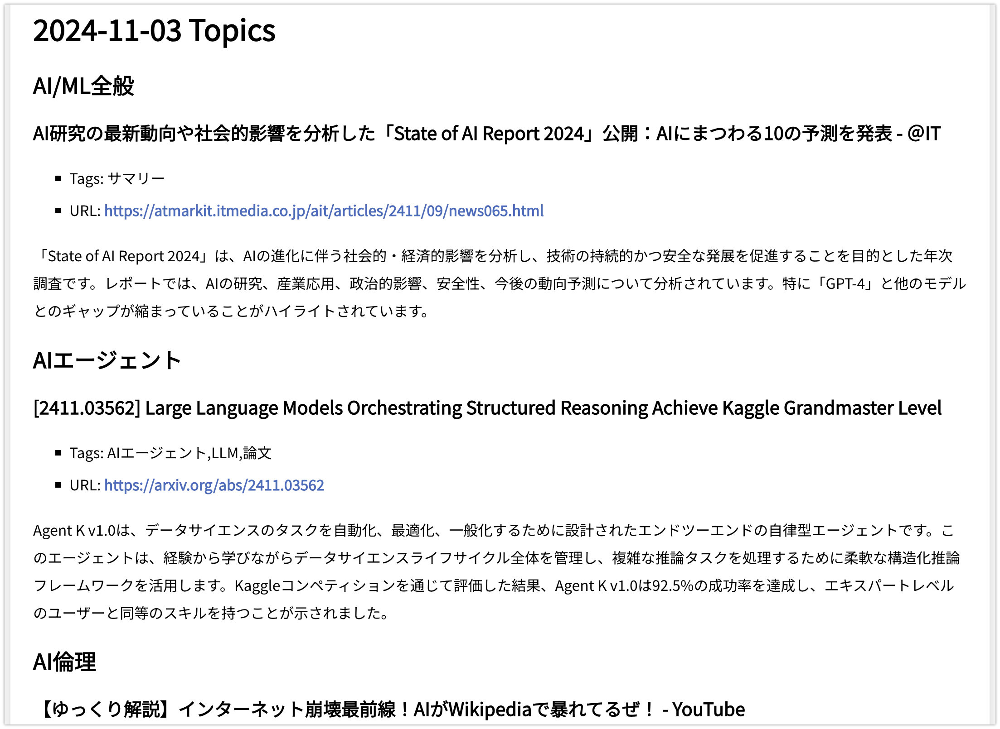

# Notion Database で管理しているリーディングリストをホームページに掲載する

Notion Database で管理しているリーディングリストを定期的かつ自動的にホームページに掲載する仕組みです。以下の運用を想定しています。



システム構成は以下のとおりです。



Hugo を利用したホームページ公開については、以下を参照してください。

-   [GitHub Actions + Hugo + AWS S3 + CloudFront でホームページをリニューアルしました](https://www.inoue-kobo.com/aws/hugo/)

## 登録したいサイトを見つける

ブラウザなどで閲覧中に登録したいサイトを見つけます。

## リーディングリストに登録する

リーディングリストへの登録では、以下の拡張機能を利用します。

-   [Notion Web Clipper](https://www.notion.so/ja/web-clipper)

リーディングリストを記録する Notion Database の構造は以下のとおりです。詳細は [Notion に記録した Web サイトのリーディングリストを Markdown 形式で出力するスクリプト](https://www.inoue-kobo.com/webservice/readinglist2md/) を参照してください。



## リーディングリストでタグ付けする

カテゴリやタグ、共有先などを Notion データベースで設定します。

## リーディングリストを Hugo で構成している INOUE-KOBO トピックに変換する

以下を AWS にデプロイします。

-   [GitHub - readinglist2inoue-kobo-topics](https://github.com/lhideki/readinglist2inoue-kobo-topics)

## Hugo でサイトをビルドする

GitHub Actions で定期的にビルドします。ワークフローの内容は以下のとおりです。`リーディングリストを Hugo で構成している INOUE-KOBO トピックに変換する`で Markdown ファイルとして S3 上に出力したトピックを、Hugo のコンテンツとして aws s3 sync でダウンロードし、Hugo でビルドします。

```yaml
name: Deploy into www.inoue-kobo.com
on:
    push:
        branches:
            - master
    workflow_dispatch:
    schedule:
        - cron: '0 0 * * 2' # 毎週火曜日の0時(JST 9時)に実行します。

jobs:
    build:
        runs-on: ubuntu-22.04
        steps:
            - name: Checkout
              uses: actions/checkout@v3
              with:
                  submodules: true

            - name: Configure AWS credentials
              uses: aws-actions/configure-aws-credentials@v1
              with:
                  aws-access-key-id: ${{ secrets.AWS_ACCESS_KEY_ID }}
                  aws-secret-access-key: ${{ secrets.AWS_SECRET_ACCESS_KEY }}
                  aws-region: ap-northeast-1

            - name: Download Topic Files from S3
              continue-on-error: true # s3 syncがexit code 2を返すため、エラーを無視します。
              env:
                  AWS_ACCESS_KEY_ID: ${{ secrets.AWS_ACCESS_KEY_ID }}
                  AWS_SECRET_ACCESS_KEY: ${{ secrets.AWS_SECRET_ACCESS_KEY }}
                  HOMEPAGE_S3_BUCKET: ${{ secrets.HOMEPAGE_S3_BUCKET }}
              run: |
                  aws s3 sync s3://$HOMEPAGE_S3_BUCKET/topics ./www/content

            - name: Setup Hugo
              uses: peaceiris/actions-hugo@v2
              with:
                  hugo-version: '0.138.0'
                  extended: true
                  path: /tmp/hugo_cache

            - name: Build Hugo
              working-directory:
              run: |
                  cd www
                  hugo --environment production

            - name: Upload file to S3
              env:
                  AWS_ACCESS_KEY_ID: ${{ secrets.AWS_ACCESS_KEY_ID }}
                  AWS_SECRET_ACCESS_KEY: ${{ secrets.AWS_SECRET_ACCESS_KEY }}
                  HOMEPAGE_S3_BUCKET: ${{ secrets.HOMEPAGE_S3_BUCKET }}
              run: |
                  aws s3 sync www/public s3://$HOMEPAGE_S3_BUCKET/docs-v2 --delete
                  aws cloudfront create-invalidation --region ap-northeast-1 --distribution-id E3JEKHZG9UN3GI --paths "/*"
```

## 公開する

以下の様にホームページ上で公開されます。





## 参考文献

-   [Notion に記録した Web サイトのリーディングリストを Markdown 形式で出力するスクリプト](https://www.inoue-kobo.com/webservice/readinglist2md/)
-   [GitHub - readinglist2inoue-kobo-topics](https://github.com/lhideki/readinglist2inoue-kobo-topics)
