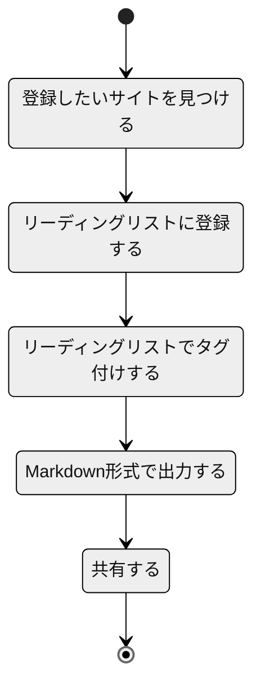
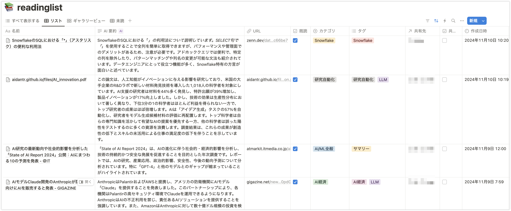

# Notion に記録した Web サイトのリーディングリストを Markdown 形式で出力するスクリプト

Notion に記録した Web サイトのリーディングリストを Markdown 形式で出力するスクリプトを作成しました。以下のような運用を想定しています。



## 事前準備

Notion においてリーディングリストを管理するためのデータベースを作成します。データベースのプロパティは以下のように設定します。

-   名前: タイトル
-   AI 要約: テキスト
-   URL: URL
-   既読: チェックボックス
-   カテゴリ: セレクト
-   タグ: マルチセレクト
-   共有先: リレーション
-   共有済: チェックボックス
-   作成日時: 作成日時



### 共有先について

リーディングリストを共有先毎に共有するという運用を想定しています。共有先については別のデータベースで管理している前提であるため、リレーションとして表現しています。別データベースとするまでも無い場合は、単純にセレクトでも構いません。

## 登録したいサイトを見つける

ブラウザなどで閲覧中に登録したいサイトを見つけます。

## リーディングリストに登録する

URL をコピーし、Notion のリーディングリストデータベースに登録することでも構いませんが、ブラウザの拡張機能を利用すると内容を含めてデータベースに登録し、AI 要約を活用することができるので便利です。以下の拡張機能を利用することができます。

-   [Notion Web Clipper](https://www.notion.so/ja/web-clipper)

## リーディングリストでタグ付けする

カテゴリやタグ、共有先などを Notion データベースで設定します。

## Markdown 形式で出力する

以下のスクリプトで共有先毎の Markdown ファイルを出力します。リーディングリストで共有済としたものについては、出力しません。

```
pip install notion-client==2.2.1
pip install Jinja2==3.1.4
pip install pandas==2.2.3
```

```python
from notion_client import Client
from dotenv import load_dotenv
from datetime import datetime
from jinja2 import Template
import pandas as pd
import os

load_dotenv(verbose=True)

notion = Client(auth=os.getenv("NOTION_API_KEY"))


def _get_customer_code(page_id):
    response = notion.pages.retrieve(
        **{
            "page_id": page_id,
        }
    )
    return response["properties"]["Customer Code"]["title"][0]["text"]["content"]  # type: ignore


def get_unshared_reading_list(database_id):
    response = notion.databases.query(
        **{
            "database_id": database_id,
        }
    )

    entries = []
    for page in response["results"]:  # type: ignore
        entry = {
            "名前": (
                page["properties"]["名前"]["title"][0]["text"]["content"]
                if page["properties"]["名前"]["title"]
                else None
            ),
            "AI 要約": (
                page["properties"]["AI 要約"]["rich_text"][0]["text"]["content"]
                if page["properties"]["AI 要約"]["rich_text"]
                else None
            ),
            "URL": page["properties"]["URL"]["url"],
            "既読": page["properties"]["既読"]["checkbox"],
            "カテゴリ": (
                page["properties"]["カテゴリ"]["select"]["name"]
                if page["properties"]["カテゴリ"]["select"]
                else None
            ),
            "タグ": [tag["name"] for tag in page["properties"]["タグ"]["multi_select"]],
            "共有先": (
                [
                    _get_customer_code(r["id"])
                    for r in page["properties"]["共有先"]["relation"]
                ]
                if page["properties"]["共有先"]["relation"]
                else None
            ),
            "共有済": page["properties"]["共有済"]["checkbox"],
            "作成日時": datetime.strptime(
                page["properties"]["作成日時"]["created_time"],
                "%Y-%m-%dT%H:%M:%S.%fZ",
            ),
        }
        if entry["共有済"]:
            continue
        entries.append(entry)

    return entries

database_id = "chamgeme" # リーディングリストとして作成したデータベースのIDで置き換えてください。

unshared_reading_list = get_unshared_reading_list(database_id)
unshared_reading_list_df = pd.DataFrame(unshared_reading_list)

# 共有先別にdataframeを分割
unshared_reading_list_df_per_customer = {}
for index, row in unshared_reading_list_df.iterrows():
    for customer_code in row["共有先"]:
        if customer_code not in unshared_reading_list_df_per_customer:
            unshared_reading_list_df_per_customer[customer_code] = []
        unshared_reading_list_df_per_customer[customer_code].append(row)

for (
    customer_code,
    entries_per_customer,
) in unshared_reading_list_df_per_customer.items():
    if not os.path.exists(f"output/{customer_code}"):
        os.makedirs(f"output/{customer_code}")
    with open(f"output/{customer_code}/reading_list.md", "w") as f:
        customer_df = pd.DataFrame(entries_per_customer)
        for i, group in enumerate(customer_df.groupby("カテゴリ")):
            category = group[0]
            entries = group[1]

            if i == 0:
                f.write(f"## {category}\n")
            else:
                f.write(f"\n## {category}\n")
            for entry in entries.to_dict(orient="records"):
                template = Template(
                    """
### {{ entry['名前'] }}

* Tags: {{ ','.join(entry['タグ']) }}
* URL: {{ entry['URL'] }}

{{ entry['AI 要約'] }}

"""
                )
                f.write(template.render(entry=entry))
```

### Notion データベース ID の取得方法

以下を参照してください。Web 版の Notion でデータベースを表示した際の URL の一部がデータベース ID です。

-   [Retrieve a database](https://developers.notion.com/reference/retrieve-a-database)

### 共有先が空配列になる場合

Notion API Key を発行した際のインテーグレーションとして、共有先のデータベースにも接続が必要です。接続が設定されていない場合は、エラーになるのでは無く、空配列が取得されるため注意してください。

## 共有する

以下のような内容のファイルが共有先毎に出力されます。

```markdown
## AI/ML 全般

### AI 研究の最新動向や社会的影響を分析した「State of AI Report 2024」公開：AI にまつわる 10 の予測を発表 - ＠IT

-   Tags: サマリー
-   URL: https://atmarkit.itmedia.co.jp/ait/articles/2411/09/news065.html

「State of AI Report 2024」は、AI の社会的・経済的影響を分析し、技術の持続的な発展を促進することを目的とした年次調査です。レポートでは、研究、産業、政治、安全性、予測の観点から AI 技術を評価し、特に「GPT-4」と他のモデルのギャップが縮まっていることがハイライトされています。

## AI エージェント

### [2411.03562] Large Language Models Orchestrating Structured Reasoning Achieve Kaggle Grandmaster Level

-   Tags: AI エージェント,LLM
-   URL: https://arxiv.org/abs/2411.03562

Agent K v1.0 は、データサイエンスタスクを自動化、最適化、一般化するために設計されたエンドツーエンドの自律型エージェントです。Kaggle コンペティションをケーススタディとして評価した結果、92.5%の成功率を達成し、Elo-MMR スコアに基づくと、エキスパートレベルのユーザーと同等のスキルを持つことが示されました。Agent K v1.0 は、Kaggle のグランドマスターに匹敵するパフォーマンスを達成し、6 つの金、3 つの銀、7 つの銅メダルを獲得しています。

## AI 経済

### AI モデル Claude 開発の Anthropic が防衛産業向けに AI を販売すると発表 - GIGAZINE

-   Tags: AI 経済,LLM
-   URL: https://gigazine.net/news/20241108-anthropic-claude-aws-palantir-defense-task/?utm_source=facebook&utm_medium=sns&utm_campaign=facebook_post&utm_content=20241108-anthropic-claude-aws-palantir-defense-task&fbclid=IwY2xjawGbdy9leHRuA2FlbQIxMQABHep-QzqzIkBckJMGF70t0ImVD0uQd3oMXeXJftN9QoUUaMIL2JpS7CJUew_aem_u5NFPyjSjPYIVMFB0pdGdQ

Anthropic は Palantir および AWS と提携し、アメリカの防衛機関に AI モデル「Claude」を提供することを発表しました。このパートナーシップにより、各機関は Palantir の高セキュリティ環境で Claude を運用できるようになります。Anthropic は AI の不正利用を禁じ、責任ある AI ソリューションを提供することを強調しています。また、Amazon は Anthropic に対して数十億ドル規模の投資を検討中です。

### 「AI バブル崩壊」の足音と「AI 副業」のデメリット｜しらいはかせ(AI 研究/Hacker 作家)

-   Tags:
-   URL: https://note.com/o_ob/n/n879e3a8dcc5d

AI 副業の問題点として、本業で稼げない人の逃げ口、遵法精神の欠如、計算の甘さ、要件定義や PM 能力の不足、法律文書の理解不足、頭の中を通過しているだけのコード、新規創業支援の壁、無知で勉強嫌いのコア層が挙げられています。これらの課題は AI 業界の健全な発展に影響を与え、AI 副業のリスクを理解し適切な対策を講じることが求められています。
```
