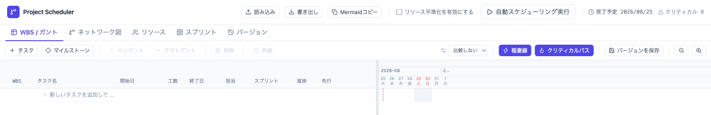
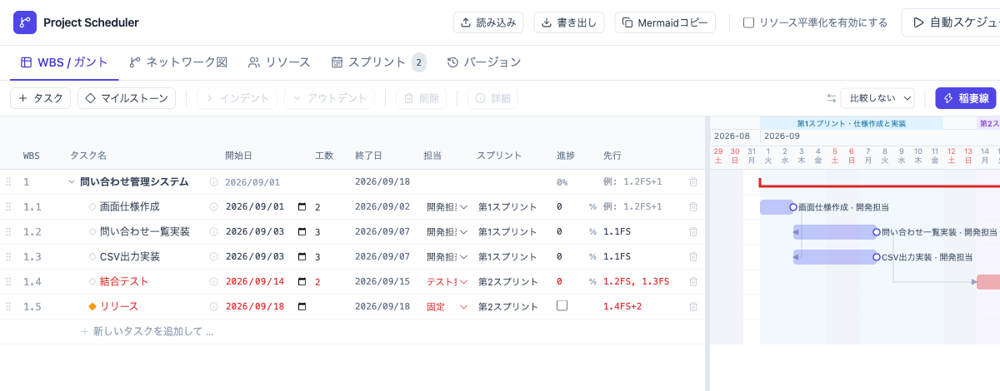
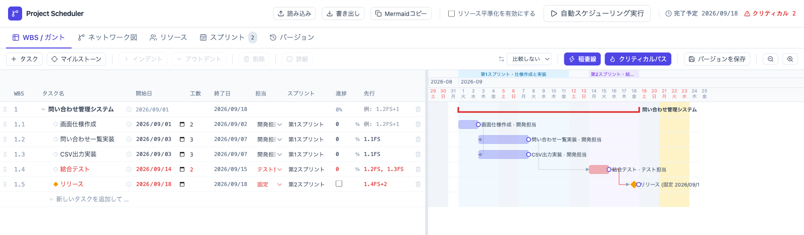
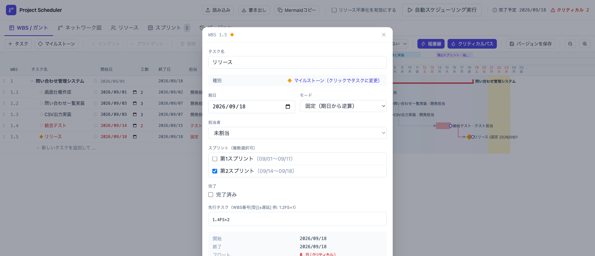
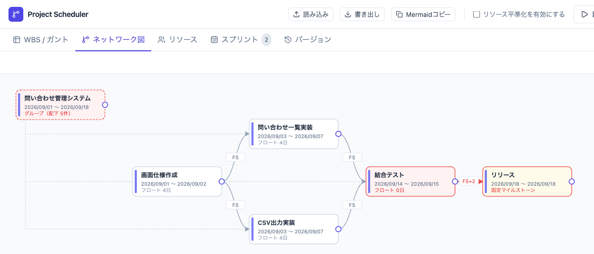
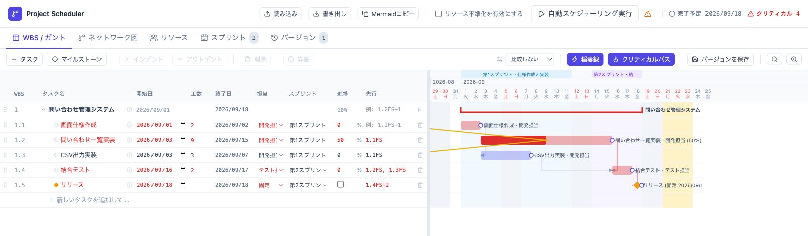
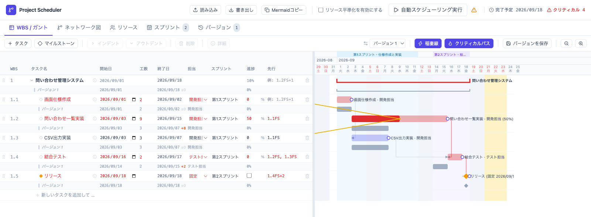
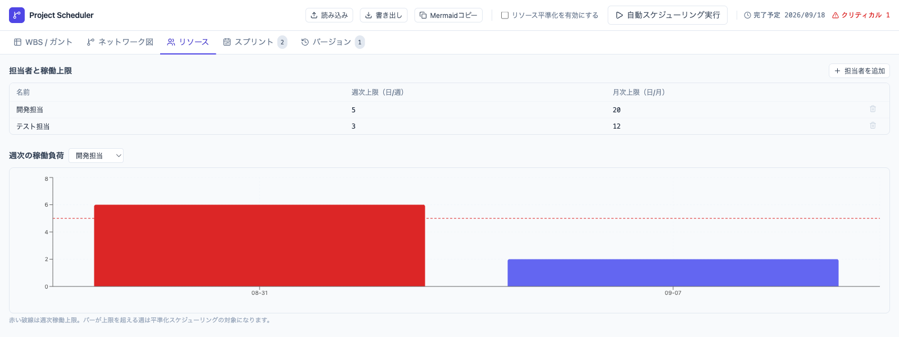
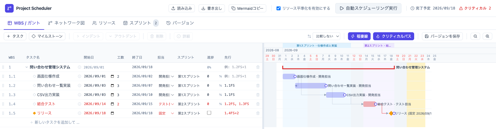
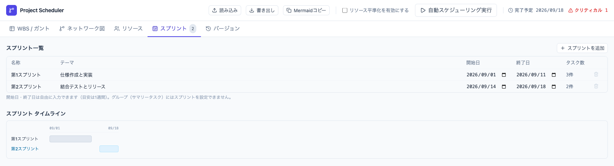

# ガントチャートの日付を手で直すのをやめる - Project Scheduler実践チュートリアル

実装の見積もりが3人日から9人日に増えたとき、後続のテストとリリース日はどうなるでしょうか。担当者に二つの実装を同時に割り当てたとき、その計画は本当に実行できるでしょうか。

ガントチャートの日付を一つずつ動かしていると、こうした変更のたびに後続タスクを確認し直す必要があります。しかし、本来のスケジュールは作図した日付の集まりではありません。WBS、工数、依存関係、担当者、期日という条件から、繰り返し計算できる計画モデルです。

この記事では、単一HTMLで動作する `Project Scheduler` を使い、サンプルをすべて削除した状態から小規模な問い合わせ管理システムの計画を作ります。そして、実装の見積もり超過と担当者の負荷超過という二つの問題を、変更前との差を残しながら調整します。

この記事を最後まで進めると、次のことができるようになります。

* WBSのアウトライン、工数、依存関係から日程を自動計算する。
* 固定マイルストーンから余裕を逆算し、PERT図で遅延の波及経路を確認する。
* 進捗、基準計画、担当者の稼働上限、スプリントを使って計画を更新する。

時間がない場合は、「WBSを作る」「自動スケジューリングを実行する」「工数を変えて基準計画と比較する」「リソース平準化を有効にする」の4段階だけを先に試してください。この流れだけでも、日付を手で直す方法との違いを確認できます。

このチュートリアルで使用するLive Demoとソースコードは、次のリンクから開けます。主な機能を先に確認したい場合は、紹介記事を参照してください。

* [Project Scheduler Live Demo](https://lhideki.github.io/project-scheduler/)
* [Project Scheduler紹介記事](https://www.inoue-kobo.com/webservice/project-scheduler/)
* [GitHub - lhideki/project-scheduler](https://github.com/lhideki/project-scheduler)

## 今回作るプロジェクト

題材は、問い合わせの一覧表示とCSV出力を追加する小規模なWebシステムです。2026年9月1日に着手し、9月18日にリリースする前提で、次のWBSを作ります。

| WBS | タスク | 工数 | 担当 | 先行タスク | スプリント |
| --- | --- | ---: | --- | --- | --- |
| 1 | 問い合わせ管理システム | - | - | - | - |
| 1.1 | 画面仕様作成 | 2人日 | 開発担当 | - | 第1スプリント |
| 1.2 | 問い合わせ一覧実装 | 3人日 | 開発担当 | 1.1FS | 第1スプリント |
| 1.3 | CSV出力実装 | 3人日 | 開発担当 | 1.1FS | 第1スプリント |
| 1.4 | 結合テスト | 2人日 | テスト担当 | 1.2FS、1.3FS | 第2スプリント |
| 1.5 | リリース | 0人日 | 固定 | 1.4FS+2 | 第2スプリント |

「問い合わせ一覧実装」と「CSV出力実装」は、どちらも画面仕様の完成後に開始できます。この並行作業が、後半のリソース平準化で重要になります。

## Project Schedulerを起動する

[Project Scheduler Live Demo](https://lhideki.github.io/project-scheduler/)をChrome、Edge、Safariなどのモダンブラウザで開きます。サーバー、アカウント登録、インストールは必要ありません。オフラインで利用する場合は、GitHubから `project_scheduler.html` をダウンロードしてブラウザで開きます。

入力内容はブラウザのローカルストレージへ自動保存されます。ただし、別の端末やブラウザとは同期されません。Live DemoとダウンロードしたHTMLも保存領域が異なるため、入力内容は自動共有されません。重要な計画は、画面上部の「書き出し」からJSONファイルとして保存します。別の環境へ移す場合は、移行先で「読み込み」を実行します。

すでにLive Demoで計画を作成している場合は、次の手順で現在の内容を削除する前に、必ずJSONファイルへ書き出してください。ブラウザのプライベートモードやサイトデータの削除によって入力内容が消える場合もあるため、チュートリアル後に残したい計画も書き出しておくと安全です。

## サンプルを削除して、空の計画から始める

保存済みデータがない状態でLive Demoを開くと、操作を確認するためのサンプルが登録されています。すでに利用したことがある場合は、以前保存した計画が表示されます。今回はゼロベースで作るため、必要なバックアップを取った上で、WBS／ガント画面で最上位のグループを選択し、「削除」から配下のタスクごと削除します。同様に、リソース画面の担当者とスプリント画面のスプリントも削除します。

削除後のWBS／ガント画面は次の状態です。

画面下部の「新しいタスクを追加して Enter」へ名前を入力すると、連続してタスクを追加できます。最初に空にすることで、サンプルの依存関係や担当者が残ったまま新しい計画へ混ざることを防げます。

## WBSをアウトラインとして組み立てる

### タスクをすべて追加する

WBS／ガント画面で、次の順に行を追加します。

1. 問い合わせ管理システム
2. 画面仕様作成
3. 問い合わせ一覧実装
4. CSV出力実装
5. 結合テスト
6. リリース

「リリース」は通常タスクではなく、「マイルストーン」から追加します。

### インデントしてグループを作る

「画面仕様作成」から「リリース」までの各行を選び、「インデント」を実行します。最初の「問い合わせ管理システム」が親になり、配下の作業はWBS 1.1から1.5になります。子を持つ親タスクがグループです。

以下は、後続手順の担当者や依存関係まで入力した完成形です。左側のWBS番号と親子構造に注目してください。

グループの開始日、終了日、進捗は、配下のタスクから自動集計されます。グループへ工数をまとめて入力するのではなく、見積もりや担当者を設定できる大きさまで、実作業を子タスクへ分解します。

アウトラインには二つの役割があります。

* 上位層では、プロジェクトや機能のまとまりを説明できます。
* 下位層では、工数、担当者、依存関係を設定する実行単位を管理できます。

子タスクを選択して「アウトデント」を実行すれば、一つ上の階層へ戻せます。WBSの構造を先に決め切る必要はなく、計画を具体化しながら分割や並べ替えができます。

## 担当者とスプリントを登録する

リソース画面で、次の担当者を追加します。

| 担当者 | 週次上限 | 月次上限 |
| --- | ---: | ---: |
| 開発担当 | 5日／週 | 20日／月 |
| テスト担当 | 3日／週 | 12日／月 |

続いて、スプリント画面で二つの期間を追加します。

| スプリント | テーマ | 期間 |
| --- | --- | --- |
| 第1スプリント | 仕様作成と実装 | 2026年9月1日から9月11日 |
| 第2スプリント | 結合テストとリリース | 2026年9月14日から9月18日 |

WBS／ガント画面へ戻り、各タスクの「担当」と「スプリント」を設定します。グループには担当者やスプリントを設定せず、子タスクへ設定します。

## 工数と依存関係から日程を計算する

画面仕様作成の開始日を9月1日、工数を2人日にします。問い合わせ一覧実装とCSV出力実装は工数をそれぞれ3人日、先行タスクを `1.1FS` にします。

`FS` はFinish to Startの略で、先行タスクの終了後に後続タスクを開始する関係です。結合テストには `1.2FS, 1.3FS` を設定し、二つの実装が両方終わるまで開始できないことを表します。

リリースには `1.4FS+2` を設定します。これは、結合テストの終了後に2稼働日を空け、承認やリリース準備の期間を確保する指定です。

設定後、「自動スケジューリング実行」を選択します。画面仕様作成は9月2日、二つの実装は9月7日に完了します。結合テストは、依存関係を満たし、かつ第2スプリントが始まる9月14日から配置されます。

ここで入力したのは、すべての日付ではありません。「何日かかるか」「何が終われば始められるか」「誰が担当するか」「どのスプリントで扱うか」です。開始日と終了日は、その条件を満たした計算結果として扱います。

依存関係にはFSのほか、SS、FF、SFも利用できます。`FS` の後ろに `+2` のようなラグを加えると、先行タスクの終了後に指定した稼働日数を空けられます。

## 固定マイルストーンから余裕を逆算する

契約上の納品日、展示会、リリース日など、簡単に動かせない期日は固定マイルストーンにします。「リリース」の期日を9月18日、モードを「固定(期日から逆算)」、先行タスクを `1.4FS+2` に設定します。

詳細画面では、固定期日と、期日から逆算したフロートを確認できます。

固定マイルストーンを置くと、その日を終点として遅い側の日程が逆算されます。タスク自体は依存関係に沿った早い日程へ配置され、早い日程と遅い日程の差がフロートです。

今回の計画では、画面仕様作成と二つの実装に4日のフロートがあります。一方、結合テストはフロートが0日です。テストが遅れると、その後に確保した2稼働日のリリース準備期間を維持できず、固定期日へ直接影響します。

固定マイルストーンは、すべてを期日の直前へ寄せるための機能ではありません。期日から逆算して「あと何日まで遅れてよいか」を見えるようにするために使います。

## ネットワーク図(PERT図)で遅延の波及経路を見る

WBS／ガント画面は「いつ作業するか」を確認するのに向いています。ネットワーク図(PERT図)は、「なぜその日程になるか」を依存関係から確認する画面です。

「ネットワーク図」を開くと、タスクがノード、依存関係が矢印で表示されます。各ノードには開始日、終了日、フロートが表示され、固定マイルストーンやクリティカルな関係も色で確認できます。

今回の図からは、次のことが読み取れます。

* 画面仕様作成の完了後、二つの実装へ作業が分岐する。
* 結合テストは、二つの実装が合流するまで開始できない。
* 結合テストの後に固定マイルストーンのリリースがある。

ガントチャートで日付が動いた理由が分からない場合は、PERT図で矢印を上流へたどります。逆に、依存関係を追加した後はガントチャートへ戻り、日付への影響を確認します。この二つの画面を往復すると、「遅れています」だけでなく、「どの経路からリリースへ波及したか」を説明できます。

ノード右端のハンドルから別のノードへドラッグするとFSの依存関係を追加でき、矢印のラベルから種類やラグを変更できます。「整頓表示」を選ぶと、動かしたノードを階層順へ戻せます。

上の図では、分岐と合流が一目で分かるようにノードをドラッグし、二つの実装を上下に配置しました。会議で説明するときは、クリティカルな経路だけでなく、並行できる作業と待ち合わせる地点が見える配置にすると伝わりやすくなります。

## 問題1: 見積もり超過を計画へ反映する

計画は一度作って終わりではありません。ここでは、問い合わせ一覧実装が想定より難しく、3人日では終わらないことが分かったケースを扱います。

### 変更前の計画を保存する

変更前に、WBS／ガント画面の「バージョンを保存」を選択します。保存したバージョンには、タスクだけでなく、担当者の稼働上限とスプリントも含まれます。ここでは「バージョン 1」を基準計画にします。

### 進捗と新しい見積もりを入力する

問い合わせ一覧実装の工数を3人日から9人日へ変更し、進捗を50%にします。その上で「自動スケジューリング実行」を選択します。

問い合わせ一覧実装の終了日は9月7日から9月15日へ変わり、結合テストは9月16日から17日へ移動します。固定したリリース日は9月18日のままですが、結合テスト後に2稼働日を空ける `1.4FS+2` を満たせません。日付が固定されたままでも、計画としては期日を守れない状態になったことが分かります。

また、問い合わせ一覧実装は第1スプリントの終了日を越えるため、スプリントとの矛盾を示す警告も表示されます。長期日程だけでなく、直近のスプリントバックログを見直す必要がある状態です。

### 基準計画との差を表示する

比較用のリストから「バージョン 1」を選択すると、現在の各行の下に基準計画が表示されます。

問い合わせ一覧実装は終了日が8日後、結合テストは2日後へ変わっています。一方、画面仕様作成、CSV出力実装、固定したリリース日の表示は変わっていません。固定日が動いていないことと、依存関係を満たして期日を守れることは別なので、直前タスクとラグも併せて確認します。

変更前後を同じWBS番号で比較できるため、「プロジェクトが遅れた」という曖昧な報告ではなく、変わったタスクと影響を受けた後続タスクを分けて説明できます。

## 問題2: 担当者の負荷超過を平準化する

次は、別の観点から基準計画を確認します。バージョン画面で「バージョン 1」を復元し、問い合わせ一覧実装を9人日に変更する前の状態へ戻します。

二つの実装は依存関係上、どちらも9月3日から開始できます。しかし、同じ開発担当へ割り当てられています。依存関係だけを満たしていても、一人が同時に二つの作業を進められるとは限りません。

### 負荷グラフで超過を見つける

リソース画面で開発担当を選ぶと、8月31日の週は6人日の負荷です。週次上限の5日を超えているため、バーが赤く表示されます。

ガントチャートだけを見ると二つの実装を並行できそうですが、負荷グラフを見ると実行できない計画であることが分かります。

### 平準化後の日程をWBS／ガントで確認する

画面上部の「リソース平準化を有効にする」を選び、「自動スケジューリング実行」を実行します。

平準化前は、問い合わせ一覧実装とCSV出力実装が同時に進み、どちらも9月7日に完了していました。平準化後は二つの作業が直列に近い配置となり、CSV出力実装の終了日は9月10日へ変わります。

固定した9月18日の期日は画面上部の完了予定とリリース行の終了日に残ったままです。その内側で、担当者の週次上限を満たすように実装タスクの日程が変わりました。この例では結合テストが9月14日から15日、2稼働日の準備期間を挟んだリリースが9月18日となり、平準化しても固定期日に間に合います。

もし間に合わない場合は、次の選択肢を比較します。

* 担当者を追加または変更する。
* タスクをさらに分割し、並行できる部分を切り出す。
* 工数や依存関係の前提を見直す。
* スプリントの範囲または固定期日を調整する。

自動スケジューリングは、この判断を代行するものではありません。制約を同時に満たせない箇所を見つけ、選択肢ごとの日程差を比較するために利用します。

## スプリントバックログと長期計画をつなぐ

アジャイル開発では、日々の作業はスプリントバックログを中心に進めます。一方、複数スプリントにまたがる依存関係、担当者負荷、固定したリリース日は、スプリント単位の画面だけでは把握しにくいことがあります。

スプリント画面では、名称、テーマ、開始日、終了日、紐付いたタスク数を確認できます。

WBS／ガント画面のスプリント列で、バックログに相当するタスクをスプリントへ紐付けます。一つのタスクを複数スプリントへ紐付けることもできます。自動スケジューリングではスプリントの開始日より前にタスクを開始しないよう考慮し、計算結果が期間から外れた場合は警告が表示されます。

この使い分けにより、次の二つの視点を同じ計画に持てます。

| 視点 | 確認すること |
| --- | --- |
| スプリント | 今回のイテレーションで何を完了させるか |
| WBS／ガント／PERT | リリースまでにどの依存関係と制約があるか |

JIRAやBacklogとの直接連携は現時点では実装されていません。まずは課題と同じ名前や識別子をWBSへ記録して対応付け、必要に応じてJSON入出力を使った連携を追加する形になります。

## まとめ: スケジュールを「図」から「更新できるモデル」へ変える

今回のチュートリアルでは、空の状態から一つの問い合わせ管理システムを作り、同じWBSを使って二つの問題を確認しました。

* 見積もりが3人日から9人日に増えたときは、後続タスクとスプリントへの影響を再計算しました。
* 開発担当の週次上限を超えたときは、リソース平準化で実行可能な配置へ調整しました。
* 固定マイルストーン、基準計画、PERT図を使い、変更の影響と残りの余裕を確認しました。

重要なのは、最初から正確な日付を引くことではありません。作業を見積もれる大きさへ分け、依存関係と制約を入力し、状況が変わるたびに再計算できる状態を作ることです。

まずは[Project Scheduler Live Demo](https://lhideki.github.io/project-scheduler/)を開き、サンプルを削除して、親グループ、三つの作業、固定マイルストーンだけの小さなWBSを作ってみてください。工数を一つ変えて再計算すると、手作業で日付を引く方法との違いを確認できます。継続して利用する場合は、重要な計画を定期的にJSONファイルへ書き出してください。
